# Envoy Network Layer — Overview Part 3: Sockets & IO Handles

**Directory:** `source/common/network/`  
**Part:** 3 of 4 — Socket Hierarchy, IoHandle, io_uring, Socket Options, Transport Sockets

---

## Table of Contents

1. [IO Abstraction Layers](#1-io-abstraction-layers)
2. [IoHandle Hierarchy](#2-iohandle-hierarchy)
3. [IoSocketHandleImpl — Epoll/Kqueue Path](#3-iosockethandleimpl--epollkqueue-path)
4. [IoUringSocketHandleImpl — io_uring Path](#4-iouringsockethandleimpl--io_uring-path)
5. [Socket Hierarchy](#5-socket-hierarchy)
6. [ConnectionSocketImpl — Rich Metadata](#6-connectionsocketimpl--rich-metadata)
7. [SocketInterface — Platform Factory](#7-socketinterface--platform-factory)
8. [Socket Options System](#8-socket-options-system)
9. [Transport Sockets](#9-transport-sockets)
10. [IO Error Handling](#10-io-error-handling)

---

## 1. IO Abstraction Layers

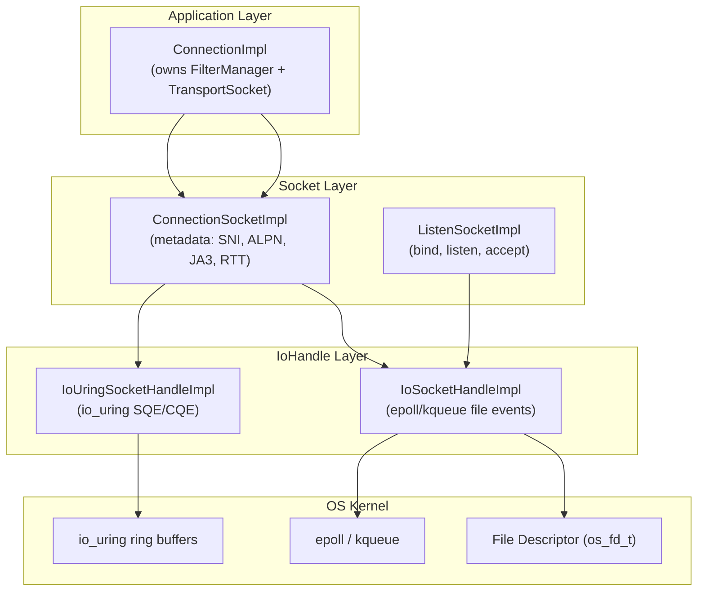

---

## 2. IoHandle Hierarchy

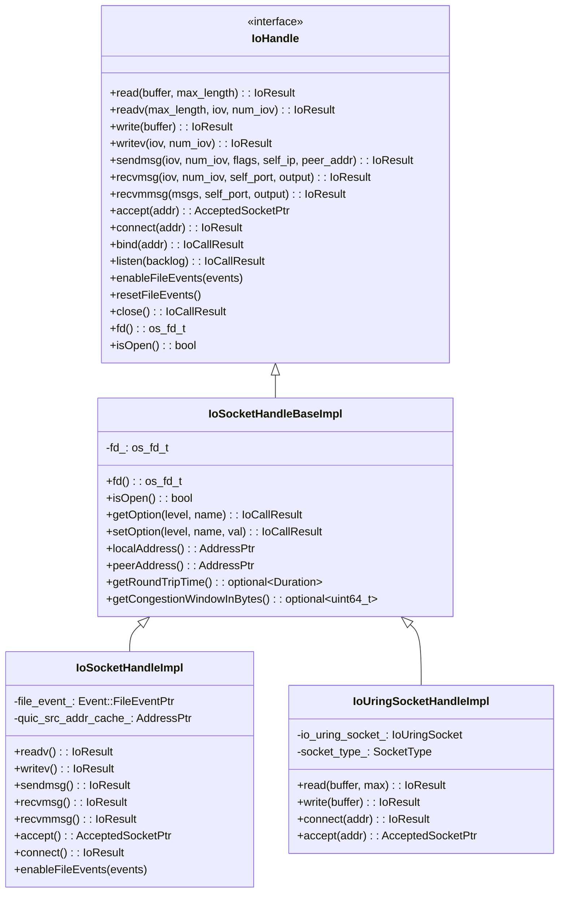

---

## 3. IoSocketHandleImpl — Epoll/Kqueue Path

`IoSocketHandleImpl` is the standard I/O path on Linux (epoll) and macOS/BSD (kqueue).

### File Event Registration

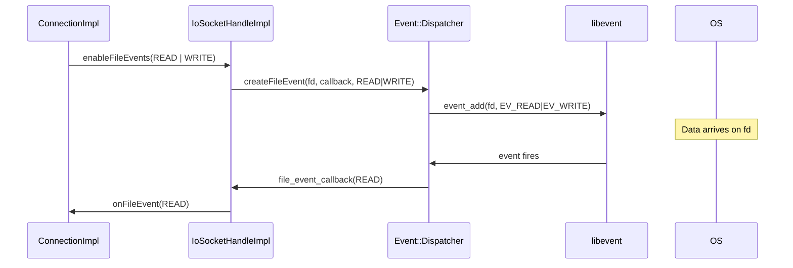

### `recvmmsg` — Batched UDP Receive

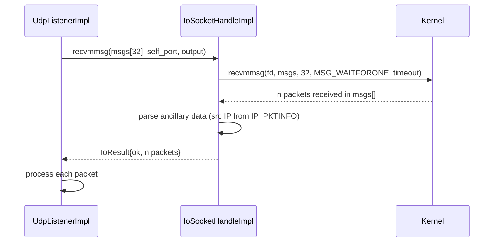

### `sendmsg` — UDP with Source IP

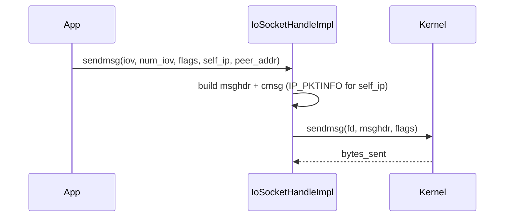

### QUIC Source Address Cache

For QUIC (HTTP/3), the same source address is used repeatedly. `IoSocketHandleImpl` caches it to avoid repeated `getsockname()` calls:

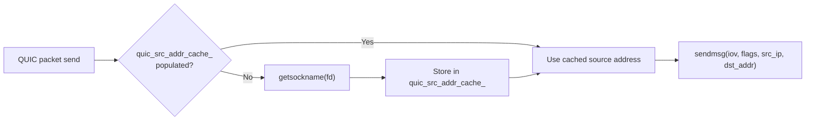

---

## 4. IoUringSocketHandleImpl — io_uring Path

On modern Linux kernels (5.1+), `IoUringSocketHandleImpl` submits I/O operations as SQEs (Submission Queue Entries) to avoid the overhead of per-syscall context switches.

### SQE/CQE Cycle

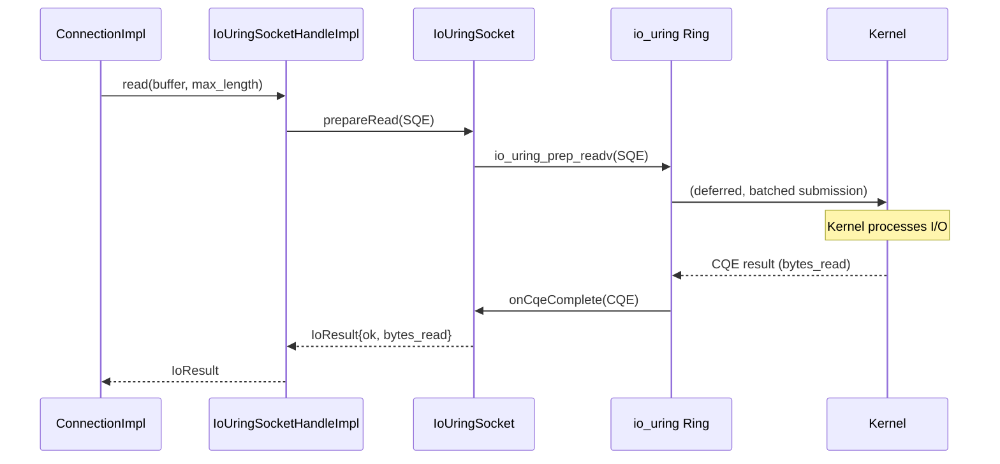

### Socket Types for io_uring

`IoUringSocketHandleImpl` is parameterized by socket type, which determines which io_uring operations are available:

| `SocketType` | Operations | Use Case |
|-------------|-----------|---------|
| `Accept` | `io_uring_prep_accept` | Listen socket (server) |
| `Server` | `io_uring_prep_read`, `io_uring_prep_write` | Accepted connection |
| `Client` | `io_uring_prep_connect`, `io_uring_prep_read`, `io_uring_prep_write` | Upstream connection |

---

## 5. Socket Hierarchy

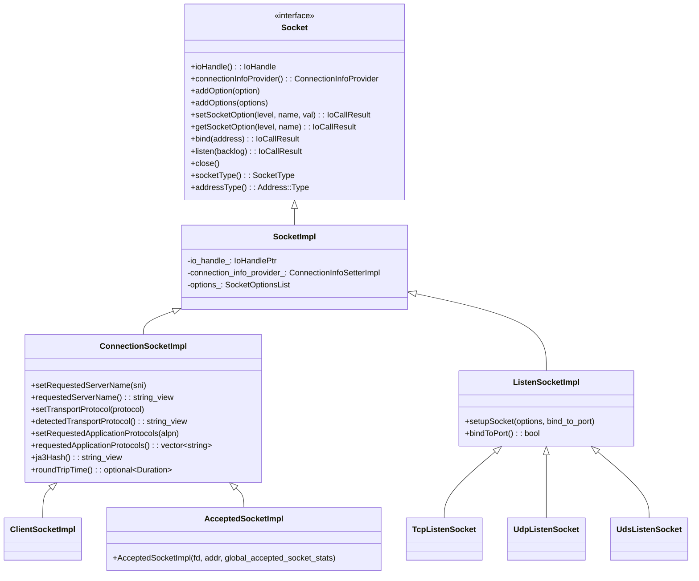

---

## 6. ConnectionSocketImpl — Rich Metadata

`ConnectionSocketImpl` (and its `ConnectionInfoSetterImpl`) stores rich per-connection metadata populated during the TLS handshake and listener filter processing:

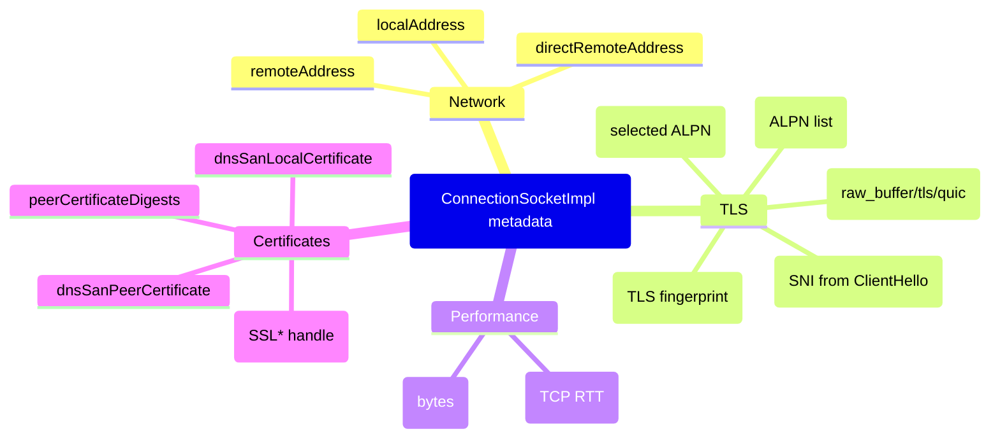

### Metadata Population Timeline

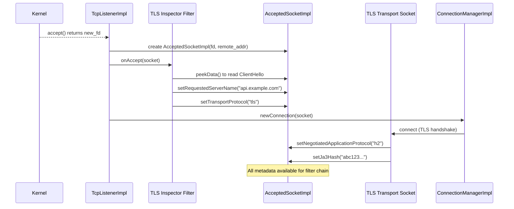

---

## 7. SocketInterface — Platform Factory

`SocketInterfaceSingleton` is an injected singleton that centralizes `IoHandle` and `Socket` creation:

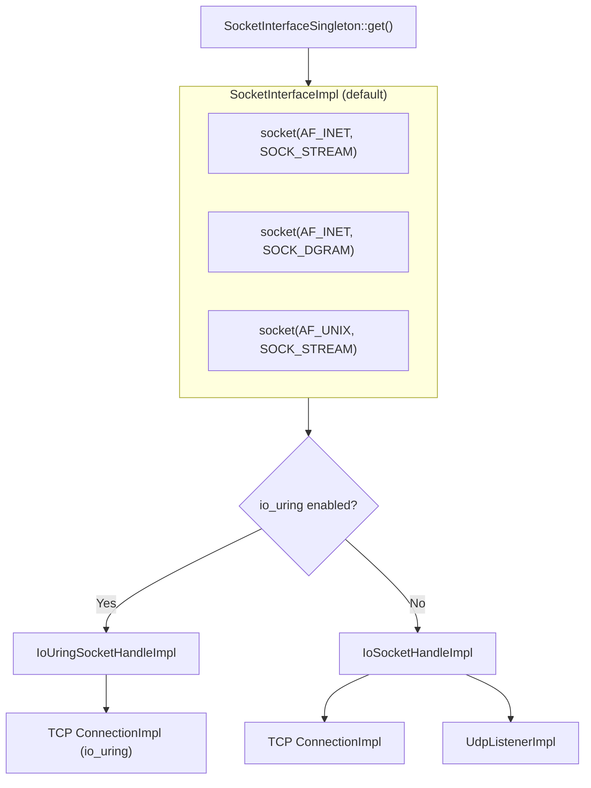

### Injection for Testing

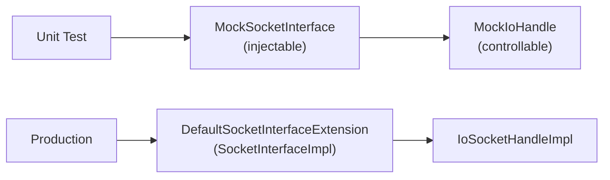

---

## 8. Socket Options System

### `SocketOptionImpl`

Encapsulates a single `setsockopt()` call to be applied at a specific lifecycle stage:

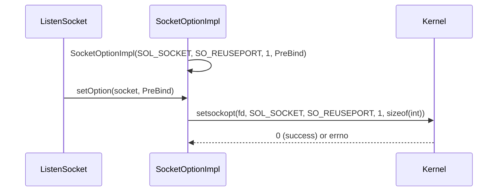

### Socket Option Lifecycle

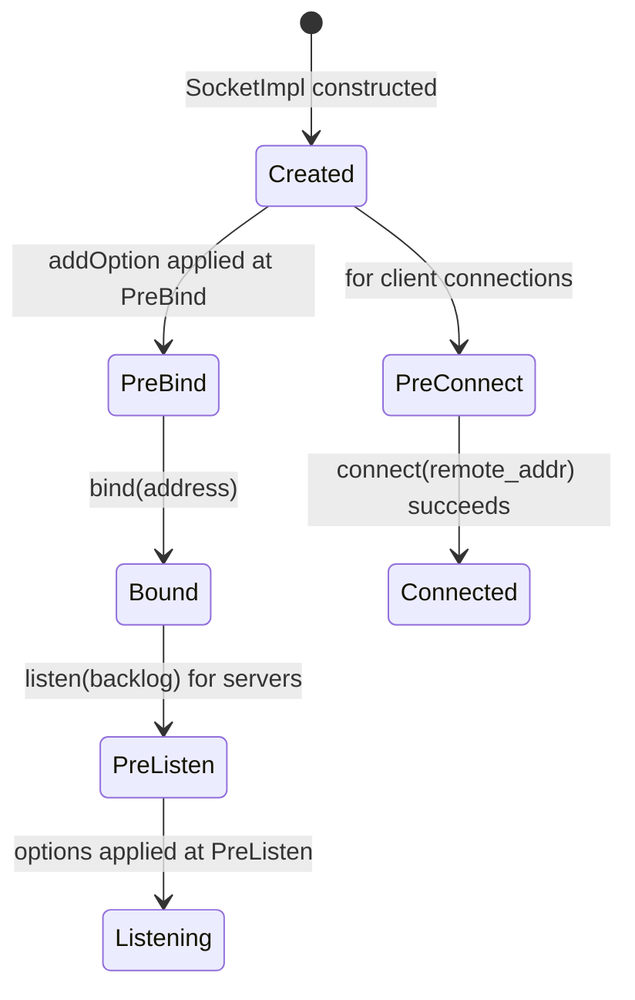

### `AddrFamilyAwareSocketOptionImpl`

Routes socket options to the appropriate IPv4 or IPv6 implementation:

```mermaid
flowchart TD
    AFAS["AddrFamilyAwareSocketOptionImpl::setOption(socket, state)"] --> B{socket.addressType()?}
    B -->|AF_INET| IPv4Opt["ipv4_option_.setOption(socket, state)<br/>e.g. IP_FREEBIND"]
    B -->|AF_INET6| IPv6Opt["ipv6_option_.setOption(socket, state)<br/>e.g. IPV6_FREEBIND"]
    B -->|Unknown| Try["Try IPv4, then IPv6"]
```

### `SocketOptionFactory` — Standard Options

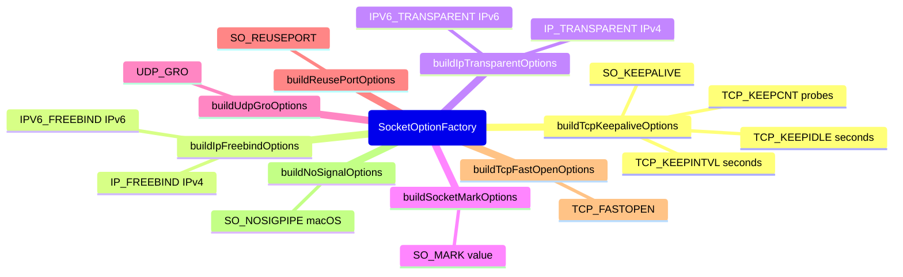

---

## 9. Transport Sockets

Transport sockets sit between `ConnectionImpl` and the raw `IoHandle`, providing encryption/decryption or protocol framing:

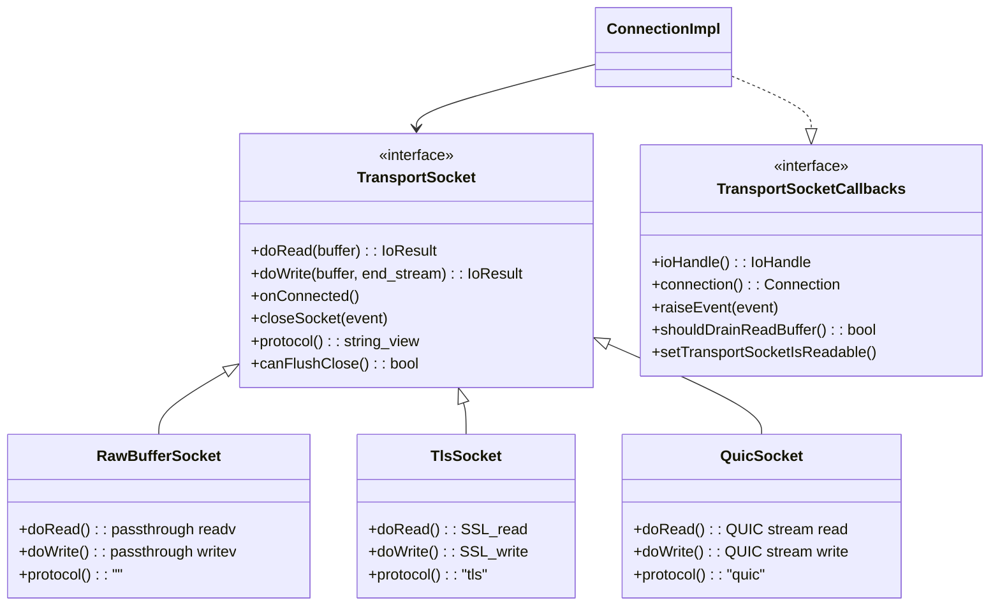

### Transport Socket Data Path

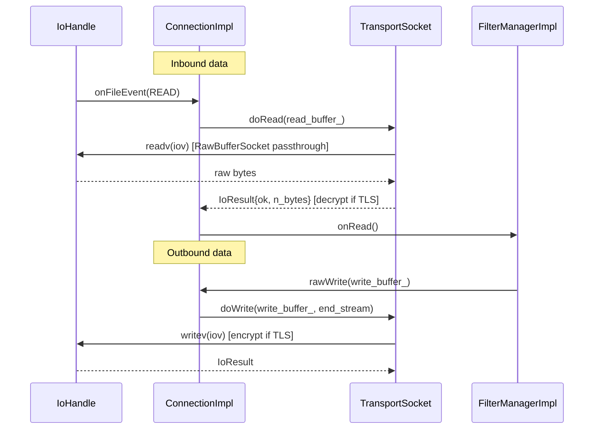

---

## 10. IO Error Handling

`IoSocketError` maps OS `errno` values to typed `IoErrorCode` enum values:

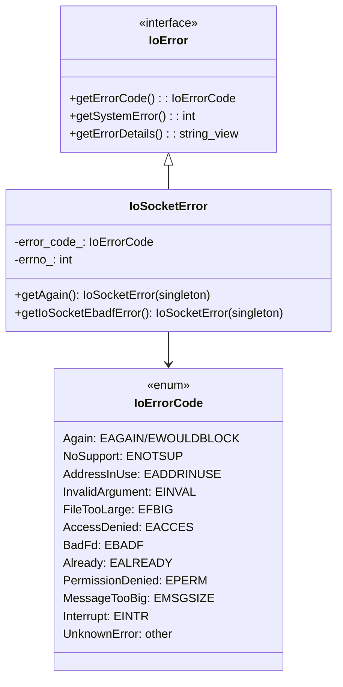

### Error Singletons

`EAGAIN` and `EBADF` are returned as singletons to avoid allocation on the hot path:

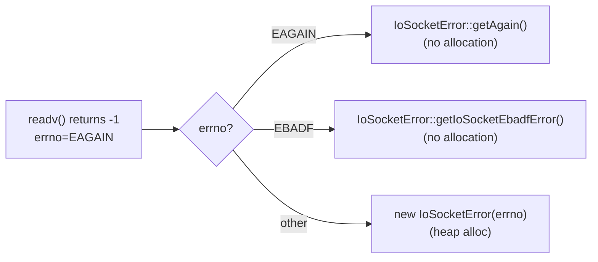

---

## Navigation

| Part | Topics |
|------|--------|
| [Part 1](OVERVIEW_PART1_architecture_and_connections.md) | Architecture, Connections, Happy Eyeballs, Filter Manager |
| [Part 2](OVERVIEW_PART2_filters_and_listeners.md) | Network Filters, TCP/UDP Listeners, Listener Filters |
| **Part 3 (this file)** | Sockets, IoHandles, Socket Options, io_uring |
| [Part 4](OVERVIEW_PART4_addressing_dns_and_utilities.md) | Addressing, CIDR, DNS, Matching, Transport Socket Options |
