# Envoy Network Layer — Overview Part 4: Addressing, DNS, Matching & Utilities

**Directory:** `source/common/network/`  
**Part:** 4 of 4 — Address System, CIDR Matching, DNS, Transport Socket Options, Matching Framework, Utilities

---

## Table of Contents

1. [Address System Overview](#1-address-system-overview)
2. [IP Address Hierarchy](#2-ip-address-hierarchy)
3. [CIDR Matching — CidrRange and IpList](#3-cidr-matching--cidrrange-and-iplist)
4. [LC-Trie — Fast CIDR Lookup](#4-lc-trie--fast-cidr-lookup)
5. [DNS Resolution](#5-dns-resolution)
6. [Transport Socket Options and Filter State](#6-transport-socket-options-and-filter-state)
7. [Network Matching Framework](#7-network-matching-framework)
8. [Connection Hash Policy](#8-connection-hash-policy)
9. [Network Utility Functions](#9-network-utility-functions)
10. [Full Component Interaction Map](#10-full-component-interaction-map)

---

## 1. Address System Overview

Envoy unifies all address types under a single `Address::Instance` interface: IPv4, IPv6, Unix domain sockets (pipes), and internal virtual addresses.

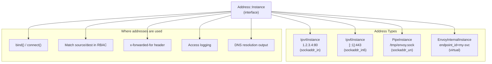

---

## 2. IP Address Hierarchy

### Class Relationships

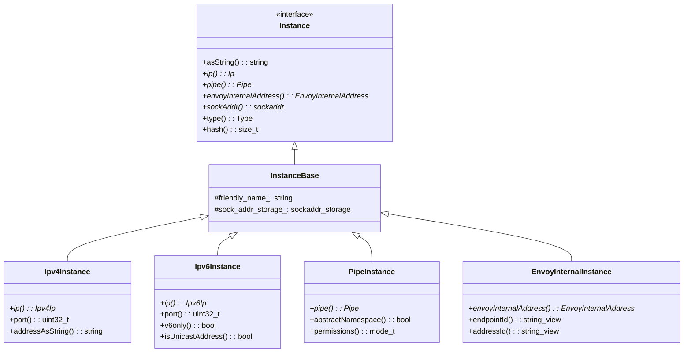

### Address Creation

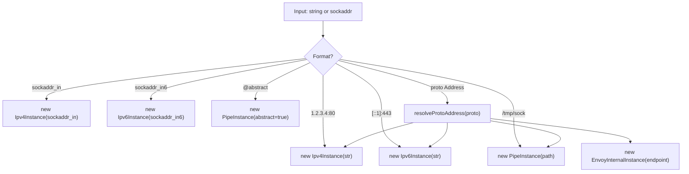

### Thread Safety

All `Address::Instance` objects are:
- Immutable after construction
- Stored as `InstanceConstSharedPtr` = `shared_ptr<const Instance>`
- Safe to share across all worker threads

---

## 3. CIDR Matching — CidrRange and IpList

### `CidrRange` — Single Prefix Match

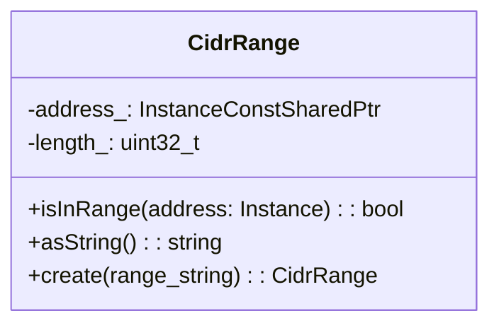

Matching logic:

```
address = 10.0.1.50
range   = 10.0.0.0/8

mask = 0xFF000000  (8-bit prefix)
address & mask = 10.0.0.0
range.ip & mask = 10.0.0.0
→ match!
```

### `IpList` — Multiple CIDR Ranges

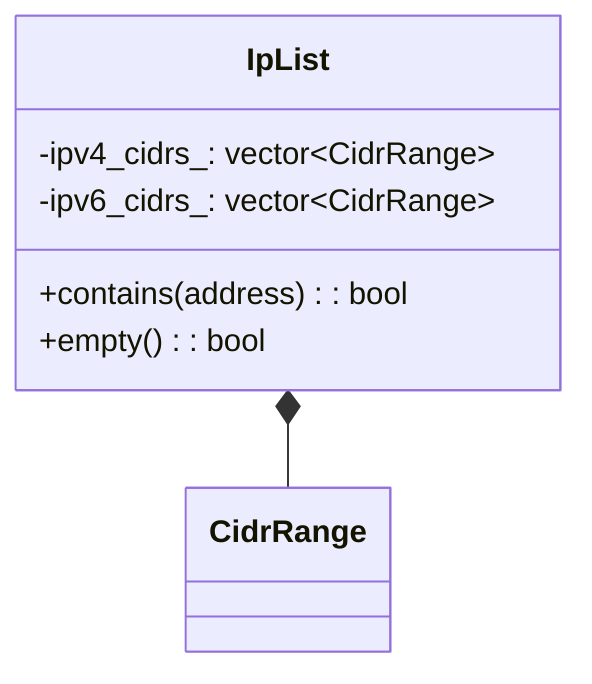

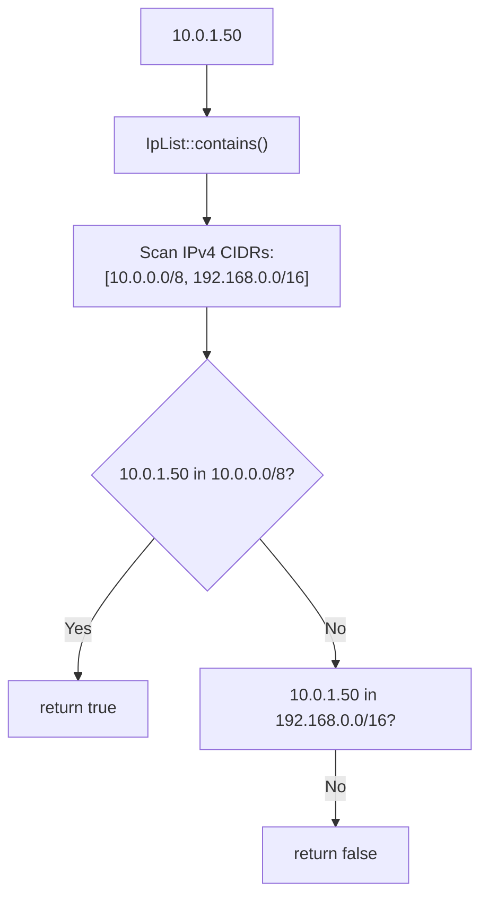

---

## 4. LC-Trie — Fast CIDR Lookup

`LcTrie<T>` implements the Nilsson-Karlsson Level-Compressed Trie for O(1) (constant small number of memory accesses) IP-to-data mapping. Used in RBAC policies and access control with large CIDR tables.

### Comparison with Linear Scan

| Method | Build Cost | Lookup Cost | Best For |
|--------|-----------|-------------|---------|
| `IpList` linear scan | O(n) | O(n) | Small lists |
| `LcTrie<T>` | O(n log n) | O(1) ~3-5 memory accesses | Large tables |

### LcTrie Structure

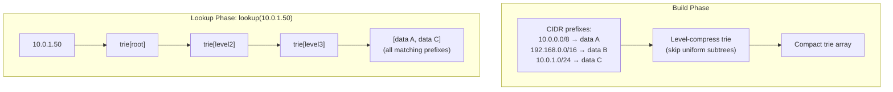

### Use in RBAC

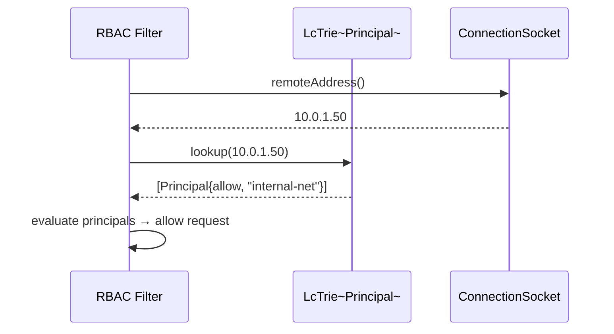

---

## 5. DNS Resolution

### DNS Factory Utilities (`dns_resolver/dns_factory_util.h`)

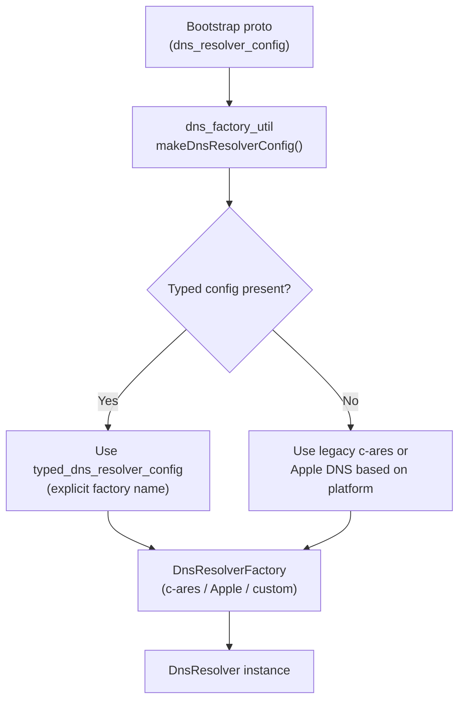

### Resolver Selection

| Platform | Default Resolver | Config Field |
|----------|-----------------|-------------|
| Linux | c-ares | `typed_dns_resolver_config` |
| macOS | Apple DNS (`kDNSServiceErr_*`) | `typed_dns_resolver_config` |
| Custom | Factory-provided | `typed_dns_resolver_config.type_url` |

### DNS Resolution Flow

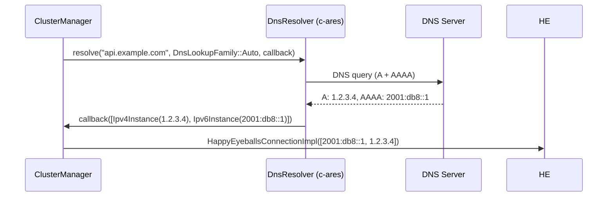

---

## 6. Transport Socket Options and Filter State

Filter state objects allow downstream request context to influence upstream TLS connection parameters.

### Filter State to TransportSocketOptions Pipeline

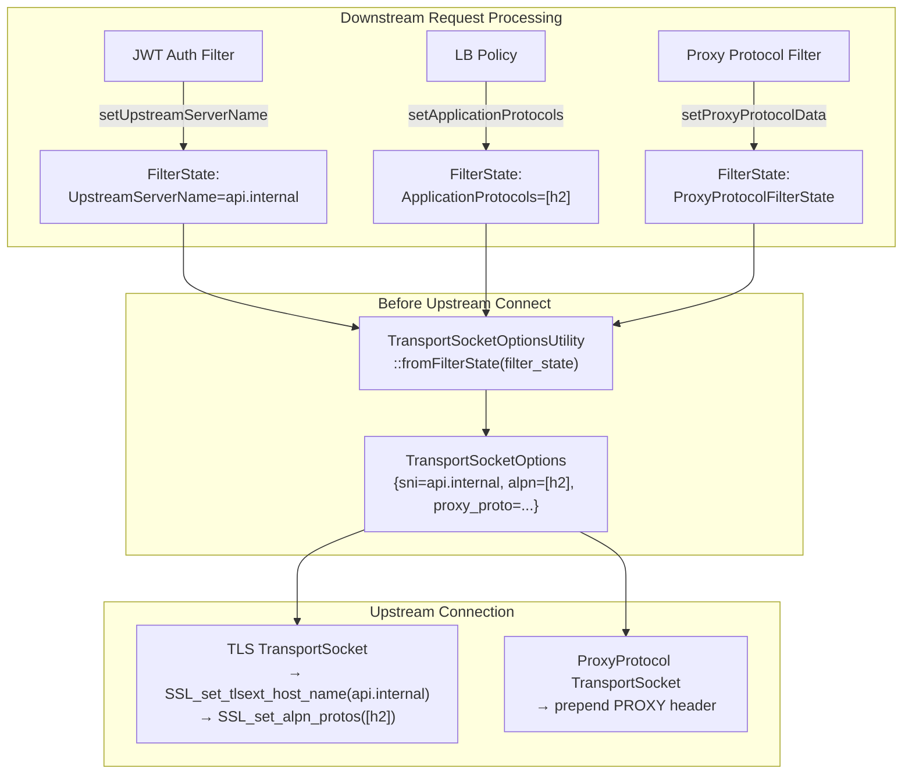

### Filter State Key Reference

| Object | Key | Set By | Used By |
|--------|-----|--------|---------|
| `UpstreamServerName` | `envoy.network.upstream_server_name` | HTTP filters | TLS socket SNI |
| `ApplicationProtocols` | `envoy.network.application_protocols` | HTTP filters | TLS ALPN |
| `UpstreamSubjectAltNames` | `envoy.network.upstream_subject_alt_names` | HTTP filters | TLS SAN verification |
| `UpstreamSocketOptionsFilterState` | `envoy.network.upstream_socket_options` | Any filter | Socket options on upstream |
| `ProxyProtocolFilterState` | `envoy.network.proxy_protocol` | Proxy protocol filter | PROXY header on upstream |
| `AddressObject` | `envoy.network.filter_state_dst_address` | Original dest filter | Destination address override |
| `DownstreamNetworkNamespace` | `envoy.network.downstream_network_namespace` | Listener config | Per-listener network namespace |

### `AlpnDecoratingTransportSocketOptions`

Dynamically prepends ALPN protocols (used by `ConnectivityGrid` to indicate H3 preference):

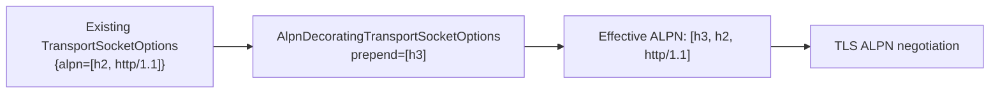

---

## 7. Network Matching Framework

The `matching/` subdirectory provides network-layer data inputs for the unified xDS match tree API.

### Matching Data Inputs

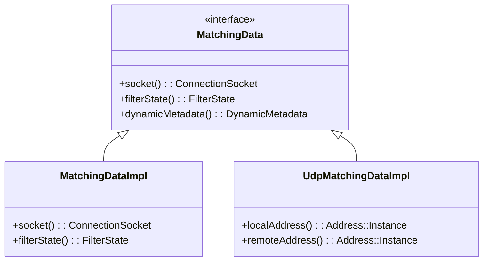

### Match Tree Evaluation for Network Filters

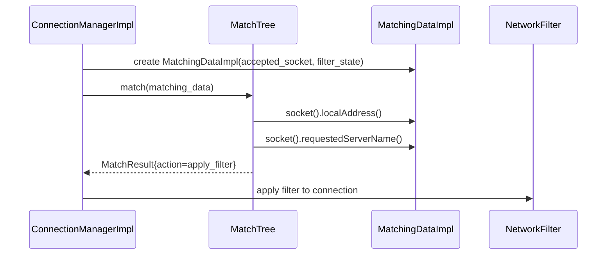

### Available Network Data Inputs

| Input Class | Data Provided | Typical Use |
|------------|--------------|-------------|
| Source IP matcher | `remoteAddress()` | IP-based ACL |
| Destination port matcher | `localAddress().ip().port()` | Port-based routing |
| SNI matcher | `requestedServerName()` | Virtual hosting |
| Transport protocol matcher | `detectedTransportProtocol()` | TLS vs plaintext |
| Application protocol matcher | `requestedApplicationProtocols()` | ALPN-based routing |
| Filter state matcher | `filterState().get(key)` | Custom routing |

---

## 8. Connection Hash Policy

`HashPolicyImpl` computes a connection-level hash for consistent hashing load balancers (e.g., ring hash, Maglev). Used by TCP proxy for connection stickiness.

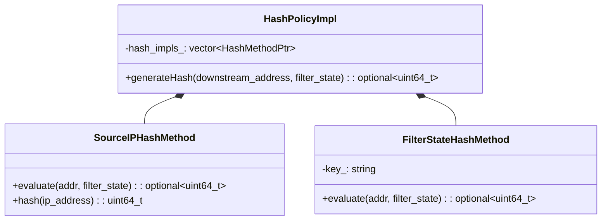

### Hash Computation

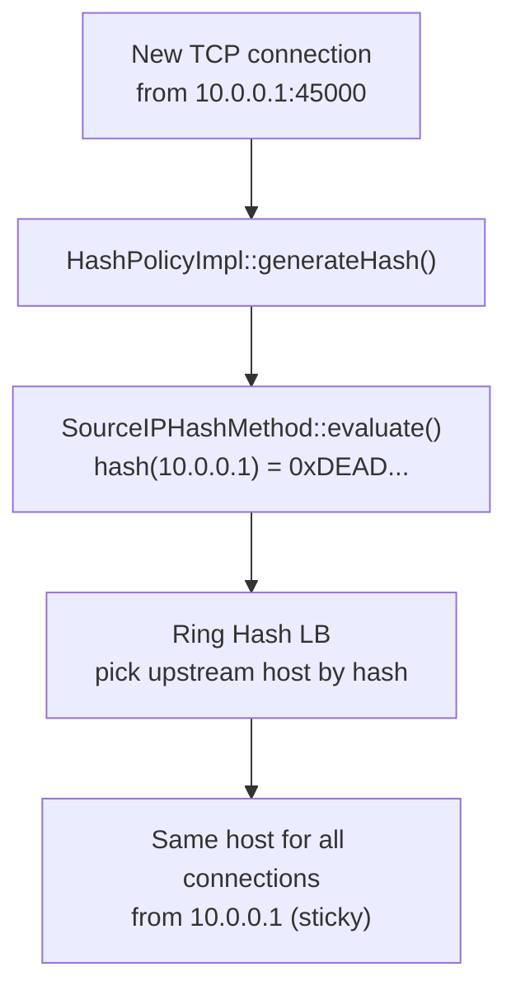

---

## 9. Network Utility Functions

`utility.h` provides free functions and the `Utility` class for common networking operations:

### Address Parsing

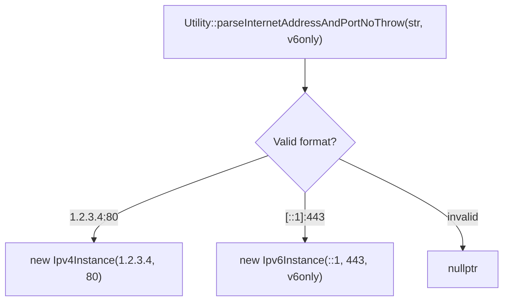

### UDP Helpers

| Function | Purpose |
|----------|---------|
| `Utility::writeToSocket(handle, buffer, local_ip, peer_addr)` | Send UDP datagram with source IP |
| `Utility::readFromSocket(handle, local_addr, processor, recv_time, ...)` | Receive UDP packets with ancillary data |
| `Utility::addressFromSockAddr(ss, len, v6only)` | Convert `sockaddr_storage` to `Address::Instance` |

### `ResolvedUdpSocketConfig`

Resolves UDP socket configuration (receive buffer size, GRO enable) from protobuf config:

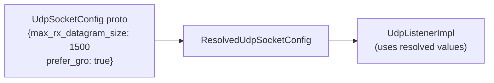

---

## 10. Full Component Interaction Map

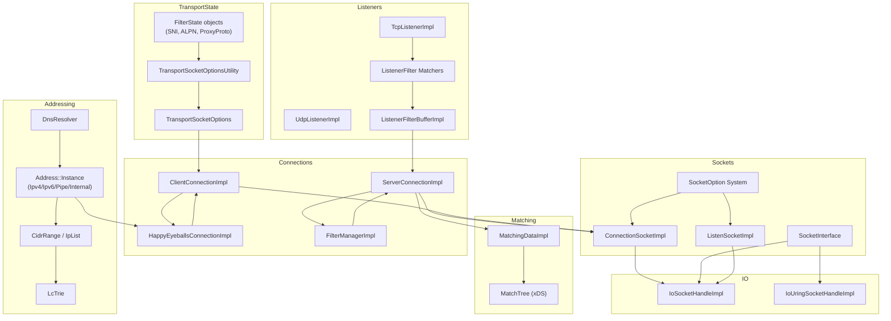

---

## Navigation

| Part | Topics |
|------|--------|
| [Part 1](OVERVIEW_PART1_architecture_and_connections.md) | Architecture, Connections, Happy Eyeballs, Filter Manager |
| [Part 2](OVERVIEW_PART2_filters_and_listeners.md) | Network Filters, TCP/UDP Listeners, Listener Filters |
| [Part 3](OVERVIEW_PART3_sockets_and_io.md) | Sockets, IoHandles, Socket Options, io_uring |
| **Part 4 (this file)** | Addressing, CIDR, DNS, Matching, Transport Socket Options |

---

## Index of Individual File Documentation

| File | Individual Doc |
|------|---------------|
| `connection_impl.h/.cc` | [connection_impl.md](connection_impl.md) |
| `filter_manager_impl.h/.cc` | [filter_manager_impl.md](filter_manager_impl.md) |
| `happy_eyeballs_connection_impl.h/.cc` | [happy_eyeballs_connection_impl.md](happy_eyeballs_connection_impl.md) |
| `address_impl.h/.cc` | [address_impl.md](address_impl.md) |
| `socket_impl.h`, `io_socket_handle_impl.h`, `io_uring_socket_handle_impl.h` | [socket_and_io_handle.md](socket_and_io_handle.md) |
| `tcp_listener_impl.h`, `udp_listener_impl.h`, `listen_socket_impl.h` | [listeners.md](listeners.md) |
| `transport_socket_options_impl.h`, `application_protocol.h`, etc. | [transport_socket_options.md](transport_socket_options.md) |
