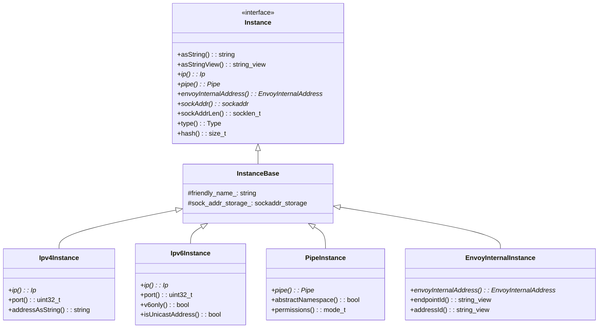
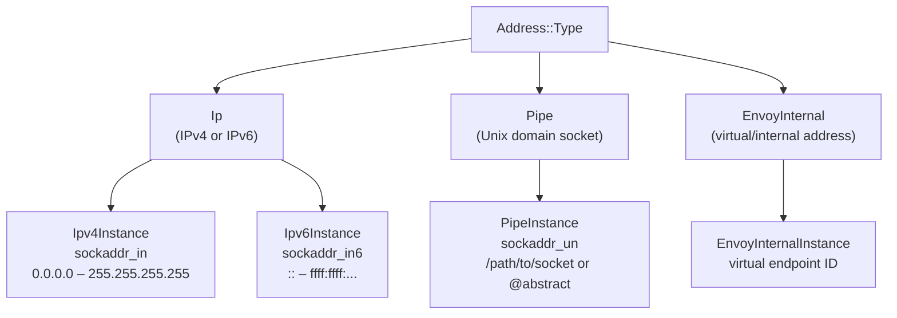
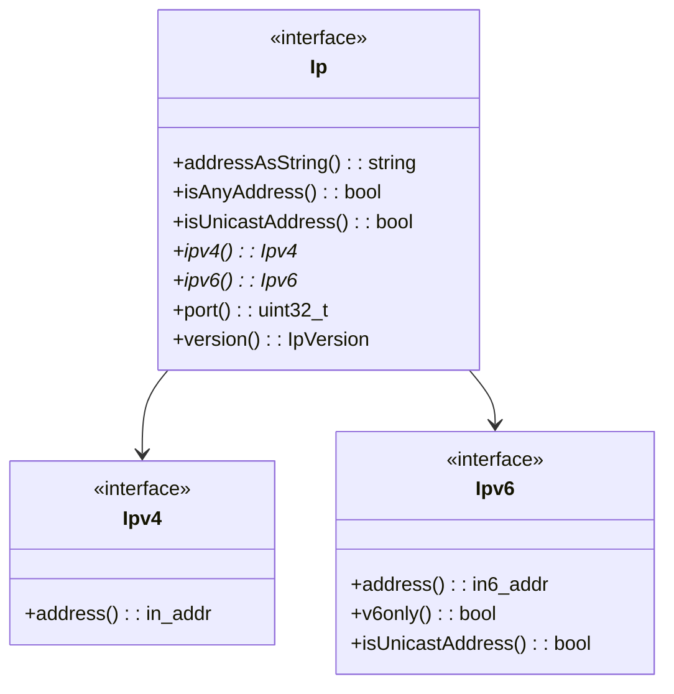
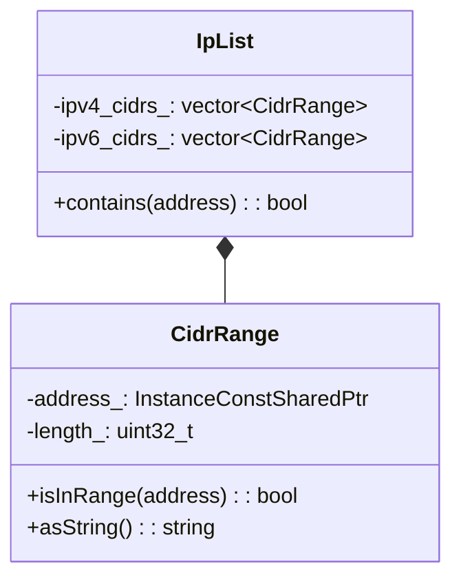
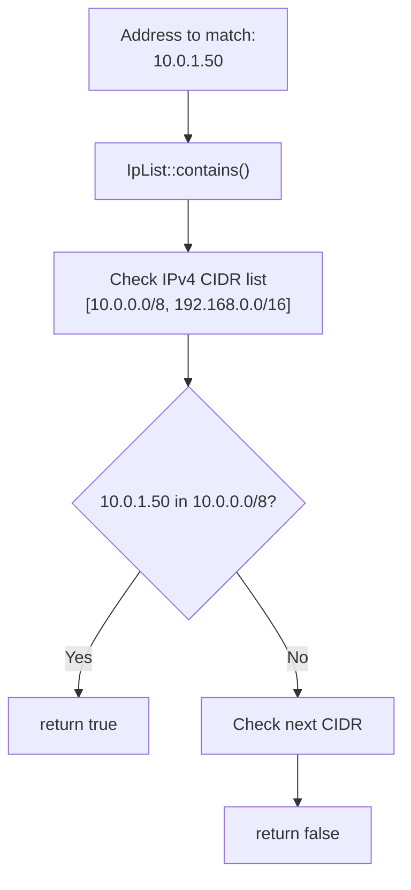
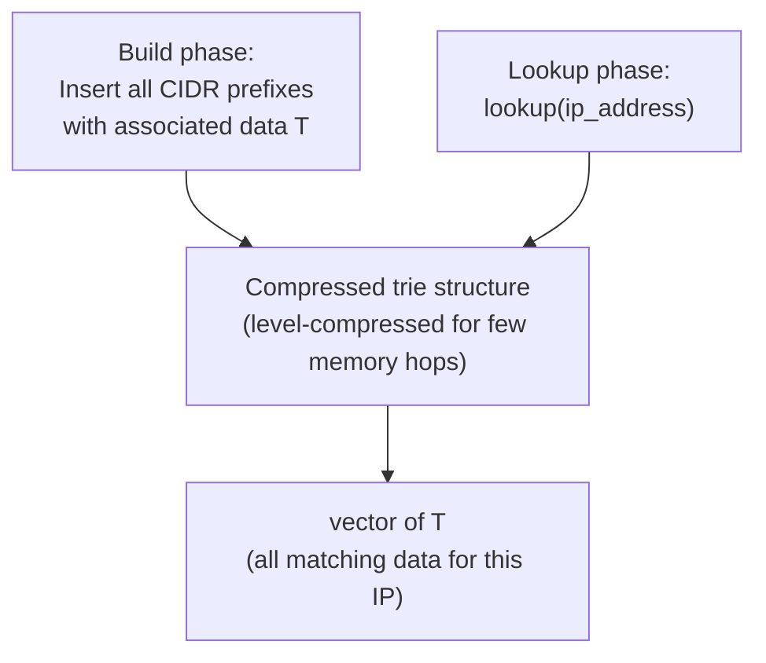
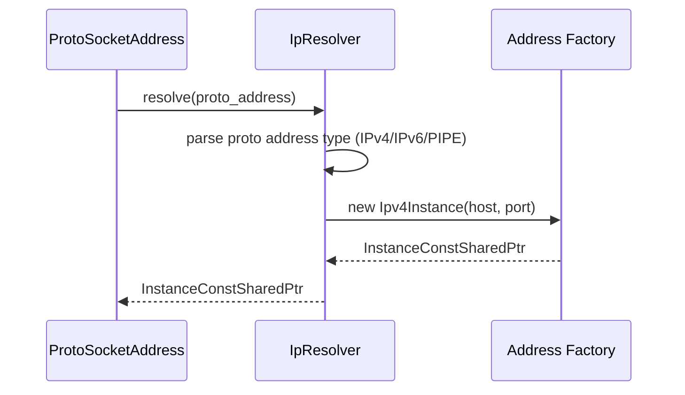
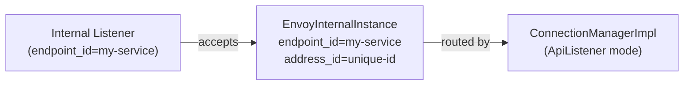

# Address Implementation

**Files:** `source/common/network/address_impl.h` / `.cc`  
**Namespace:** `Envoy::Network::Address`

## Overview

The address system provides a unified `Instance` interface over IPv4, IPv6, Unix domain sockets (pipes), and Envoy-internal virtual addresses. All address objects are **immutable** and **const-shared**, making them safe to share across threads without locking.

## Class Hierarchy



## Address Types



## `Ip` Interface

Both `Ipv4Instance` and `Ipv6Instance` expose an `Ip*` from `instance.ip()`:



## Creating Addresses — `InstanceFactory`

```mermaid
flowchart TD
    F["InstanceFactory"] --> A{Address type?}
    A -->|IPv4 string "1.2.3.4:80"| B["new Ipv4Instance(ip, port)"]
    A -->|IPv6 string "[::1]:443"| C["new Ipv6Instance(ip, port)"]
    A -->|sockaddr_in| D["new Ipv4Instance(sockaddr_in)"]
    A -->|sockaddr_in6| E["new Ipv6Instance(sockaddr_in6)"]
    A -->|path string "/tmp/sock"| G["new PipeInstance(path, permissions)"]
    A -->|abstract "@sock"| H["new PipeInstance(abstract_name)"]
    A -->|internal endpoint| I["new EnvoyInternalInstance(endpoint, address)"]
```

## CIDR Range Matching — `CidrRange` and `IpList`



### CIDR Matching Flow



## LC-Trie — `LcTrie<T>` (Fast CIDR Lookup)

`LcTrie` implements the Nilsson-Karlsson Level-Compressed Trie algorithm for O(1) (few memory accesses) CIDR-to-data mapping, used in RBAC and access control:



### Performance Comparison

| Structure | Lookup Complexity | Use Case |
|-----------|------------------|---------|
| `IpList` | O(n) linear scan | Small lists (< 10 ranges), simple config |
| `LcTrie<T>` | O(1) few memory hops | Large CIDR tables (RBAC policies, access logs) |

## `Resolver` and `ResolverImpl`



Free functions `resolveProtoAddress()` and `resolveProtoSocketAddress()` convert proto config addresses (`core::v3::Address`) to `Address::InstanceConstSharedPtr`.

## `EnvoyInternalInstance` — Internal Addressing

Used for in-process communication between Envoy components (e.g., internal listeners, direct response listeners):



## Thread Safety

All `Address::Instance` objects are:
- **Immutable** after construction
- **Const-shared** (`InstanceConstSharedPtr = shared_ptr<const Instance>`)
- **Safe to share** across worker threads without locking
