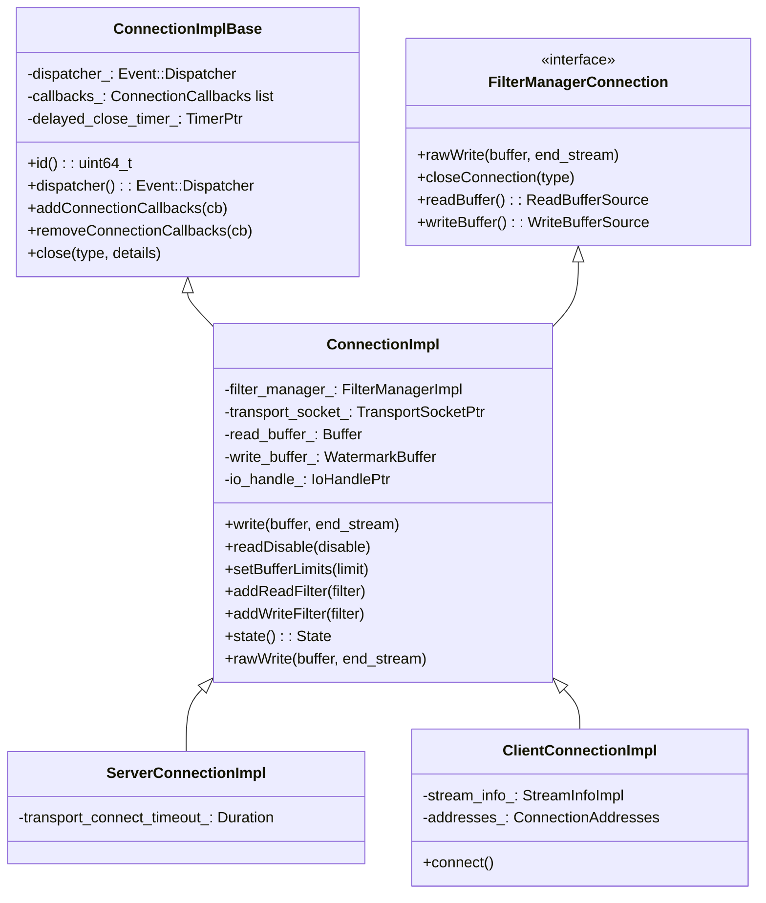
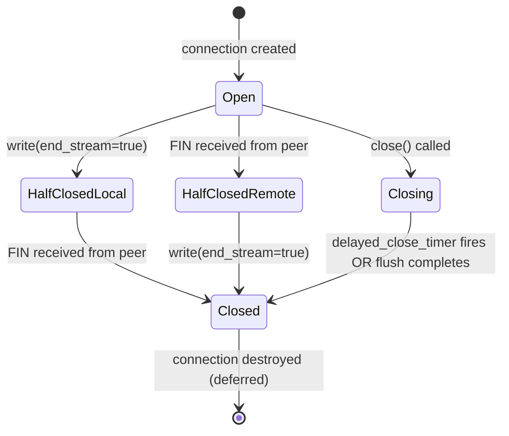
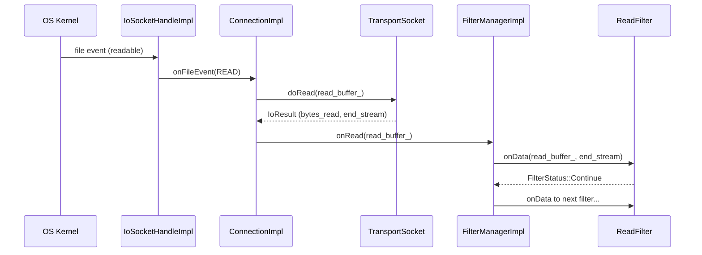
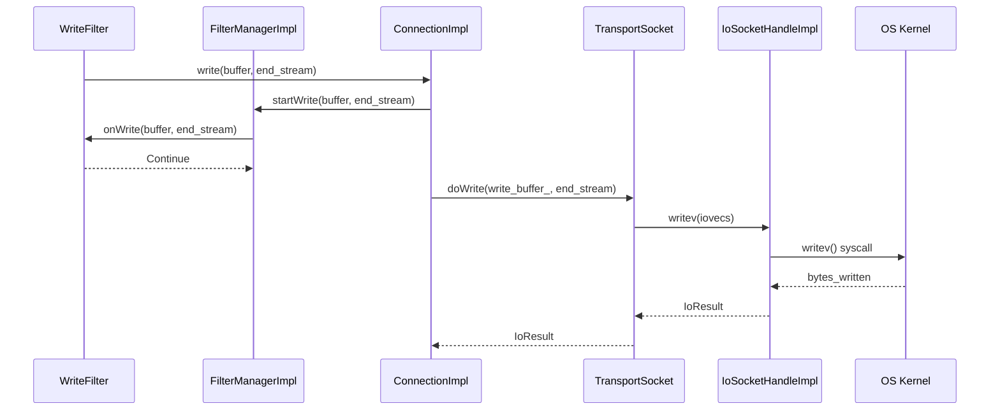
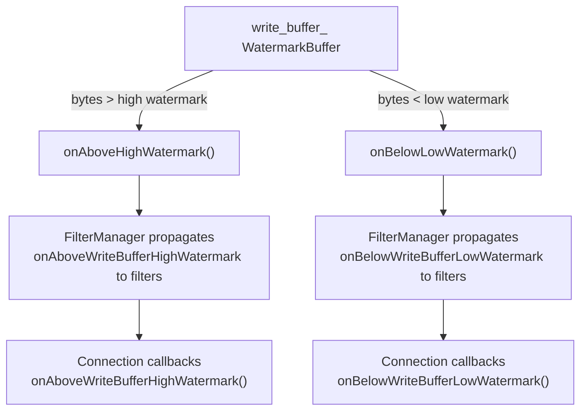
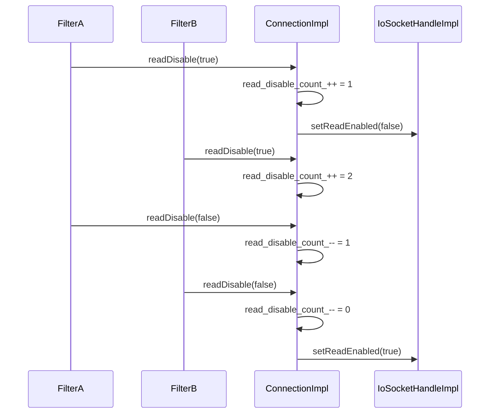
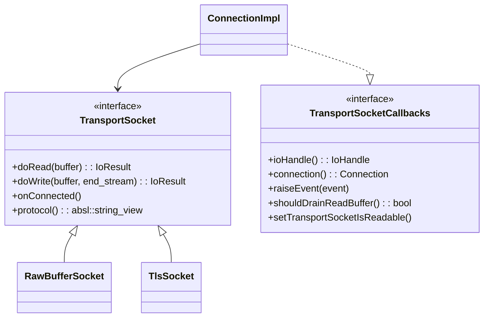
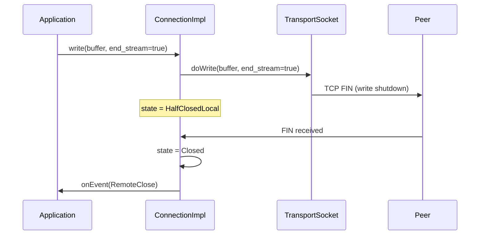
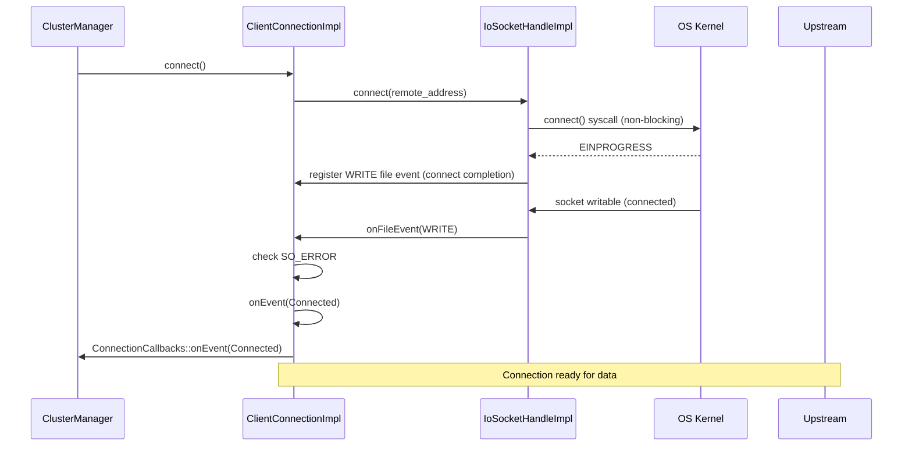

# ConnectionImpl

**Files:**
- `source/common/network/connection_impl_base.h/.cc` (abstract base)
- `source/common/network/connection_impl.h/.cc` (~30 KB header, ~70 KB impl)
**Namespace:** `Envoy::Network`

## Overview

`ConnectionImpl` is the core TCP connection implementation in Envoy. It owns the `IoHandle` (raw file descriptor), drives the read/write filter chain via `FilterManagerImpl`, manages backpressure watermarks, delayed-close timers, and half-close semantics. Two concrete subclasses exist: `ServerConnectionImpl` (for accepted downstream connections) and `ClientConnectionImpl` (for initiated upstream connections).

## Class Hierarchy



## Connection Lifecycle

**This state machine shows the complete lifecycle of a TCP connection:**

**States Explained:**

**Open (Active State):**
- Connection is fully established and bidirectional
- Both sending and receiving data
- Filters are actively processing
- Most connections spend majority of time here

**HalfClosedLocal (Envoy sent FIN):**
- Envoy called `write()` with `end_stream=true`
- TCP FIN sent to peer (no more data from Envoy)
- Still receiving data from peer
- Waiting for peer to close their side

**HalfClosedRemote (Peer sent FIN):**
- Received FIN from peer (peer finished sending)
- Envoy can still send data
- Common when client sends request and waits for response
- Envoy closes after sending full response

**Closing (Shutdown in Progress):**
- `close()` was explicitly called
- Delayed close timer may be active (flush pending writes)
- Not accepting new data
- Waiting for clean shutdown

**Closed (Terminal State):**
- Connection fully terminated
- Resources released
- Object scheduled for deferred deletion
- Cannot be reopened

**Half-Close vs Full-Close:**
- **Half-close** enables efficient request/response patterns (HTTP)
- **Full-close** happens when either side calls `close()` or error occurs
- Half-close is graceful, full-close may be abrupt



## Data Read Flow

**This sequence shows how data flows from the network into the application:**

**Step-by-Step Process:**

1. **OS Kernel**: Data arrives on socket, kernel buffers it
2. **Event Notification**: Socket becomes readable, event loop wakes up
3. **IoHandle**: Receives file event, calls ConnectionImpl
4. **ConnectionImpl::onFileEvent()**: Handles read event
5. **TransportSocket::doRead()**: Reads and potentially decrypts data
   - For TLS: Reads encrypted data, decrypts, returns plaintext
   - For raw: Directly reads into read buffer
6. **FilterManagerImpl::onRead()**: Passes data to filter chain
7. **ReadFilter::onData()**: Each filter processes data in sequence
   - Can return **Continue** (pass to next filter)
   - Can return **StopIteration** (pause, resume later)
   - Filter may consume, modify, or buffer data

**Transport Socket Role:**
- Abstracts encryption/decryption from filters
- Filters always see plaintext, regardless of transport
- TLS handshake happens transparently
- Application code doesn't need to know about encryption

**Filter Chain Execution:**
- Filters execute in registration order
- First filter gets first look at data
- Last filter (often HTTP Connection Manager or TCP Proxy) handles final processing
- Filters can stop chain (buffering, async operations)

**Backpressure:**
- If read buffer grows too large, `readDisable()` is called
- Stops reading from socket until buffer drains
- Prevents memory exhaustion
- Automatically resumes when buffer drops below low watermark



## Data Write Flow



## Close Types and Delayed Close

```mermaid
flowchart TD
    A[close called] --> B{CloseType?}
    B -->|NoFlush| C[Immediate close<br/>Discard write buffer]
    B -->|FlushWrite| D{Write buffer empty?}
    B -->|FlushWriteAndDelay| E[Flush + start delayed_close_timer]
    D -->|Yes| C
    D -->|No| F[Wait for write buffer drain]
    F --> C
    E --> G[Wait for timer OR flush]
    G --> C
    C --> H[close IoHandle]
    H --> I[onEvent(LocalClose) to callbacks]
```

### Close Type Reference

| `CloseType` | Behavior |
|-------------|---------|
| `NoFlush` | Immediately close; discard pending write data |
| `FlushWrite` | Drain write buffer first, then close |
| `FlushWriteAndDelay` | Drain write buffer, then wait for `delayed_close_timeout` before closing |

## Watermark / Backpressure



### Read Disable

`readDisable(true)` disables the `READ` file event on the IoHandle, applying backpressure to the OS TCP receive window. It uses a ref-count (`read_disable_count_`) so nested disables work correctly:



## Transport Socket Integration

`ConnectionImpl` delegates all actual I/O to a `TransportSocket` (e.g., `RawBufferSocket` for plaintext, TLS socket for encrypted). The transport socket calls back into the connection via `TransportSocketCallbacks`:



## Half-Close Semantics

HTTP/1.1 and other protocols need to send a FIN (EOF) on the write side while still reading. `ConnectionImpl` supports this via the `end_stream` parameter in `write()`:



## Stats / Logging

Key stats charged by `ConnectionImpl`:

| Stat | When |
|------|------|
| `cx_total` | Connection created |
| `cx_active` | Connection active (gauged) |
| `cx_destroy_local` | Closed locally |
| `cx_destroy_remote` | Closed by peer |
| `cx_tx_bytes_total` | Bytes written |
| `cx_rx_bytes_total` | Bytes read |
| `cx_connect_timeout` | Client connect timeout |

## `ClientConnectionImpl` — Initiating Connections



## Key Configuration Points

| Config | Effect |
|--------|--------|
| `setBufferLimits(bytes)` | Sets high/low watermarks on write buffer |
| `delayed_close_timeout` | Duration for `FlushWriteAndDelay` close |
| `enable_half_close` | Whether to support half-close semantics |
| `detect_and_raise_rst_tcp_reset` | Map TCP RST to `ConnectionEvent::ConnectedZeroRtt` |
