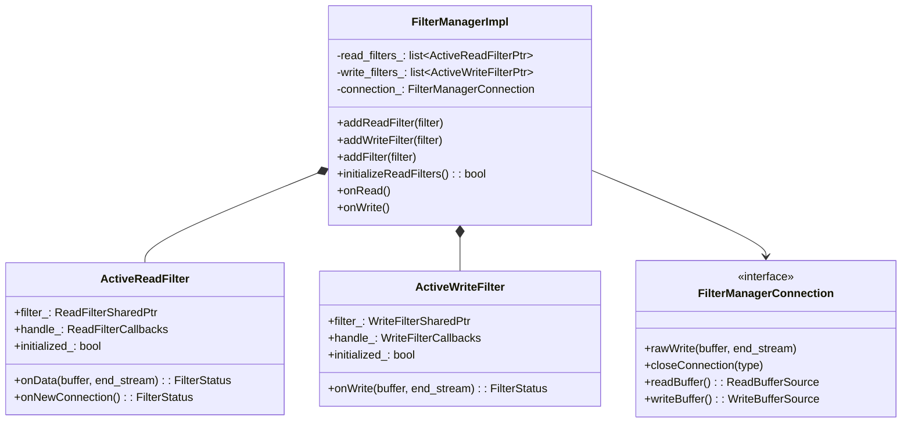
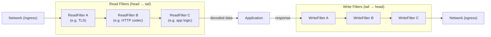
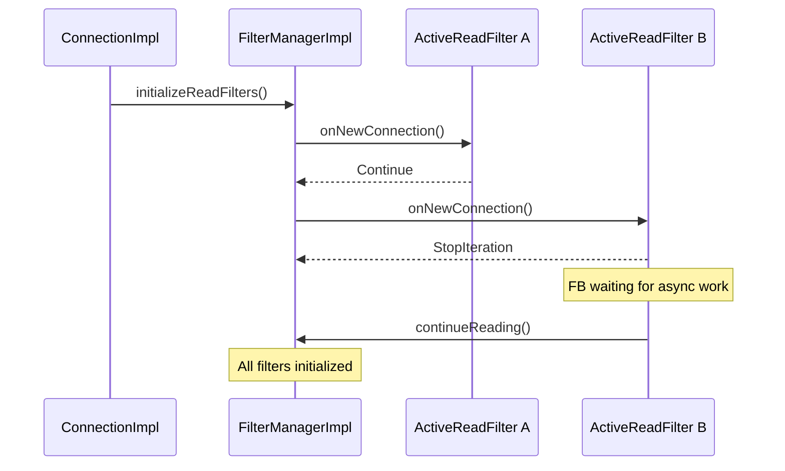
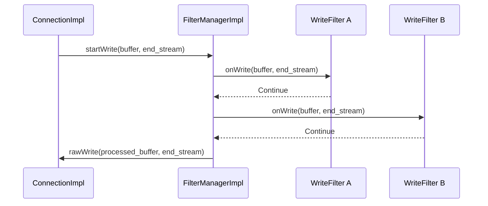
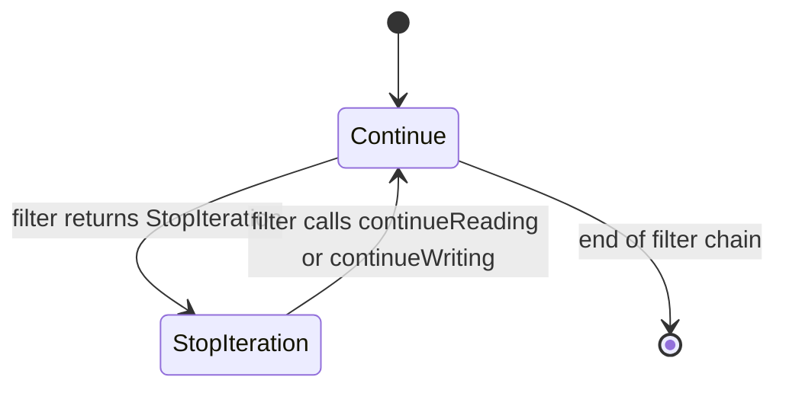
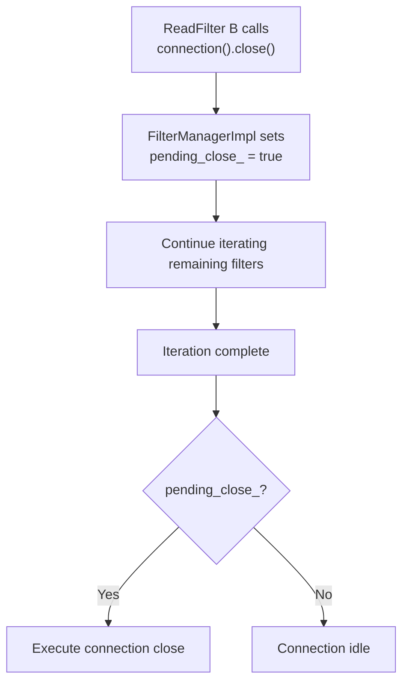

# FilterManagerImpl

**Files:** `source/common/network/filter_manager_impl.h` / `.cc`  
**Namespace:** `Envoy::Network`

## Overview

`FilterManagerImpl` manages the ordered list of **network read and write filters** installed on a `ConnectionImpl`. It drives data through the filter chain in both directions, manages filter initialization (lazy `onNewConnection`), handles connection draining after a filter signals close, and provides each filter with callback access to the connection.

This is the **network-layer** (L4) filter manager, distinct from the HTTP-layer `Http::FilterManager`. Network filters operate on raw `Buffer::Instance` data, not parsed HTTP headers.

**What is a Network Filter?**

Network filters operate at Layer 4 (TCP/UDP), processing raw bytes before any protocol parsing:

**Common Network Filters:**
- **HTTP Connection Manager**: Parses HTTP and creates HTTP filter chain
- **TCP Proxy**: Proxies raw TCP streams to upstream
- **Redis Proxy**: Parses Redis protocol, provides connection pooling
- **MySQL Proxy**: Parses MySQL protocol, provides query routing
- **Mongo Proxy**: Parses MongoDB protocol, provides sharding
- **TLS Inspector (listener filter)**: Extracts SNI before connection is established

**Why Network Filters?**
- **Protocol agnostic**: Connection layer doesn't need to know about HTTP, Redis, etc.
- **Composability**: Can stack filters (rate limit → protocol parser → proxy)
- **Early decision making**: Can reject connections before expensive parsing
- **Resource management**: Can limit connections based on raw metrics

**Network Filter vs HTTP Filter:**
- **Network Filter**: Sees raw bytes, operates at connection level
- **HTTP Filter**: Sees parsed HTTP (headers, body), operates at request level
- HTTP Connection Manager is a network filter that creates HTTP filters internally

## Class Hierarchy



## Filter Chain Ordering

**This diagram shows how network filters process data in both directions:**

**Read Filters (Downstream → Envoy):**
- Execute in **forward order**: First filter added gets first look at data
- Each filter can inspect, modify, or buffer data
- Filter A might do rate limiting
- Filter B might parse protocol (HTTP Connection Manager)
- Filter C might do application-specific logic
- Data flows: Network → A → B → C → Application

**Write Filters (Envoy → Downstream):**
- Execute in **reverse order**: Last filter added gets first look at response
- Symmetric with read filters for layering
- Filter C might add metadata
- Filter B might encode protocol
- Filter A might compress data
- Data flows: Application → C → B → A → Network

**Why Reverse Order for Writes?**
- **Symmetry**: Filter that unwraps on read can wrap on write
- **Layering**: Matches OSI model (application → transport)
- **Example**:
  - Filter A: Encryption - decrypts on read, encrypts on write
  - Filter B: Compression - decompresses on read, compresses on write
  - Processing: Read: encrypted → compressed → plain | Write: plain → compressed → encrypted



- **Read filters** iterate **forward** (first added → last added)
- **Write filters** iterate **reverse** (last added → first added)

## Filter Initialization — `onNewConnection()`

Filters are lazily initialized. `initializeReadFilters()` is called once when the connection is accepted, walking each `ActiveReadFilter` and calling `onNewConnection()`. If a filter returns `StopIteration`, the chain pauses until that filter calls `continueReading()`.



## Read Data Flow

```mermaid
sequenceDiagram
    participant CI as ConnectionImpl
    participant FM as FilterManagerImpl
    participant FA as ReadFilter A
    participant FB as ReadFilter B

    CI->>FM: onRead()
    FM->>FA: onData(read_buffer, end_stream)
    FA-->>FM: Continue
    FM->>FB: onData(read_buffer, end_stream)
    FB-->>FM: StopIteration
    Note over FB: FB paused; data stays in read_buffer
    FB->>FM: continueReading()
    FM->>FB: onData(remaining_data)
```

## Write Data Flow



## Filter Status State Machine



## Pending Close Handling

If a filter calls `connection().close()` while the filter chain is mid-iteration, `FilterManagerImpl` records a `pending_close_` flag and defers the actual close until the current iteration completes:



## `ActiveReadFilter` — ReadFilterCallbacks

Each `ActiveReadFilter` wraps the real `ReadFilter` and also implements `ReadFilterCallbacks` to give the filter access to the connection:

| Callback | Behavior |
|----------|---------|
| `continueReading()` | Resume chain from this filter's position |
| `connection()` | Returns reference to the `Connection` |
| `injectReadDataToFilterChain(buffer, end_stream)` | Inject synthetic data into the chain |
| `upstreamHost()` | Returns upstream `HostDescription` (for cluster filters) |

## `ActiveWriteFilter` — WriteFilterCallbacks

| Callback | Behavior |
|----------|---------|
| `injectWriteDataToFilterChain(buffer, end_stream)` | Inject synthetic data into the write chain |
| `connection()` | Returns reference to the `Connection` |

## Comparison: Network vs HTTP Filter Manager

| Aspect | `Network::FilterManagerImpl` | `Http::FilterManager` |
|--------|-----------------------------|-----------------------|
| Data type | Raw `Buffer::Instance` | Parsed HTTP headers/body/trailers |
| Filter interfaces | `ReadFilter` / `WriteFilter` | `StreamDecoderFilter` / `StreamEncoderFilter` |
| Direction | Read = forward; Write = reverse | Decoder = forward; Encoder = reverse |
| Per-stream | No (per-connection) | Yes (per HTTP request) |
| Local reply | No | Yes (`sendLocalReply`) |
| Initialization | `onNewConnection()` called once | Filter factories called per request |
| Buffering | In `read_buffer_` on `ConnectionImpl` | Per-filter `buffered_body_` |
