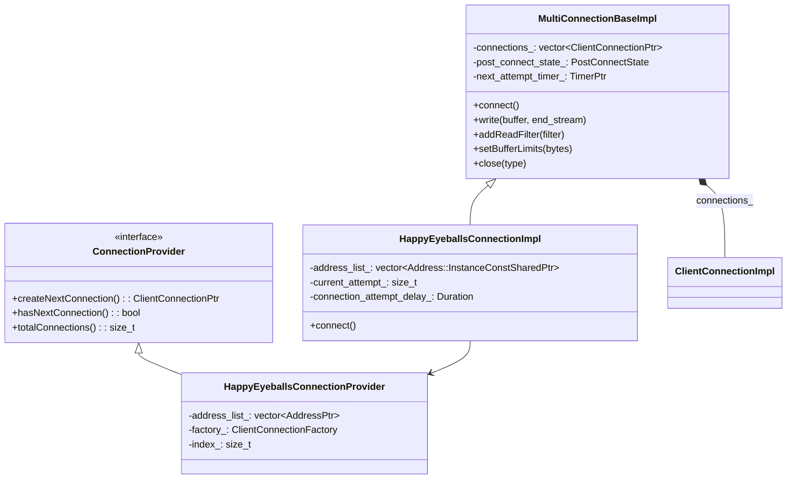
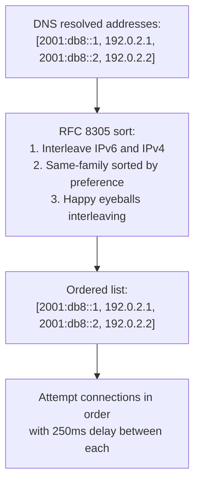
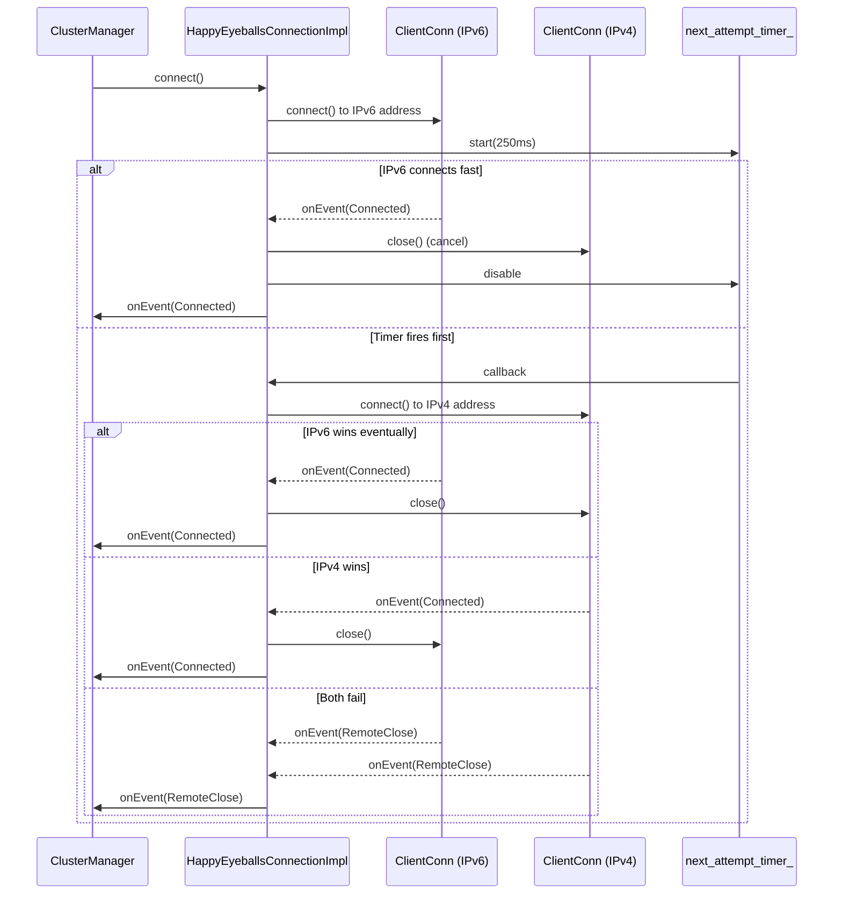
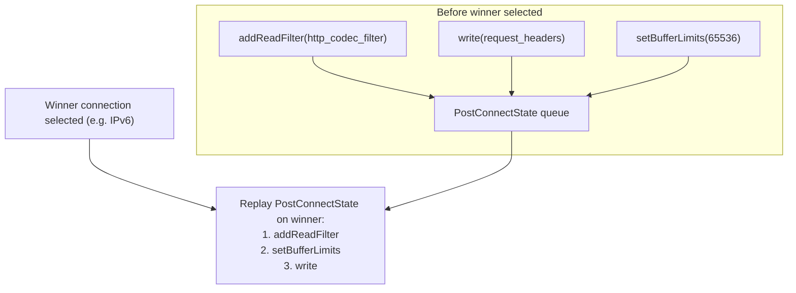
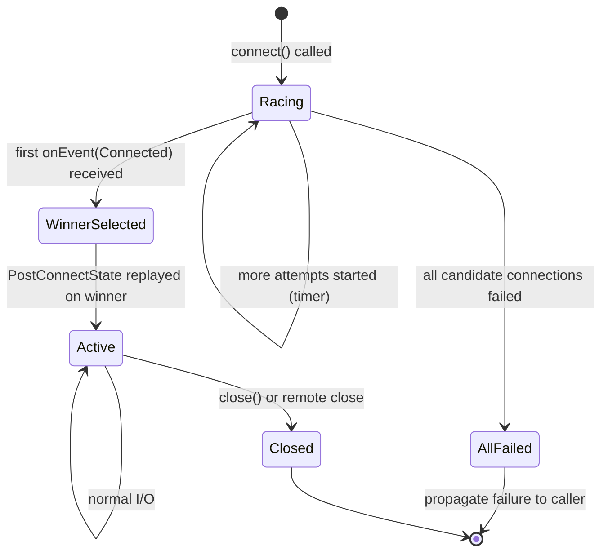
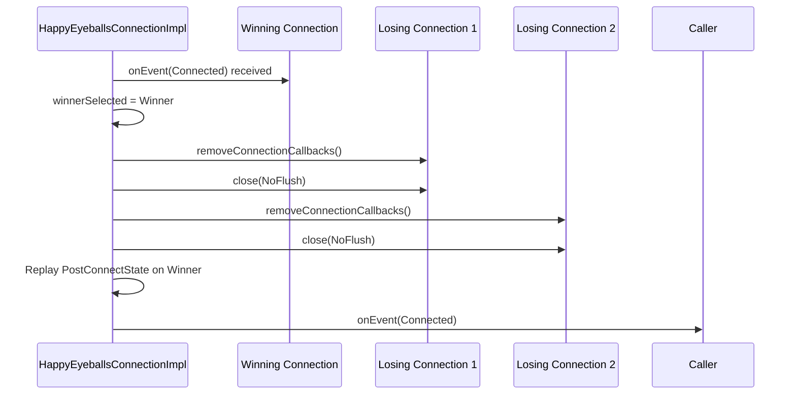

# HappyEyeballsConnectionImpl

**Files:**
- `source/common/network/multi_connection_base_impl.h/.cc` (base)
- `source/common/network/happy_eyeballs_connection_impl.h/.cc`
**Namespace:** `Envoy::Network`

## Overview

`HappyEyeballsConnectionImpl` implements **RFC 8305 (Happy Eyeballs v2)** for upstream TCP connections. When an upstream hostname resolves to multiple addresses (e.g., both IPv6 and IPv4), it races connections to each address in priority order, using the first one that successfully connects while cancelling the others.

`MultiConnectionBaseImpl` is the generic racing base; `HappyEyeballsConnectionImpl` extends it with RFC 8305–compliant address ordering and the 250ms per-attempt delay.

## Class Hierarchy

## RFC 8305 Address Ordering

Before attempting connections, addresses are sorted per RFC 8305:

## Connection Racing Flow

## `PostConnectState` — Deferred Operations

Before a winner is selected, operations like `write()`, `addReadFilter()`, and `setBufferLimits()` are deferred and replayed on the winning connection:

## `PerConnectionState` — Applied Immediately to All

Some state must be applied to every candidate connection (not deferred):

| State | Reason Applied to All |
|-------|----------------------|
| `setBufferLimits()` | Watermarks must be consistent across all attempts |
| `noDelay(true)` | TCP_NODELAY applied immediately on socket creation |
| `addConnectionCallbacks()` | Internal callbacks needed for race tracking |

## Winner Selection State Machine

## Cancellation and Cleanup

When a winner is selected, all losing connections are closed:

## Attempt Timing

| Parameter | Default | Purpose |
|-----------|---------|---------|
| `connection_attempt_delay` | 250ms (RFC 8305) | Delay before starting next address attempt |
| Max attempts | `address_list_.size()` | One attempt per resolved address |

## Key Design Properties

- **Transparent substitution**: `HappyEyeballsConnectionImpl` implements the same `ClientConnection` interface as `ClientConnectionImpl`, so upstream pool code needs no changes.
- **No extra latency when first address succeeds**: If the first connection (typically IPv6) succeeds before the 250ms timer fires, no additional connection is ever made.
- **Filter/callback replay**: All `addReadFilter()`, `addWriteFilter()`, `addConnectionCallbacks()`, and initial `write()` calls are safely deferred and replayed exactly once on the winner.
