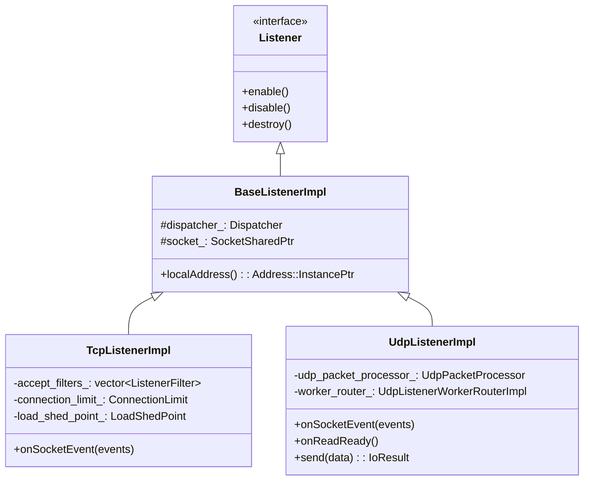
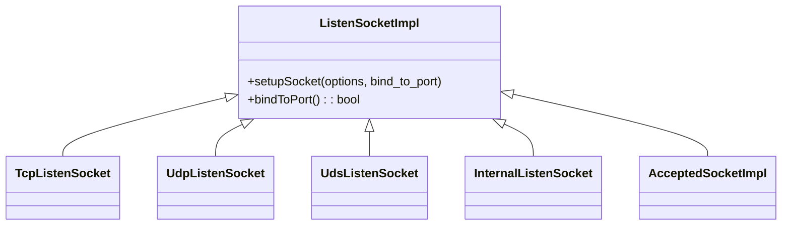
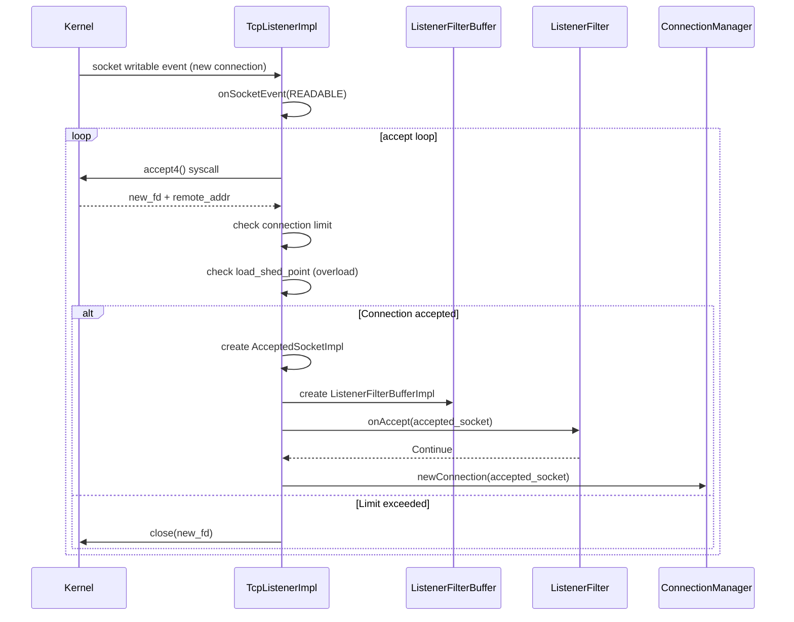
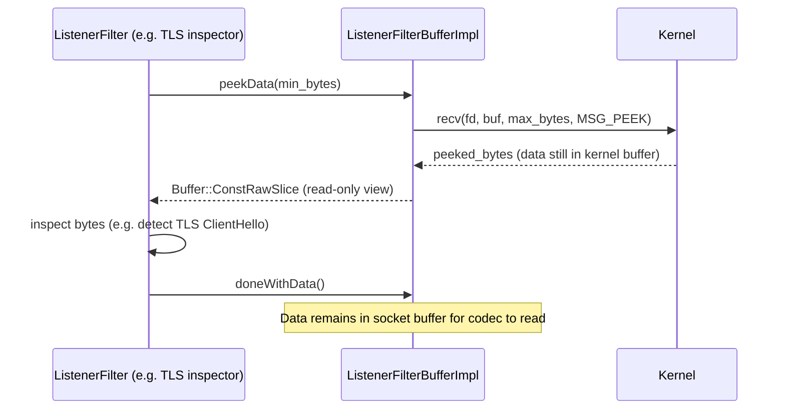
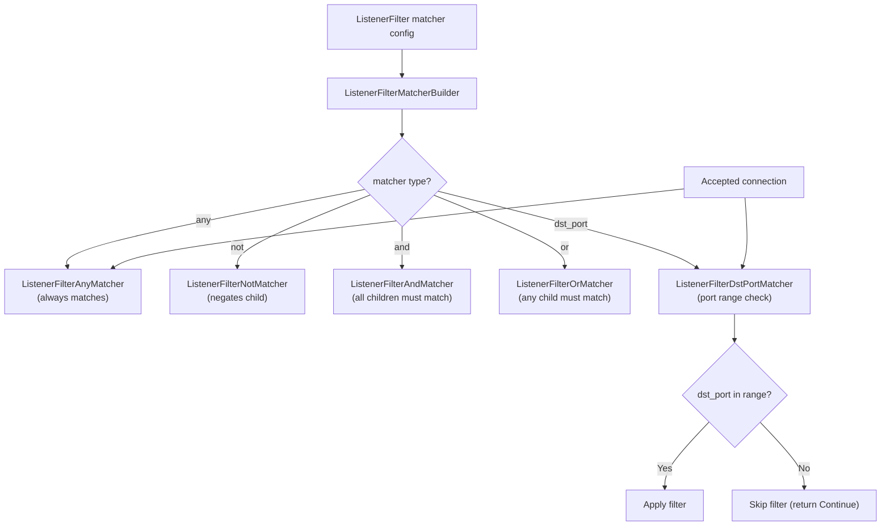
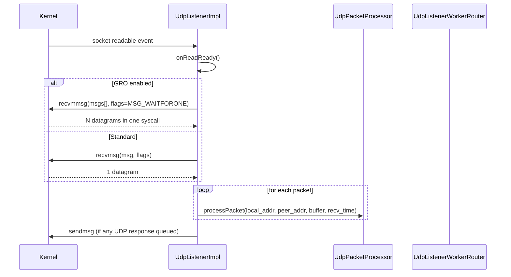
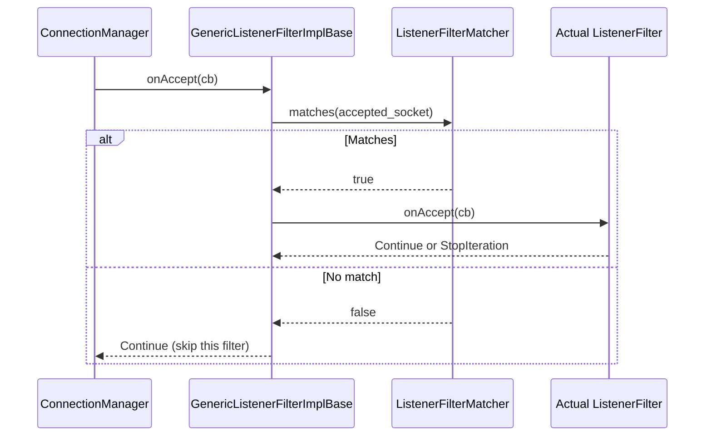
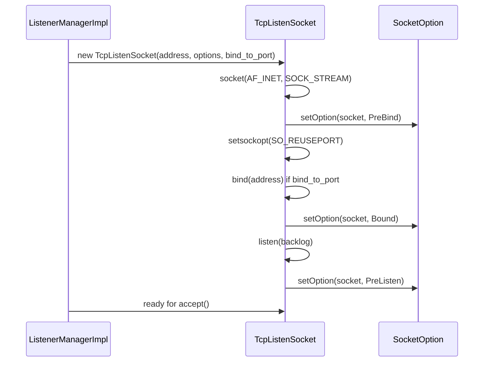

# TCP and UDP Listeners

**Files:**
- `source/common/network/base_listener_impl.h/.cc`
- `source/common/network/tcp_listener_impl.h/.cc`
- `source/common/network/udp_listener_impl.h/.cc`
- `source/common/network/listen_socket_impl.h/.cc`
- `source/common/network/listener_filter_buffer_impl.h/.cc`
**Namespace:** `Envoy::Network`

## Overview

Envoy's listener layer accepts new connections (TCP) or datagrams (UDP) from the OS, applies listener filters (L4 pre-processing before the connection is handed to a filter chain), enforces connection limits and overload shedding, and dispatches to the appropriate worker thread.

## Class Hierarchy



## Listen Socket Hierarchy



## TCP Accept Flow



## Listener Filter Buffer — Peek Without Consuming

`ListenerFilterBufferImpl` lets listener filters peek at the first bytes of a connection (e.g., for TLS detection, proxy protocol parsing) using `recv(MSG_PEEK)` so the data is not consumed:



## Listener Filter Match Predicates

`filter_matcher.h` provides composable predicates that determine whether a listener filter applies to a given accepted connection:



## Overload / Connection Limit Protection

`TcpListenerImpl` integrates with two protection mechanisms:

```mermaid
flowchart TD
    Accept["New connection accepted"] --> A{Global connection<br/>limit reached?}
    A -->|Yes| B["Reject: close(new_fd)<br/>cx_overflow++ stat"]
    A -->|No| C{LoadShedPoint<br/>check (overload)?}
    C -->|Shed| D["Reject: close(new_fd)<br/>overload_reject++ stat"]
    C -->|Accept| E["Hand to listener filter chain"]
```

| Protection | Source | Stat |
|------------|--------|------|
| Connection limit | `config.globalConnectionLimit()` | `listener.downstream_cx_overflow` |
| Load shedding | `OverloadManager::LoadShedPoint` | `listener.downstream_cx_overload_reject` |

## UDP Listener Flow

UDP listeners have different semantics — there are no connections, only datagrams. `UdpListenerImpl` uses `recvmsg`/`recvmmsg` (with optional GRO) to batch-receive packets:



## UDP Worker Routing

For multi-worker setups, UDP packets from the same peer are consistently routed to the same worker thread:

```mermaid
flowchart TD
    Pkt["UDP packet from 10.0.0.1:5000"] --> Router["UdpListenerWorkerRouterImpl"]
    Router -->|hash(peer_addr)| W0["Worker 0"]
    Router -->|hash(peer_addr)| W1["Worker 1"]
    Router -->|hash(peer_addr)| W2["Worker 2"]
    W1 -->|all packets from 10.0.0.1:5000| Session["UDP Session Handler"]
```

## `GenericListenerFilterImplBase<T>`

A template that wraps any listener filter with a `ListenerFilterMatcher`, short-circuiting `onAccept()` when the predicate doesn't match:



## Socket Setup Lifecycle


