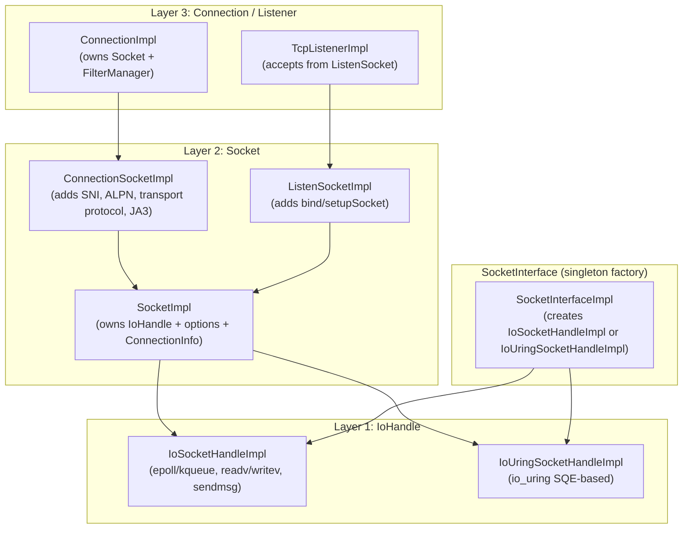
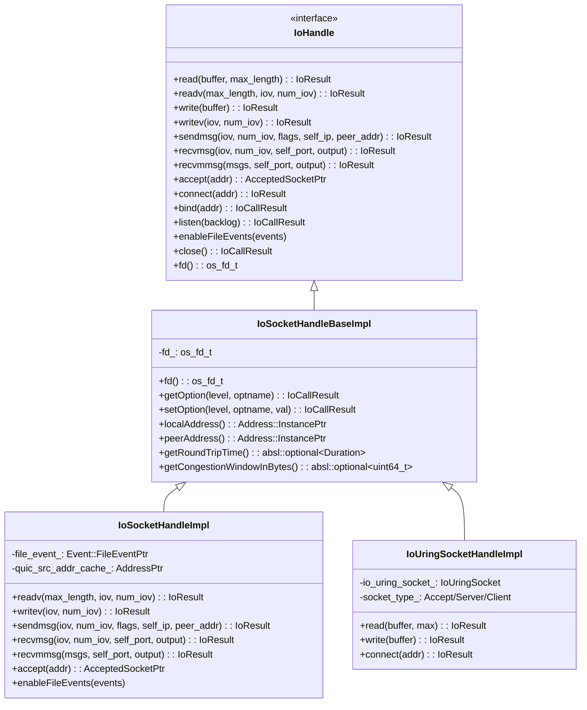
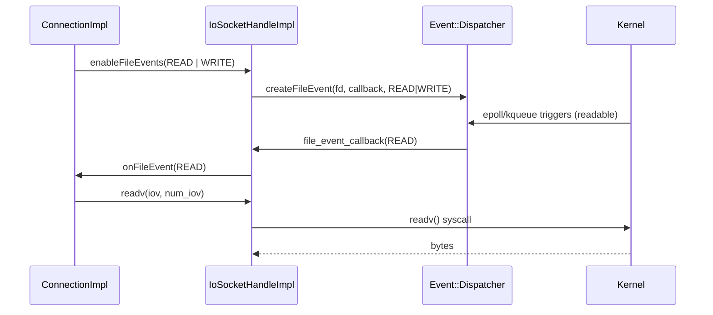
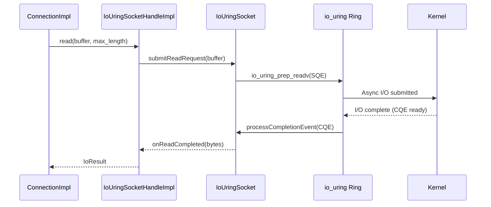
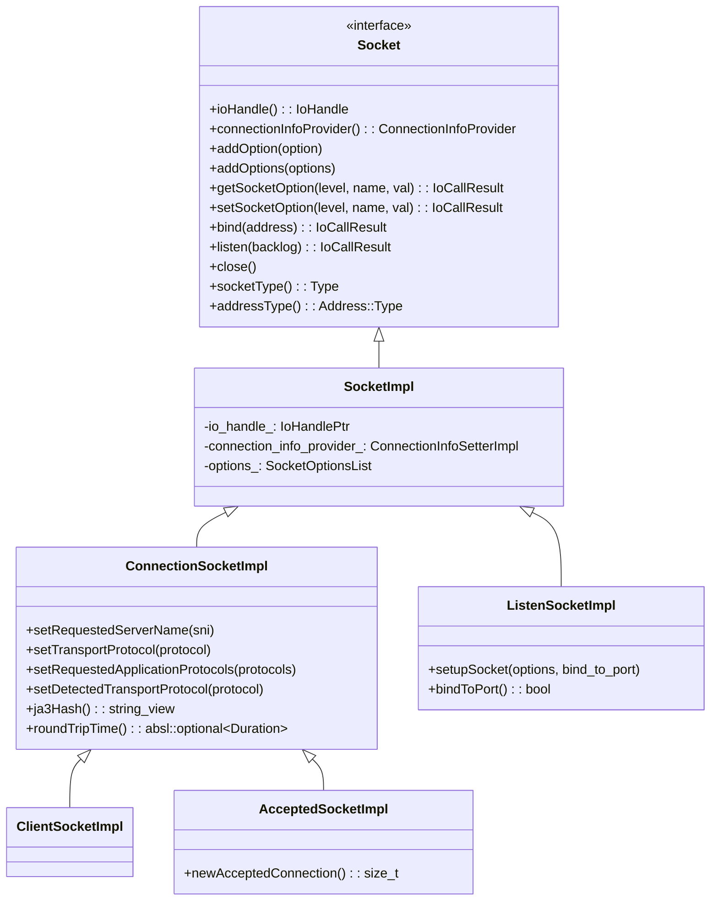
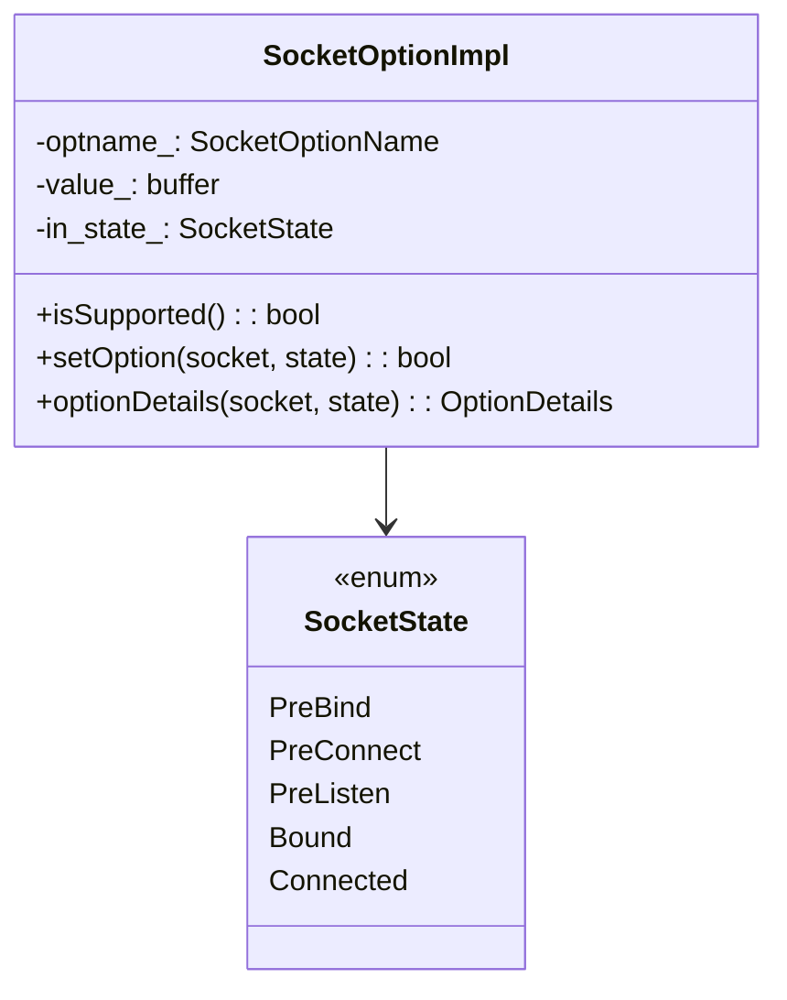
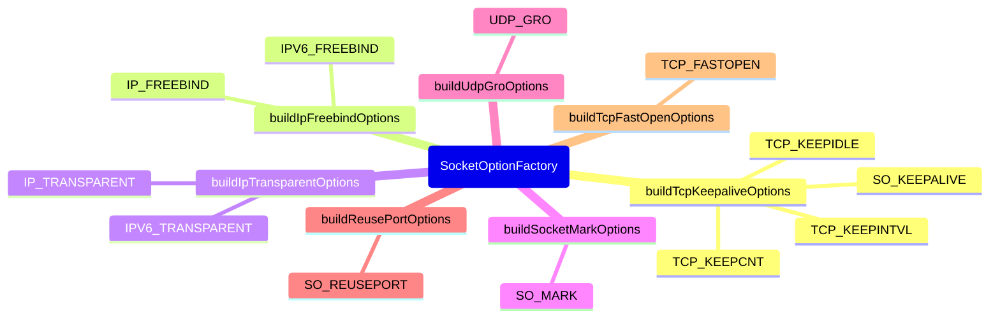
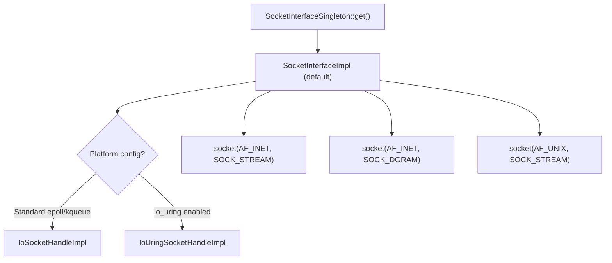
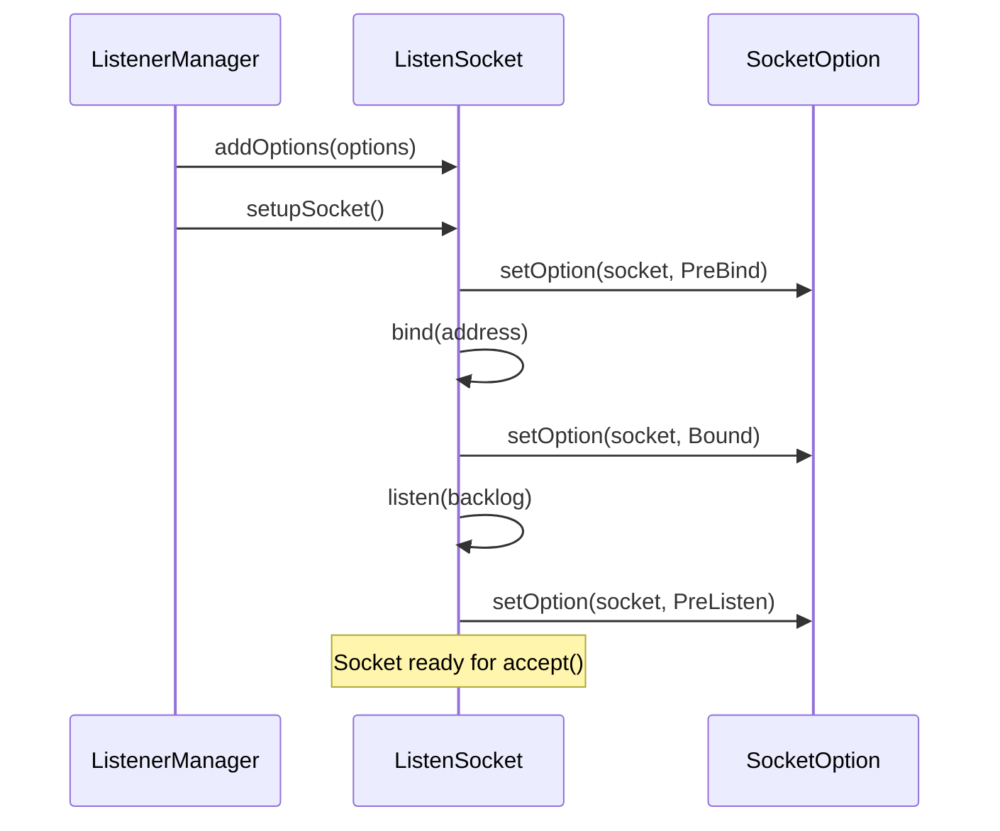

# Socket & IO Handle System

**Files:**
- `source/common/network/io_socket_handle_base_impl.h/.cc`
- `source/common/network/io_socket_handle_impl.h/.cc`
- `source/common/network/io_uring_socket_handle_impl.h/.cc`
- `source/common/network/socket_impl.h/.cc`
- `source/common/network/socket_interface.h` / `socket_interface_impl.h/.cc`
- `source/common/network/socket_option_impl.h/.cc`
- `source/common/network/socket_option_factory.h/.cc`
**Namespace:** `Envoy::Network`

## Overview

The socket/IO system is organized in three layers:
1. **`IoHandle`** — abstracts raw OS I/O (syscalls: readv, writev, sendmsg, recvmsg, accept, connect)
2. **`Socket`** — adds addressing, socket options, and connection metadata on top of `IoHandle`
3. **`SocketInterface`** — an injectable singleton factory that creates `IoHandle` instances (enabling io_uring backend)

## Layer Architecture



## IoHandle Hierarchy



## `IoSocketHandleImpl` — Event-Driven I/O

`IoSocketHandleImpl` integrates directly with the `Event::Dispatcher`'s event loop via `enableFileEvents()`:



## `IoUringSocketHandleImpl` — io_uring Backend

For Linux kernels with io_uring support, async I/O is submitted as SQEs (Submission Queue Entries) and completed via CQEs (Completion Queue Entries):



## Socket Hierarchy



## Socket Options System

### `SocketOptionImpl`

Wraps a single `setsockopt()` call, applied at a specific lifecycle state:



### `AddrFamilyAwareSocketOptionImpl`

Applies different options for IPv4 vs IPv6:

```mermaid
flowchart TD
    AFAS["AddrFamilyAwareSocketOptionImpl::setOption(socket, state)"] --> B{socket.addressType()?}
    B -->|IPv4| C["ipv4_option_.setOption(socket, state)"]
    B -->|IPv6| D["ipv6_option_.setOption(socket, state)"]
    B -->|Any| E["Try ipv4_option_ first,<br/>then ipv6_option_"]
```

### `SocketOptionFactory` — Common Options



## `SocketInterface` — Platform Factory

`SocketInterfaceSingleton` is an injectable singleton that decouples `IoHandle` creation from `ConnectionImpl`:



## TCP/UDP Socket Option Application Lifecycle



## `ConnectionInfoSetterImpl` — Connection Metadata

`ConnectionSocketImpl` exposes rich connection metadata via `ConnectionInfoSetterImpl`:

| Field | Purpose |
|-------|---------|
| `localAddress()` | Local socket address |
| `remoteAddress()` | Remote peer address |
| `directRemoteAddress()` | Pre-XFF actual remote IP |
| `requestedServerName()` | TLS SNI from client |
| `transportProtocol()` | "raw_buffer", "tls", "quic" |
| `requestedApplicationProtocols()` | ALPN protocols requested |
| `ja3Hash()` | TLS JA3 fingerprint |
| `roundTripTime()` | TCP RTT estimate |
