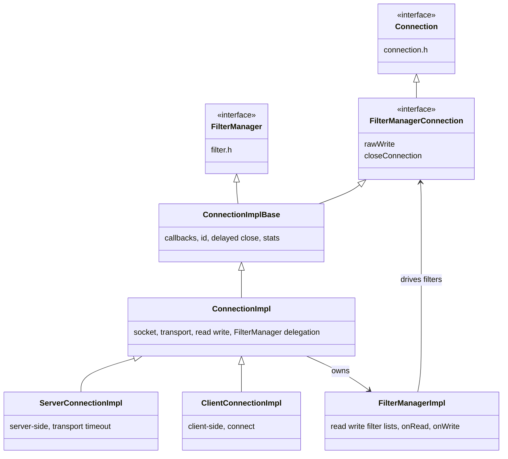
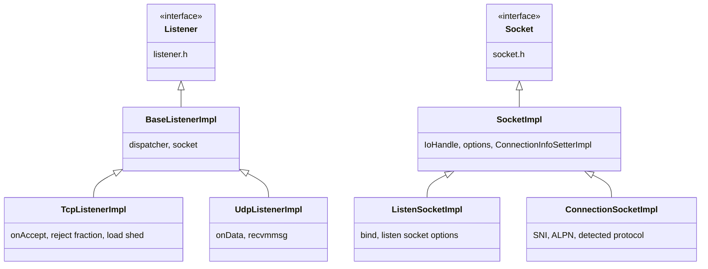
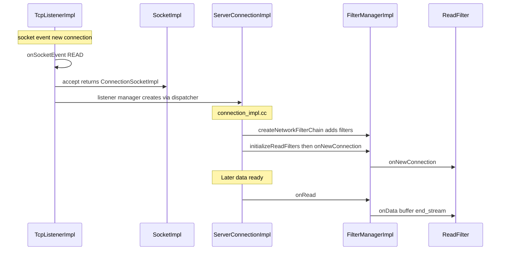

# Source: Common Network

This directory contains the **implementations** of Envoy's network layer. It implements the interfaces defined in **`envoy/network/`** (listeners, connections, filters, sockets, addresses, transport, etc.) and adds shared utilities used across the codebase.

**Relationship to API:** Types in `envoy/network/*.h` are the public interface; types in `source/common/network/*` are the default/common implementations. Extensions and tests may provide alternative implementations.

---

## Directory layout

```
source/common/network/
├── README.md                    # This file
├── *.h / *.cc                   # Core implementations (see sections below)
├── dns_resolver/                # DNS resolver factory utilities (c-ares, Apple)
│   ├── dns_factory_util.h/cc
│   └── BUILD
└── matching/                    # Network match tree data (filter chain matching)
    ├── data_impl.h             # MatchingDataImpl, UdpMatchingDataImpl
    ├── inputs.h                 # BaseFactory for network match inputs
    └── BUILD
```

---

## Implementation map (API → this directory)

| API (envoy/network) | Implementation in source/common/network |
|---------------------|------------------------------------------|
| **Address::Instance** | `address_impl.h/cc`, `ip_address.h/cc`, `ip_address_parsing.h/cc` |
| **Socket, ConnectionSocket, ConnectionInfoProvider** | `socket_impl.h/cc`, `connection_socket_impl.h` |
| **ListenSocket** | `listen_socket_impl.h/cc` |
| **IoHandle** | `io_socket_handle_impl.h/cc`, `io_socket_handle_base_impl.h/cc`, `io_uring_socket_handle_impl.*`, `win32_socket_handle_impl.*` |
| **SocketInterface** | `socket_interface_impl.h/cc`, `socket_interface.h` (common shim) |
| **Listener** (TCP/UDP) | `base_listener_impl.h/cc`, `tcp_listener_impl.h/cc`, `udp_listener_impl.h/cc` |
| **Connection, FilterManager** | `connection_impl.h/cc`, `connection_impl_base.h/cc`, `filter_manager_impl.h/cc` |
| **ServerConnection / ClientConnection** | `connection_impl.h` → `ServerConnectionImpl`, `ClientConnectionImpl` |
| **FilterManagerConnection** | `filter_manager_impl.h` → `FilterManagerConnection` (base for ConnectionImpl) |
| **TransportSocket** (raw L4) | `raw_buffer_socket.h/cc` |
| **ListenerFilterBuffer** | `listener_filter_buffer_impl.h/cc` |
| **ConnectionBalancer** | `connection_balancer_impl.h/cc` |
| **ClientConnectionFactory** | `default_client_connection_factory.h/cc` |
| **Resolver** (address proto → Address) | `resolver_impl.h/cc` |
| **DnsResolver** (typed config helpers) | `dns_resolver/dns_factory_util.h/cc` |
| **MatchingData / UdpMatchingData** | `matching/data_impl.h` |
| **HashPolicy** | `hash_policy.h/cc` |

---

## Core implementations (by area)

### Connections and filter manager

- **`connection_impl.h/cc`**
  - **ConnectionImpl** – Implements `Network::Connection` and `TransportSocketCallbacks`. Holds socket, transport socket, stream info; drives read/write and close; delegates filter chain to **FilterManagerImpl**.
  - **ServerConnectionImpl** – Server-side connection (accepted socket). Adds transport socket connect timeout, `initializeReadFilters()` override.
  - **ClientConnectionImpl** – Client-side connection (outbound). Creates socket, connects, raises `Connected` when done.
- **`connection_impl_base.h/cc`**
  - **ConnectionImplBase** – Base for ConnectionImpl: implements `FilterManagerConnection`, `Connection` (callbacks, id, stats, delayed close, scope tracking). Does **not** implement socket I/O; that is in ConnectionImpl.
- **`filter_manager_impl.h/cc`**
  - **FilterManagerConnection** – Interface extending `Connection` with `rawWrite()` and `closeConnection(ConnectionCloseAction)` for use by the filter manager.
  - **FilterManagerImpl** – Holds lists of read/write filters; implements `onRead()` (iterate read filters, call `onData`/`onNewConnection`) and `onWrite()` (iterate write filters in reverse). Uses **ActiveReadFilter** / **ActiveWriteFilter** wrappers that implement the filter callbacks. ConnectionImpl owns a FilterManagerImpl and delegates `addReadFilter`, `addWriteFilter`, `initializeReadFilters`, etc.

**Flow:** Incoming data → ConnectionImpl (transport socket doRead) → FilterManagerImpl::onRead() → ReadFilters in order. Outgoing data → write() → FilterManagerImpl::onWrite() → WriteFilters in reverse → transport socket doWrite.

### Listeners and sockets

- **`base_listener_impl.h/cc`** – **BaseListenerImpl** implements `Network::Listener`: holds dispatcher and listen socket; base for TCP/UDP listener impls.
- **`tcp_listener_impl.h/cc`** – **TcpListenerImpl** extends BaseListenerImpl: registers socket with dispatcher, on read event calls **TcpListenerCallbacks::onAccept** with accepted socket. Handles global connection limit, reject fraction, load shed points, overload manager.
- **`udp_listener_impl.h/cc`** – **UdpListenerImpl**: UDP listen socket, recvmmsg-style reads, dispatches to **UdpListenerCallbacks::onData**.
- **`listen_socket_impl.h/cc`** – **ListenSocketImpl** extends SocketImpl; **NetworkListenSocket&lt;Address::Ip&gt;** template creates/binds listen socket. Used by listener managers to create the socket passed into TcpListenerImpl/UdpListenerImpl.
- **`socket_impl.h/cc`** – **SocketImpl** implements **Network::Socket** (ioHandle, options, close). **ConnectionInfoSetterImpl** implements address/SSL/metadata for the socket. Used by ConnectionSocketImpl and listen sockets.
- **`connection_socket_impl.h`** – **ConnectionSocketImpl** implements **ConnectionSocket** (detected protocol, SNI, ALPN, etc.) on top of SocketImpl; used for accepted and client connections.

### I/O and socket interface

- **`io_socket_handle_impl.h/cc`** – **IoSocketHandleImpl** implements **IoHandle** (read, write, duplicate, etc.) around a file descriptor; used by SocketImpl.
- **`io_socket_handle_base_impl.h/cc`** – Shared base for IoHandle implementations.
- **`io_uring_socket_handle_impl.*`** – io_uring-based IoHandle (Linux).
- **`win32_socket_handle_impl.*`** – Windows IoHandle.
- **`socket_interface_impl.h/cc`** – **SocketInterfaceImpl**: creates sockets (e.g. for bind/connect) using the platform’s IoHandle. Used by address implementations and connection creation.
- **`socket_interface.h`** – Common helpers / forward declarations for socket interface usage.

### Addresses and resolution

- **`address_impl.h/cc`** – **InstanceBase**, **Ipv4Instance**, **Ipv6Instance**, **PipeInstance** implementing **Address::Instance**. **InstanceFactory** to build from proto or sockaddr.
- **`ip_address.h/cc`** – **Ipv4**, **Ipv6** helpers and **CidrRange**-related IP representation.
- **`ip_address_parsing.h/cc`** – Parsing IPs from strings.
- **`cidr_range.h/cc`** – **CidrRange** for IP + prefix length (filter chain matching, RBAC, etc.).
- **`resolver_impl.h/cc`** – Resolves **envoy::config::core::v3::Address** to **Address::InstanceConstSharedPtr**.

### Transport and options

- **`raw_buffer_socket.h/cc`** – **RawBufferSocket** implements **TransportSocket** for plain TCP (no TLS): doRead/doWrite pass through to IoHandle. **RawBufferSocketFactory** for downstream and upstream.
- **`transport_socket_options_impl.h/cc`** – Options passed when creating transport sockets (e.g. SNI, ALPN).

### Listener filters and buffer

- **`listener_filter_buffer_impl.h/cc`** – **ListenerFilterBufferImpl** implements **ListenerFilterBuffer**: peeks data from IoHandle for listener filters (e.g. TLS inspector), exposes **PeekState**, drain, capacity. Used by **ActiveTcpSocket** (in listener_manager) when a listener filter returns StopIteration to wait for more data.

### Client connections and Happy Eyeballs

- **`default_client_connection_factory.h/cc`** – **DefaultClientConnectionFactory** implements **ClientConnectionFactory**: creates **ClientConnectionImpl** (or Happy Eyeballs wrapper when configured).
- **`happy_eyeballs_connection_impl.h/cc`** – **HappyEyeballsConnectionProvider** implements **ConnectionProvider**: tries multiple addresses (e.g. IPv6 then IPv4) per RFC 8305. **HappyEyeballsConnectionImpl** wraps the winning connection.
- **`multi_connection_base_impl.h/cc`** – **MultiConnectionBaseImpl** base for Happy Eyeballs; manages multiple candidate connections, one becomes the “active” ClientConnection.

### Connection balancing and hashing

- **`connection_balancer_impl.h/cc`** – **ExactConnectionBalancerImpl** (balance by address), **NopConnectionBalancerImpl**. **ConnectionBalanceFactory** for config registration.
- **`hash_policy.h/cc`** – Hash policy implementation for connection hashing (e.g. for consistent hashing to upstreams).

### Utilities and helpers

- **`utility.h/cc`** – **Utility** namespace: `readFromSocket()`, `writeToSocket()`, UDP packet processor interface, `parseInternetAddress()`, `resolveUrl()`, socket option helpers, etc. Used widely by connections, listeners, and tests.
- **`application_protocol.h/cc`** – ALPN string normalization.
- **`socket_option_impl.h/cc`**, **`addr_family_aware_socket_option_impl.h/cc`** – Socket option implementations.
- **`socket_option_factory.h/cc`** – Building socket options from config.

### Filter chain matching

- **`filter_matcher.h/cc`** – Filter matcher utilities used when matching filter chains.
- **`matching/data_impl.h`** – **MatchingDataImpl** implements **Network::MatchingData** (socket, filter state, dynamic metadata) for TCP. **UdpMatchingDataImpl** for UDP. Used by filter chain manager to find the right chain.
- **`matching/inputs.h`** – **BaseFactory** template for network match tree inputs (e.g. source IP, destination IP, server name).

### Filter state and metadata

- **`filter_state_dst_address.h/cc`** – Filter state object for original destination address.
- **`filter_state_proxy_info.h/cc`** – Proxy info for filter state.
- **`proxy_protocol_filter_state.h/cc`** – Proxy protocol state.
- **`downstream_network_namespace.h/cc`** – Network namespace filter state.
- **`upstream_server_name.h/cc`**, **`upstream_subject_alt_names.h/cc`**, **`upstream_socket_options_filter_state.h/cc`** – Upstream-related filter state and names.

### DNS resolver (subdirectory)

- **`dns_resolver/dns_factory_util.h/cc`** – Helpers to create default DNS resolver config: **makeDefaultCaresDnsResolverConfig**, **makeDefaultAppleDnsResolverConfig**, **makeDefaultDnsResolverConfig**. **tryUseAppleApiForDnsLookups** for macOS. **checkTypedDnsResolverConfigExist**, **checkDnsResolutionConfigExist** to merge bootstrap/cluster DNS config. No actual resolver implementation here (those live in extensions).

### Other

- **`lc_trie.h`** – Longest-prefix match trie (e.g. for IP matching).
- **`io_socket_error_impl.h/cc`** – I/O error implementation.
- **`udp_packet_writer_handler_impl.h/cc`** – UDP packet writer handler implementation.
- **`generic_listener_filter_impl_base.h`** – Base for generic listener filter implementations.
- **`filter_impl.h`** – Internal filter helpers (if any).
- **`win32_redirect_records_option_impl.*`** – Windows-specific socket option.

---

## Connection and filter manager class hierarchy



---

## Listener and socket hierarchy



---

## Data flow: accept to network filters (where this code runs)



- **TcpListenerImpl** (this dir) receives the accept and passes the socket to the listener manager’s **TcpListenerCallbacks**.
- **ServerConnectionImpl** and **FilterManagerImpl** (this dir) own the connection and the network filter chain; read/write events are handled here and passed to the filters.

---

## File summary (quick reference)

| File(s) | Purpose |
|--------|---------|
| `address_impl.*`, `ip_address.*`, `ip_address_parsing.*` | Address and IP implementation and parsing. |
| `cidr_range.*` | CIDR range for matching. |
| `connection_impl.*`, `connection_impl_base.*` | Connection, ServerConnectionImpl, ClientConnectionImpl. |
| `filter_manager_impl.*` | FilterManagerImpl, FilterManagerConnection, read/write filter iteration. |
| `base_listener_impl.*`, `tcp_listener_impl.*`, `udp_listener_impl.*` | Listener implementations. |
| `listen_socket_impl.*`, `socket_impl.*`, `connection_socket_impl.h` | Listen and connection socket implementations. |
| `io_socket_handle_impl.*`, `io_socket_handle_base_impl.*` | IoHandle implementations. |
| `socket_interface_impl.*`, `socket_interface.h` | Socket creation abstraction. |
| `raw_buffer_socket.*` | Plain TCP transport socket. |
| `listener_filter_buffer_impl.*` | Peek buffer for listener filters. |
| `resolver_impl.*` | Address resolution from proto. |
| `connection_balancer_impl.*`, `hash_policy.*` | Connection balancing and hashing. |
| `default_client_connection_factory.*`, `happy_eyeballs_connection_impl.*`, `multi_connection_base_impl.*` | Client connection creation and Happy Eyeballs. |
| `utility.h/cc` | Socket I/O helpers, parse address, resolve URL, etc. |
| `transport_socket_options_impl.*` | Transport socket options. |
| `matching/data_impl.h`, `matching/inputs.h` | Filter chain matching data and inputs. |
| `dns_resolver/dns_factory_util.*` | Default DNS resolver config (c-ares, Apple). |
| `*_filter_state*`, `*_option*`, `*_proxy*`, `*_namespace*` | Filter state, socket options, proxy/original-dst, namespace. |

This directory is the **default implementation** of the Envoy network stack; for more on the public API and the accept → filter flow, see **`envoy/network/README.md`**.
