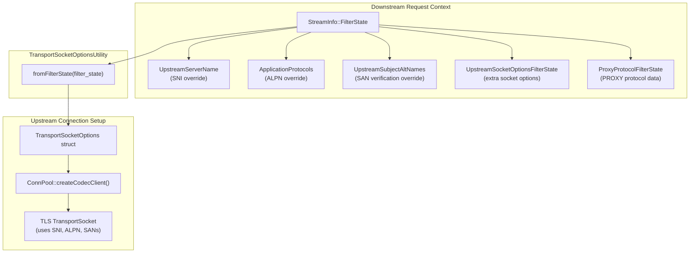
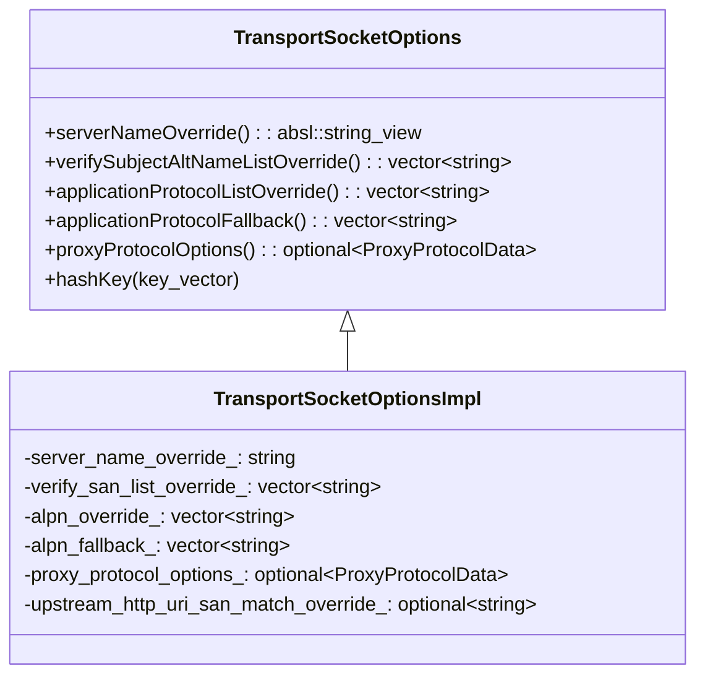
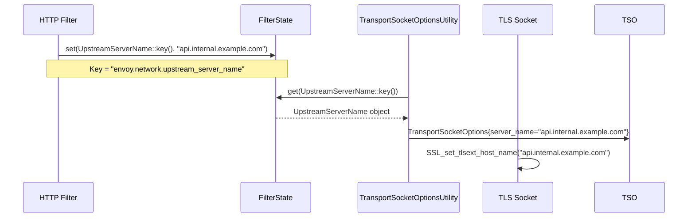
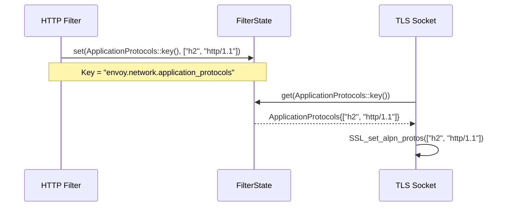
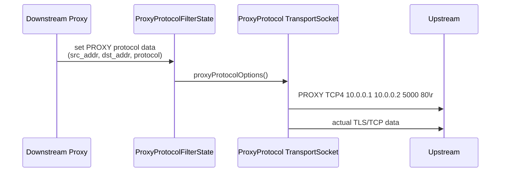
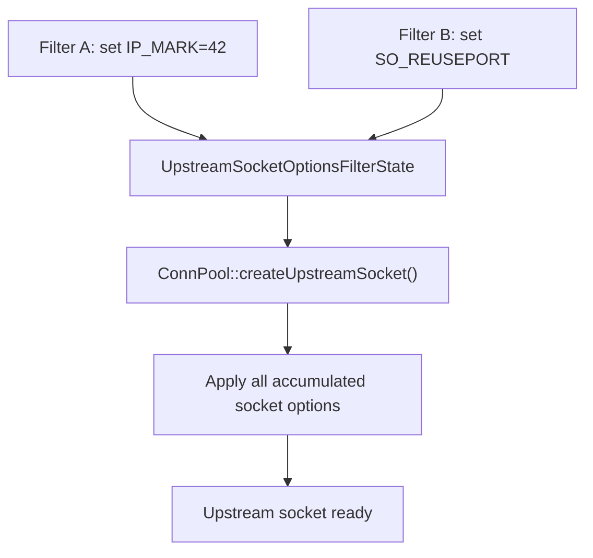
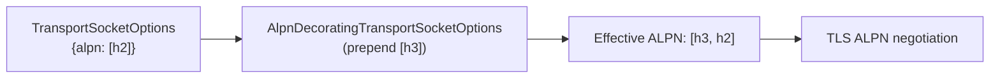
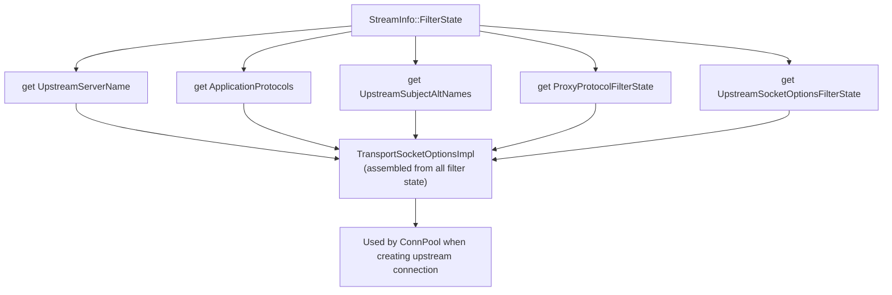
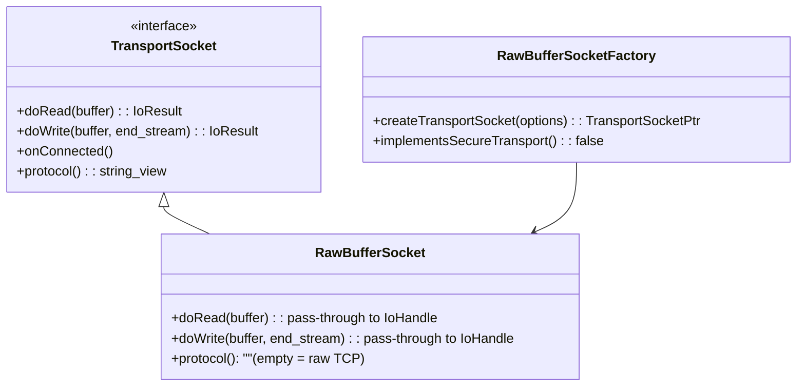
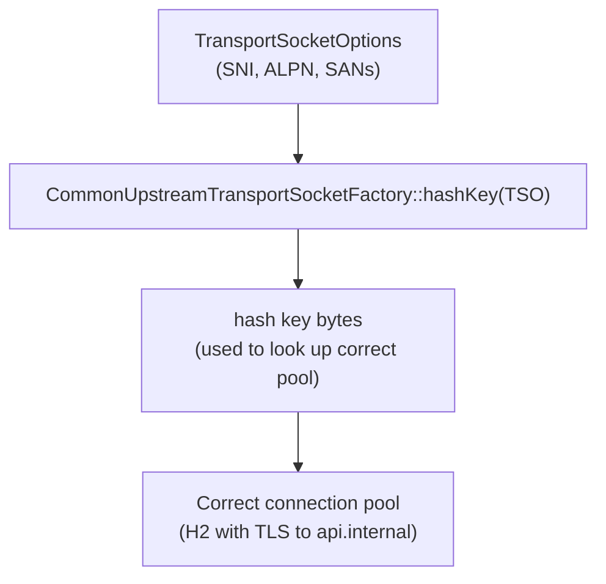

# Transport Socket Options & Upstream Filter State

**Files:**
- `source/common/network/transport_socket_options_impl.h/.cc`
- `source/common/network/application_protocol.h/.cc`
- `source/common/network/upstream_server_name.h/.cc`
- `source/common/network/upstream_subject_alt_names.h/.cc`
- `source/common/network/upstream_socket_options_filter_state.h/.cc`
- `source/common/network/proxy_protocol_filter_state.h/.cc`
- `source/common/network/raw_buffer_socket.h/.cc`
**Namespace:** `Envoy::Network`

## Overview

`TransportSocketOptions` carries upstream connection tuning parameters (SNI, ALPN, SANs, socket options, proxy protocol) from the downstream request context into the TLS/QUIC layer when establishing upstream connections. These parameters travel via `FilterState` objects keyed by well-known string constants.

## Architecture

## `TransportSocketOptions` struct

## Filter State Objects

Each filter state object has a static string key and is stored in `StreamInfo::FilterState`:

### `UpstreamServerName`

Overrides the TLS SNI hostname for upstream connections:

### `ApplicationProtocols`

Overrides ALPN protocols offered to the upstream TLS server:

### `ProxyProtocolFilterState`

Carries PROXY protocol v1/v2 header data to prepend on the upstream connection:

### `UpstreamSocketOptionsFilterState`

Accumulates additional socket options to apply when creating the upstream socket:

## `AlpnDecoratingTransportSocketOptions`

Wraps existing `TransportSocketOptions` and prepends additional ALPN protocols for dynamic protocol negotiation:

## `TransportSocketOptionsUtility::fromFilterState()`

The key function that reads all filter state objects and assembles a `TransportSocketOptions`:

## `RawBufferSocket` — Plaintext Transport

`RawBufferSocket` is the no-op transport socket used for unencrypted TCP connections:

## `CommonUpstreamTransportSocketFactory`

Base class for upstream transport socket factories. Provides `hashKey()` for connection pool identity (different TLS configs → different pools):

## Filter State Keys Reference

| Filter State Object | Key String | Purpose |
|--------------------|-----------|---------|
| `UpstreamServerName` | `envoy.network.upstream_server_name` | Override TLS SNI |
| `ApplicationProtocols` | `envoy.network.application_protocols` | Override ALPN |
| `UpstreamSubjectAltNames` | `envoy.network.upstream_subject_alt_names` | Override SAN verification |
| `UpstreamSocketOptionsFilterState` | `envoy.network.upstream_socket_options` | Extra socket options |
| `ProxyProtocolFilterState` | `envoy.network.proxy_protocol` | PROXY protocol data |
| `AddressObject` | `envoy.network.filter_state_dst_address` | Override destination address |
| `DownstreamNetworkNamespace` | `envoy.network.downstream_network_namespace` | Per-listener network namespace |
