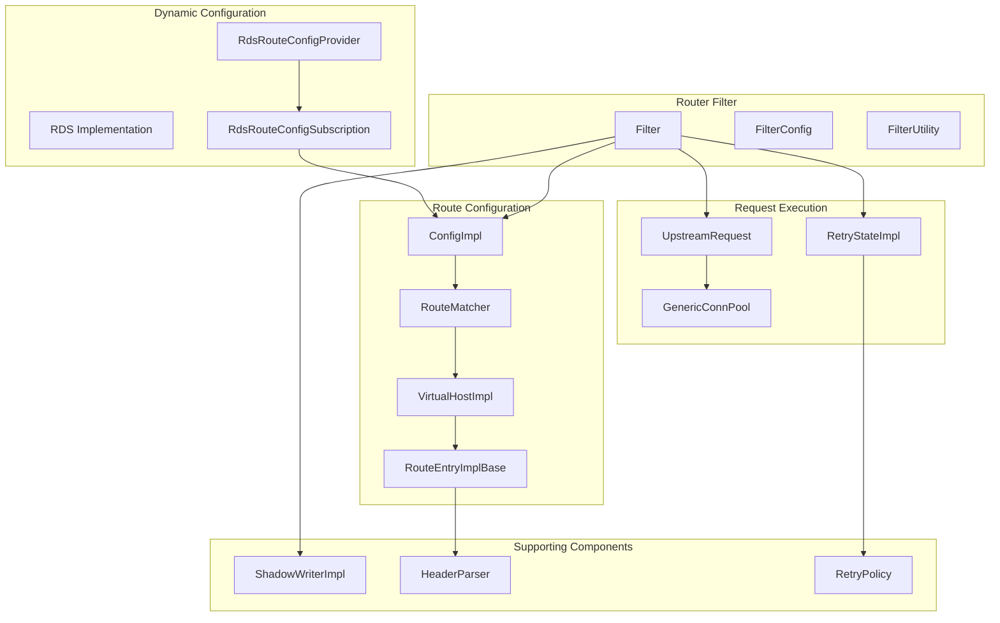
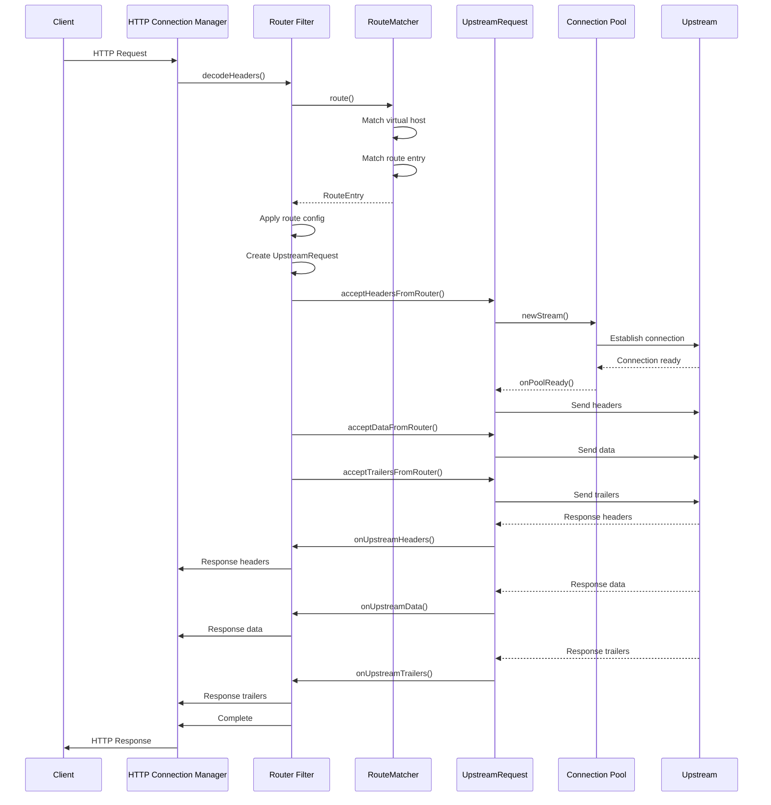
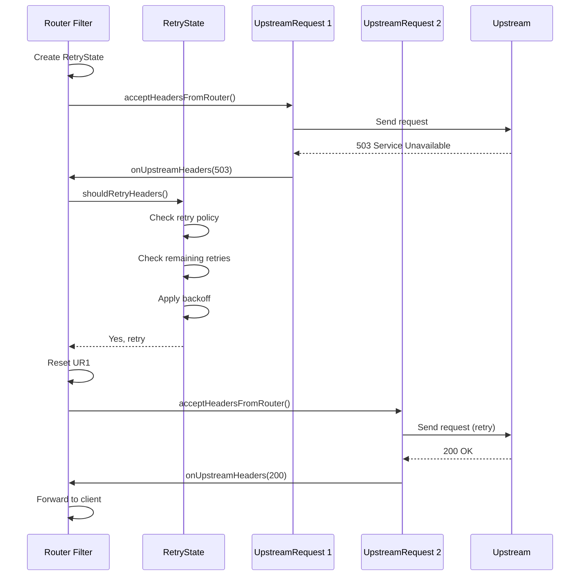
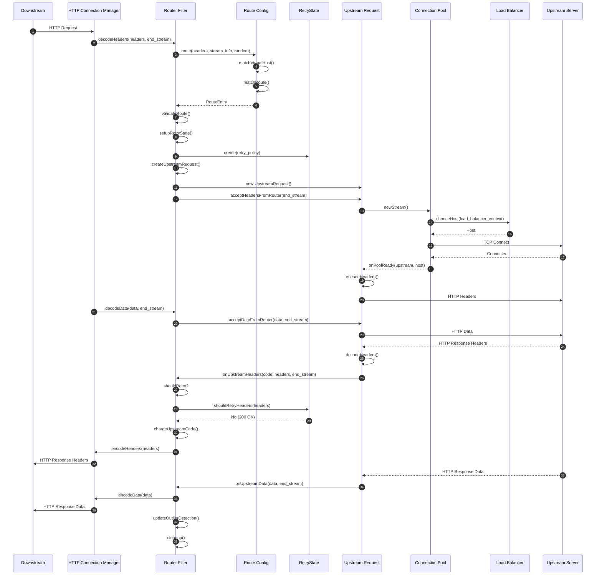
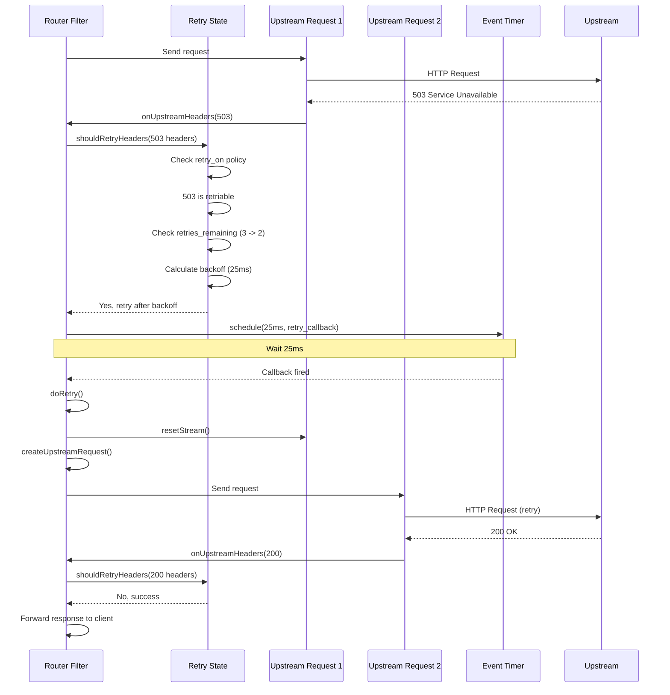
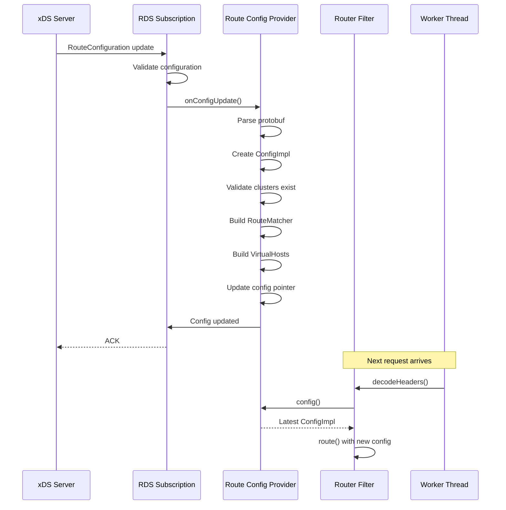
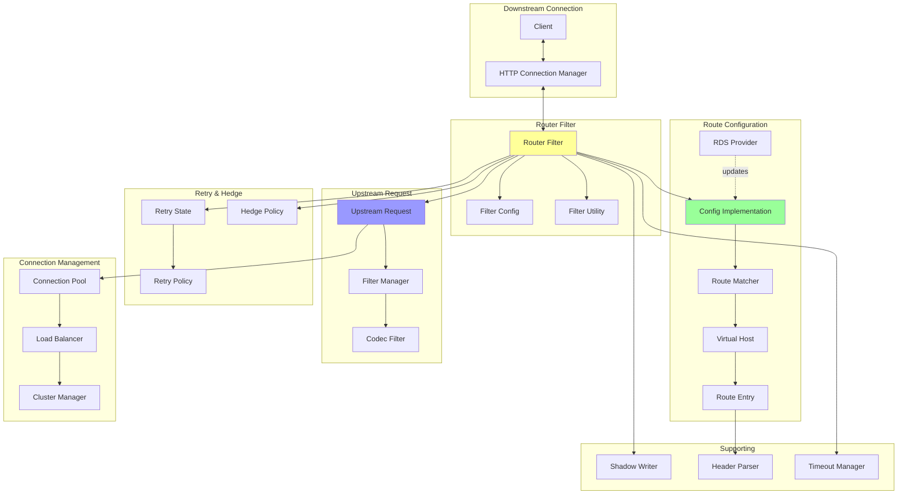
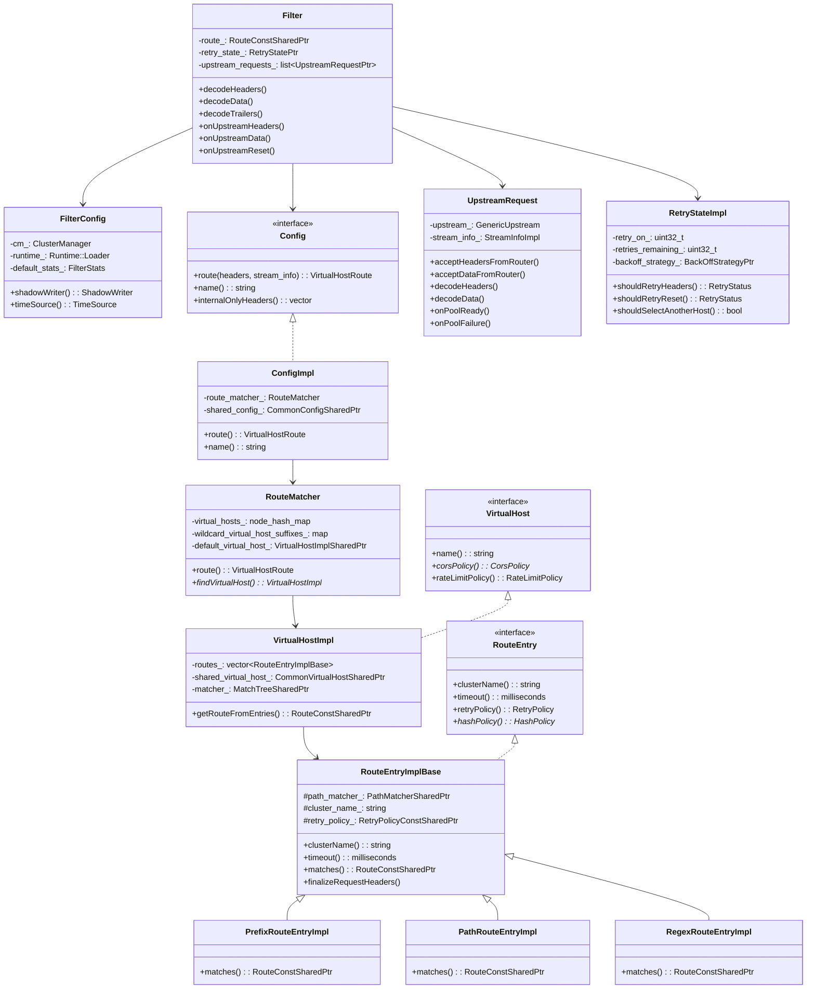
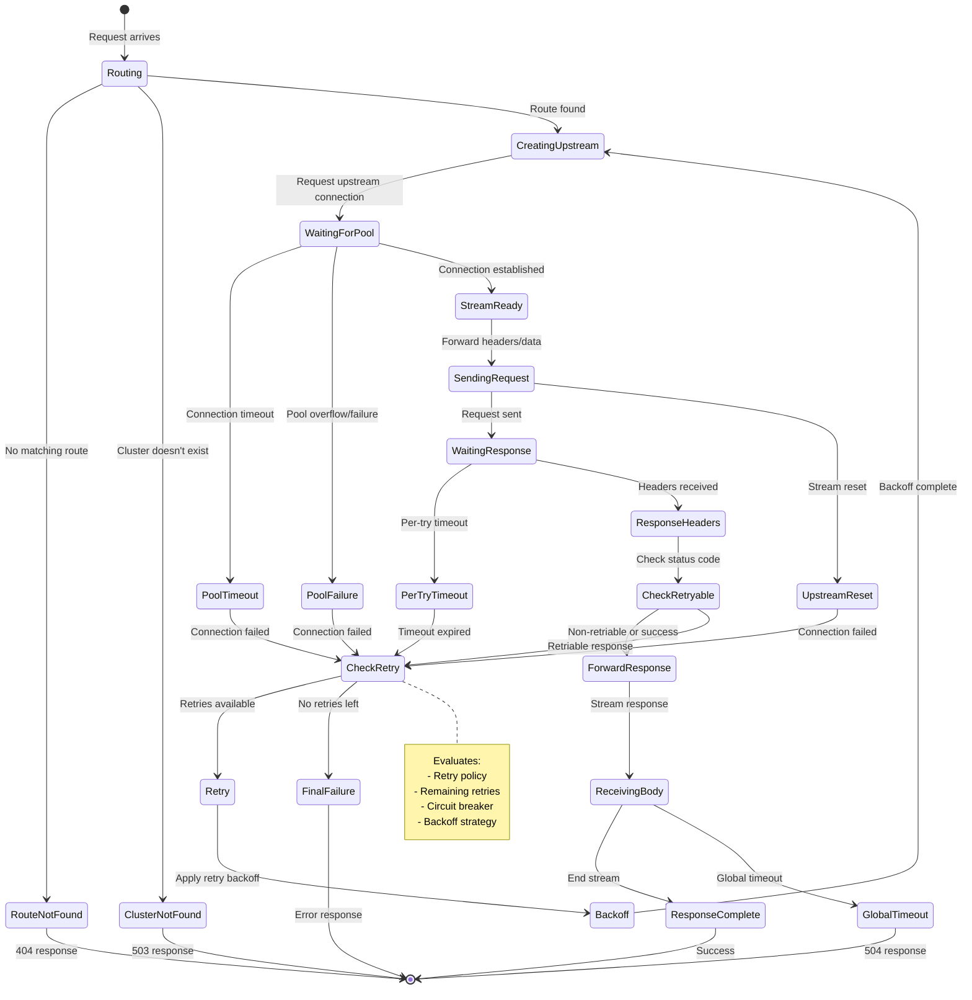

# Envoy Router Architecture Documentation

## Table of Contents
1. [Overview](#overview)
2. [Core Components](#core-components)
3. [Key Classes](#key-classes)
4. [Request Flow](#request-flow)
5. [Routing Scenarios](#routing-scenarios)
6. [Sequence Diagrams](#sequence-diagrams)
7. [Architecture Diagrams](#architecture-diagrams)
8. [Advanced Features](#advanced-features)

---

## Overview

The Envoy Router is the core HTTP routing component responsible for:
- **Request Routing**: Matching incoming requests to upstream clusters based on configured rules
- **Load Balancing**: Selecting appropriate upstream hosts using various strategies
- **Retry Logic**: Implementing sophisticated retry policies for failed requests
- **Request Hedging**: Sending parallel requests to improve latency
- **Request Shadowing**: Mirroring traffic to shadow clusters for testing
- **Header Manipulation**: Adding, removing, and transforming headers
- **Timeout Management**: Handling global, per-try, and idle timeouts
- **Dynamic Configuration**: Supporting RDS (Route Discovery Service) for dynamic updates

### Key Design Principles
- **Separation of Concerns**: Clear separation between routing logic, retry state, and upstream request handling
- **Async Operations**: Non-blocking operations using event-driven architecture
- **Filter Chain Integration**: Acts as an HTTP filter in the filter chain
- **Extensibility**: Plugin architecture for custom behaviors

---

## Core Components



---

## Key Classes

### 1. **Filter** (`router.h`)

The main router filter class that implements the HTTP streaming decoder filter interface.

**Responsibilities:**
- Receives downstream requests
- Performs route matching
- Creates and manages upstream requests
- Handles retries and hedging
- Manages timeouts
- Coordinates response handling

**Key Methods:**
```cpp
// Decode incoming request headers
Http::FilterHeadersStatus decodeHeaders(Http::RequestHeaderMap& headers, bool end_stream);

// Decode request data (body)
Http::FilterDataStatus decodeData(Buffer::Instance& data, bool end_stream);

// Decode request trailers
Http::FilterTrailersStatus decodeTrailers(Http::RequestTrailerMap& trailers);

// Handle upstream responses
void onUpstreamHeaders(uint64_t response_code, Http::ResponseHeaderMapPtr&& headers,
                       UpstreamRequest& upstream_request, bool end_stream);
void onUpstreamData(Buffer::Instance& data, UpstreamRequest& upstream_request, bool end_stream);
void onUpstreamTrailers(Http::ResponseTrailerMapPtr&& trailers, UpstreamRequest& upstream_request);

// Handle upstream failures
void onUpstreamReset(Http::StreamResetReason reset_reason, absl::string_view transport_failure,
                     UpstreamRequest& upstream_request);
```

**Key State:**
- `route_`: The matched route for the request
- `route_entry_`: The route entry containing routing details
- `cluster_`: The target cluster information
- `upstream_requests_`: List of active upstream requests (for retries/hedging)
- `retry_state_`: Retry state machine
- `timeout_`: Request timeout configuration

---

### 2. **ConfigImpl** (`config_impl.h`)

Holds the complete route configuration parsed from protobuf config.

**Responsibilities:**
- Parses route configuration from protobuf
- Maintains virtual hosts and their routes
- Provides route matching functionality
- Manages header manipulation rules

**Key Components:**
```cpp
class ConfigImpl : public Config {
  // Route matching - finds the appropriate route for a request
  VirtualHostRoute route(const Http::RequestHeaderMap& headers,
                        const StreamInfo::StreamInfo& stream_info,
                        uint64_t random_value) const;

  // Configuration properties
  const std::string& name() const;
  bool usesVhds() const;  // Virtual Host Discovery Service
  bool mostSpecificHeaderMutationsWins() const;
};
```

---

### 3. **RouteMatcher** (`config_impl.h`)

Responsible for matching incoming requests to the correct virtual host and route.

**Matching Strategy:**
1. **Host Matching**: Matches the `:authority` or `Host` header to a virtual host
   - Exact matches
   - Wildcard suffix matches (`*.example.com`)
   - Wildcard prefix matches (`example.*`)
   - Default virtual host (catch-all)

2. **Path Matching**: Within a virtual host, matches path using:
   - Exact path match
   - Prefix match
   - Regex match
   - Path-separated prefix match
   - URI template match

**Key Data Structures:**
```cpp
// Exact host matches
absl::node_hash_map<std::string, VirtualHostImplSharedPtr> virtual_hosts_;

// Wildcard matches (sorted by specificity)
WildcardVirtualHosts wildcard_virtual_host_suffixes_;
WildcardVirtualHosts wildcard_virtual_host_prefixes_;

// Fallback
VirtualHostImplSharedPtr default_virtual_host_;
```

---

### 4. **RouteEntryImplBase** (`config_impl.h`)

Base class for all route entry types (prefix, exact, regex, etc.).

**Responsibilities:**
- Store route configuration (cluster name, timeout, retry policy, etc.)
- Header manipulation (request and response)
- Path rewriting
- Host rewriting
- Metadata matching for load balancing

**Route Entry Variants:**
- **PrefixRouteEntryImpl**: Prefix path matching
- **PathRouteEntryImpl**: Exact path matching
- **RegexRouteEntryImpl**: Regex path matching
- **PathSeparatedPrefixRouteEntryImpl**: Path-separated prefix matching
- **UriTemplateMatcherRouteEntryImpl**: URI template matching
- **ConnectRouteEntryImpl**: CONNECT method requests

**Configuration Elements:**
```cpp
// Cluster targeting
const std::string cluster_name_;
ClusterSpecifierPluginSharedPtr cluster_specifier_plugin_;

// Timeouts
std::chrono::milliseconds timeout_;
OptionalTimeouts optional_timeouts_;  // idle, max_stream_duration, etc.

// Retry configuration
RetryPolicyConstSharedPtr retry_policy_;
HedgePolicyImpl hedge_policy_;

// Header manipulation
HeaderParserPtr request_headers_parser_;
HeaderParserPtr response_headers_parser_;

// Advanced routing
MetadataMatchCriteriaConstPtr metadata_match_criteria_;
Http::HashPolicyImpl hash_policy_;
std::vector<ShadowPolicyPtr> shadow_policies_;
```

---

### 5. **UpstreamRequest** (`upstream_request.h`)

Represents a single upstream request attempt.

**Responsibilities:**
- Establish connection to upstream host
- Forward request data upstream
- Receive and process upstream response
- Handle connection failures
- Track per-try timeouts
- Support connection pooling

**Lifecycle:**
1. **Creation**: Created by Filter when routing decision is made
2. **Connection**: Establishes connection via GenericConnPool
3. **Request Transmission**: Sends headers, data, trailers upstream
4. **Response Reception**: Receives response and forwards to Filter
5. **Completion/Reset**: Completes successfully or handles failures

**Key Methods:**
```cpp
// Accept data from router filter
void acceptHeadersFromRouter(bool end_stream);
void acceptDataFromRouter(Buffer::Instance& data, bool end_stream);
void acceptTrailersFromRouter(Http::RequestTrailerMap& trailers);

// Receive data from upstream
void decodeHeaders(Http::ResponseHeaderMapPtr&& headers, bool end_stream);
void decodeData(Buffer::Instance& data, bool end_stream);
void decodeTrailers(Http::ResponseTrailerMapPtr&& trailers);

// Handle upstream events
void onResetStream(Http::StreamResetReason reason, absl::string_view transport_failure_reason);
void onPoolReady(std::unique_ptr<GenericUpstream>&& upstream, ...);
void onPoolFailure(ConnectionPool::PoolFailureReason reason, ...);
```

**State Tracking:**
```cpp
StreamInfo::StreamInfoImpl stream_info_;  // Per-attempt stream info
Upstream::HostDescriptionConstSharedPtr upstream_host_;
std::unique_ptr<GenericUpstream> upstream_;  // The actual upstream connection
Event::TimerPtr per_try_timeout_;
Event::TimerPtr per_try_idle_timeout_;
bool awaiting_headers_;
bool router_sent_end_stream_;
bool retried_;
```

---

### 6. **RetryStateImpl** (`retry_state_impl.h`)

Implements retry logic and state management.

**Retry Triggers:**
- **5xx responses**: Server errors
- **Gateway errors**: 502, 503, 504
- **Connect failures**: Connection refused, timeout
- **Reset**: Stream reset by upstream
- **Retriable 4xx**: Configurable 4xx codes
- **Retriable headers**: Response header-based retry
- **Retriable status codes**: Custom status code list

**Retry Policies:**
```cpp
uint32_t retry_on_;  // Bitmask of retry conditions
uint32_t retries_remaining_;
BackOffStrategyPtr backoff_strategy_;  // Exponential backoff
std::vector<uint32_t> retriable_status_codes_;
std::vector<Http::HeaderMatcherSharedPtr> retriable_headers_;
```

**Host Selection:**
```cpp
// Retry host predicates - avoid previously failed hosts
std::vector<Upstream::RetryHostPredicateSharedPtr> retry_host_predicates_;

// Retry priority - adjust priority selection for retries
Upstream::RetryPrioritySharedPtr retry_priority_;

// Maximum host selection attempts
uint32_t host_selection_max_attempts_;
```

**Key Methods:**
```cpp
// Determine if should retry based on response headers
RetryStatus shouldRetryHeaders(const Http::ResponseHeaderMap& response_headers,
                               const Http::RequestHeaderMap& original_request,
                               DoRetryHeaderCallback callback);

// Determine if should retry based on reset
RetryStatus shouldRetryReset(Http::StreamResetReason reset_reason,
                            Http3Used http3_used,
                            DoRetryResetCallback callback,
                            bool upstream_request_started);

// Handle host selection for retry
bool shouldSelectAnotherHost(const Upstream::Host& host);
const Upstream::HealthyAndDegradedLoad& priorityLoadForRetry(...);
```

---

### 7. **RDS Implementation** (`rds_impl.h`)

Implements dynamic route configuration via RDS (Route Discovery Service).

**Components:**

**RdsRouteConfigSubscription:**
- Subscribes to RDS updates via xDS
- Validates and applies new route configurations
- Supports VHDS (Virtual Host Discovery Service)
- Manages configuration versions

**RdsRouteConfigProviderImpl:**
- Provides current route configuration to Filter
- Notifies listeners of configuration updates
- Supports on-demand VHDS updates

**Update Flow:**
```cpp
RdsRouteConfigSubscription::onConfigUpdate()
  └─> Validate new configuration
  └─> Update RouteConfigProvider
  └─> Notify subscribers
  └─> Update VHDS if enabled
```

---

### 8. **ShadowWriterImpl** (`shadow_writer_impl.h`)

Implements request shadowing (mirroring).

**Functionality:**
- Clones requests to shadow clusters
- Fire-and-forget semantics (doesn't wait for response)
- Header transformations for shadow requests
- Sampling based on runtime configuration

**Usage:**
```cpp
void shadow(const std::string& cluster,
           Http::RequestMessagePtr&& request,
           const Http::AsyncClient::RequestOptions& options);

Http::AsyncClient::OngoingRequest* streamingShadow(
    const std::string& cluster,
    Http::RequestHeaderMapPtr&& headers,
    const Http::AsyncClient::RequestOptions& options);
```

---

### 9. **HeaderParser** (`header_parser.h`)

Handles header manipulation (adding, removing, modifying headers).

**Features:**
- Static header values
- Dynamic values using formatters (e.g., `%DOWNSTREAM_REMOTE_ADDRESS%`)
- Conditional header operations
- Support for append/overwrite/add-if-empty semantics

**Configuration:**
```cpp
std::vector<std::pair<Http::LowerCaseString, std::unique_ptr<HeadersToAddEntry>>> headers_to_add_;
std::vector<Http::LowerCaseString> headers_to_remove_;
```

---

## Request Flow

### Normal Request Flow



### Request with Retry Flow



---

## Routing Scenarios

### Scenario 1: Simple Route Match

**Configuration:**
```yaml
virtual_hosts:
- name: backend
  domains: ["api.example.com"]
  routes:
  - match:
      prefix: "/api/v1"
    route:
      cluster: backend_cluster
```

**Request:** `GET http://api.example.com/api/v1/users`

**Flow:**
1. Filter receives request headers
2. RouteMatcher matches domain `api.example.com` → `backend` virtual host
3. Within virtual host, matches prefix `/api/v1` → route entry
4. Route entry specifies `backend_cluster`
5. Filter creates UpstreamRequest targeting `backend_cluster`
6. Connection pool provides connection to healthy host
7. Request forwarded, response received, returned to client

---

### Scenario 2: Route with Header Matching

**Configuration:**
```yaml
routes:
- match:
    prefix: "/"
    headers:
    - name: "x-api-version"
      exact_match: "v2"
  route:
    cluster: backend_v2
- match:
    prefix: "/"
  route:
    cluster: backend_v1
```

**Request:** `GET http://api.example.com/ with header x-api-version: v2`

**Flow:**
1. RouteMatcher evaluates routes in order
2. First route: prefix matches `/`, header matches `v2` → Selected
3. Targets `backend_v2` cluster

---

### Scenario 3: Retry on 5xx

**Configuration:**
```yaml
route:
  cluster: backend
  retry_policy:
    retry_on: "5xx"
    num_retries: 3
    per_try_timeout: 2s
```

**Scenario:**
1. **First attempt**: Connection to Host A, receives 503
2. RetryState evaluates: 5xx is retriable, retries remaining: 2
3. **Second attempt**: Connection to Host B, timeout (2s)
4. RetryState evaluates: timeout on per-try is retriable, retries remaining: 1
5. **Third attempt**: Connection to Host C, receives 200
6. Success - return 200 to client

---

### Scenario 4: Request Hedging

**Configuration:**
```yaml
route:
  cluster: backend
  hedge_policy:
    initial_requests: 1
    additional_request_chance:
      numerator: 50
      denominator: 100
    hedge_on_per_try_timeout: true
```

**Scenario:**
1. Send initial request (UR1) to Host A
2. Per-try timeout expires (hedge_on_per_try_timeout)
3. 50% chance check passes
4. Send hedged request (UR2) to Host B (parallel to UR1)
5. Whichever responds first is used
6. Other request is cancelled

---

### Scenario 5: Request Shadowing

**Configuration:**
```yaml
route:
  cluster: production
  request_mirror_policies:
  - cluster: shadow_cluster
    runtime_fraction:
      default_value:
        numerator: 10
        denominator: 100
```

**Flow:**
1. Filter routes request to `production` cluster
2. Checks shadow policies
3. Runtime check: 10% of requests should be shadowed
4. Random number falls within 10% → shadow
5. Clone request, send to `shadow_cluster` (fire-and-forget)
6. Continue processing production request normally

---

### Scenario 6: Weighted Cluster Routing

**Configuration:**
```yaml
route:
  weighted_clusters:
    clusters:
    - name: backend_v1
      weight: 90
    - name: backend_v2
      weight: 10
```

**Flow:**
1. Generate random number 0-99
2. If 0-89: route to `backend_v1`
3. If 90-99: route to `backend_v2`

---

## Sequence Diagrams

### Complete Request/Response Cycle



### Retry with Backoff



### Dynamic Configuration Update (RDS)



---

## Architecture Diagrams

### High-Level Component Architecture



### Route Matching Flow

```mermaid
graph TD
    Start[Incoming Request] --> ExtractHost[Extract :authority header]
    ExtractHost --> MatchHost{Match Virtual Host}

    MatchHost -->|Exact| ExactHost[Exact Host Match]
    MatchHost -->|Wildcard Suffix| SuffixHost[*.example.com]
    MatchHost -->|Wildcard Prefix| PrefixHost[example.*]
    MatchHost -->|Default| DefaultHost[Default VHost]

    ExactHost --> MatchRoute[Match Route]
    SuffixHost --> MatchRoute
    PrefixHost --> MatchRoute
    DefaultHost --> MatchRoute

    MatchRoute --> CheckPath{Path Match Type}

    CheckPath -->|Exact| ExactPath[Exact: /api/users]
    CheckPath -->|Prefix| PrefixPath[Prefix: /api/]
    CheckPath -->|Regex| RegexPath[Regex: /api/.*/users]
    CheckPath -->|Template| TemplatePath[Template: /api/{id}/users]
    CheckPath -->|PathSeparated| PSPath[PathSep: /api/]

    ExactPath --> CheckHeaders{Check Headers}
    PrefixPath --> CheckHeaders
    RegexPath --> CheckHeaders
    TemplatePath --> CheckHeaders
    PSPath --> CheckHeaders

    CheckHeaders -->|Match| CheckQuery{Check Query Params}
    CheckHeaders -->|No Match| NextRoute[Try Next Route]
    NextRoute --> MatchRoute

    CheckQuery -->|Match| CheckRuntime{Runtime Check}
    CheckQuery -->|No Match| NextRoute

    CheckRuntime -->|Pass| RouteFound[Route Found]
    CheckRuntime -->|Fail| NextRoute

    RouteFound --> ExtractCluster[Extract Cluster Name]
    ExtractCluster --> ApplyConfig[Apply Route Config]
    ApplyConfig --> ReturnRoute[Return RouteEntry]

    MatchRoute --> NoRoute{Routes Exhausted?}
    NoRoute -->|Yes| NotFound[404 Not Found]
    NoRoute -->|No| NextRoute
```

### Class Hierarchy



### State Machine: Request Lifecycle



---

## Advanced Features

### 1. Request Hedging

**Purpose**: Reduce tail latency by sending parallel requests.

**How it works:**
- Configure `hedge_policy` with `initial_requests` and `additional_request_chance`
- Initial request(s) sent immediately
- On per-try timeout or other hedgeable conditions:
  - Random check against `additional_request_chance`
  - If passes, send additional parallel request
  - First successful response wins
  - Other requests cancelled

**Configuration Example:**
```yaml
hedge_policy:
  initial_requests: 2  # Send 2 requests immediately
  additional_request_chance:
    numerator: 30
    denominator: 100  # 30% chance of additional hedge
  hedge_on_per_try_timeout: true
```

**Implementation Details:**
- `Filter` maintains multiple `UpstreamRequest` objects in `upstream_requests_` list
- First to return successful response sets `final_upstream_request_`
- Others are reset via `resetOtherUpstreams()`

---

### 2. Request Shadowing (Mirroring)

**Purpose**: Duplicate production traffic to test/shadow clusters without affecting production.

**Characteristics:**
- Fire-and-forget (doesn't wait for shadow response)
- Configurable sampling rate
- Optional header transformations
- Shadow requests don't affect original request latency

**Configuration Example:**
```yaml
request_mirror_policies:
- cluster: shadow_cluster
  runtime_fraction:
    default_value:
      numerator: 10
      denominator: 100
  request_headers_to_add:
  - header:
      key: x-shadow
      value: "true"
```

**Implementation:**
- `ShadowWriterImpl` clones request
- Uses `Http::AsyncClient` for independent request
- Callbacks are no-ops (fire-and-forget)
- Can shadow to multiple clusters

---

### 3. Header Manipulation

**Operations:**
- **Add**: Add header if not present
- **Append**: Add header value (multiple values allowed)
- **Overwrite**: Replace existing header
- **Remove**: Delete header

**Dynamic Values:**
Headers support formatters for dynamic values:
- `%DOWNSTREAM_REMOTE_ADDRESS%`: Client IP
- `%START_TIME%`: Request start time
- `%HOSTNAME%`: Envoy hostname
- `%RESPONSE_CODE%`: Response status code
- Custom metadata: `%DYNAMIC_METADATA(namespace:key)%`

**Levels:**
1. **Connection Manager level**: Applied to all requests
2. **Virtual Host level**: Applied to all routes in vhost
3. **Route level**: Applied to specific route

**Precedence**: Controlled by `most_specific_header_mutations_wins`

---

### 4. Timeout Management

**Timeout Types:**

1. **Global Timeout** (`timeout`):
   - Total time for entire request (including retries)
   - Default: 15 seconds
   - Includes all retry attempts

2. **Per-Try Timeout** (`per_try_timeout`):
   - Timeout for each individual upstream attempt
   - Applies to each retry independently
   - Should be < global timeout

3. **Idle Timeout** (`idle_timeout`):
   - Max time between data events
   - Resets on each chunk received
   - Prevents hung connections

4. **Max Stream Duration** (`max_stream_duration`):
   - Maximum lifetime of request stream
   - Useful for WebSocket/streaming requests

**Configuration Example:**
```yaml
route:
  cluster: backend
  timeout: 30s              # Global timeout
  retry_policy:
    per_try_timeout: 10s    # Each attempt gets 10s
  idle_timeout: 5s          # 5s between data events
  max_stream_duration: 3600s # 1 hour max for WebSocket
```

**Implementation:**
- `Filter` manages global timeout timer
- `UpstreamRequest` manages per-try timeout
- Idle timeout managed by stream
- Timeout expiry triggers appropriate response (408, 504)

---

### 5. Hash-Based Load Balancing

**Purpose**: Route requests to the same upstream host based on request attributes.

**Hash Sources:**
- **Header**: Hash specific header value
- **Cookie**: Hash cookie value
- **Source IP**: Hash client IP
- **Query Parameter**: Hash query param
- **Filter State**: Hash filter state object

**Configuration Example:**
```yaml
route:
  cluster: backend
  hash_policy:
  - header:
      header_name: "x-user-id"
  - cookie:
      name: "session-id"
      ttl: 300s
```

**Flow:**
1. `Filter::computeHashKey()` called by load balancer
2. Evaluates hash policy (cluster-level first, then route-level)
3. Extracts value from request
4. Computes hash
5. Load balancer uses hash to select host (consistent hashing)

---

### 6. Metadata-Based Routing

**Purpose**: Route to upstream hosts matching specific metadata.

**Use Cases:**
- Canary deployments (route to canary hosts)
- Zone-aware routing
- Version-specific routing

**Configuration Example:**
```yaml
route:
  cluster: backend
  metadata_match:
    filter_metadata:
      envoy.lb:
        version: "v2"
        canary: "true"
```

**Implementation:**
- Route specifies `metadata_match_criteria`
- Load balancer filters hosts matching criteria
- Metadata can come from:
  - Route configuration
  - Dynamic metadata (from filters)
  - Connection metadata

---

### 7. Internal Redirects

**Purpose**: Handle redirects (301, 302, etc.) internally without round-trip to client.

**Configuration Example:**
```yaml
route:
  cluster: backend
  internal_redirect_policy:
    max_internal_redirects: 3
    redirect_response_codes: [301, 302, 307]
    allow_cross_scheme_redirect: false
```

**Flow:**
1. Upstream returns redirect (e.g., 302)
2. `Filter::setupRedirect()` checks internal redirect policy
3. Validates redirect target (same host, allowed schemes)
4. Converts response to new request
5. Performs routing again with new path
6. Tracks redirect count to prevent loops

---

### 8. Direct Responses

**Purpose**: Return responses directly without upstream (useful for static content, errors).

**Configuration Example:**
```yaml
route:
  match:
    prefix: "/health"
  direct_response:
    status: 200
    body:
      inline_string: "OK"
```

**Implementation:**
- Route has `direct_response_code_` set
- `Filter` detects direct response in route
- Sends response immediately without creating `UpstreamRequest`

---

### 9. Virtual Host Discovery Service (VHDS)

**Purpose**: Dynamically discover virtual hosts on-demand.

**How it works:**
- Route configuration references VHDS
- On request to unknown domain:
  - VHDS subscription requests virtual host config
  - Request held until config arrives
  - Config cached for future requests

**Benefits:**
- Reduce memory footprint (only load needed vhosts)
- Faster config updates (incremental)
- Support large numbers of virtual hosts

---

### 10. Rate Limiting Integration

**Purpose**: Control request rate to upstreams.

**Stages:**
1. **Descriptor Generation**: Extract rate limit descriptors from request
2. **Rate Limit Service Call**: Query external rate limit service
3. **Action**: Allow or reject based on response

**Configuration Example:**
```yaml
route:
  cluster: backend
  rate_limits:
  - actions:
    - request_headers:
        header_name: "x-user-id"
        descriptor_key: "user_id"
    - remote_address: {}
```

**Integration Points:**
- `RateLimitPolicyImpl` defines rate limit actions
- Separate rate limit filter performs actual limiting
- Router provides descriptor generation

---

## Performance Considerations

### Memory Optimization

1. **Packed Structs**: Using `PackedStruct` for optional timeouts to reduce memory overhead
2. **Member Ordering**: Small members (bools, enums) placed at end to reduce alignment overhead
3. **Shared Configuration**: Virtual host and route configuration shared across workers
4. **Copy-on-Write**: Route updates use new instances, old freed when no longer referenced

### Latency Optimization

1. **Fast Path**: Optimized for common case (no retries, no hedging)
2. **Hash Maps**: O(1) lookups for virtual host matching
3. **Regex Caching**: Compiled regex patterns cached
4. **Connection Pooling**: Reuse existing connections to reduce latency

### Scalability

1. **Per-Worker State**: Each worker thread has independent route cache
2. **Lock-Free Reads**: Route configuration reads don't require locks
3. **Async Operations**: All operations non-blocking
4. **Connection Pool Management**: Per-cluster connection pools

---

## Debugging and Observability

### Stats

**Per-Cluster Stats:**
```
cluster.<cluster_name>.upstream_rq_total
cluster.<cluster_name>.upstream_rq_200
cluster.<cluster_name>.upstream_rq_5xx
cluster.<cluster_name>.upstream_rq_retry
cluster.<cluster_name>.upstream_rq_timeout
```

**Router Stats:**
```
http.<stat_prefix>.downstream_rq_total
http.<stat_prefix>.downstream_rq_5xx
http.<stat_prefix>.no_route
http.<stat_prefix>.no_cluster
```

### Access Logging

**Per-Request Information:**
- Route name
- Cluster name
- Upstream host
- Attempt count
- Response flags (timeout, retry, etc.)

### Tracing

**Spans Created:**
- Downstream span (entire request)
- Upstream spans (per attempt)
- Child spans (if start_child_span enabled)

**Tags:**
- Cluster name
- Route name
- Response code
- Retry count

---

## Configuration Best Practices

### 1. Route Ordering
- Place most specific routes first
- Use default catch-all route last
- Consider using matchers for complex routing

### 2. Timeout Configuration
```yaml
# Good: Layered timeouts
timeout: 30s              # Overall timeout
retry_policy:
  per_try_timeout: 10s    # Each attempt
idle_timeout: 5s          # Between data
```

### 3. Retry Policy
```yaml
# Good: Conservative retry policy
retry_policy:
  retry_on: "5xx,reset,connect-failure"
  num_retries: 2
  per_try_timeout: 3s
  retry_host_predicate:
  - name: envoy.retry_host_predicates.previous_hosts
```

### 4. Header Manipulation
```yaml
# Prefer specific over wildcard
request_headers_to_add:
- header:
    key: x-request-id
    value: "%REQ(X-REQUEST-ID)%"
  append: false  # Overwrite existing
```

---

## Common Issues and Solutions

### Issue 1: Retry Storms

**Problem**: Retries causing cascading failures.

**Solution:**
- Limit retry count
- Implement circuit breakers
- Use exponential backoff
- Set per-try timeouts

### Issue 2: Route Not Found

**Problem**: 404 errors despite route existing.

**Diagnosis:**
- Check Host header matching (with/without port)
- Verify path matching (exact vs prefix)
- Check runtime fraction
- Validate header matchers

**Solution:**
```yaml
virtual_hosts:
- name: backend
  domains: ["*"]  # Catch-all for testing
```

### Issue 3: Connection Pool Overflow

**Problem**: 503 errors due to pool exhaustion.

**Solution:**
- Increase cluster max connections
- Adjust circuit breaker thresholds
- Implement connection timeout
- Add more upstream hosts

---

## Future Enhancements

### Planned Features
1. **gRPC-Web support improvements**
2. **Advanced traffic splitting (progressive rollouts)**
3. **Enhanced observability (detailed retry metrics)**
4. **Improved WebSocket/HTTP/2 handling**
5. **Custom retry predicates (plugin architecture)**

---

## Summary

The Envoy Router is a sophisticated HTTP routing engine that provides:

✅ **Flexible Routing**: Multiple matching strategies (prefix, exact, regex, headers, query params)
✅ **High Availability**: Retries, hedging, circuit breaking
✅ **Dynamic Configuration**: RDS/VHDS for runtime updates
✅ **Advanced Features**: Shadowing, rate limiting, header manipulation
✅ **Performance**: Optimized for low latency and high throughput
✅ **Observability**: Comprehensive stats, logging, and tracing

The architecture follows key design principles:
- **Modularity**: Clear separation of concerns
- **Extensibility**: Plugin architecture for custom behaviors
- **Reliability**: Robust error handling and retry logic
- **Performance**: Optimized data structures and algorithms

Understanding this architecture enables effective configuration, debugging, and extension of Envoy's routing capabilities.

---

**Document Version**: 1.0
**Last Updated**: March 2026
**Envoy Version**: Based on commit 12a1168419
