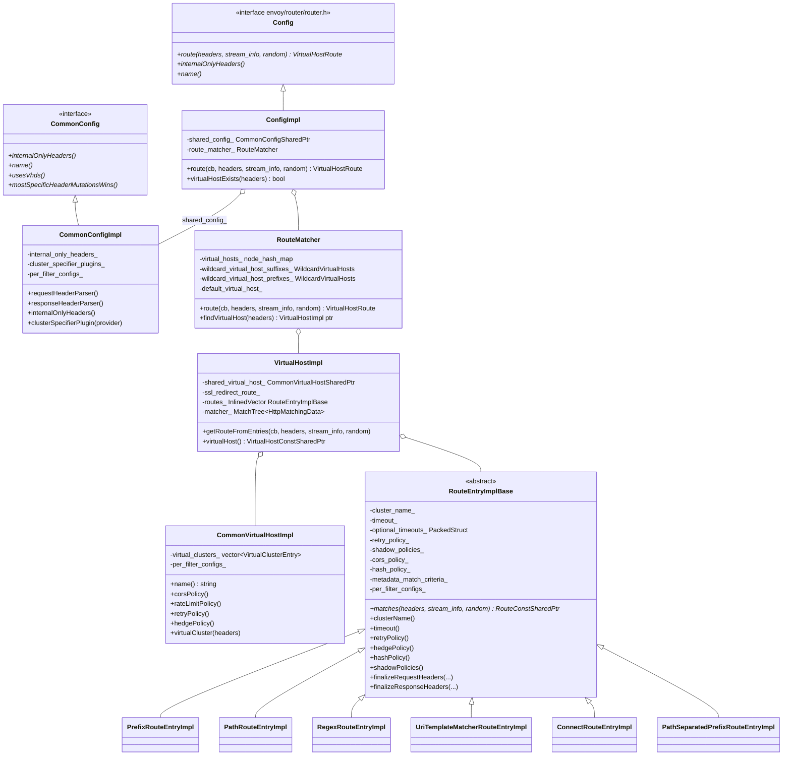
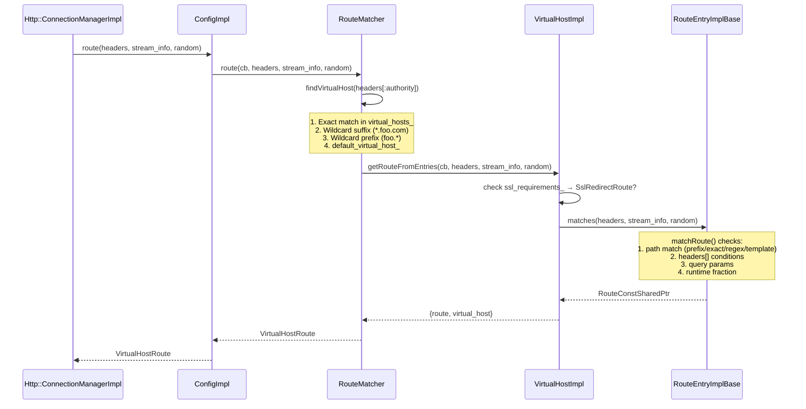

# Route Config Implementation — `config_impl.h`

**File:** `source/common/router/config_impl.h`

The complete runtime representation of an Envoy route configuration (`RouteConfiguration`
proto). Implements the lookup path from incoming request headers to a `RouteEntry`,
and owns all policy objects (retry, timeout, hedge, CORS, shadow, rate limit, etc.)
created at xDS load time.

---

## Class Hierarchy



---

## Route Lookup Flow



---

## `RouteMatcher` — Virtual Host Selection

Holds three structures for vhost lookup in `O(1)` for exact and `O(prefix_len)` for wildcards:

| Structure | Matches | Example |
|---|---|---|
| `virtual_hosts_` (node_hash_map) | Exact hostname | `api.example.com` |
| `wildcard_virtual_host_suffixes_` (sorted by key length, `std::greater`) | `*.suffix` | `*.example.com` |
| `wildcard_virtual_host_prefixes_` (sorted by key length, `std::greater`) | `prefix.*` | `api.*` |
| `default_virtual_host_` | Catch-all (`*`) | `*` |

`std::greater` sort ensures longer (more specific) wildcards are tried first.

`ignore_port_in_host_matching_`: when true, strips the port from `:authority` before lookup.
`vhost_header_`: if configured, uses a custom header (e.g. `x-original-host`) instead of `:authority`.

---

## `VirtualHostImpl` — Route List Owner

Owns the ordered list of `RouteEntryImplBase` for a virtual host. Also holds an
optional `Matcher::MatchTree<Http::HttpMatchingData>` (the new unified match tree) that
takes precedence over the legacy linear route list.

```
VirtualHostImpl
  ├── ssl_redirect_route_     (SslRedirectRoute if ssl_requirements_ != None)
  ├── routes_                 (InlinedVector<RouteEntryImplBaseConstSharedPtr, 2>)
  └── matcher_                (MatchTree for unified match API, optional)
```

`SslRequirements` enum:
- `None` — no redirect
- `ExternalOnly` — redirect only non-internal requests
- `All` — redirect all HTTP to HTTPS

---

## `CommonVirtualHostImpl` — Shared VHost State

Split from `VirtualHostImpl` to be shared across hot-restart config swaps. Contains
all **policy** data for the virtual host:

| Member | Type | Purpose |
|---|---|---|
| `virtual_clusters_` | `VirtualClusterEntry[]` | Named sub-clusters for per-cluster stats |
| `rate_limit_policy_` | `RateLimitPolicyImpl` | Vhost-level rate limit descriptors |
| `shadow_policies_` | `ShadowPolicyPtr[]` | Vhost-level request mirroring |
| `cors_policy_` | `CorsPolicyImpl` | CORS allowed origins/methods |
| `retry_policy_` | `RetryPolicyConstSharedPtr` | Vhost-level retry defaults |
| `hedge_policy_` | `HedgePolicyImpl` | Vhost-level hedging defaults |
| `per_filter_configs_` | `PerFilterConfigs` | Per-filter typed config |
| `per_request_buffer_limit_` | `optional<uint32_t>` | Max request body buffered |

`virtualClusterFromEntries(headers)` scans `virtual_clusters_` for the first
`VirtualClusterEntry` whose `headers_` all match, returning it for per-cluster stats.
Falls back to `virtual_cluster_catch_all_` (stat name `"other"`).

---

## `RouteEntryImplBase` — The Core Route

The abstract base for all concrete route types. Implements `RouteEntryAndRoute`,
`DirectResponseEntry`, `PathMatchCriterion`, and `Matchable`.

### Key Accessors

| Method | Returns | Notes |
|---|---|---|
| `clusterName()` | `string` | Upstream cluster; may delegate to `cluster_specifier_plugin_` |
| `timeout()` | `milliseconds` | Default 15s; 0 = infinite |
| `retryPolicy()` | `RetryPolicyConstSharedPtr` | Falls back to vhost, then default |
| `hedgePolicy()` | `HedgePolicy` | Falls back to `DefaultHedgePolicy` |
| `rateLimitPolicy()` | `RateLimitPolicy` | Falls back to `DefaultRateLimitPolicy` |
| `hashPolicy()` | `Http::HashPolicy ptr` | Ring hash / maglev key extraction |
| `shadowPolicies()` | `ShadowPolicyPtr[]` | Mirror target clusters |
| `internalRedirectPolicy()` | `InternalRedirectPolicy` | Internal redirect handling |
| `metadataMatchCriteria()` | `MetadataMatchCriteria ptr` | LB metadata filtering |
| `tlsContextMatchCriteria()` | `TlsContextMatchCriteria ptr` | Downstream TLS matching |
| `earlyDataPolicy()` | `EarlyDataPolicy` | 0-RTT control |

### `OptionalTimeouts` — Memory-Efficient Optional Timeouts

Uses `PackedStruct<milliseconds, 7, OptionalTimeoutNames>` — a bitmask struct that
stores 7 optional timeout values in a single allocation, avoiding 7 `absl::optional`
members:

| Enum | Method | Purpose |
|---|---|---|
| `IdleTimeout` | `idleTimeout()` | Per-stream idle timeout |
| `MaxStreamDuration` | `maxStreamDuration()` | Max request lifetime |
| `GrpcTimeoutHeaderMax` | `grpcTimeoutHeaderMax()` | Max gRPC-Timeout override |
| `GrpcTimeoutHeaderOffset` | `grpcTimeoutHeaderOffset()` | Subtract from gRPC-Timeout |
| `MaxGrpcTimeout` | `maxGrpcTimeout()` | Hard cap on gRPC timeout |
| `GrpcTimeoutOffset` | `grpcTimeoutOffset()` | Subtract from global gRPC timeout |
| `FlushTimeout` | `flushTimeout()` | CONNECT/websocket flush timeout |

### Header Finalization

Called by the router filter after a route is selected:

```cpp
// Called on request headers — applies route/vhost/global header mutations
route.finalizeRequestHeaders(request_headers, formatter_context, stream_info, keep_host);
// Applied after response arrives from upstream
route.finalizeResponseHeaders(response_headers, formatter_context, stream_info);
```

Three parsers are applied in order (global config → virtual host → route),
controlled by `mostSpecificHeaderMutationsWins()`:
- `false` (default): global wins (applied last)
- `true`: route wins (applied last, most specific)

---

## Concrete Route Entry Types

| Class | Proto field | `PathMatchType` |
|---|---|---|
| `PrefixRouteEntryImpl` | `prefix` | `Prefix` |
| `PathRouteEntryImpl` | `path` | `Exact` |
| `RegexRouteEntryImpl` | `safe_regex` | `Regex` |
| `UriTemplateMatcherRouteEntryImpl` | `path_match_policy` (uri template) | `Template` |
| `ConnectRouteEntryImpl` | CONNECT method match | `None` |
| `PathSeparatedPrefixRouteEntryImpl` | `path_separated_prefix` | `PathSeparatedPrefix` |

Each overrides `matches()`, `rewritePathHeader()`, and `currentUrlPathAfterRewrite()`.

---

## Policy Implementation Classes

### `CorsPolicyImplBase<ProtoType>`

Templated over `envoy.config.route.v3.CorsPolicy`. Supports:
- Origin matching via `vector<StringMatcherPtr>` for allow-list
- Runtime fractional enable/shadow flags (`filter_enabled_`, `shadow_enabled_`)
- `allow_credentials`, `allow_private_network_access`, `forward_not_matching_preflights`

### `ShadowPolicyImpl`

Controls request mirroring:
- `cluster_` / `cluster_header_` — static cluster name or dynamic header-based target
- `runtime_key_` + `default_value_` — fractional percent enabling via runtime flags
- `host_rewrite_literal_` — overrides `:authority` for shadow requests

### `HedgePolicyImpl`

Stores:
- `initial_requests_` — number of simultaneous initial upstream requests
- `additional_request_chance_` — fractional percent for extra hedged requests
- `hedge_on_per_try_timeout_` — start hedge on per-try timeout expiry

### `InternalRedirectPolicyImpl`

Controls internal redirects:
- `redirect_response_codes_` — set of HTTP codes that trigger redirect (301, 302, 303, 307, 308)
- `max_internal_redirects_` — prevents infinite redirect loops (default 1)
- `allow_cross_scheme_redirect_` — allow http→https redirect
- `predicates_` — pluggable `InternalRedirectPredicate` extensions

### `DecoratorImpl`

Applies a tracing operation name to the active span:
```cpp
void apply(Tracing::Span& span) const override {
    if (!operation_.empty()) span.setOperation(operation_);
}
```

---

## `CommonConfigImpl` — Route-Level Shared Config

Holds configuration shared across all virtual hosts in a route config:

| Member | Purpose |
|---|---|
| `internal_only_headers_` | Headers stripped before forwarding if not from internal source |
| `cluster_specifier_plugins_` | Named cluster specifier plugin instances |
| `per_filter_configs_` | Route-config-level per-filter typed config |
| `shadow_policies_` | Route-config-level shadow policies |
| `most_specific_header_mutations_wins_` | Header mutation precedence flag |
| `ignore_path_parameters_in_path_matching_` | Strip `;key=val` before path matching |
| `uses_vhds_` | Whether VHDS (virtual host discovery) is active |
