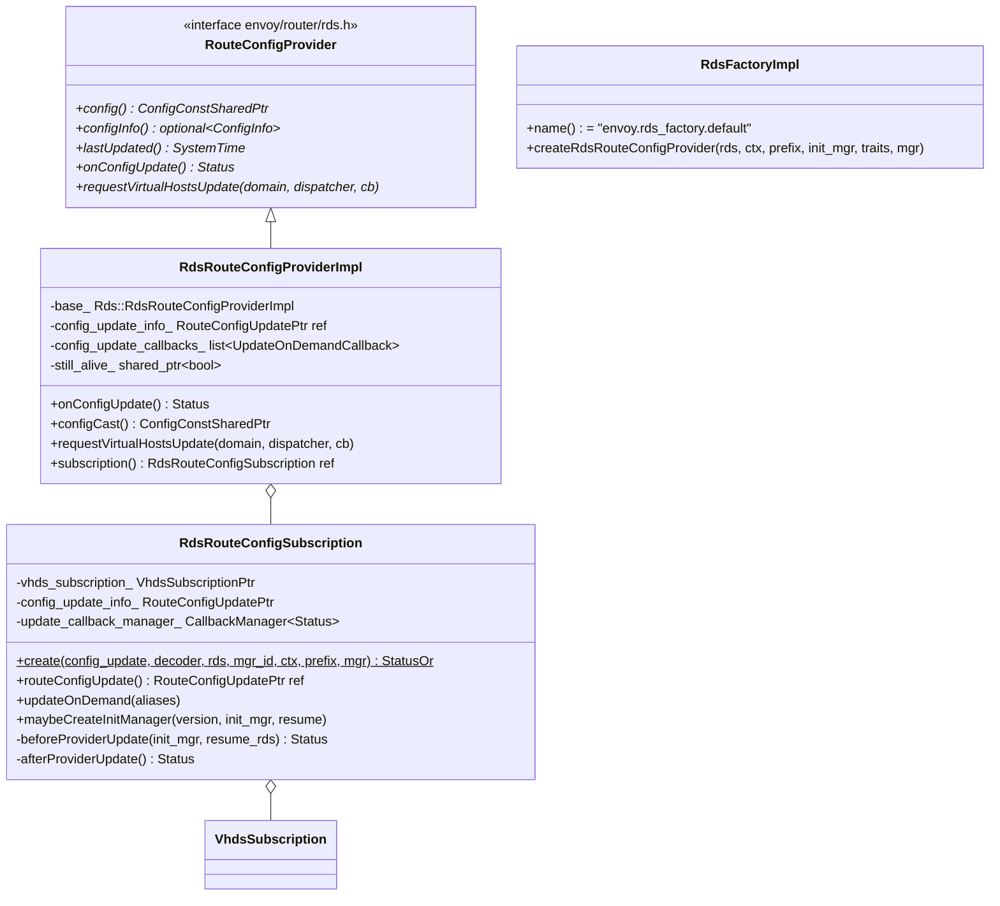
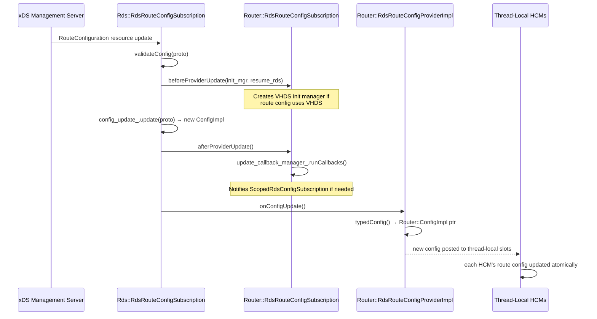

# Route Discovery Service — `rds_impl.h`

**File:** `source/common/router/rds_impl.h`

Implements dynamic route configuration via RDS (Route Discovery Service). Thin
Router-namespace wrappers over the generic `source/common/rds/` infrastructure,
adding VHDS (Virtual Host Discovery Service) support, on-demand route updates, and
Router-specific `ConfigImpl` type awareness.

---

## Class Overview



---

## Architecture — RDS Layering

```
Router::RdsRouteConfigProviderImpl
    └── base_ : Rds::RdsRouteConfigProviderImpl        (generic RDS impl)
            └── subscription_ : Rds::RdsRouteConfigSubscription  (xDS subscription)
                    └── Envoy::Config::GrpcSubscriptionImpl       (gRPC delta/SotW stream)

Router::RdsRouteConfigSubscription
    ├── config_update_info_ : RouteConfigUpdateReceiver  (holds current RouteConfig proto)
    ├── vhds_subscription_  : VhdsSubscription           (on-demand virtual host loading)
    └── update_callback_manager_ : CallbackManager<Status>
```

The `Router::` classes are thin wrappers that add:
1. Router-type-specific `ConfigImpl` creation (`RouteConfigUpdateReceiver`)
2. VHDS integration in `beforeProviderUpdate`/`afterProviderUpdate` hooks
3. `requestVirtualHostsUpdate` for on-demand vhost fetching

---

## RDS Update Lifecycle



---

## `RdsRouteConfigSubscription` — Router Extensions

Extends `Rds::RdsRouteConfigSubscription` with two hooks and VHDS support:

### `beforeProviderUpdate(init_mgr, resume_rds)`

Called before the new `RouteConfiguration` is installed:
- If `uses_vhds` is true in the new config, creates a new `Init::ManagerImpl` for
  pending VHDS requests
- `resume_rds` is a `Cleanup` that resumes the RDS subscription after VHDS init completes,
  ensuring the new route config is not visible until all virtual hosts are loaded

### `afterProviderUpdate()`

Called after the new config is installed:
- Fires `update_callback_manager_` to notify `ScopedRdsConfigSubscription` that
  a new route config version is available

### `updateOnDemand(aliases)`

Triggers VHDS on-demand fetch for a specific domain alias:
```cpp
subscription_->updateOnDemand(aliases);
// → VhdsSubscription::updateOnDemand(aliases)
// → DeltaSubscription request for specific vhost aliases
```

---

## `RdsRouteConfigProviderImpl` — Per-HCM Provider

One instance per HCM filter using RDS. Multiple HCMs with the same route config
name **share** the same `RdsRouteConfigSubscription` (de-duplicated via the manager).

### `requestVirtualHostsUpdate`

Called when a downstream request arrives for a domain not yet in the route table
(VHDS on-demand mode):

```cpp
void requestVirtualHostsUpdate(const string& for_domain,
                                Dispatcher& thread_local_dispatcher,
                                weak_ptr<RouteConfigUpdatedCallback> cb) {
    // Post to main thread to avoid cross-thread subscription calls
    main_thread_dispatcher_.post([this, for_domain, thread_local_dispatcher, cb]() {
        if (!still_alive_->expired()) {
            subscription().updateOnDemand(for_domain);
            // When VHDS responds, invoke cb on thread_local_dispatcher
            config_update_callbacks_.push_back({for_domain, thread_local_dispatcher, cb});
        }
    });
}
```

`still_alive_` (`shared_ptr<bool>`) prevents use-after-free if the provider is
destroyed between the main thread post and execution.

### `onConfigUpdate()`

Called when a new config is available from the subscription:
1. Calls `base_.onConfigUpdate()`
2. Iterates `config_update_callbacks_` — notifies waiting on-demand callers
3. Posts `cb` to their `thread_local_dispatcher` so HCM resumes processing

---

## `RdsFactoryImpl`

Registry factory (`"envoy.rds_factory.default"`) wiring up the Router-specific
types into the generic RDS infrastructure:

```cpp
RouteConfigProviderSharedPtr createRdsRouteConfigProvider(
    const Rds& rds,
    ServerFactoryContext& factory_context,
    const string& stat_prefix,
    Init::Manager& init_manager,
    ProtoTraitsImpl& proto_traits,
    RouteConfigProviderManager& manager) override;
```

Creates a `RdsRouteConfigSubscription` (or retrieves a cached one from `manager`
for deduplication) and wraps it in a `RdsRouteConfigProviderImpl`.

---

## VHDS Integration

When `route_configuration.vhds` is set, the route table is built **incrementally**:

```
Initial RDS response:
  RouteConfiguration with vhds { config_source { ... } }
  → VhdsSubscription created, subscribes to VHDS API
  → Route table initially empty or partial

On-demand flow (per request):
  Request for api.example.com arrives
  → HCM: route_config->findVirtualHost(headers) == null
  → HCM: requestVirtualHostsUpdate("api.example.com", ...)
  → VHDS fetch for that domain
  → VirtualHost arrives, merged into RouteConfiguration
  → HCM re-processes the pending request

Eager VHDS:
  All known virtual hosts pre-fetched at init time
  via VhdsSubscription::start() subscribe-to-all
```

`maybeCreateInitManager()` ensures the init system waits for VHDS to complete
before the listener becomes active, preventing 404s at startup.

---

## Static Route Config

For non-dynamic (inline) route configs, `source/common/router/static_route_provider_impl.h`
provides `StaticRouteConfigProviderImpl` — a trivial implementation that wraps a
pre-built `ConfigImpl` and never changes. Used when HCM has `route_config` (static)
rather than `rds` (dynamic).
