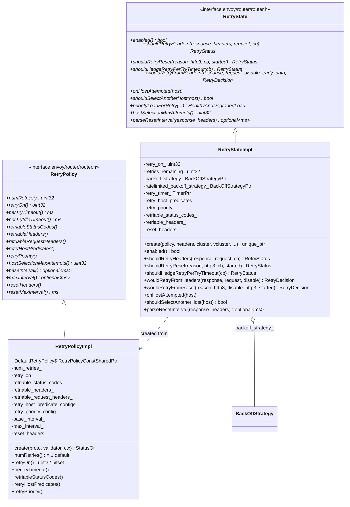

# Retry Policy & State — `retry_policy_impl.h` / `retry_state_impl.h`

**Files:**
- `source/common/router/retry_policy_impl.h` — static policy parsed from proto
- `source/common/router/retry_state_impl.h` — per-request retry state machine

Two complementary classes: `RetryPolicyImpl` is immutable config loaded at xDS time,
`RetryStateImpl` is created per-request and drives the actual retry decision/timer logic.

---

## Class Overview



---

## `RetryPolicyImpl` — Static Configuration

Parsed once from `envoy.config.route.v3.RetryPolicy` at route load time. Shared
(via `RetryPolicyConstSharedPtr`) between the route and all request instances.

### `retry_on_` — Bitset of Retry Conditions

`RetryStateImpl::parseRetryOn()` converts the `x-envoy-retry-on` header value or
`retry_policy.retry_on` proto string into a `uint32_t` bitset:

| Bit flag | String | Condition |
|---|---|---|
| `RetryPolicy::RETRY_ON_5XX` | `5xx` | Any 5xx response |
| `RetryPolicy::RETRY_ON_GATEWAY_ERROR` | `gateway-error` | 502, 503, 504 |
| `RetryPolicy::RETRY_ON_CONNECT_FAILURE` | `connect-failure` | Connection pool failure |
| `RetryPolicy::RETRY_ON_RETRIABLE_4XX` | `retriable-4xx` | 409 Conflict |
| `RetryPolicy::RETRY_ON_RESET` | `reset` | Stream reset before response |
| `RetryPolicy::RETRY_ON_RETRIABLE_STATUS_CODES` | `retriable-status-codes` | Custom codes |
| `RetryPolicy::RETRY_ON_RETRIABLE_HEADERS` | `retriable-headers` | Matching response headers |
| `RetryPolicy::RETRY_ON_GRPC_CANCELLED` | `cancelled` (gRPC) | gRPC status CANCELLED |
| `RetryPolicy::RETRY_ON_GRPC_DEADLINE_EXCEEDED` | `deadline-exceeded` | gRPC DEADLINE_EXCEEDED |
| `RetryPolicy::RETRY_ON_GRPC_RESOURCE_EXHAUSTED` | `resource-exhausted` | gRPC RESOURCE_EXHAUSTED |
| `RetryPolicy::RETRY_ON_GRPC_UNAVAILABLE` | `unavailable` | gRPC UNAVAILABLE |
| `RetryPolicy::RETRY_ON_GRPC_INTERNAL` | `internal` | gRPC INTERNAL |
| `RetryPolicy::RETRY_ON_HTTP3_POST_CONNECT_FAILURE` | `http3-post-connect-failure` | HTTP/3 fail after connect |

### Defaults

- `num_retries_ = 1` — when retry is enabled (any flag set), attempt once by default
- `reset_max_interval_ = 300000ms` — `Retry-After` header max accepted interval
- No backoff unless `base_interval` specified in proto

---

## `RetryStateImpl` — Per-Request State Machine

Created by `Filter::createRetryState()` (via `ProdFilter`) after route is resolved.
Uses the cluster-level retry policy if present (takes precedence over route-level).

### Retry Decision Flow

```mermaid
flowchart TD
    A[Response received] --> B{wouldRetryFromHeaders?}
    B -->|RetryDecision::NoRetry| C[Forward response downstream]
    B -->|RetryDecision::RetryWithDelay or No| D{retries_remaining_ > 0?}
    D -->|No| E[circuit breaker: RETRY_OVERFLOW or LIMIT_EXCEEDED]
    D -->|Yes| F{cluster retry circuit breaker OK?}
    F -->|No| G[RETRY_OVERFLOW — increment stat]
    F -->|Yes| H[RetryStatus::Yes: invoke DoRetryCallback]
    H --> I{backoff needed?}
    I -->|Retry-After header| J[ratelimited_backoff_strategy_]
    I -->|normal backoff| K[backoff_strategy_ JitteredExponential]
    J --> L[retry_timer_.enableTimer(delay)]
    K --> L
    L --> M[timer fires → DoRetryCallback → doRetry()]
```

### `wouldRetryFromHeaders`

Checks in order:
1. `retry_on_` bitmask vs response status code
2. `retriable_status_codes_` — custom list (e.g. `[429, 503]`)
3. `retriable_headers_` — matches response headers
4. gRPC status code in `grpc-status` header (if gRPC request)

Returns `RetryDecision` enum: `NoRetry`, `RetryWithDelay`, `DisableHttp3AndRetry`.

### `wouldRetryFromReset`

Evaluates reset reasons:

| Reset reason | Retries if |
|---|---|
| `ConnectionFailure` | `RETRY_ON_CONNECT_FAILURE` bit set |
| `LocalReset` | `RETRY_ON_RESET` bit set |
| `RemoteReset` | `RETRY_ON_RESET` or `RETRY_ON_5XX` bit set |
| `Overflow` | Never |
| `ProtocolError` | Never |
| HTTP/3 post-connect | `RETRY_ON_HTTP3_POST_CONNECT_FAILURE` + sets `disable_http3` |

`upstream_request_started` parameter: if `true` (data was sent), `RETRY_ON_RESET`
applies; if `false` (reset before any data sent), `RETRY_ON_CONNECT_FAILURE` applies.

### Backoff Strategy

`RetryStateImpl` always creates a `JitteredExponentialBackOffStrategy`:

```
base_interval = RetryPolicy::baseInterval() or 25ms default
max_interval  = RetryPolicy::maxInterval() or 10 × base_interval
```

For `Retry-After` / `x-ratelimit-reset` headers: `ratelimited_backoff_strategy_`
is created on first use — a `JitteredLowerBoundBackOffStrategy` centered on the
parsed retry-after value.

`enableBackoffTimer()` activates `retry_timer_` with the next backoff value and
schedules `DoRetryCallback`.

---

## Circuit Breaker Integration

Before each retry `shouldRetry()` checks the cluster's retry circuit breaker:

```cpp
if (!cluster_.resourceManager(priority_).retries().canCreate()) {
    return RetryStatus::NoRetryLimitExceeded;  // → upstream_rq_retry_overflow
}
cluster_.resourceManager(priority_).retries().inc();
```

The retry resource is decremented when the retry attempt completes
(success or terminal failure).

---

## Host Selection Predicates

`retry_host_predicates_` is a vector of `RetryHostPredicate` plugins (e.g.
`PreviousHostsPredicate` — avoids retrying on already-attempted hosts).

```cpp
void onHostAttempted(HostDescriptionConstSharedPtr host) {
    for (auto& pred : retry_host_predicates_) pred->onHostAttempted(host);
    if (retry_priority_) retry_priority_->onHostAttempted(host);
}

bool shouldSelectAnotherHost(const Host& host) {
    return any_of(predicates, [&host](auto p){ return p->shouldSelectAnotherHost(host); });
}
```

The LB calls `shouldSelectAnotherHost()` on each candidate during host selection,
up to `hostSelectionMaxAttempts()` times before accepting any host.

---

## Header-Driven Retry Override

At request entry, `RetryStateImpl` reads:

| Header | Effect |
|---|---|
| `x-envoy-retry-on` | Overrides/extends `retry_on_` bitset |
| `x-envoy-retry-grpc-on` | Overrides/extends gRPC retry flags |
| `x-envoy-max-retries` | Overrides `num_retries_` |

The filter's `StrictHeaderChecker` validates these headers before `RetryStateImpl`
consumes them. If invalid, the header is ignored.

---

## `RetryStatus` vs `RetryDecision`

| Type | Values | Used in |
|---|---|---|
| `RetryDecision` | `NoRetry`, `RetryWithDelay`, `DisableHttp3AndRetry` | `wouldRetry*` — pure policy check, no side effects |
| `RetryStatus` | `No`, `NoRetryLimitExceeded`, `NoOverflow`, `Yes` | `shouldRetry*` — authoritative with circuit breaker + timer setup |
