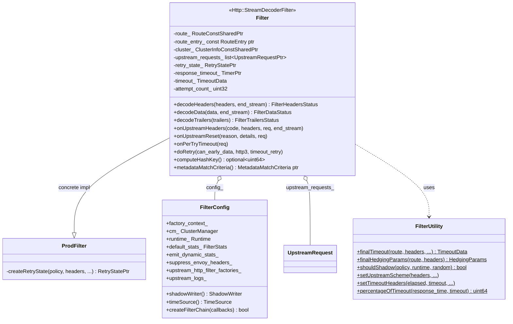
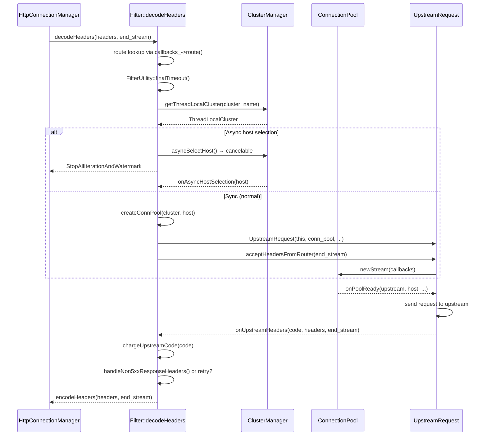

# Router Filter — `router.h`

**File:** `source/common/router/router.h`

The `Filter` class is Envoy's HTTP router — the terminal `StreamDecoderFilter`
responsible for route lookup, upstream cluster selection, connection pool acquisition,
request forwarding, retry logic, hedging, shadowing, and response proxying back
downstream.

---

## Class Overview



---

## Request Processing Pipeline



---

## `Filter` — Key State

```
Filter
├── route_                    current matched RouteConstSharedPtr
├── route_entry_              raw ptr into route_ (avoids shared_ptr overhead)
├── cluster_                  resolved ClusterInfo
├── upstream_requests_        list<UpstreamRequestPtr> (1 normal, >1 during hedging)
├── final_upstream_request_   winning UpstreamRequest for response
├── retry_state_              RetryStatePtr (nullptr until first retry needed)
├── response_timeout_         global route timeout timer
├── timeout_                  TimeoutData {global_timeout, per_try_timeout}
├── attempt_count_            increments on each try (1-indexed)
├── is_retry_                 affects LB host selection behavior
└── hedging_params_           HedgingParams from FilterUtility::finalHedgingParams
```

---

## Timeout Handling

`FilterUtility::finalTimeout()` computes `TimeoutData` from three sources, in priority order:

```
1. x-envoy-upstream-rq-timeout-ms header (if respect_expected_rq_timeout_)
2. grpc-timeout header (for gRPC requests)
3. RouteEntry::timeout() (from route config, default 15s)

Per-try timeout:
1. x-envoy-upstream-rq-per-try-timeout-ms header
2. RouteEntry::retryPolicy().perTryTimeout()
3. min(global_timeout, per_try_timeout) — can't exceed global
```

The `response_timeout_` fires `onGlobalTimeout()` → calls `onResponseTimeout()` →
sends 504. The per-try timer in `UpstreamRequest` fires `onPerTryTimeout()` on the
`Filter`, which triggers either a retry or hedge.

---

## Retry Logic

`Filter` creates `RetryState` (via virtual `createRetryState()`) after the first
response is received. On each response or reset:

```
onUpstreamHeaders → shouldRetryHeaders → RetryStatus::RetryWithDelay/RetryNow
onUpstreamReset   → shouldRetryReset   → RetryStatus::RetryWithDelay/RetryNow
onPerTryTimeout   → shouldHedgeRetryPerTryTimeout → hedge or abort
```

When retrying:
```
doRetry()
  → resetOtherUpstreams() (cancel in-flight non-winning requests)
  → createConnPool() with new host selection
  → new UpstreamRequest added to upstream_requests_
  → attempt_count_++, is_retry_ = true
```

`is_retry_ = true` affects `computeHashKey()` (returns empty — no sticky routing on
retry), `shouldSelectAnotherHost()` (consults `retry_state_`), and
`determinePriorityLoad()` (uses `RetryPriority` plugin).

---

## Hedging

When `hedge_on_per_try_timeout = true` and a per-try timeout fires:
- **New** upstream request is created without cancelling the existing one
- Both requests are now in `upstream_requests_`
- First response wins — `resetOtherUpstreams()` cancels the loser

`FilterUtility::finalHedgingParams()` reads `x-envoy-hedge-on-per-try-timeout`
header to override route config.

---

## Request Shadowing

After headers are fully decoded:
```
getShadowCluster(policy, headers)
  → resolves cluster name (static or via header)

applyShadowPolicyHeaders(policy, shadow_headers)
  → copies/mutates headers for shadow target

callbacks_->shadowWriter().shadow(cluster, shadow_headers, shadow_body, options)
  → fire-and-forget via AsyncClient
```

`FilterUtility::shouldShadow()` checks `runtime_key_` against
`Runtime::Loader::snapshot()` before firing. Multiple `ShadowPolicy` entries on a
route are all evaluated independently.

---

## `LoadBalancerContext` Implementation

`Filter` extends `LoadBalancerContextBase` to provide LB hints:

| Method | Returns |
|---|---|
| `computeHashKey()` | Hash from `HashPolicy` (ring hash / maglev) — empty on retry |
| `metadataMatchCriteria()` | Merged: route criteria ← connection metadata ← request metadata |
| `shouldSelectAnotherHost(host)` | Consults `RetryState::retry_host_predicates_` |
| `determinePriorityLoad(...)` | Uses `RetryPriority` plugin on retries |
| `hostSelectionRetryCount()` | From `RetryPolicy::hostSelectionMaxAttempts()` |
| `overrideHostToSelect()` | Upstream host override from `x-envoy-upstream-host` (first try only) |
| `downstreamHeaders()` | For LB to inspect request headers |

Metadata precedence: `request dynamic metadata > connection dynamic metadata > route criteria`.

---

## `FilterConfig`

Created once per router filter factory, shared across all requests:

| Member | Purpose |
|---|---|
| `cm_` | Cluster manager for `getThreadLocalCluster()` |
| `runtime_` | Runtime flag evaluation |
| `default_stats_` | `FilterStats` with per-router stat prefix |
| `async_stats_` | Stats for `AsyncClient` usage |
| `emit_dynamic_stats_` | Per-cluster/vcluster stats (zone, canary, etc.) |
| `suppress_envoy_headers_` | Strip `x-envoy-*` response headers |
| `respect_expected_rq_timeout_` | Honor `x-envoy-expected-request-timeout-ms` |
| `suppress_grpc_request_failure_code_stats_` | No gRPC failure stats for certain codes |
| `strict_check_headers_` | Headers validated by `StrictHeaderChecker` |
| `upstream_http_filter_factories_` | Upstream filter chain for `UpstreamFilterManager` |
| `upstream_logs_` | Access log instances for upstream logging |
| `shadow_writer_` | `ShadowWriter` for fire-and-forget mirroring |

---

## `FilterUtility::StrictHeaderChecker`

Validates `x-envoy-retry-on`, `x-envoy-retry-grpc-on`, and `x-envoy-max-retries`
request headers. If any is malformed, the filter logs a warning and ignores it
rather than allowing a mis-typed policy to silently trigger incorrect behavior.

---

## Router Stats (`ALL_ROUTER_STATS`)

Key stats emitted by the filter (via `FilterStats`):

| Stat | Description |
|---|---|
| `upstream_rq_retry` | Total retries attempted |
| `upstream_rq_retry_limit_exceeded` | Retries exhausted |
| `upstream_rq_retry_overflow` | Retry circuit breaker tripped |
| `upstream_rq_retry_success` | Retried requests that succeeded |
| `upstream_rq_timeout` | Global timeout reached |
| `upstream_rq_per_try_timeout` | Per-try timeout reached |
| `upstream_rq_maintenance_mode` | Cluster in maintenance mode (503) |
| `upstream_rq_direct_response` | Direct response sent (no upstream) |
| `no_healthy_upstream` | No available upstream host |
| `no_cluster` | Route cluster not found |
| `x_envoy_header_timeout_used` | Header-derived timeout was applied |
