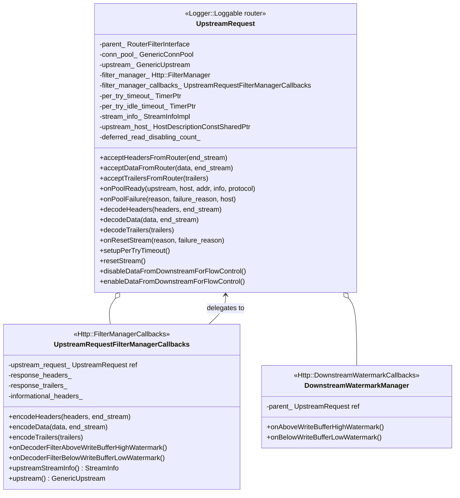
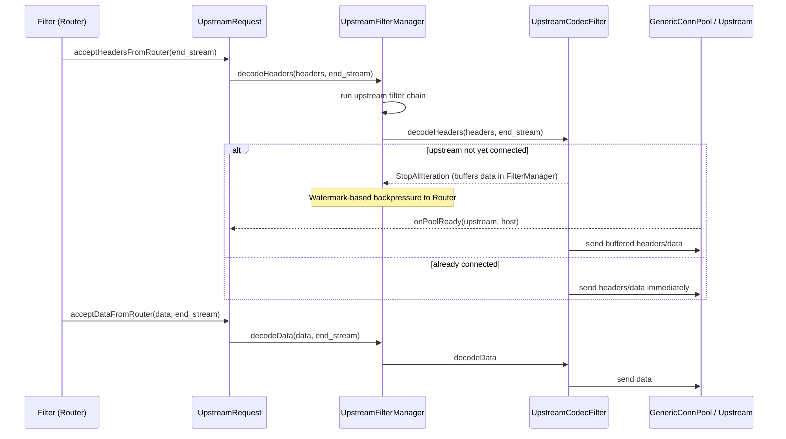
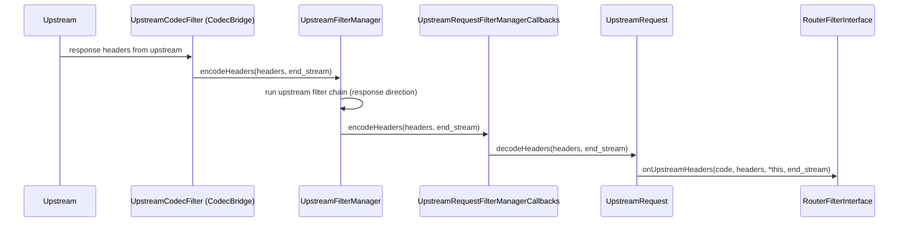

# Upstream Request — `upstream_request.h`

**File:** `source/common/router/upstream_request.h`

`UpstreamRequest` represents a single attempt to forward an HTTP request to an
upstream host. The router filter maintains a `list<UpstreamRequestPtr>` — one entry
for normal requests, more during hedging or retries. Each `UpstreamRequest` owns an
`UpstreamFilterManager` (a full upstream HTTP filter chain) and a `GenericConnPool`
(HTTP/1, HTTP/2, HTTP/3, or TCP).

---

## Class Overview



---

## Data Flow — Request Path



---

## Data Flow — Response Path



The naming is confusing intentionally preserved for legacy reasons:
- **`decode*`** on `UpstreamRequest` = data arriving **from** upstream (response)
- **`accept*FromRouter`** = data arriving **from** the downstream (request)
- **`encode*`** on `UpstreamRequestFilterManagerCallbacks` = response **leaving** filter manager

---

## Connection Pool Lifecycle

### `onPoolReady`

Called when a connection pool provides a usable stream:

```cpp
void onPoolReady(unique_ptr<GenericUpstream>&& upstream,
                 HostDescriptionConstSharedPtr host,
                 const NetworkConnectionInfoProvider& addr,
                 StreamInfo::StreamInfo& info,
                 optional<Http::Protocol> protocol);
```

1. Stores `upstream_` and `upstream_host_`
2. Records `connection_pool_callback_latency` histogram
3. Calls `maybeHandleDeferredReadDisable()` — applies any deferred read-disable count
4. Notifies parent router via `onUpstreamHostSelected(host, true)`
5. Signals `UpstreamCodecFilter` to begin draining buffered data

### `onPoolFailure`

Called when pool cannot acquire a stream:

1. Notifies parent router via `onUpstreamHostSelected(host, false)`
2. Router decides: retry or return 503

---

## Per-Try Timeout

`setupPerTryTimeout()` is called after pool is ready. Two timers:

| Timer | Fires when | Action |
|---|---|---|
| `per_try_timeout_` | `perTryTimeout` elapsed | `onPerTryTimeout()` → parent `Filter::onPerTryTimeout()` |
| `per_try_idle_timeout_` | No bytes received for `perTryIdleTimeout` | `onPerTryIdleTimeout()` → parent |

The per-try timeout may be deferred if the downstream request body hasn't finished:
`create_per_try_timeout_on_request_complete_` flag — timer starts when `router_sent_end_stream_ = true`.

For WebSocket upgrades after handshake success, `disablePerTryTimeoutForWebsocketUpgrade()` removes the timer.

---

## Flow Control — Deferred Read Disable

When the downstream send buffer fills up **before** upstream response headers arrive,
`onAboveWriteBufferHighWatermark()` is called. Rather than immediately calling
`readDisable(true)` on the upstream stream (which could cause spurious retries if
the response has already arrived but not been processed), the count is deferred:

```
downstream above watermark (before response headers):
  → deferred_read_disabling_count_++

upstream response headers arrive:
  → maybeHandleDeferredReadDisable()
  → call readDisable(true) deferred_read_disabling_count_ times

downstream below watermark:
  → deferred_read_disabling_count_-- (or actual readDisable(false))
```

This prevents a race where `readDisable` + timeout causes an unnecessary retry.

---

## `UpstreamRequestFilterManagerCallbacks`

Bridges between `Http::FilterManager` (which calls `encode*` methods as responses
flow through the upstream filter chain) and `UpstreamRequest` (which calls `decode*`
when routing responses downstream).

Key delegate relationships:

| `FilterManagerCallbacks` method | Delegated to |
|---|---|
| `encodeHeaders(headers, end_stream)` | `upstream_request_.decodeHeaders(response_headers_, end_stream)` |
| `encodeData(data, end_stream)` | `upstream_request_.decodeData(data, end_stream)` |
| `encodeTrailers(trailers)` | `upstream_request_.decodeTrailers(response_trailers_)` |
| `onDecoderFilterAboveWriteBufferHighWatermark()` | `upstream_request_.onAboveWriteBufferHighWatermark()` → downstream backpressure |
| `resetStream(reason, details)` | `upstream_request_.parent_.onUpstreamReset(...)` |
| `activeSpan()` | downstream `FilterManager`'s active span |
| `upstreamStreamInfo()` | `upstream_request_.stream_info_` (separate from downstream) |

### `UpstreamStreamFilterCallbacks`

The upstream codec filter uses this interface to:
- Get/set `paused_for_connect_` / `paused_for_websocket_` flags
- Call `addUpstreamCallbacks()` for QUIC/HTTP/3 interest
- `setUpstreamToDownstream()` to bind the codec bridge

---

## `UpstreamRequest` State Flags

All packed as bitfields at the end of the class for alignment:

| Flag | Meaning |
|---|---|
| `upstream_canary_` | Host is a canary — used for `x-envoy-upstream-canary` header |
| `router_sent_end_stream_` | Router has completed the request (all data sent) |
| `retried_` | This is a retry attempt |
| `awaiting_headers_` | Response headers not yet received |
| `outlier_detection_timeout_recorded_` | Outlier detection timeout already recorded |
| `create_per_try_timeout_on_request_complete_` | Deferred per-try timer start |
| `paused_for_connect_` | CONNECT request waiting for 200 response |
| `paused_for_websocket_` | WebSocket waiting for 101 response |
| `reset_stream_` | Stream has been reset |
| `record_timeout_budget_` | Record timeout budget histogram on completion |
| `cleaned_up_` | One-time cleanup has run |
| `had_upstream_` | Pool was ready at least once (distinguishes pool failure vs stream reset) |
| `grpc_rq_success_deferred_` | gRPC success determination deferred to trailers |
| `enable_half_close_` | Allow half-close on TCP upstream |
