# Envoy SSL/TLS Configuration Architecture

## Overview

The Envoy SSL/TLS configuration subsystem manages the setup and validation of TLS certificates and certificate validation contexts. It provides a flexible configuration layer that handles certificate chains, private keys, certificate validation, and various TLS-related settings including OCSP stapling, SPKI pinning, and custom validators.

---

## System Architecture

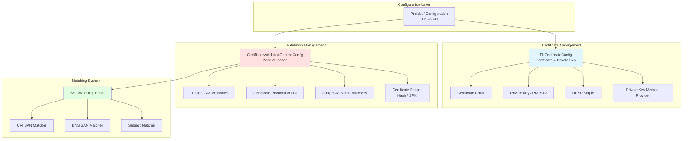

---

## 1. Core Components

### Component Hierarchy

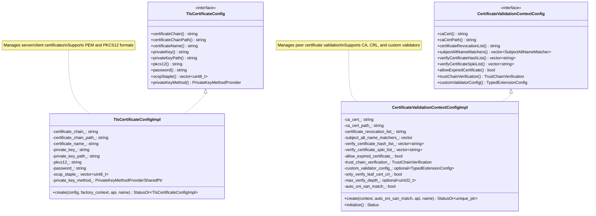

---

## 2. TLS Certificate Configuration

### Certificate Loading Strategies

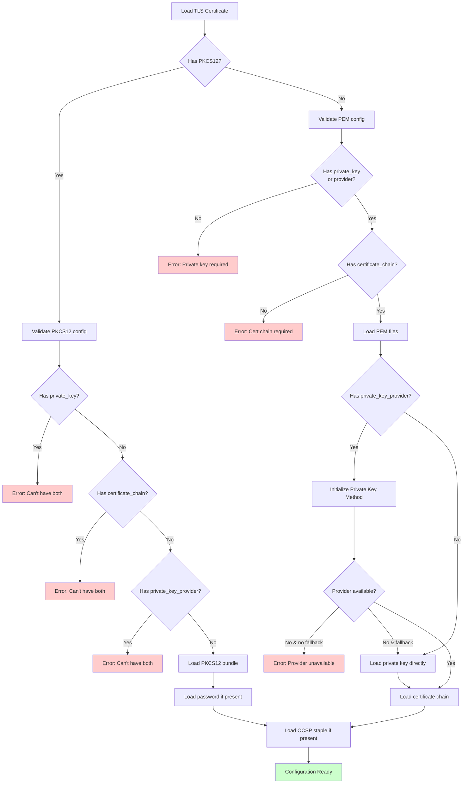

### Certificate Data Sources

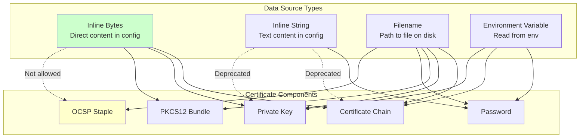

### Certificate Configuration Fields

| Field | Type | Required | Description |
|-------|------|----------|-------------|
| **certificate_chain** | DataSource | Yes* | PEM-encoded certificate chain |
| **private_key** | DataSource | Yes* | PEM-encoded private key |
| **pkcs12** | DataSource | No | PKCS12 bundle (alternative to PEM) |
| **password** | DataSource | No | Password for encrypted key/PKCS12 |
| **ocsp_staple** | DataSource | No | OCSP stapling response (must be filename) |
| **private_key_provider** | PrivateKeyProvider | No | Hardware/software key provider |

\* Either (certificate_chain + private_key) or pkcs12 is required

---

## 3. Certificate Validation Context

### Validation Configuration

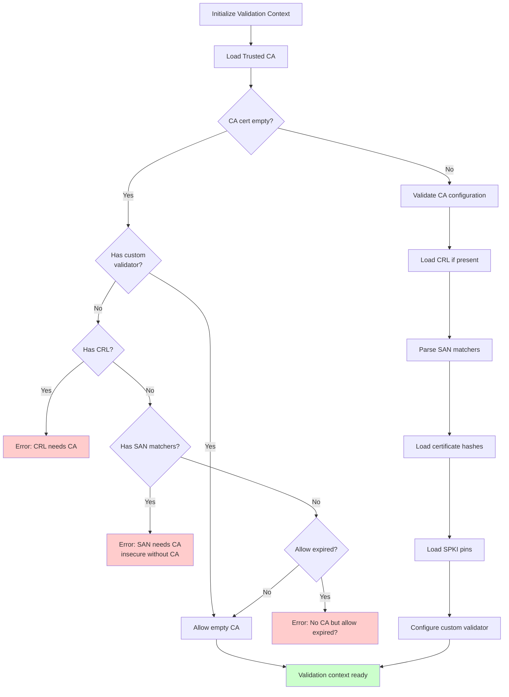

### Subject Alternative Name (SAN) Matching

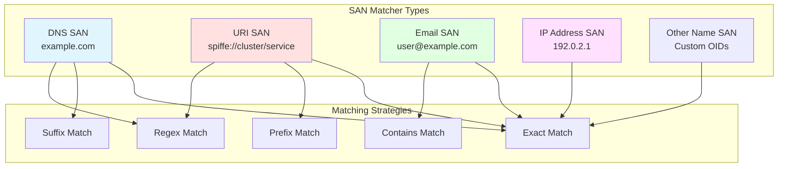

### Validation Context Fields

| Field | Type | Description |
|-------|------|-------------|
| **trusted_ca** | DataSource | PEM-encoded CA certificates |
| **crl** | DataSource | Certificate Revocation List |
| **match_typed_subject_alt_names** | SubjectAltNameMatcher[] | Typed SAN matchers |
| **verify_certificate_hash** | string[] | SHA-256 cert fingerprints |
| **verify_certificate_spki** | string[] | SHA-256 SPKI pins |
| **allow_expired_certificate** | bool | Accept expired certs |
| **trust_chain_verification** | enum | VERIFY_TRUST_CHAIN / ACCEPT_UNTRUSTED |
| **custom_validator_config** | TypedExtensionConfig | Custom validation extension |
| **only_verify_leaf_cert_crl** | bool | Skip intermediate CRL checks |
| **max_verify_depth** | uint32 | Maximum chain depth |

---

## 4. Certificate Pinning

### Pinning Strategies

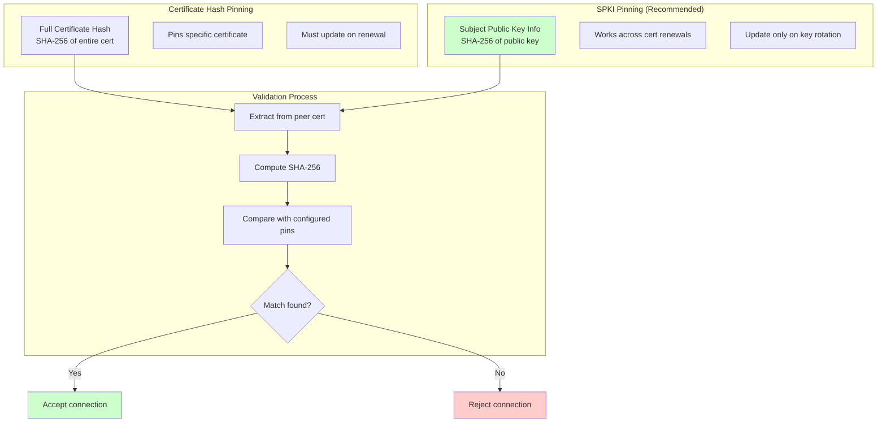

### Example Configuration

```yaml
# Certificate Hash Pinning
validation_context:
  verify_certificate_hash:
    - "E3:B0:C4:42:98:FC:1C:14:9A:FB:F4:C8:99:6F:B9:24:27:AE:41:E4:64:9B:93:4C:A4:95:99:1B:78:52:B8:55"

# SPKI Pinning (Recommended)
validation_context:
  verify_certificate_spki:
    - "NIdniy8pK1mhYTLdAp1vXL5wJXMQweHAWwVrHxMJ3Y8="
    - "qKzHZAr7BLAkiDcU+sIz1N9JpmFMcHUJJcnL8IuPJ0Y="
```

---

## 5. Private Key Methods

### Private Key Provider Architecture

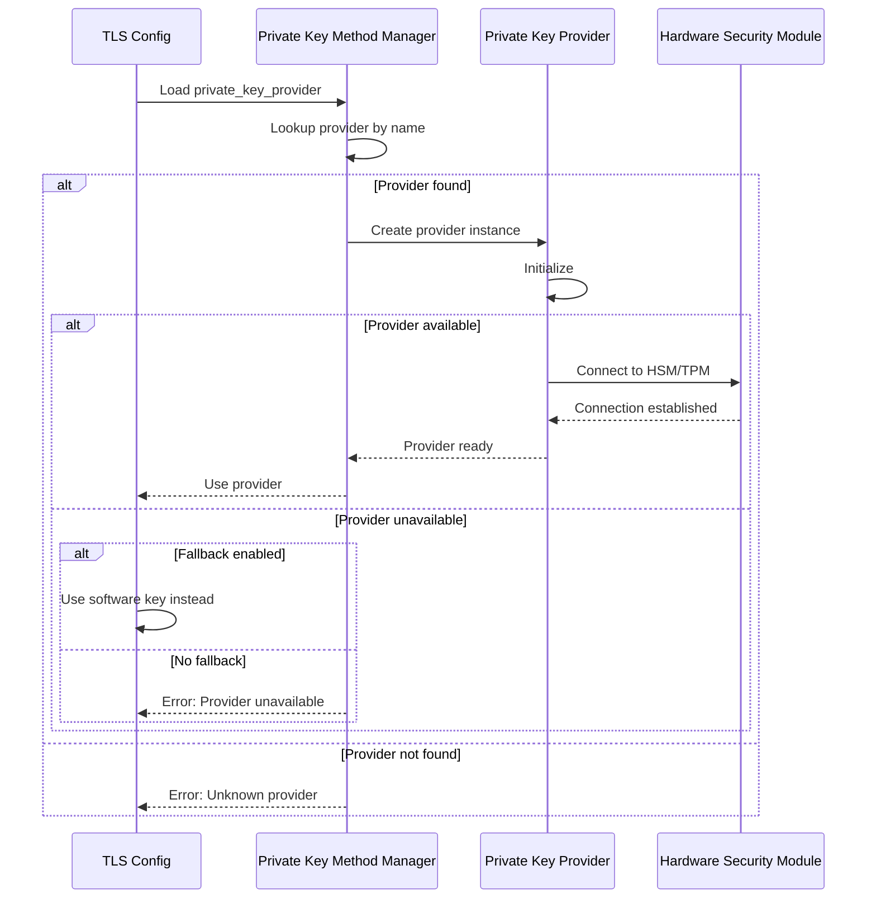

### Provider Use Cases

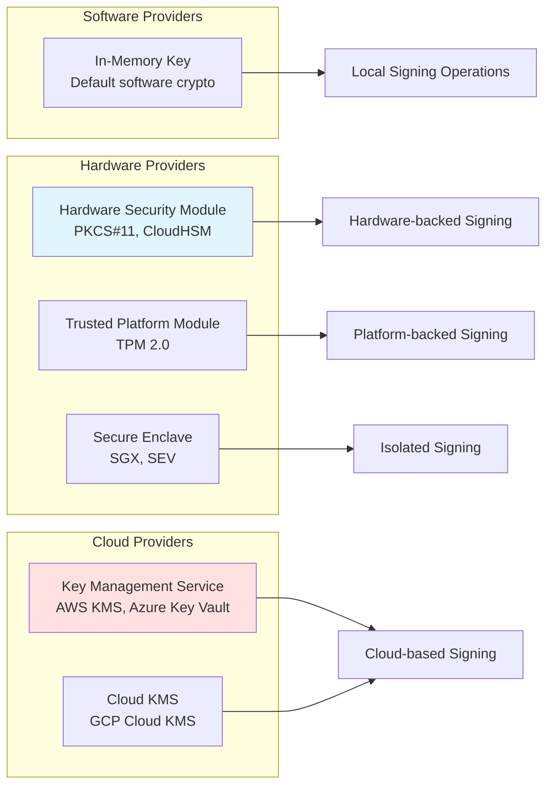

---

## 6. SSL Matching System

### Matching Input Types

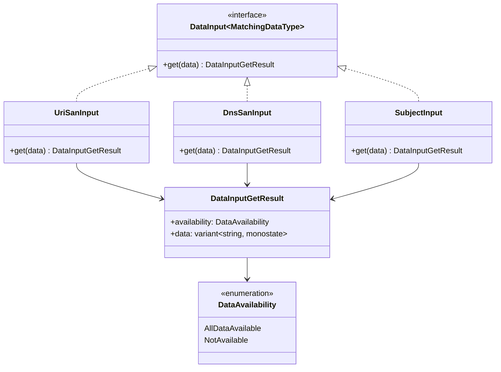

### Matching Flow

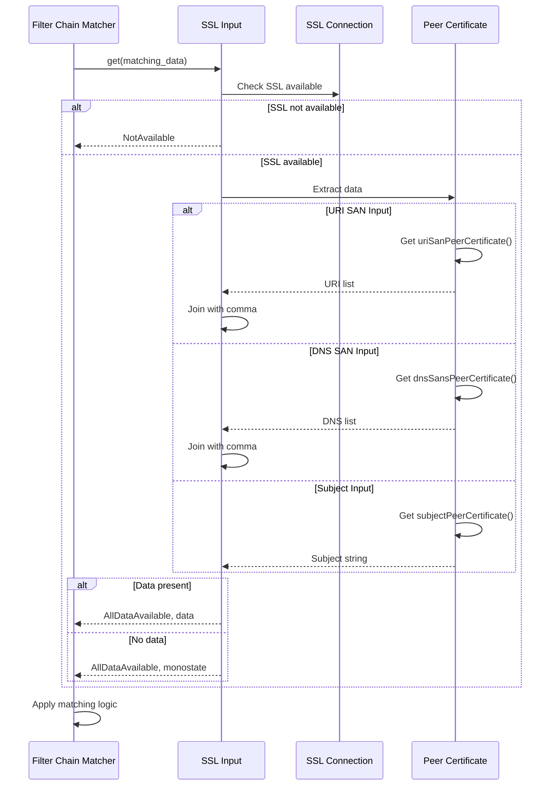

### Use Cases

| Input Type | Use Case | Example Value |
|-----------|----------|---------------|
| **URI SAN** | Service identity (SPIFFE) | `spiffe://cluster.local/ns/default/sa/web` |
| **DNS SAN** | Hostname matching | `api.example.com,*.example.com` |
| **Subject** | Legacy DN matching | `CN=server.example.com,O=Example Inc,C=US` |

---

## 7. OCSP Stapling

### OCSP Stapling Flow

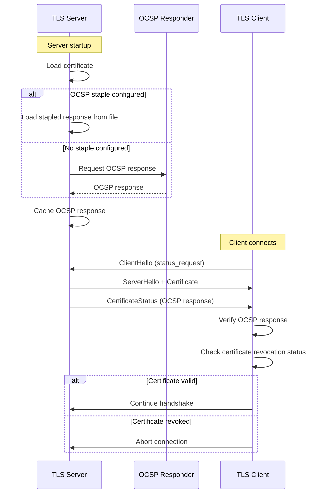

### OCSP Configuration

```yaml
tls_certificates:
  - certificate_chain:
      filename: /path/to/cert.pem
    private_key:
      filename: /path/to/key.pem
    ocsp_staple:
      filename: /path/to/ocsp_response.der
```

**Restrictions:**
- OCSP staple **must** be from a file (not inline)
- Response is DER-encoded
- Server caches response (no automatic refresh in this layer)

---

## 8. Deprecated Features Handling

### SAN Matcher Migration

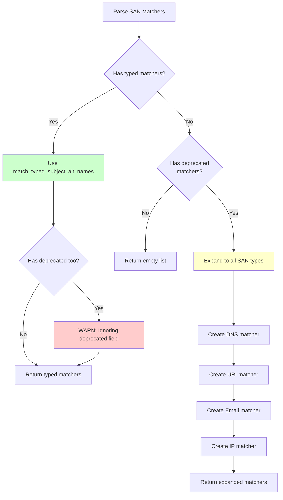

### Deprecated Fields

| Deprecated Field | Replacement | Migration Path |
|-----------------|-------------|----------------|
| **match_subject_alt_names** | match_typed_subject_alt_names | Specify explicit SAN type per matcher |
| **inline_string** (OCSP) | filename | Move OCSP response to file |

---

## 9. Error Handling

### Validation Errors

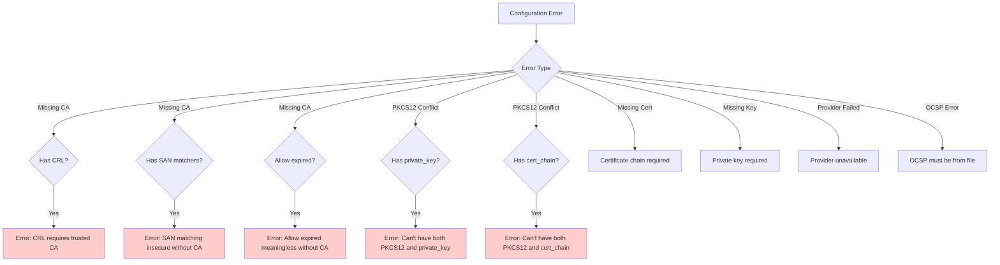

### Common Error Messages

| Error | Cause | Resolution |
|-------|-------|------------|
| **CRL without trusted CA** | CRL configured but no CA cert | Add trusted_ca or remove CRL |
| **SAN matching insecure** | SAN matchers without CA | Add trusted_ca for secure validation |
| **PKCS12 conflicts** | PKCS12 with PEM fields | Use either PKCS12 or PEM, not both |
| **Missing certificate** | No cert_chain configured | Provide certificate_chain |
| **Missing private key** | No key or provider | Provide private_key or provider |
| **OCSP inline error** | OCSP from inline_string | Use filename for OCSP staple |
| **Provider unavailable** | HSM/TPM not accessible | Enable fallback or fix provider |

---

## 10. Configuration Examples

### Basic TLS Server

```yaml
transport_socket:
  name: envoy.transport_sockets.tls
  typed_config:
    "@type": type.googleapis.com/envoy.extensions.transport_sockets.tls.v3.DownstreamTlsContext
    common_tls_context:
      tls_certificates:
        - certificate_chain:
            filename: /etc/certs/server-cert.pem
          private_key:
            filename: /etc/certs/server-key.pem
```

### Mutual TLS (mTLS)

```yaml
common_tls_context:
  tls_certificates:
    - certificate_chain:
        filename: /etc/certs/server-cert.pem
      private_key:
        filename: /etc/certs/server-key.pem

  validation_context:
    trusted_ca:
      filename: /etc/certs/ca-cert.pem
    match_typed_subject_alt_names:
      - san_type: URI
        matcher:
          exact: "spiffe://cluster.local/ns/default/sa/client"
```

### Certificate Pinning

```yaml
validation_context:
  trusted_ca:
    filename: /etc/certs/ca-cert.pem
  # SPKI Pinning (recommended)
  verify_certificate_spki:
    - "NIdniy8pK1mhYTLdAp1vXL5wJXMQweHAWwVrHxMJ3Y8="
    - "qKzHZAr7BLAkiDcU+sIz1N9JpmFMcHUJJcnL8IuPJ0Y="
```

### Hardware Security Module

```yaml
tls_certificates:
  - certificate_chain:
      filename: /etc/certs/server-cert.pem
    private_key_provider:
      provider_name: pkcs11
      fallback: true
      typed_config:
        "@type": type.googleapis.com/envoy.extensions.private_key_providers.pkcs11.v3.Pkcs11Config
        library_path: /usr/lib/libpkcs11.so
        key_id: "01:02:03:04"
```

### OCSP Stapling

```yaml
tls_certificates:
  - certificate_chain:
      filename: /etc/certs/server-cert.pem
    private_key:
      filename: /etc/certs/server-key.pem
    ocsp_staple:
      filename: /etc/certs/ocsp-response.der
```

---

## 11. Security Best Practices

### Certificate Management

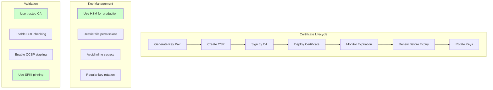

### Recommendations

1. **Private Keys**
   - Store in HSM/TPM for production
   - Use file permissions (0400/0600)
   - Never use inline_string for keys
   - Rotate regularly (e.g., annually)

2. **Certificates**
   - Use strong algorithms (RSA 2048+, EC P-256+)
   - Enable OCSP stapling
   - Monitor expiration (30 days warning)
   - Automate renewal

3. **Validation**
   - Always validate peer certificates
   - Use SPKI pinning for critical services
   - Enable CRL checking
   - Set appropriate max_verify_depth

4. **Configuration**
   - Use typed SAN matchers
   - Avoid allow_expired_certificate in production
   - Set trust_chain_verification appropriately
   - Use custom validators for special requirements

---

## Summary

The Envoy SSL/TLS configuration subsystem provides:

1. **Flexible Certificate Management**
   - PEM and PKCS12 formats
   - Multiple data sources (file, inline, env)
   - OCSP stapling support
   - Private key method providers (HSM/TPM)

2. **Comprehensive Validation**
   - CA certificate trust chains
   - Certificate Revocation Lists (CRL)
   - Subject Alternative Name (SAN) matching
   - Certificate pinning (hash and SPKI)
   - Custom validator extensions

3. **Advanced Features**
   - SSL-based filter chain matching
   - Auto SNI-SAN matching
   - Configurable trust chain verification
   - Leaf-only CRL checking
   - Maximum verification depth control

4. **Production Ready**
   - Extensive error validation
   - Secure defaults
   - Hardware security module support
   - Migration path for deprecated features
   - Clear error messages

5. **Integration Points**
   - Transport socket factories
   - Filter chain selection
   - Custom certificate validators
   - Private key providers
   - OCSP responders

This architecture enables Envoy to support diverse TLS requirements from simple HTTPS to complex mTLS with hardware-backed keys, certificate pinning, and custom validation logic.
