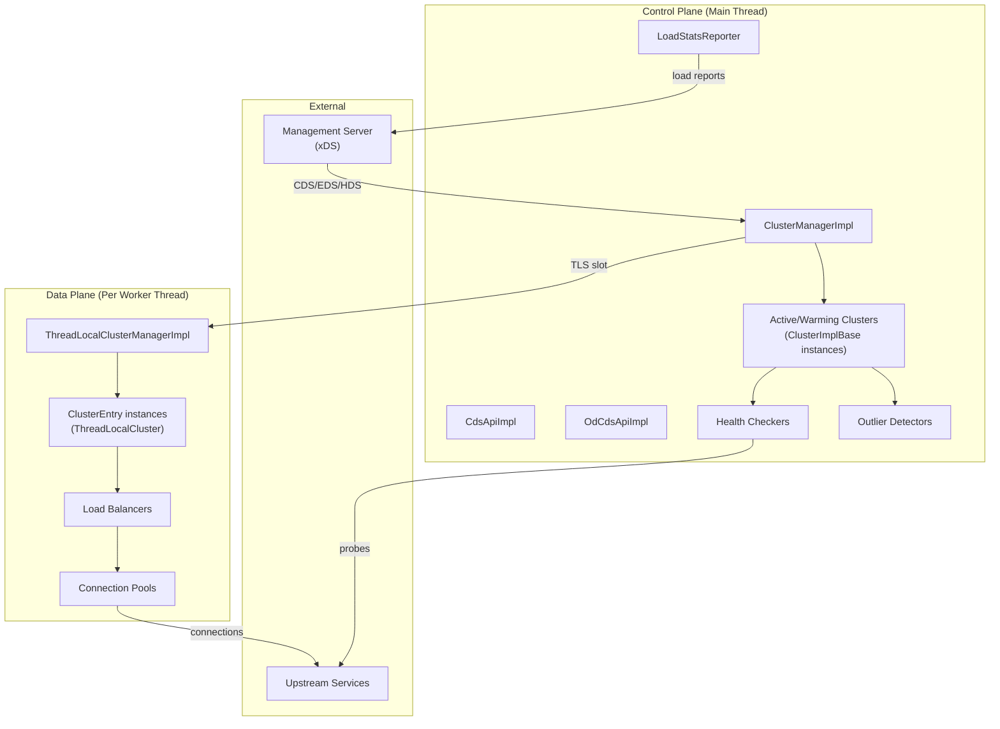
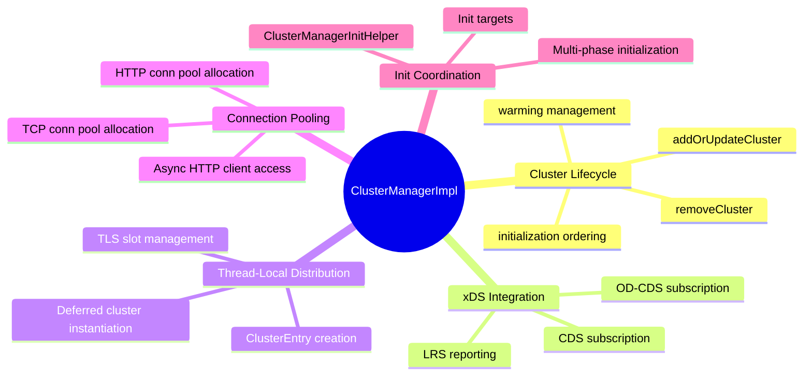
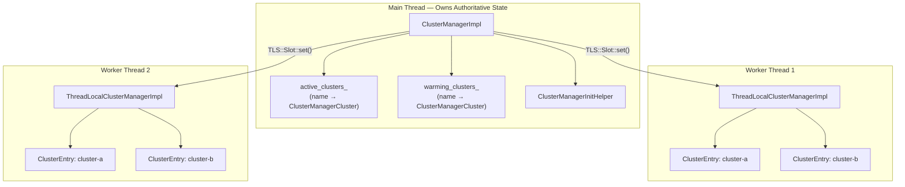
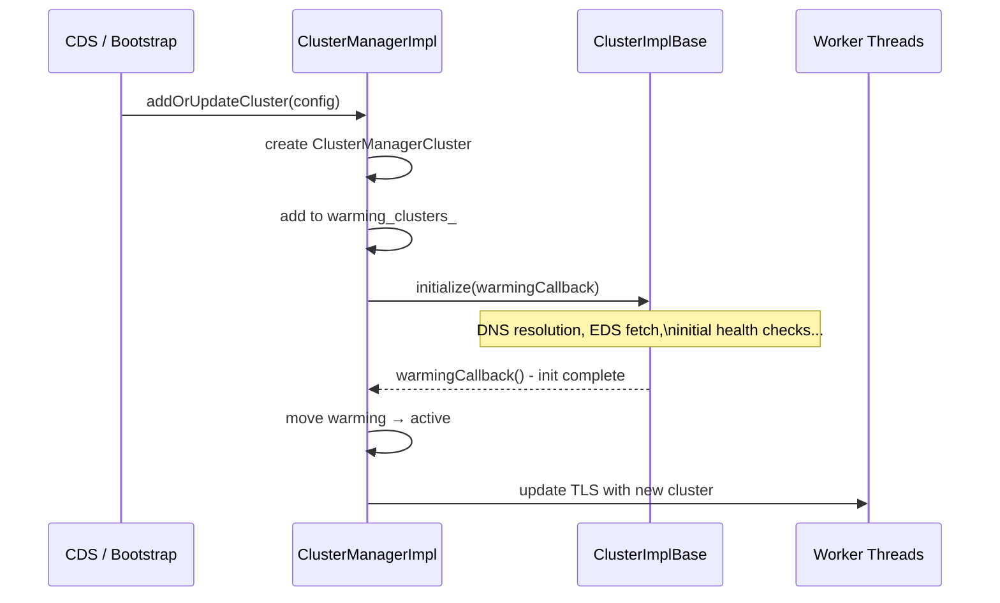
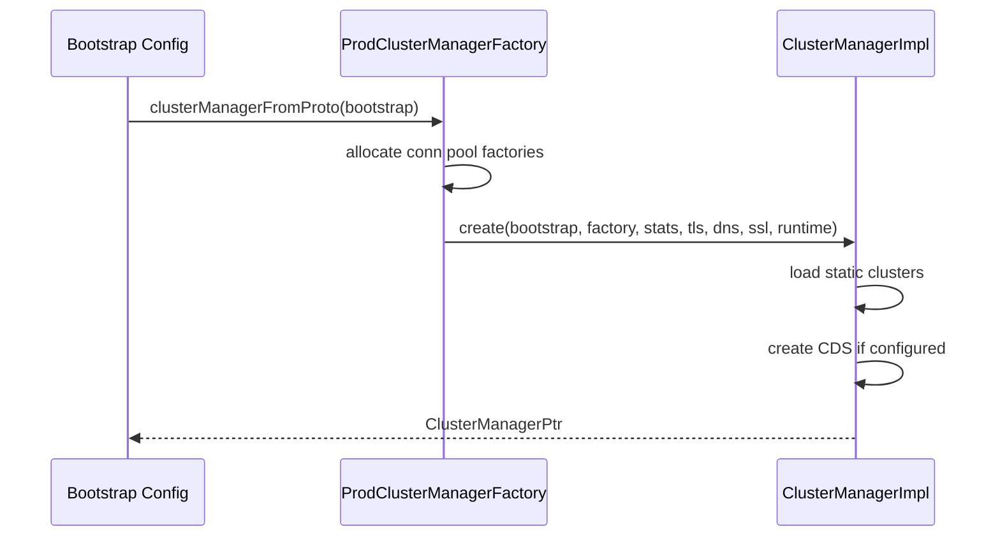

# Upstream Overview — Part 1: Architecture & Cluster Manager

## High-Level Architecture

The `source/common/upstream` directory implements Envoy's upstream cluster management system — the machinery that tracks upstream services, their endpoints, health, and provides load-balanced connection pools to the data path.

## File Map

| File | Purpose | Key Classes |
|------|---------|-------------|
| `cluster_manager_impl.h/.cc` | Central cluster management, TLS, conn pools | `ClusterManagerImpl`, `ThreadLocalClusterManagerImpl`, `ClusterEntry` |
| `upstream_impl.h/.cc` | Host, HostSet, PrioritySet, ClusterInfo, ClusterBase | `HostImpl`, `HostSetImpl`, `PrioritySetImpl`, `ClusterInfoImpl`, `ClusterImplBase` |
| `cluster_factory_impl.h/.cc` | Cluster creation factory | `ClusterFactoryImplBase`, `ClusterFactoryContextImpl` |
| `cds_api_impl.h/.cc` | CDS subscription client | `CdsApiImpl` |
| `cds_api_helper.h/.cc` | CDS config application | `CdsApiHelper` |
| `od_cds_api_impl.h/.cc` | On-demand CDS | `OdCdsApiImpl` |
| `outlier_detection_impl.h/.cc` | Outlier detection | `DetectorImpl`, `DetectorHostMonitorImpl` |
| `health_checker_impl.h/.cc` | Health checker factory | `HealthCheckerFactory`, `HealthCheckerFactoryContextImpl` |
| `health_checker_event_logger.h/.cc` | HC event logging | `HealthCheckEventLoggerImpl` |
| `health_discovery_service.h/.cc` | HDS client | `HdsDelegate`, `HdsCluster` |
| `edf_scheduler.h` | Earliest deadline first scheduler | `EdfScheduler<C>` |
| `wrsq_scheduler.h` | Weighted random selection queue | `WRSQScheduler<C>` |
| `load_balancer_context_base.h` | Default LB context | `LoadBalancerContextBase` |
| `load_balancer_factory_base.h` | Base LB factory | `TypedLoadBalancerFactoryBase
` |
| `resource_manager_impl.h` | Circuit breaker resources | `ResourceManagerImpl` |
| `conn_pool_map.h` | Generic conn pool map | `ConnPoolMap<K,V>` |
| `priority_conn_pool_map.h` | Per-priority conn pool map | `PriorityConnPoolMap<K,V>` |
| `transport_socket_match_impl.h/.cc` | Transport socket selection | `TransportSocketMatcherImpl` |
| `load_stats_reporter.h/.cc` | LRS client | `LoadStatsReporter` |
| `host_utility.h/.cc` | Host helper functions | `HostUtility` |
| `cluster_discovery_manager.h/.cc` | Per-worker OD-CDS callbacks | `ClusterDiscoveryManager` |
| `cluster_update_tracker.h/.cc` | Cached cluster reference | `ClusterUpdateTracker` |
| `default_local_address_selector.h/.cc` | Source address selection | `DefaultUpstreamLocalAddressSelector` |

## ClusterManagerImpl Deep Dive

### Responsibilities

### Thread Model

### Warming Pipeline

When a cluster is created or updated, it goes through a warming phase:

### `ProdClusterManagerFactory`

Creates the `ClusterManagerImpl` from bootstrap config:

## Key Design Patterns

### 1. Thread-Local Caching

All cluster state accessed by the data path goes through `ThreadLocalClusterManagerImpl`. Workers never lock on the main-thread cluster map. Updates flow one-way: main → workers via `TLS::Slot::runOnAllThreads()`.

### 2. Deferred Instantiation

`ClusterEntry` (with its load balancer and connection pools) is created lazily on the first access per worker thread, minimizing memory when clusters are configured but not actively used.

### 3. Two-Phase Cluster Lifecycle

Clusters exist in either `warming_clusters_` (initializing) or `active_clusters_` (ready for traffic). A cluster must fully initialize (DNS, EDS, initial HC) before it becomes active.

### 4. Priority-Based Resource Management

Each cluster has multiple priority levels (0 = highest). Hosts, host sets, and resource managers are all organized per-priority, enabling spillover to lower-priority endpoints when higher-priority ones are exhausted.

### 5. Pluggable Everything

Cluster factories, load balancer factories, health checker factories, and transport socket factories are all registered via the extension system, enabling custom implementations without modifying core code.
