# Upstream Overview — Part 2: Clusters, Hosts, and Priority Sets

## The Upstream Data Model

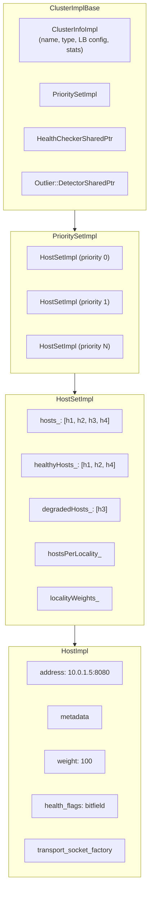

## Cluster Type Hierarchy

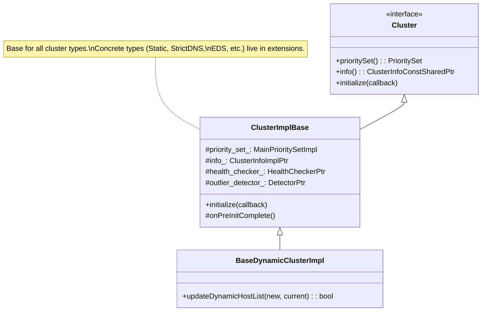

## Cluster Types (registered in extensions)

| Type | Source of Endpoints | Update Mechanism |
|------|-------------------|-----------------|
| **STATIC** | Bootstrap config | Fixed at config time |
| **STRICT_DNS** | DNS resolution | Periodic DNS re-resolve |
| **LOGICAL_DNS** | DNS resolution | Single logical address, resolve on connect |
| **EDS** | xDS API (Endpoint Discovery Service) | Streaming updates from management server |
| **ORIGINAL_DST** | Original destination address | Auto-discovered from connection metadata |

## ClusterInfoImpl — The Cluster's Identity Card

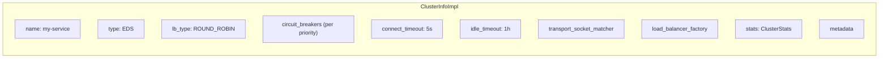

### Stats Tracked Per Cluster

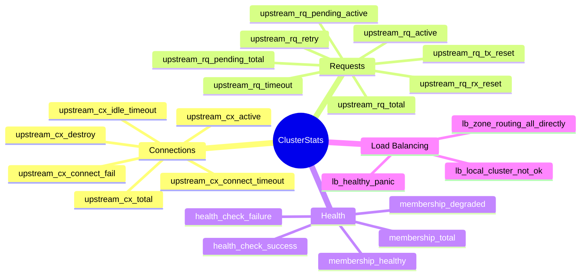

## Host Lifecycle

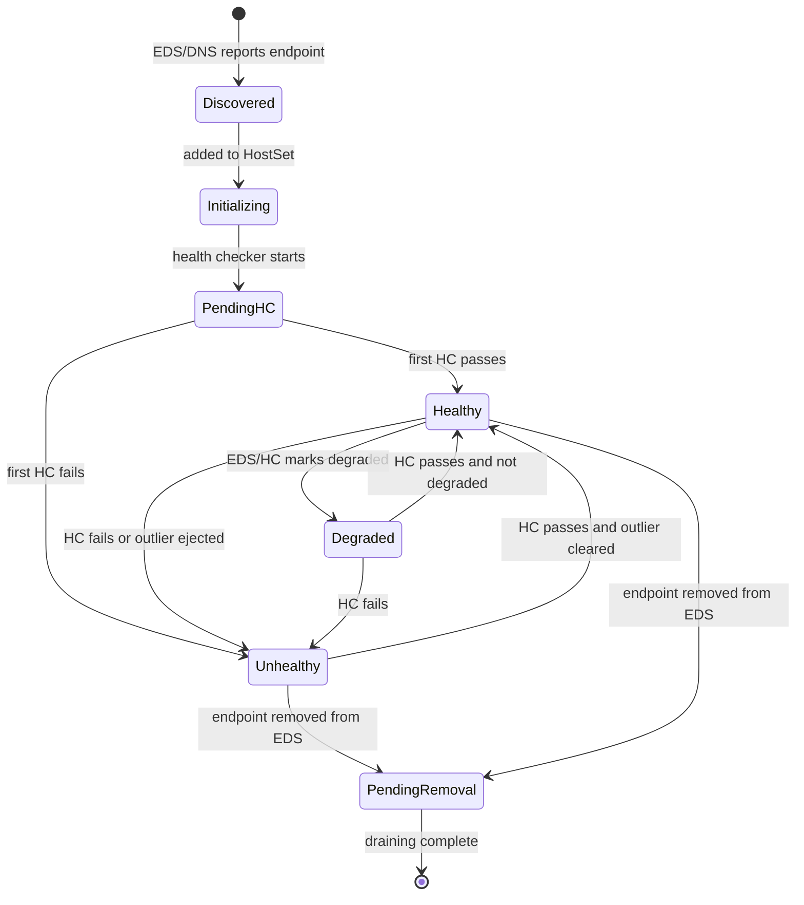

## HostSet Update Flow

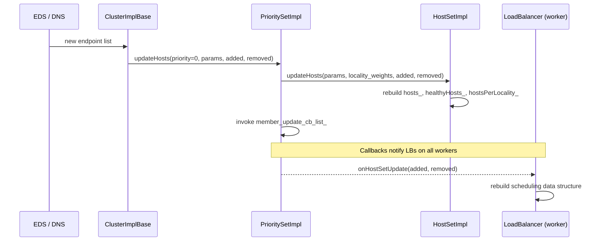

## Locality-Aware Endpoint Organization

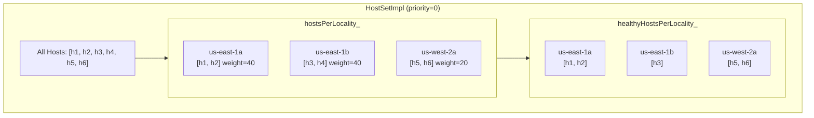

## Priority Spillover

When higher-priority host sets are degraded, traffic spills to lower priorities:

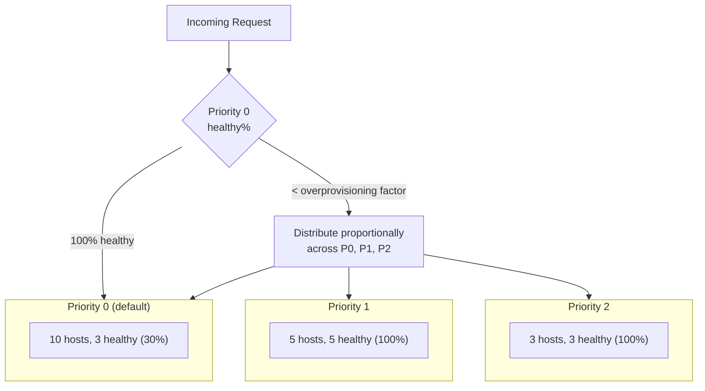

### Overprovisioning Factor

The `overprovisioning_factor` (default 1.4 = 140%) determines when spillover begins:
- If `healthy_hosts / total_hosts * overprovisioning_factor >= 100%`, all traffic stays at this priority
- Otherwise, excess traffic spills to the next priority

## Batch Host Updates

`PrioritySetImpl::batchHostUpdate()` allows atomic updates across multiple priorities:

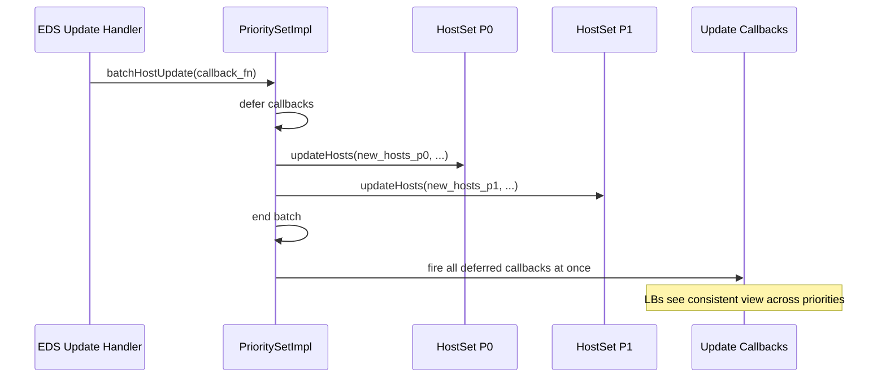

## `MainPrioritySetImpl` — Cross-Priority Host Map

On the main thread, `MainPrioritySetImpl` maintains a map of all hosts across all priorities, enabling O(1) host lookup by address:

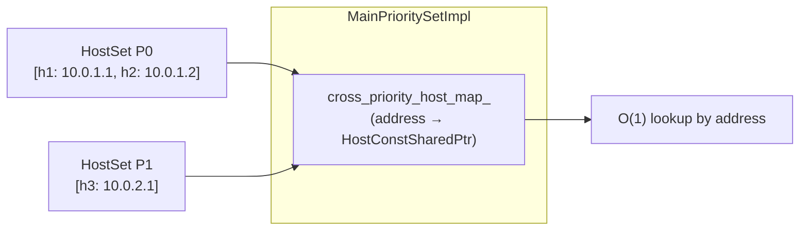

## Cluster Factory System

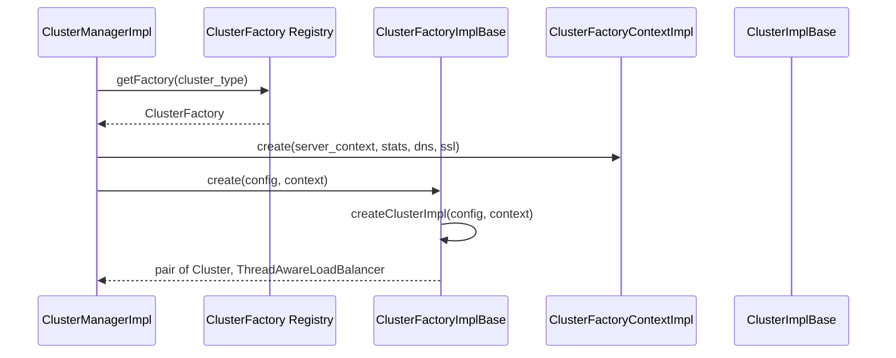

### `ConfigurableClusterFactoryBase<ConfigProto>`

For cluster types with custom config (e.g., `aggregate_cluster.proto`):

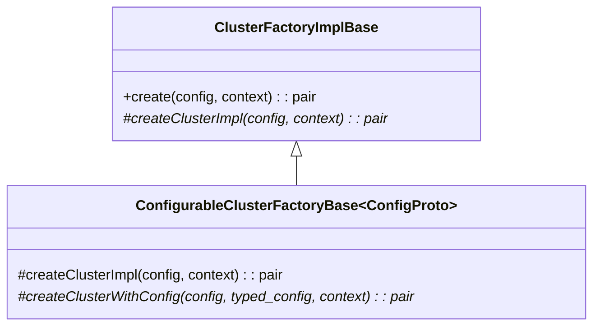
