# Upstream Overview — Part 3: Load Balancing, Connection Pools, and Resources

## Load Balancing Architecture

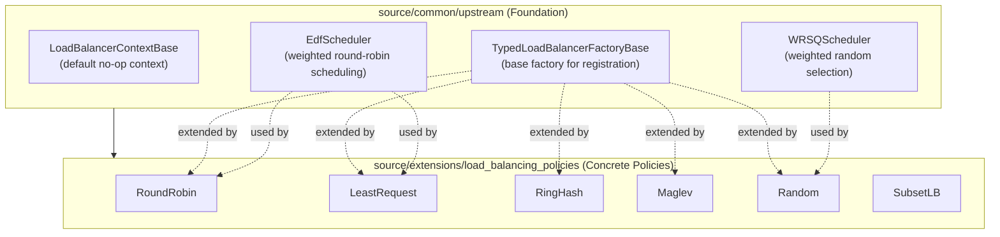

## EDF vs WRSQ — When to Use Which

| Scheduler | Algorithm | Use Case | Deterministic | Fairness |
|-----------|-----------|----------|---------------|----------|
| **EdfScheduler** | Earliest Deadline First | Weighted Round Robin, Slow Start | Yes | Exact proportional over time |
| **WRSQScheduler** | Weighted Random Selection | Random LB, P2C sampling | No (random) | Statistical proportional |

### EDF Scheduling Visualization

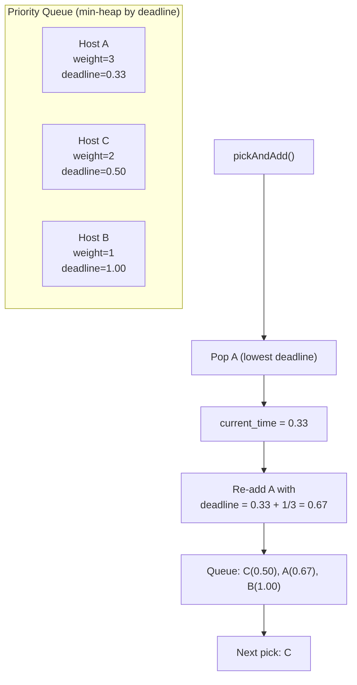

## Connection Pool System

### ConnPoolMap — Per-Host Pool Management

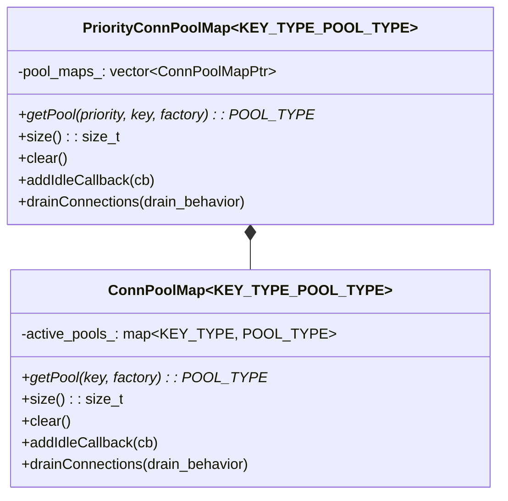

### Connection Pool Lifecycle

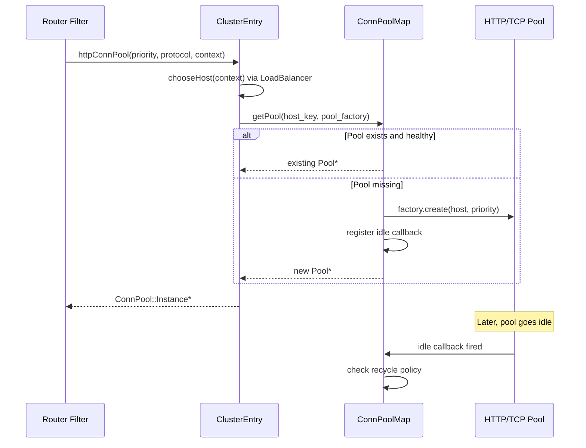

### Connection Pool in ClusterEntry

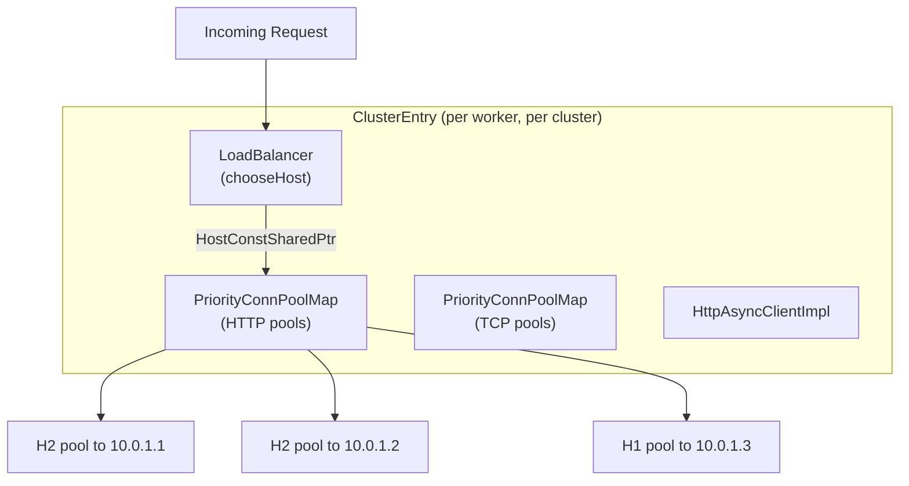

## Resource Management — Circuit Breakers

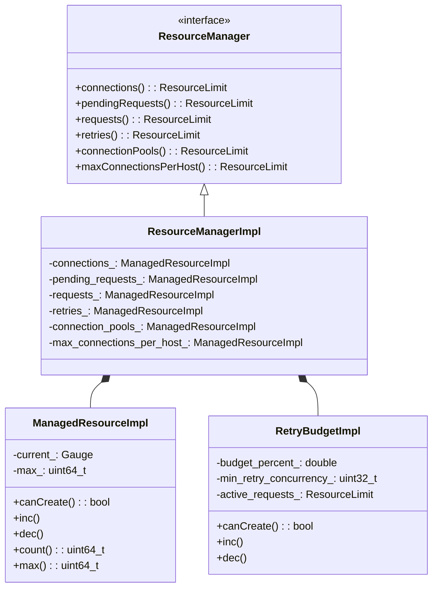

### Circuit Breaker Flow

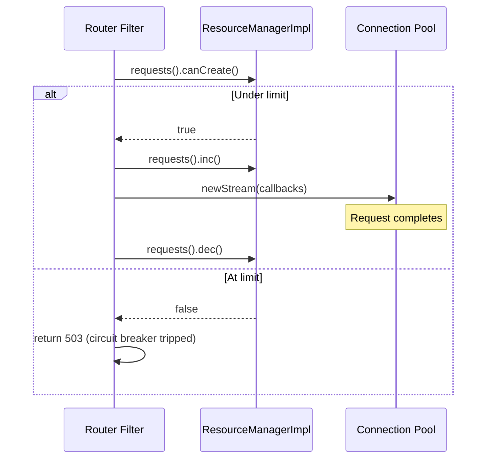

### Resource Limits Per Priority

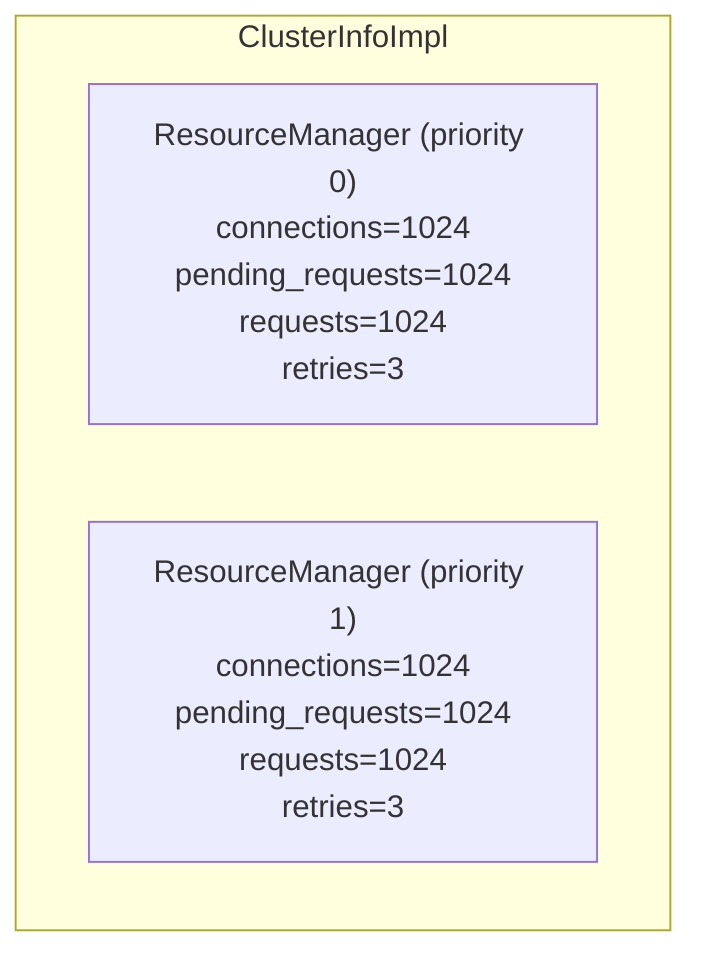

### Retry Budget

An alternative to fixed retry limits:

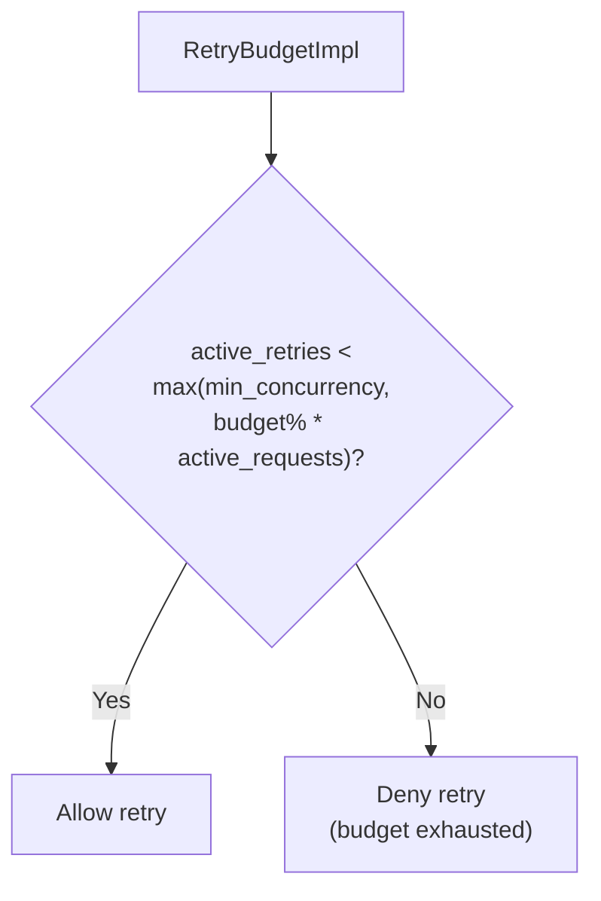

## Transport Socket Matching

`TransportSocketMatcherImpl` selects the correct transport socket (TLS config) for a given upstream host based on endpoint metadata:

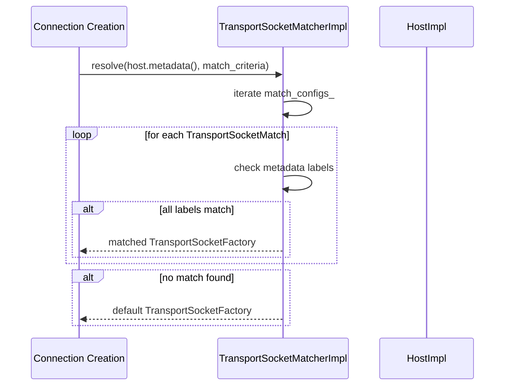

### Transport Socket Match Config

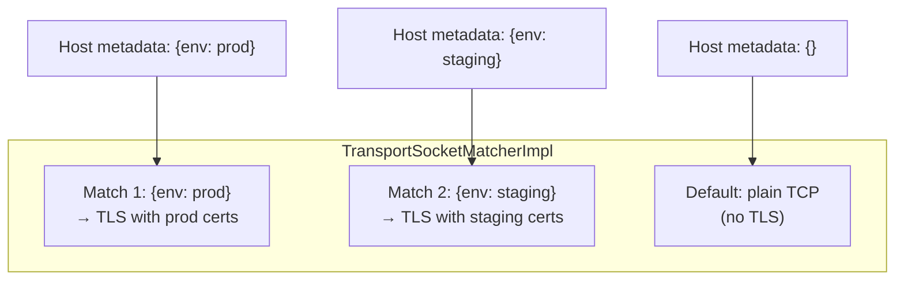

## Load Stats Reporter (LRS)

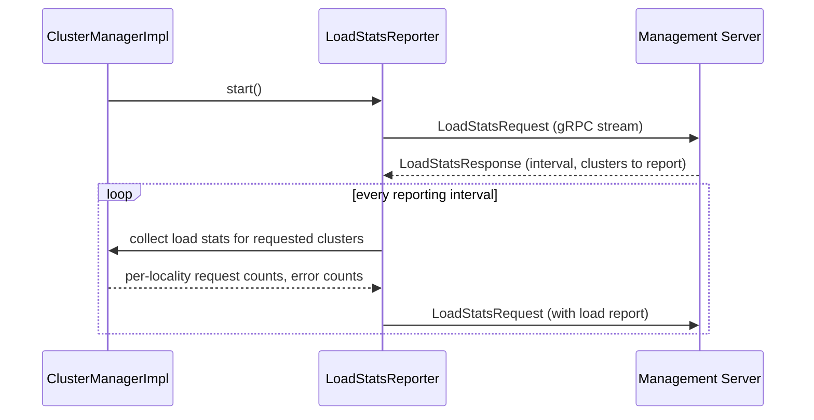

### Reported Metrics

| Metric | Description |
|--------|-------------|
| `total_successful_requests` | Requests with 2xx/3xx |
| `total_requests_in_progress` | Currently active requests |
| `total_error_requests` | Requests with 5xx |
| `total_issued_requests` | All requests attempted |
| `upstream_endpoint_stats` | Per-endpoint load metrics |
| `dropped_requests` | Requests dropped by circuit breaker |
