# Upstream Overview — Part 4: Health, Outlier Detection, CDS, and Advanced Topics

## Health Checking System

### Architecture

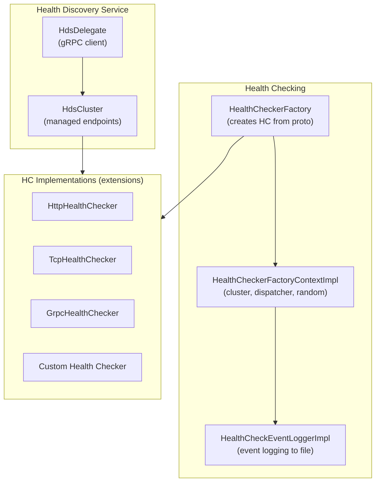

### Health Check Integration with Host

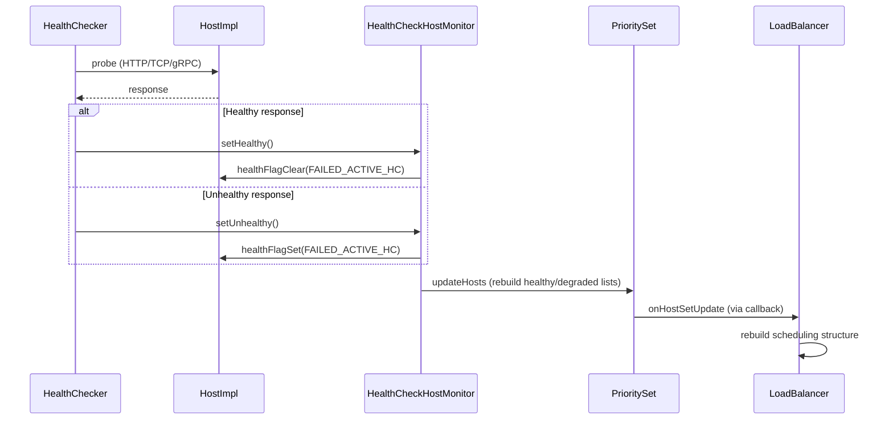

### HDS Flow — Management Server Driven Health Checks

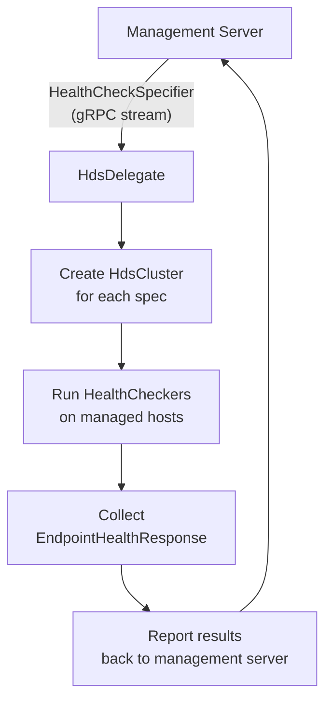

## Outlier Detection System

### Detection Algorithms

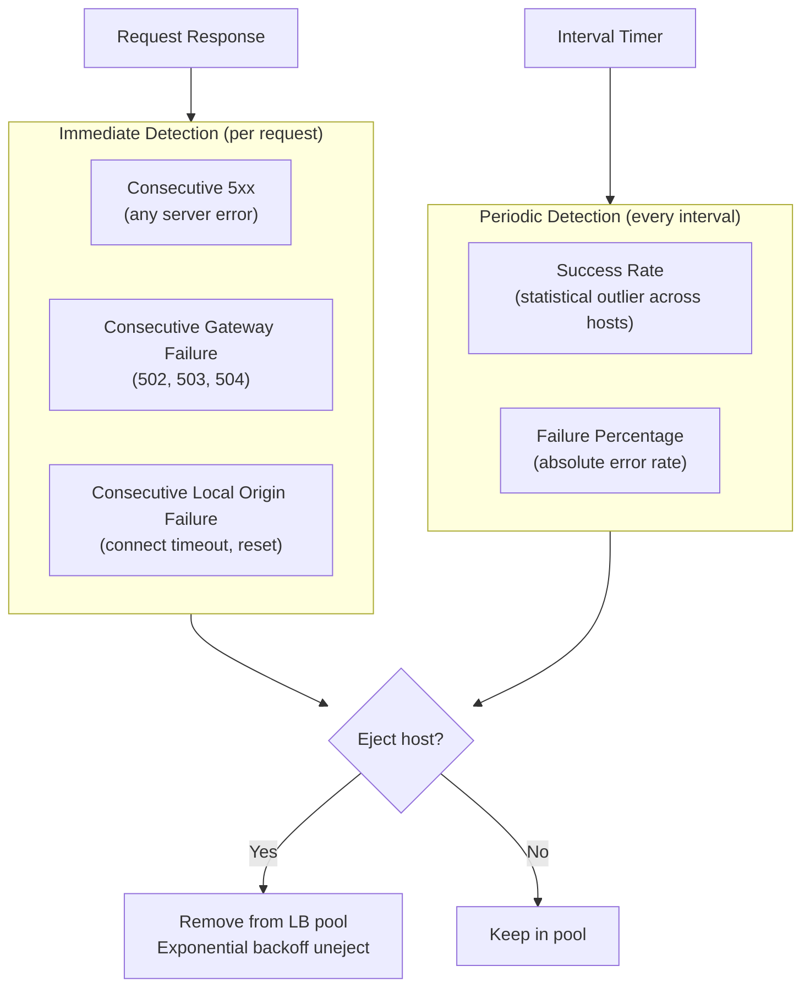

### Success Rate Outlier Detection

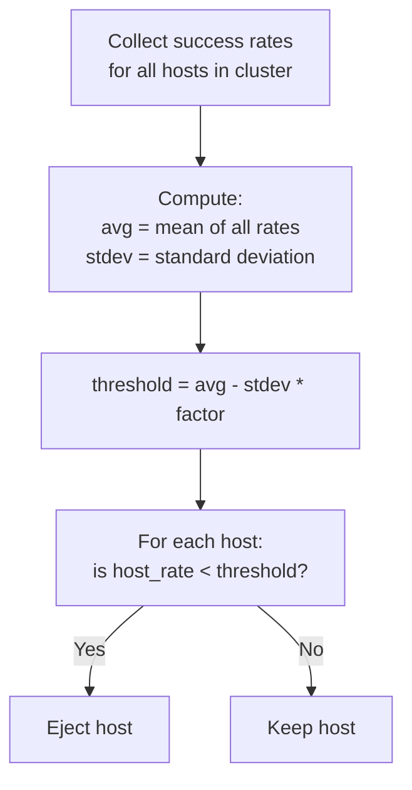

### Ejection Timeline

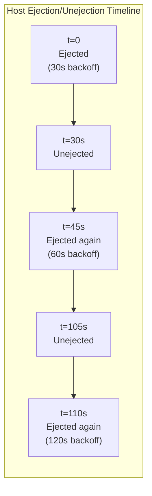

## CDS and OD-CDS

### CDS Subscription

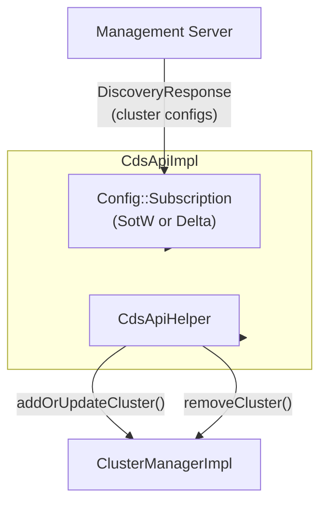

### OD-CDS — Lazy Cluster Loading

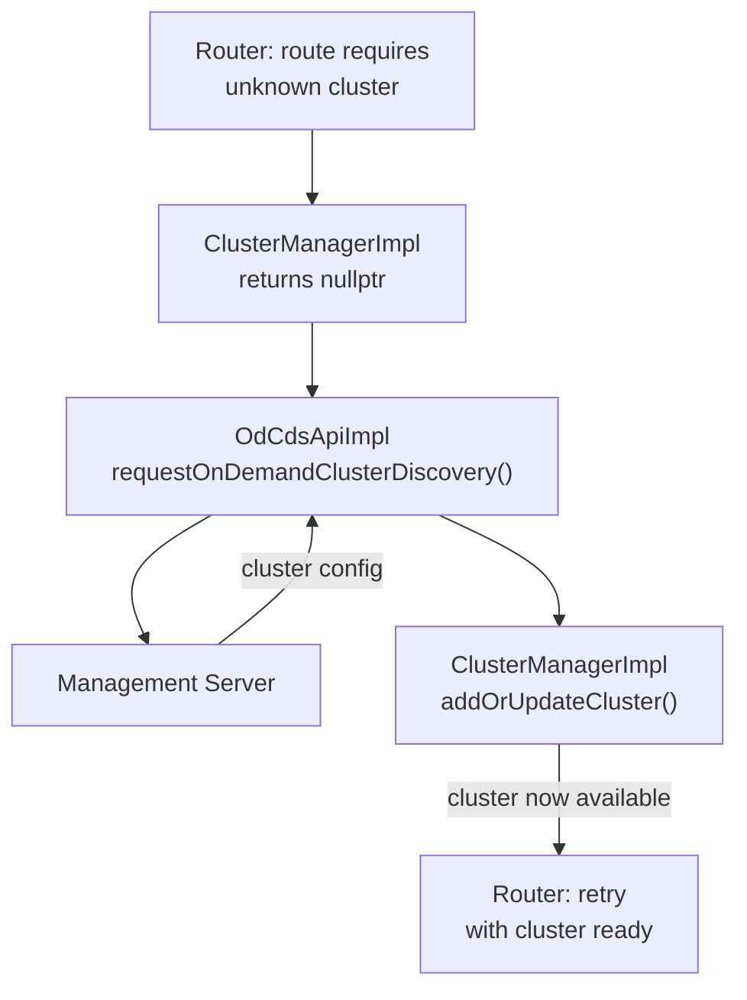

### CDS vs OD-CDS Comparison

| Feature | CDS | OD-CDS |
|---------|-----|--------|
| Subscription | Wildcard (all clusters) | Specific cluster names |
| Timing | At startup + streaming | On-demand when needed |
| Cluster removal | Via SotW diff or delta remove | Handle-based cancellation |
| Use case | Standard cluster config | Large cluster sets, lazy loading |

## Advanced Topics

### Cluster Update Tracker

`ClusterUpdateTracker` caches a `ThreadLocalCluster*` reference, avoiding `ClusterManager::get()` hash lookups on the hot path:

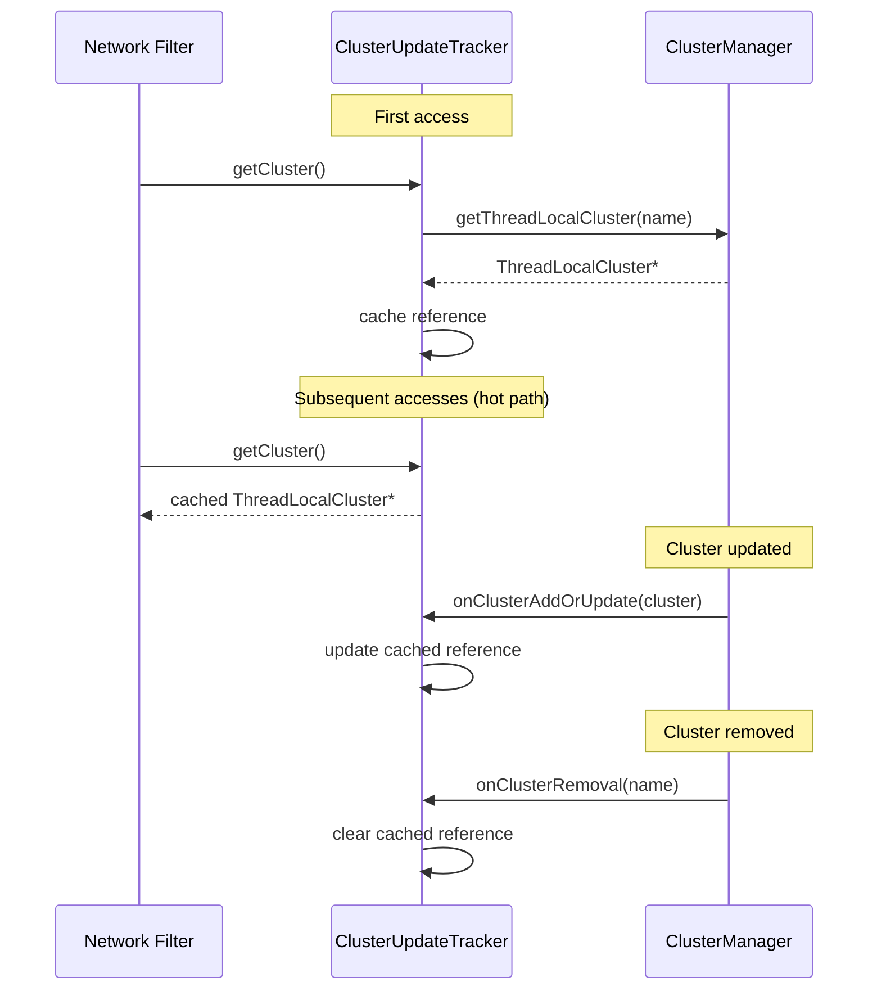

### Cluster Discovery Manager

Per-worker component that manages on-demand cluster discovery callbacks:

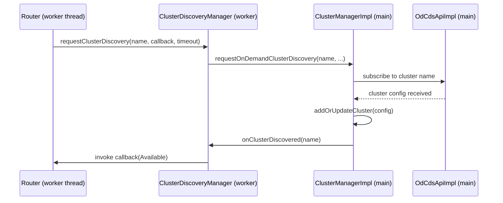

### Default Local Address Selector

Selects the source IP for upstream connections:

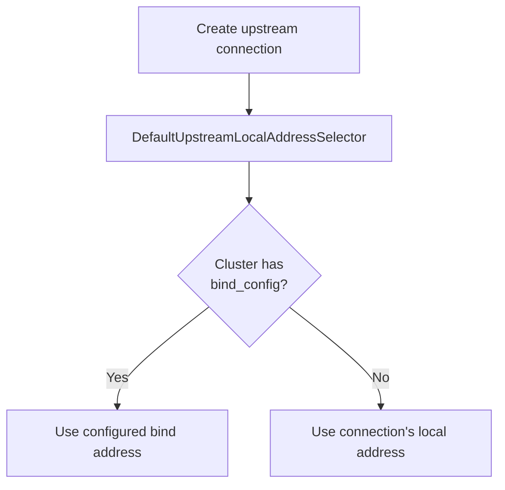

### Host Utility Functions

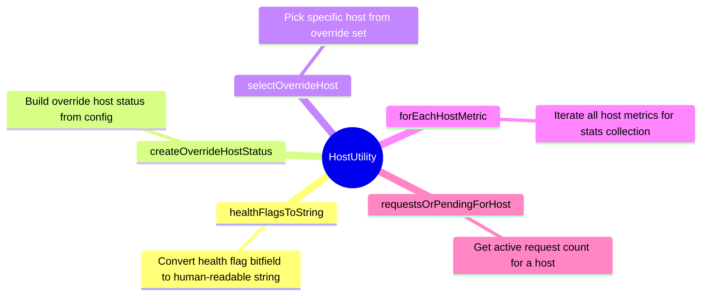

## Full Component Interaction Map

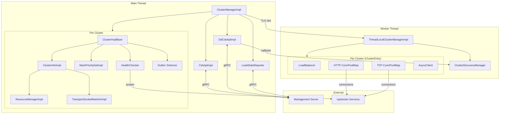

## Troubleshooting Scenarios

### Scenario 1: All Hosts Unhealthy (Panic Mode)

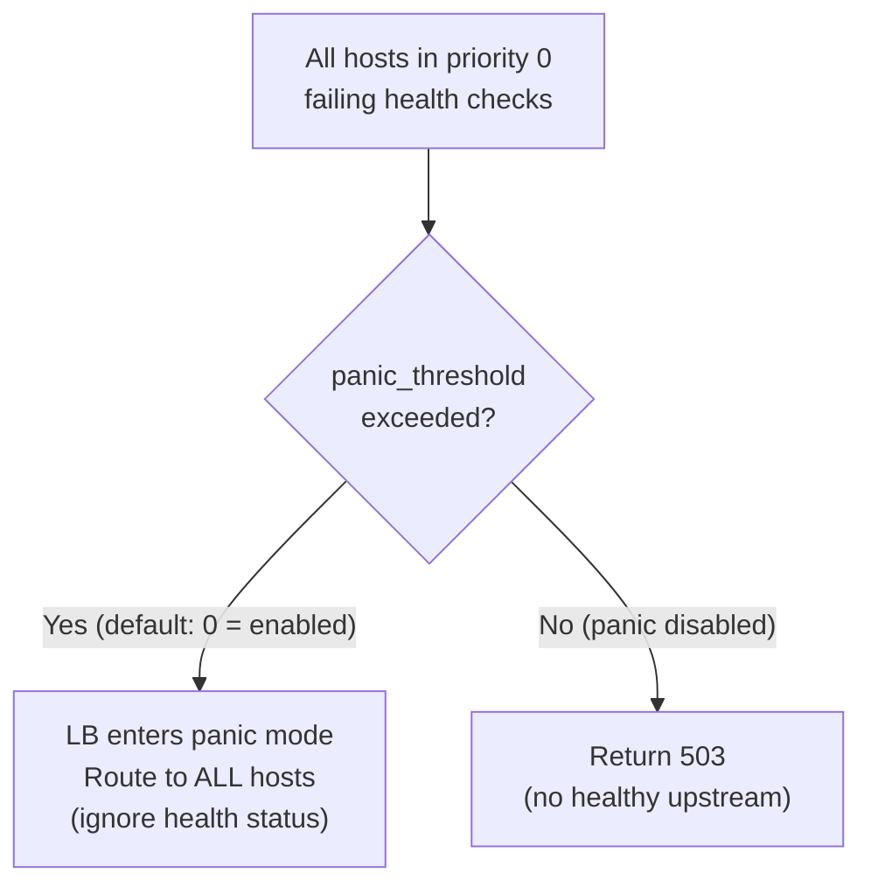

### Scenario 2: Circuit Breaker Trip

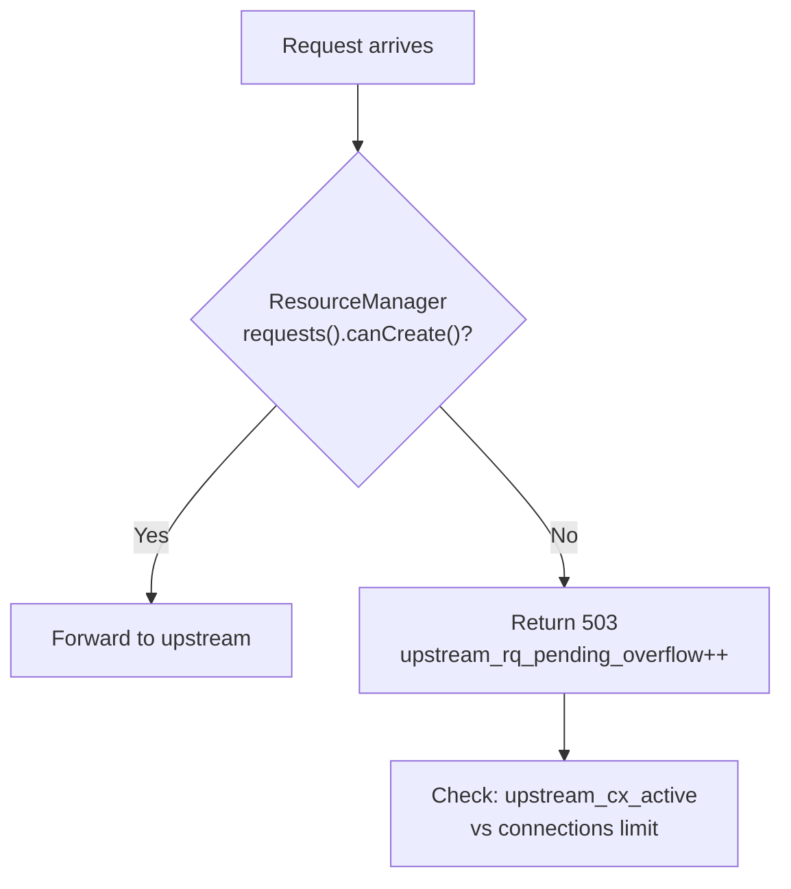

### Scenario 3: Host Flapping

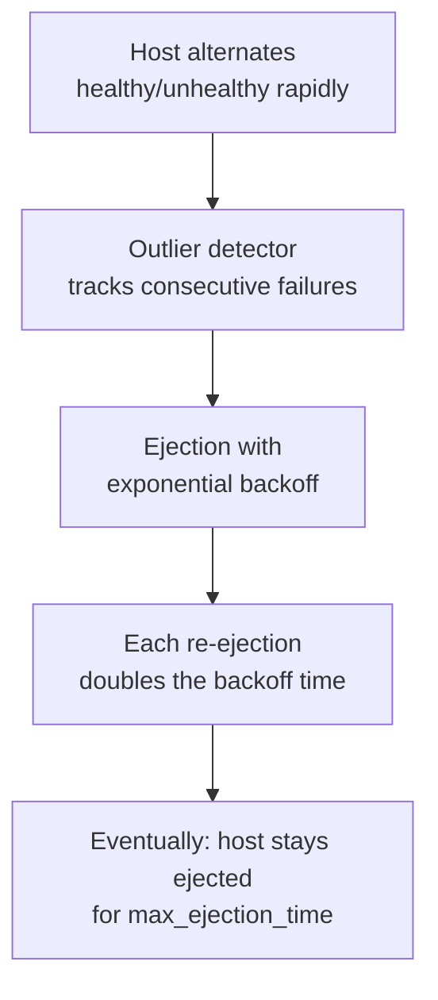
