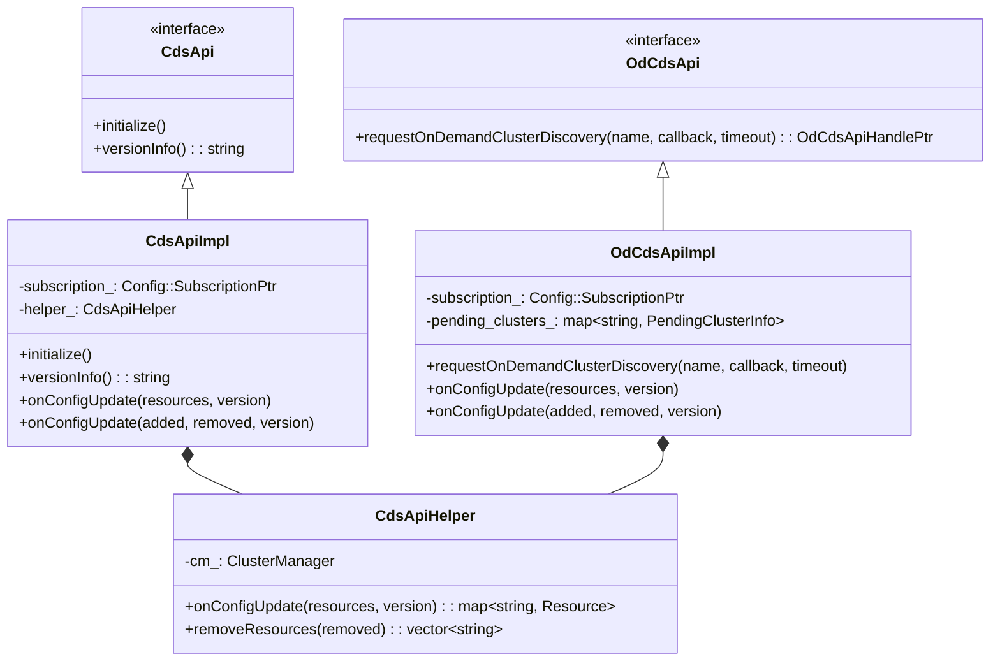
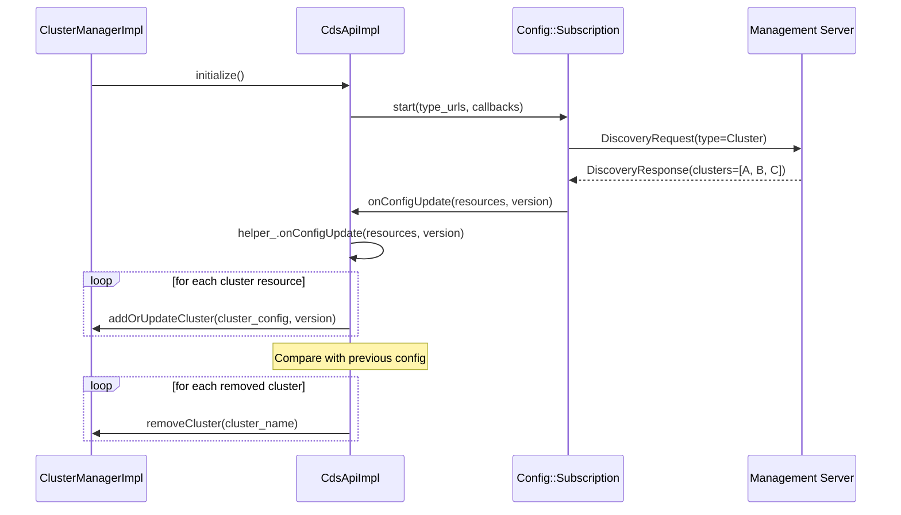
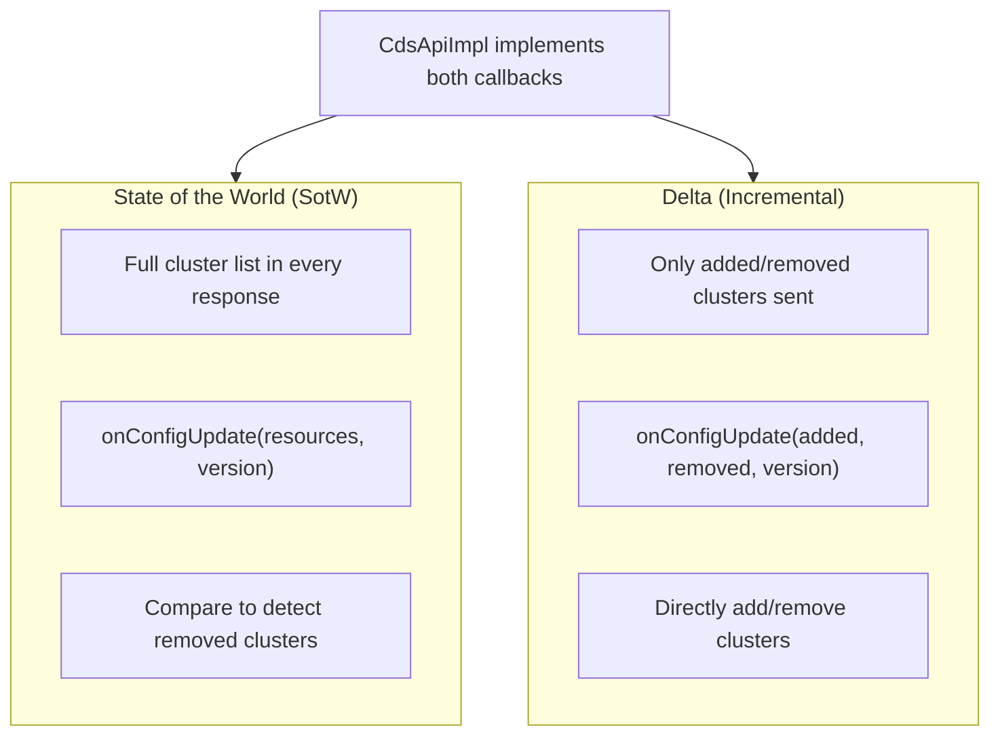
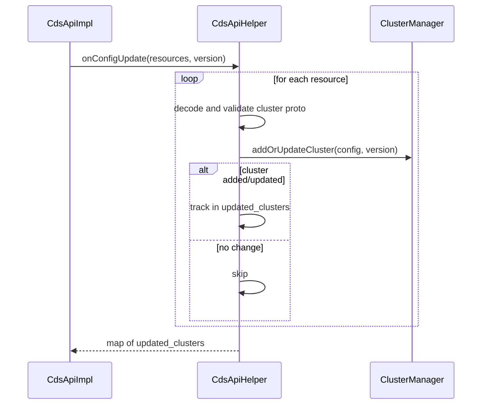
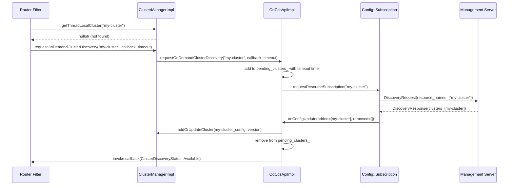
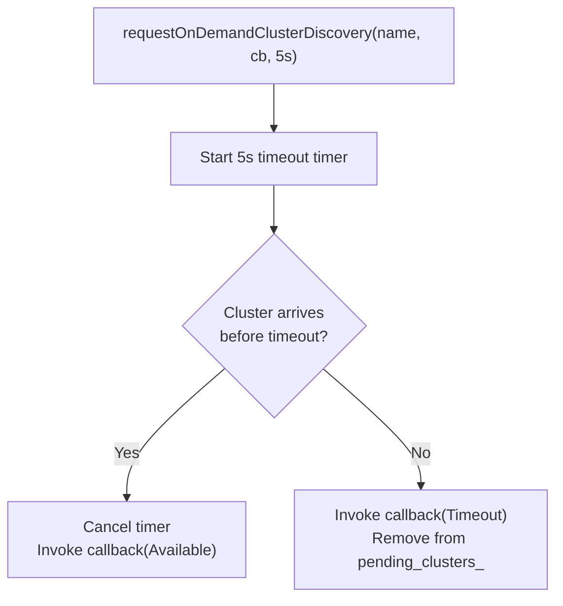
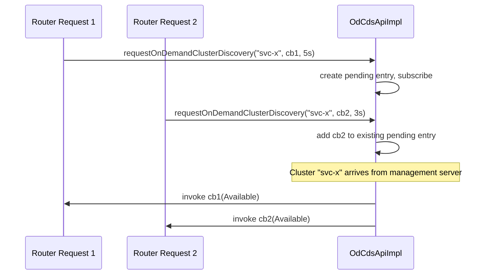
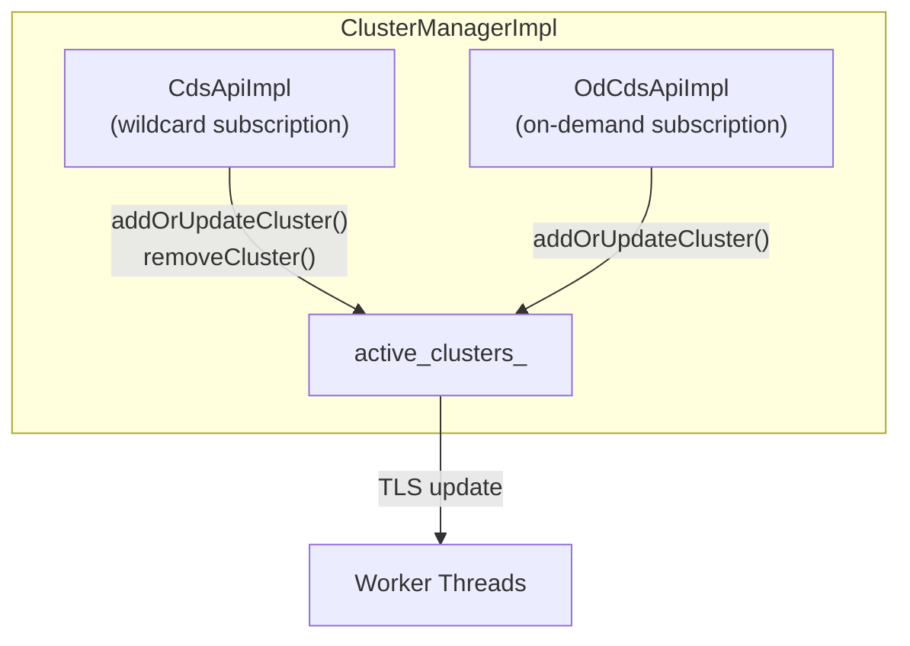

# CDS and On-Demand CDS

**Files:** `cds_api_impl.h/.cc`, `cds_api_helper.h/.cc`, `od_cds_api_impl.h/.cc`  
**Namespace:** `Envoy::Upstream`

## Overview

Cluster Discovery Service (CDS) and On-Demand CDS (OD-CDS) enable dynamic cluster configuration. CDS subscribes to a management server and receives cluster configs, while OD-CDS fetches clusters lazily when requested by the data path.

## Class Hierarchy



## CDS — Full Cluster Discovery

### Subscription Flow



### SotW vs Delta



## CDS Helper — Config Application

`CdsApiHelper` encapsulates the logic for applying CDS updates to the ClusterManager:



## OD-CDS — On-Demand Cluster Discovery

OD-CDS enables lazy loading of clusters: a cluster is fetched only when the data path needs it (e.g., a route references a cluster that doesn't exist yet).

### Request Flow



### Timeout Handling



### Multiple Waiters

When multiple requests ask for the same cluster simultaneously:



## OdCdsApiHandle — Cancellation

```mermaid
classDiagram
    class OdCdsApiHandle {
        <<interface>>
    }

    class OdCdsApiHandleImpl {
        -od_cds_api_: OdCdsApiImpl
        -cluster_name_: string
        ~OdCdsApiHandleImpl()
    }

    OdCdsApiHandle <|-- OdCdsApiHandleImpl
    Note for OdCdsApiHandleImpl "Destructor cancels the pending\nrequest if cluster not yet resolved"
```

## Integration with ClusterManager


