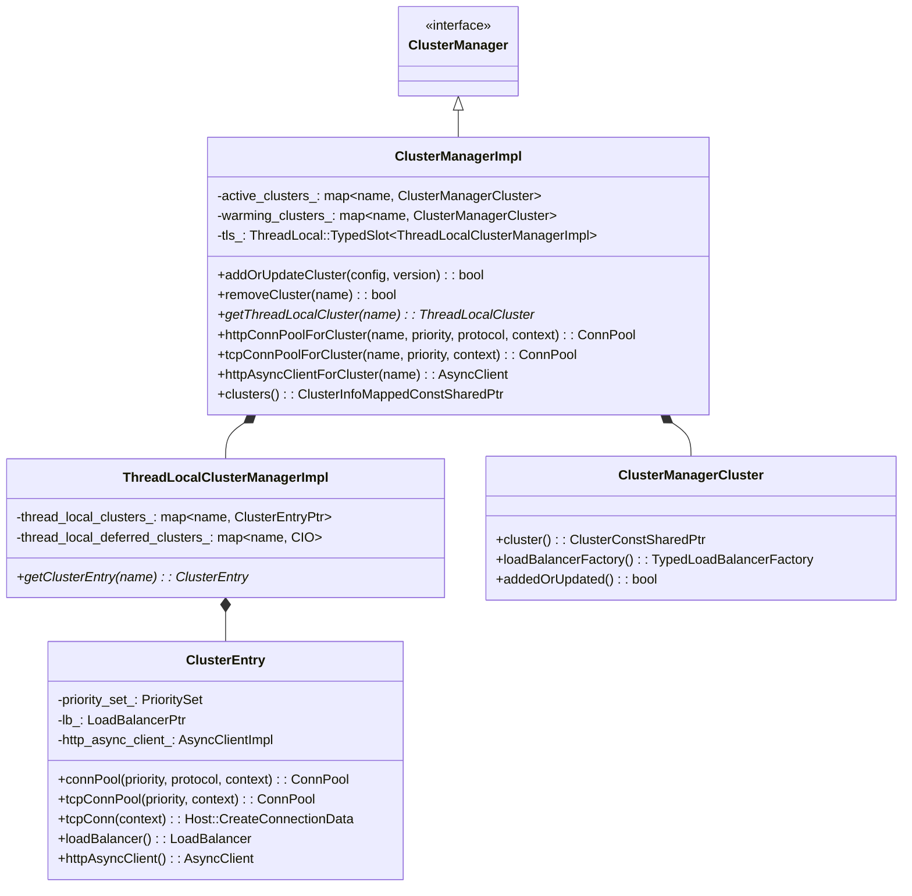
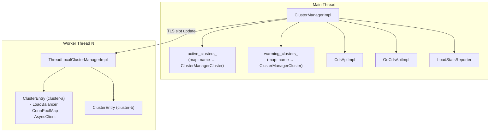
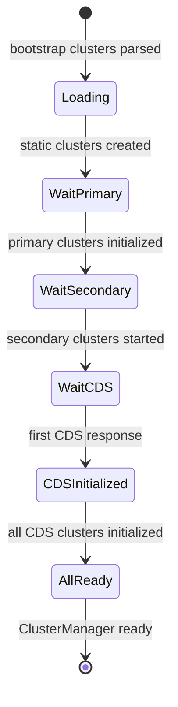
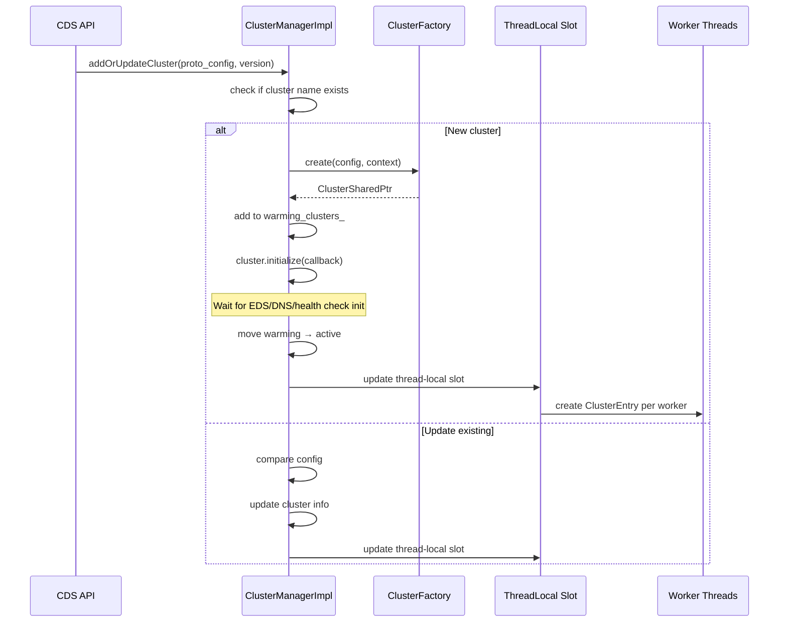
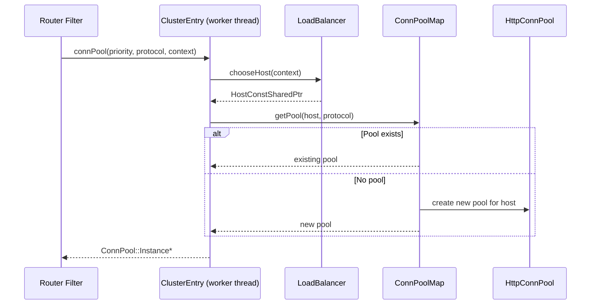
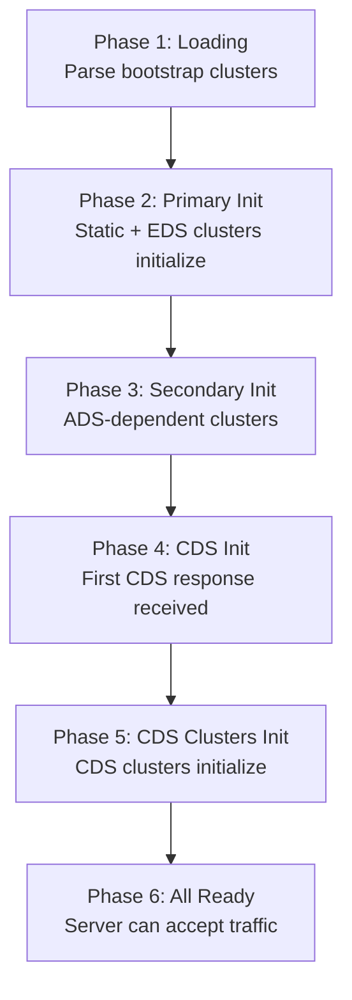
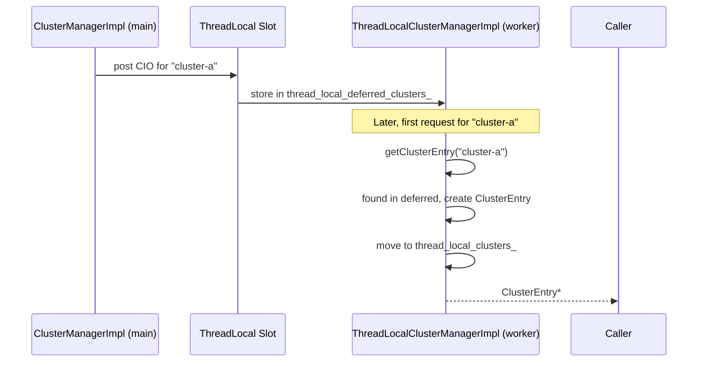
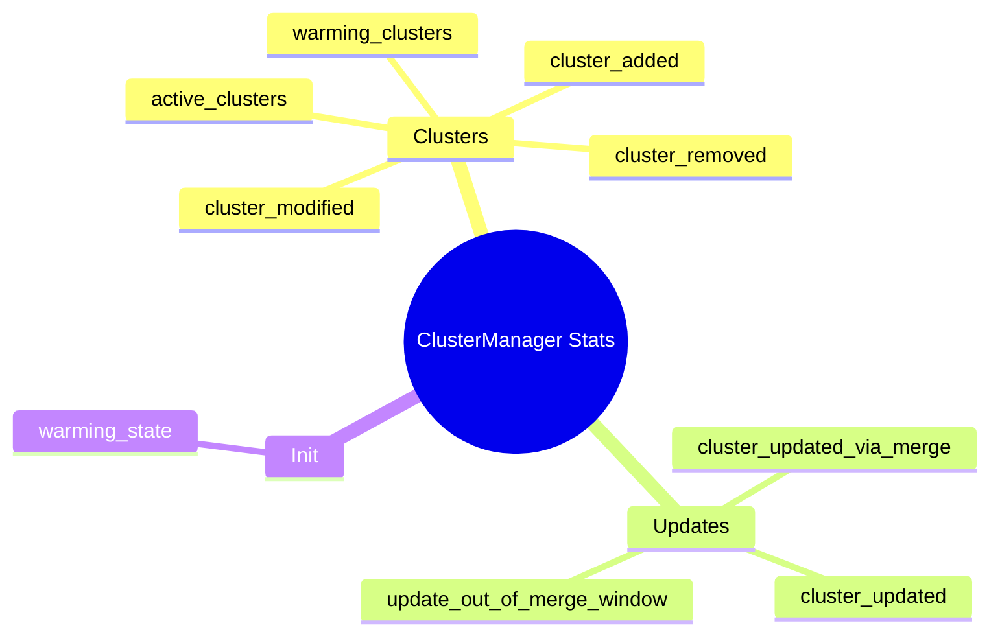

# ClusterManagerImpl

**Files:** `source/common/upstream/cluster_manager_impl.h` / `.cc`  
**Size:** ~47 KB header, ~112 KB implementation  
**Namespace:** `Envoy::Upstream`

## Overview

`ClusterManagerImpl` is the **central hub** for all upstream cluster management in Envoy. Running on the main thread, it owns the authoritative cluster list, coordinates CDS/OD-CDS subscriptions, dispatches cluster state to worker threads via thread-local slots, and manages connection pool lifecycle.

## Class Hierarchy

## Main Thread vs Worker Thread

## Initialization Phases

## Add/Update Cluster Flow

## Connection Pool Access

## `ClusterManagerInitHelper`

Coordinates multi-phase initialization at startup:

## Deferred Cluster Instantiation

Worker threads lazily create `ClusterEntry` objects. When a cluster is added, only a lightweight `ClusterInitializationObject` (CIO) is dispatched; the full `ClusterEntry` (with LB, conn pools) is created on first access:

## Stats

