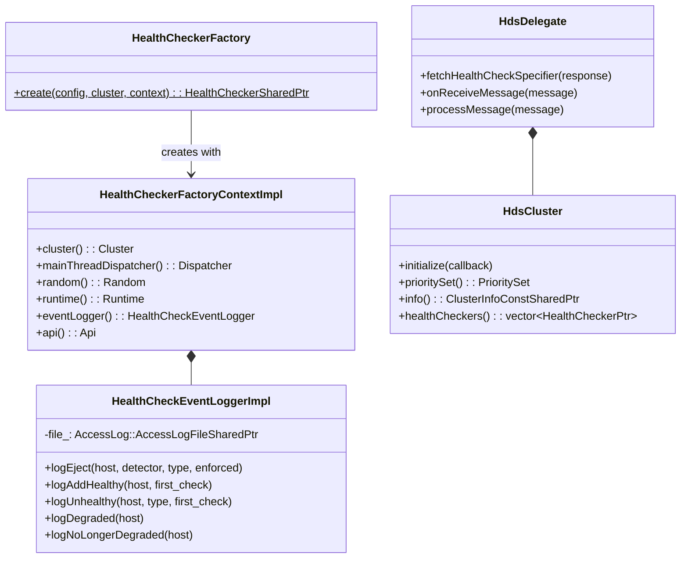
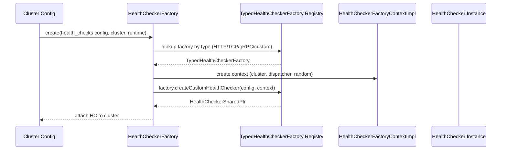
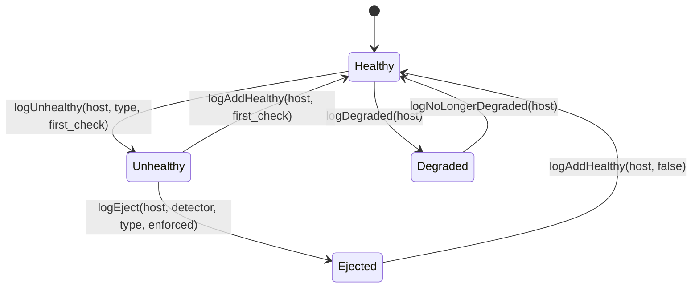
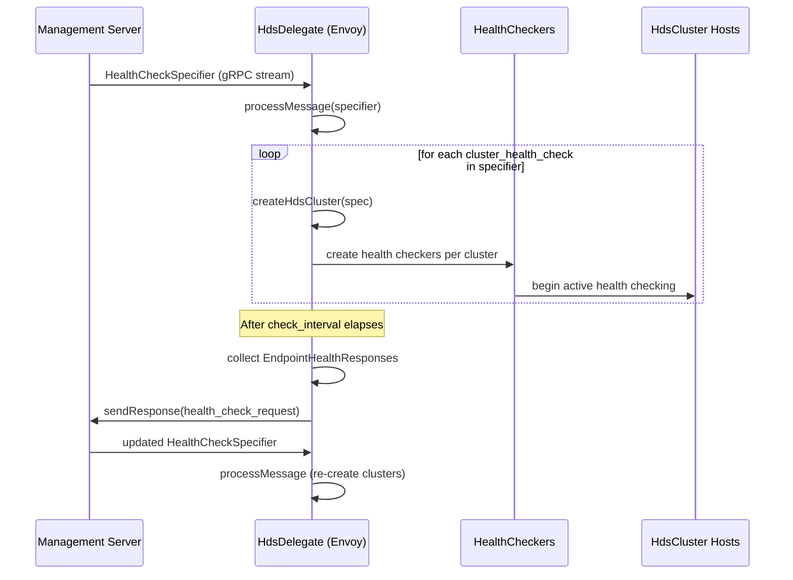
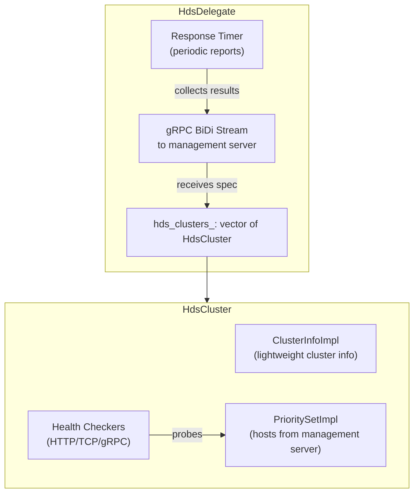
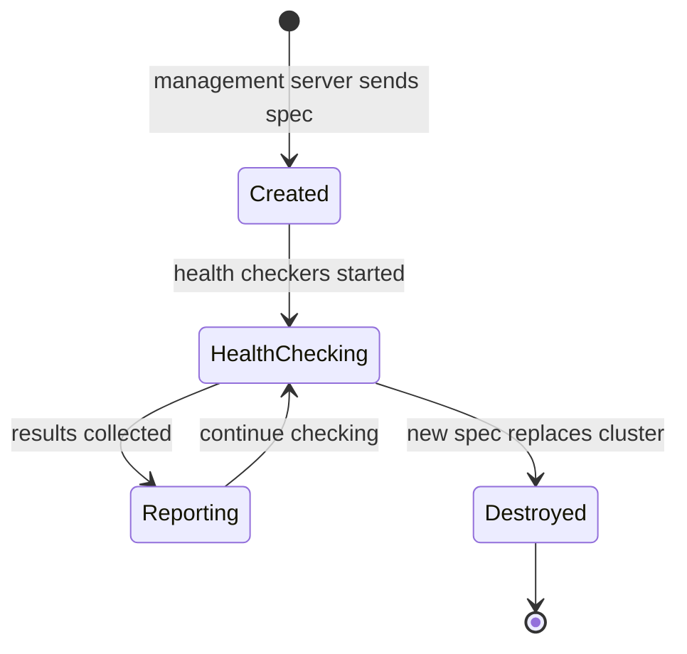
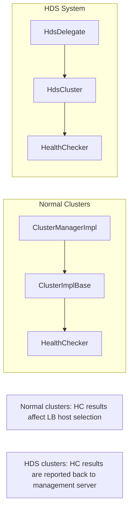

# Health Checking — HC Factory, HDS, Event Logging

**Files:** `source/common/upstream/health_checker_impl.h/.cc`, `health_checker_event_logger.h/.cc`, `health_discovery_service.h/.cc`  
**Namespace:** `Envoy::Upstream`

## Overview

Envoy's health checking system enables active probing of upstream hosts. The subsystem in `source/common/upstream` provides:
1. **HealthCheckerFactory** — creates health checker instances from proto config
2. **HealthCheckerFactoryContextImpl** — context for health checker creation
3. **HealthCheckEventLoggerImpl** — structured event logging for health check transitions
4. **HdsDelegate** — Health Discovery Service client (receives health check specs from management server)
5. **HdsCluster** — special cluster implementation for HDS-managed endpoints

## Class Hierarchy

## Health Checker Creation Flow

## Health Check Event Logging

### Event Log Fields

| Field | Description |
|-------|-------------|
| `health_checker_type` | HTTP, TCP, gRPC, or custom |
| `host` | Address of the host |
| `cluster_name` | Name of the cluster |
| `eject_unhealthy_event` | Details of unhealthy ejection |
| `add_healthy_event` | Details of return to healthy |
| `health_check_failure_event` | Details of HC failure |
| `degraded_healthy_host` | Host moved to degraded |
| `no_longer_degraded_host` | Host no longer degraded |
| `timestamp` | Time of event |

## Health Discovery Service (HDS)

HDS allows a management server to instruct Envoy to health-check arbitrary endpoints and report results back:

## HDS Components

## HDS Cluster Lifecycle

## Integration with Cluster System

