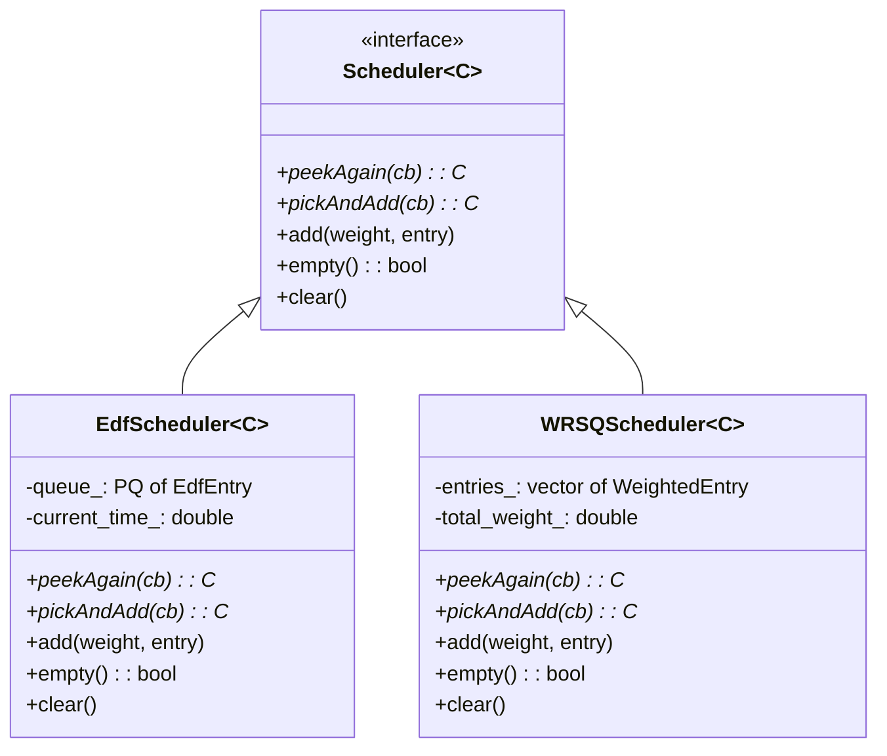
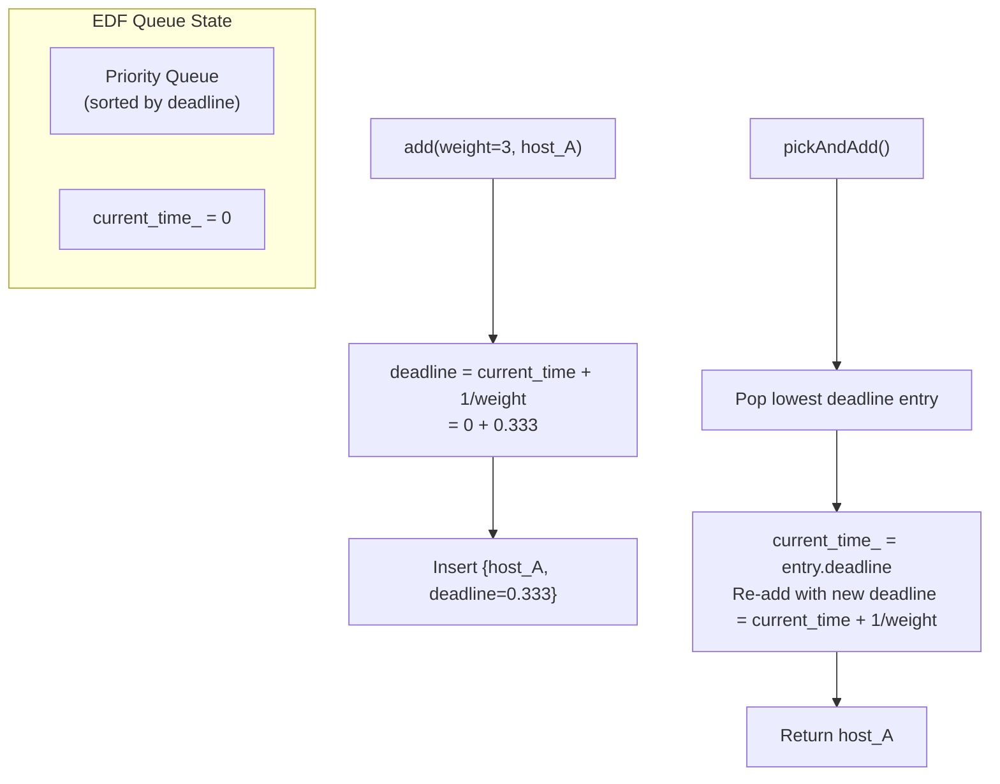
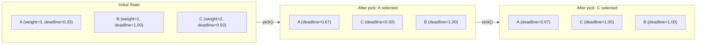
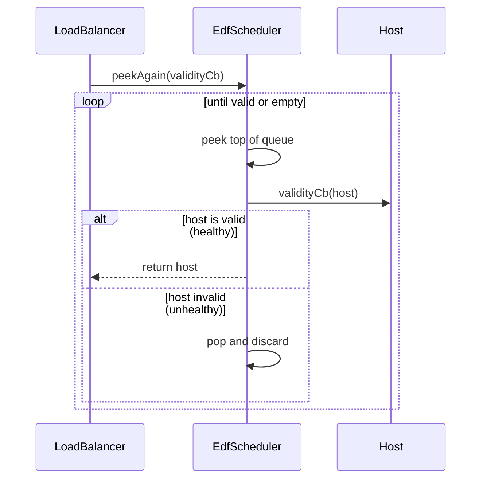
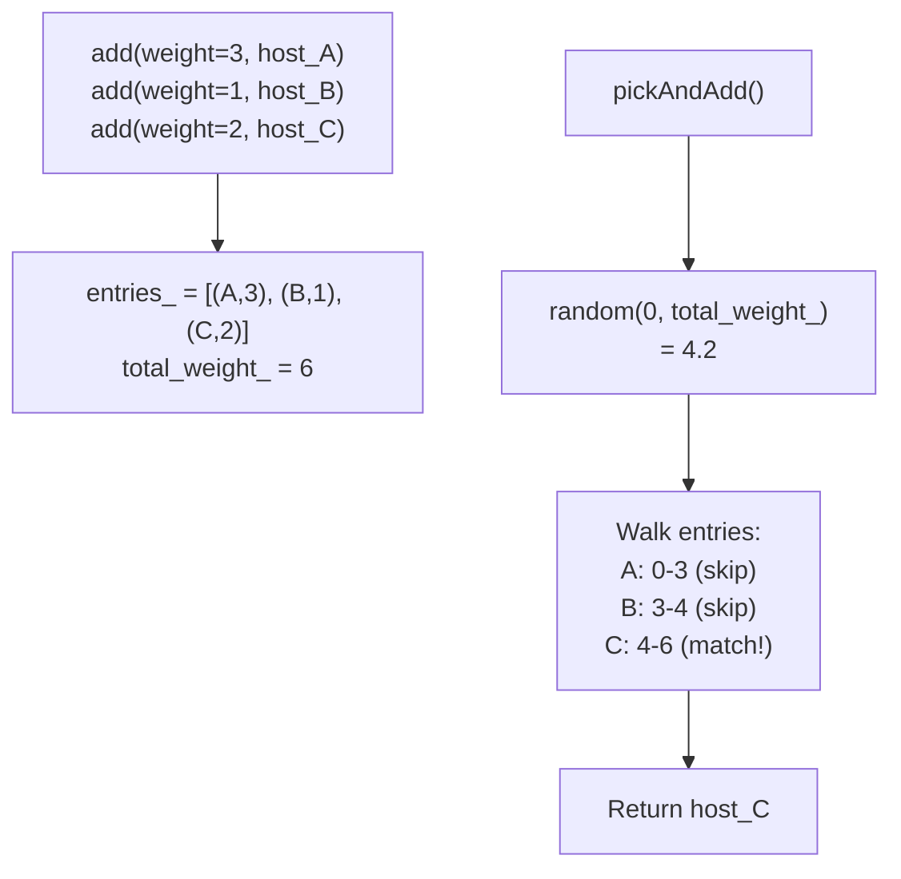
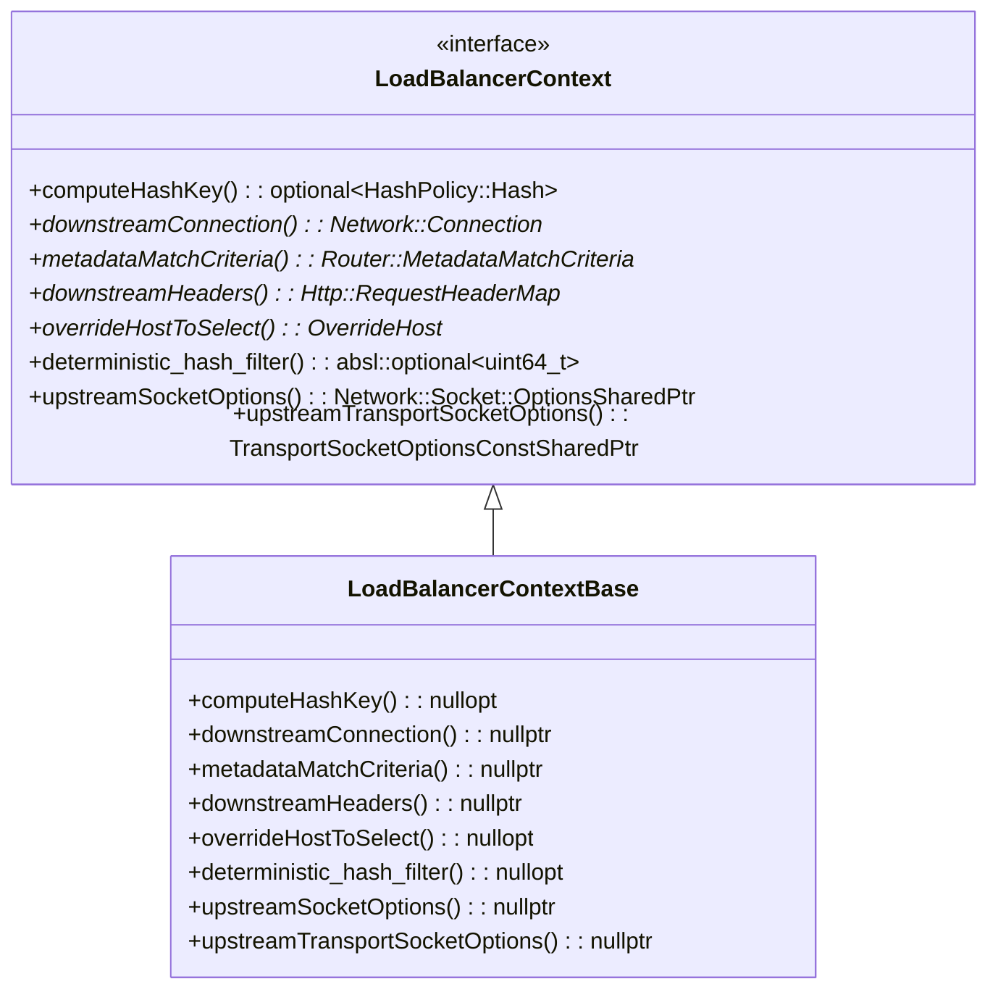
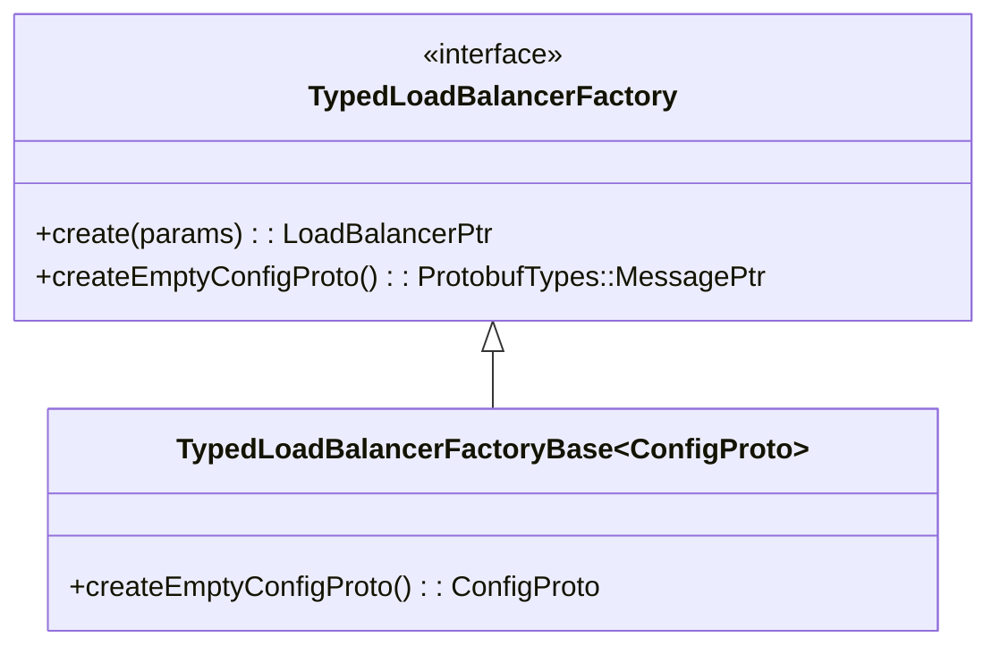
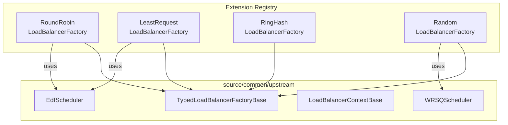

# Load Balancing Infrastructure

**Files:** `edf_scheduler.h`, `wrsq_scheduler.h`, `load_balancer_context_base.h`, `load_balancer_factory_base.h`  
**Namespace:** `Envoy::Upstream`

## Overview

The upstream directory provides the **scheduling primitives** and **base classes** used by load balancing policies. The concrete LB algorithms (round-robin, least-request, ring hash, etc.) live in `source/extensions/load_balancing_policies/`, but they build on these foundations.

## Scheduler Class Hierarchy

## EDF Scheduler — Earliest Deadline First

Used by **weighted round-robin** and **least-request** load balancers. Provides deterministic, fair scheduling proportional to weights.

### How It Works

### EDF Scheduling Example

Over 6 picks with weights A=3, B=1, C=2: sequence is **A, C, A, B, C, A** — proportional to weights.

### `peekAgain` with Validity Check

## WRSQ Scheduler — Weighted Random Selection Queue

Used when **random selection proportional to weight** is needed (e.g., random LB, P2C least-request).

### How It Works

### Selection Probabilities

| Host | Weight | Probability |
|------|--------|-------------|
| A | 3 | 3/6 = 50% |
| B | 1 | 1/6 = 16.7% |
| C | 2 | 2/6 = 33.3% |

## LoadBalancerContextBase

Default implementation of `LoadBalancerContext` with no-op behavior:

## TypedLoadBalancerFactoryBase

Base class for typed LB factories registered via proto config:

## LB Policy Integration

