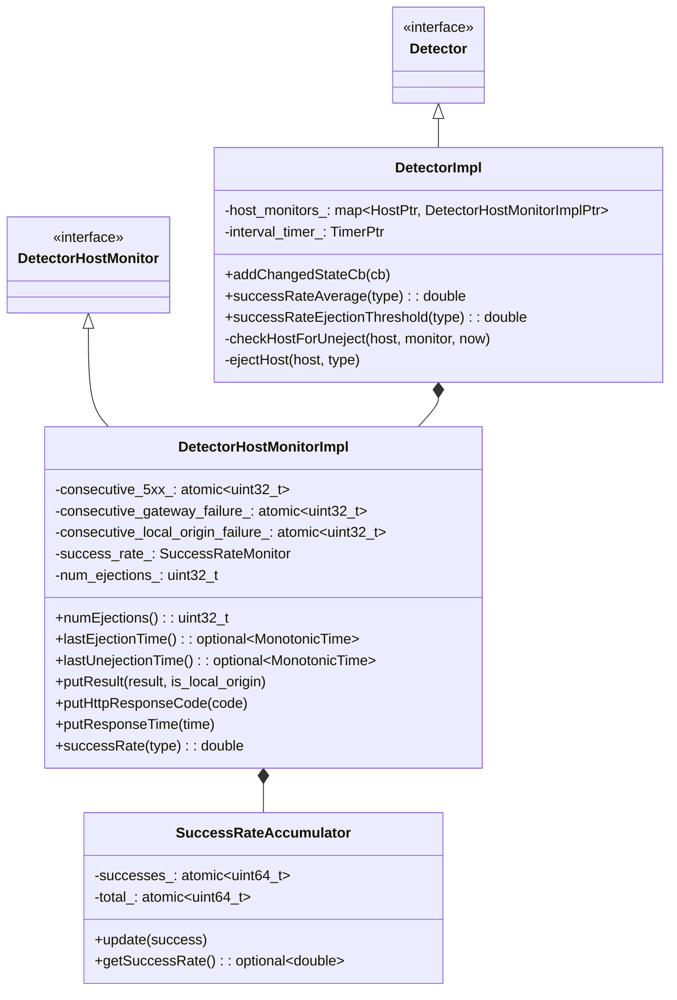
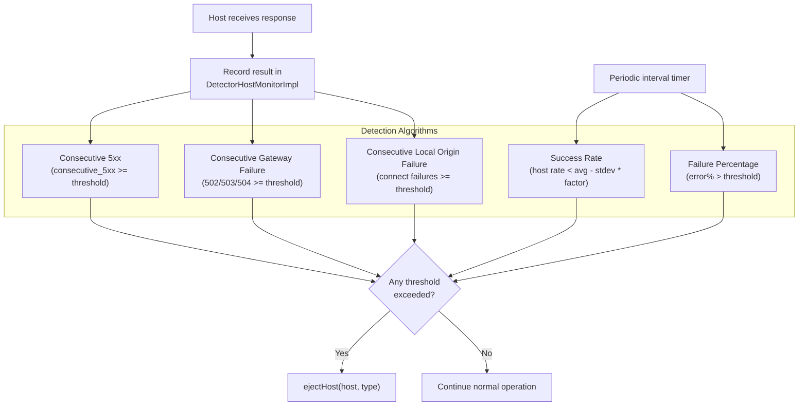
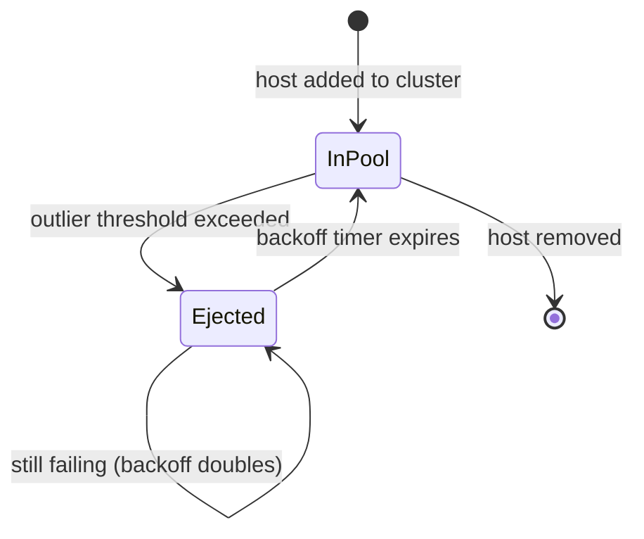
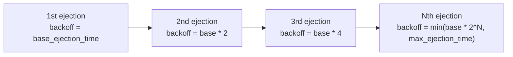
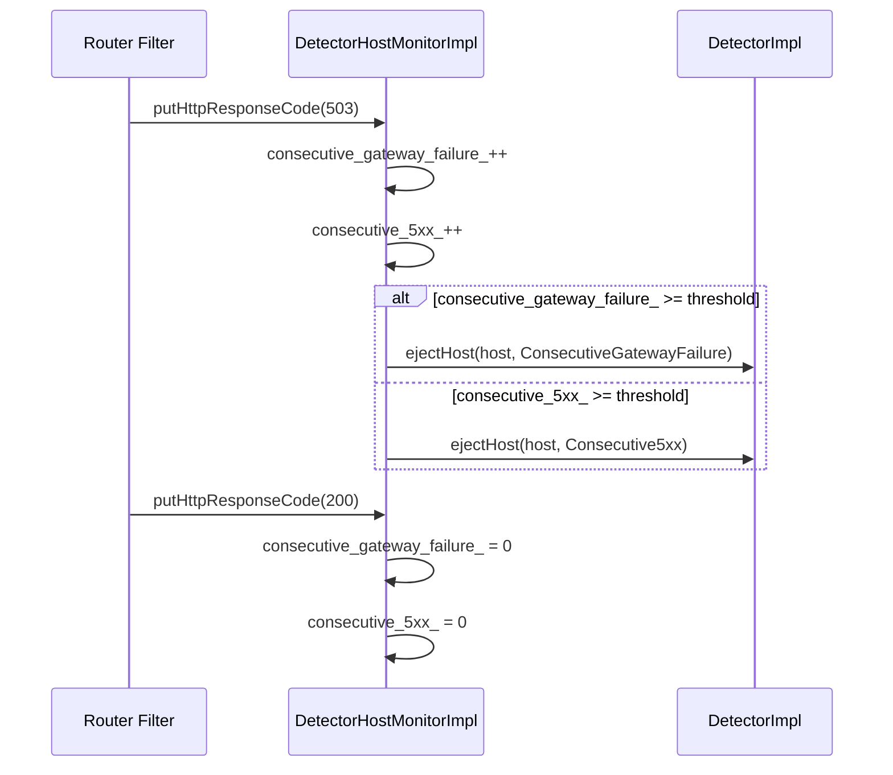
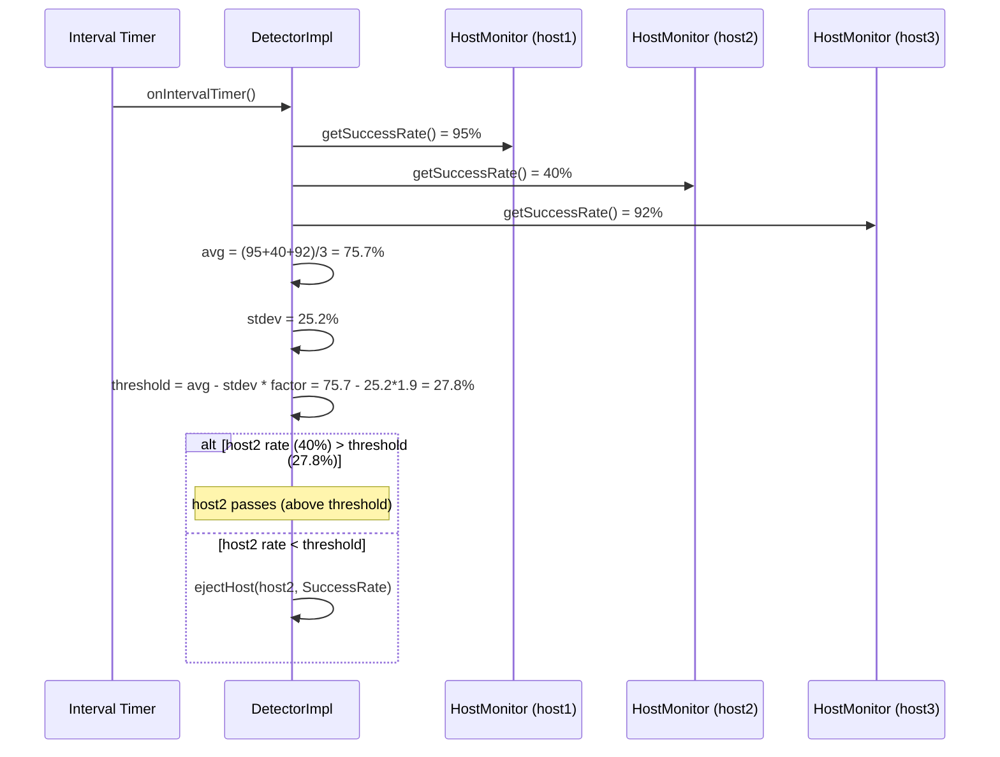
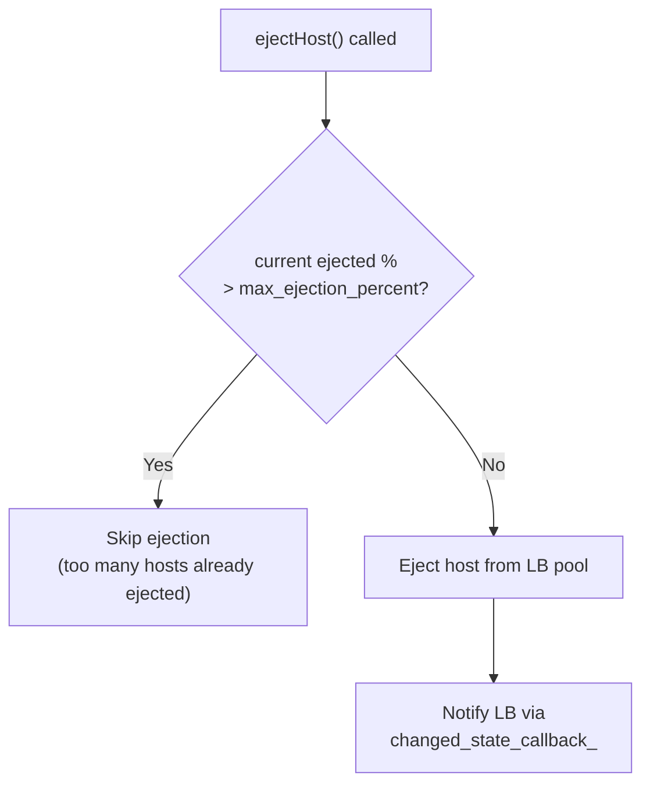

# Outlier Detection

**Files:** `source/common/upstream/outlier_detection_impl.h` / `.cc`  
**Size:** ~29 KB header, ~40 KB implementation  
**Namespace:** `Envoy::Upstream::Outlier`

## Overview

Outlier detection automatically ejects unhealthy hosts from the load balancing pool based on observed error rates. Envoy supports multiple detection algorithms: consecutive errors, success rate, and failure percentage. Ejected hosts are returned to the pool after a configurable exponential backoff.

## Class Hierarchy

## Ejection Algorithms

## Ejection / Unejection Lifecycle

### Exponential Backoff

## Consecutive Error Detection

## Success Rate Detection

Evaluated periodically (every `interval`), across all hosts:

## Max Ejection Percentage

A safety valve prevents ejecting too many hosts:

## Configuration Reference

| Config | Default | Purpose |
|--------|---------|---------|
| `consecutive_5xx` | 5 | Consecutive 5xx responses before ejection |
| `consecutive_gateway_failure` | 5 | Consecutive 502/503/504 before ejection |
| `consecutive_local_origin_failure` | 5 | Consecutive connect failures before ejection |
| `interval` | 10s | Evaluation interval for success rate/failure percentage |
| `base_ejection_time` | 30s | Base ejection duration (multiplied by ejection count) |
| `max_ejection_percent` | 10% | Maximum % of hosts that can be ejected |
| `success_rate_minimum_hosts` | 5 | Min hosts for success rate calculation |
| `success_rate_request_volume` | 100 | Min requests for success rate calculation |
| `success_rate_stdev_factor` | 1900 (1.9x) | Stdev multiplier for success rate threshold |
| `failure_percentage_threshold` | 85 | Failure % above which host is ejected |
| `failure_percentage_minimum_hosts` | 5 | Min hosts for failure percentage calculation |
| `max_ejection_time` | 300s | Maximum ejection duration cap |
