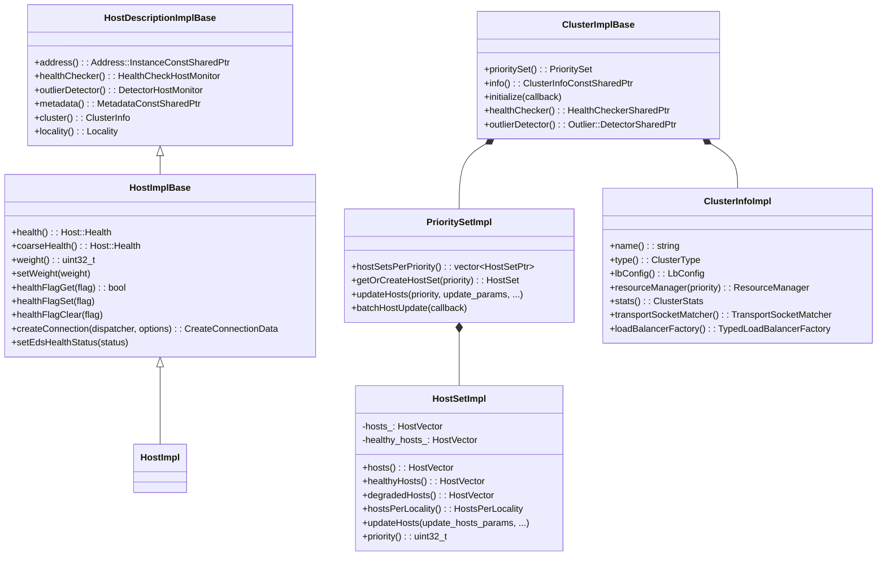
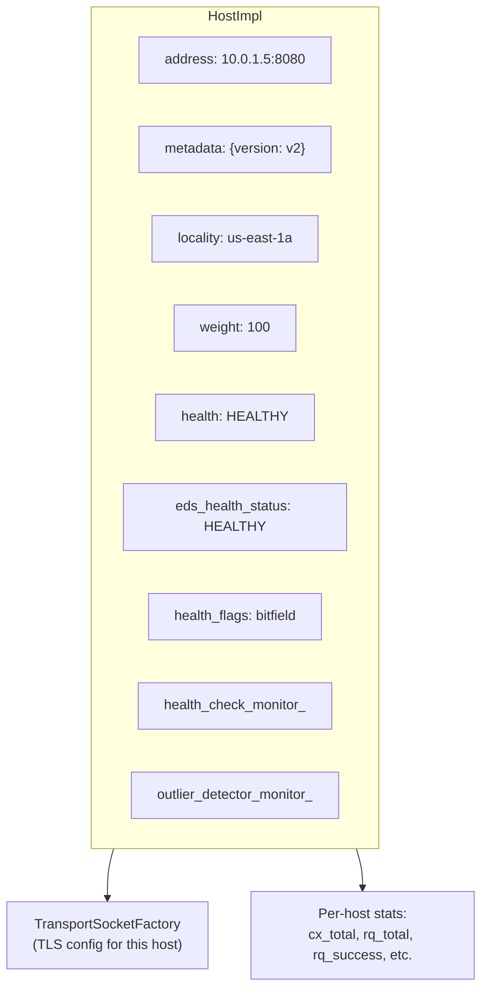
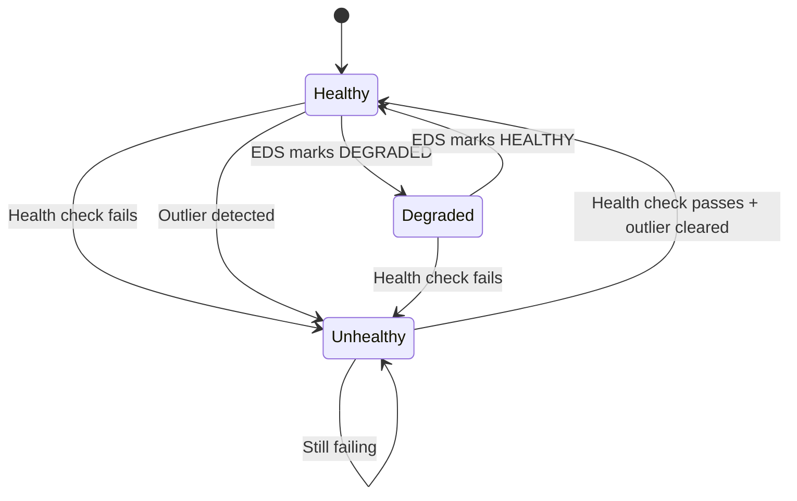
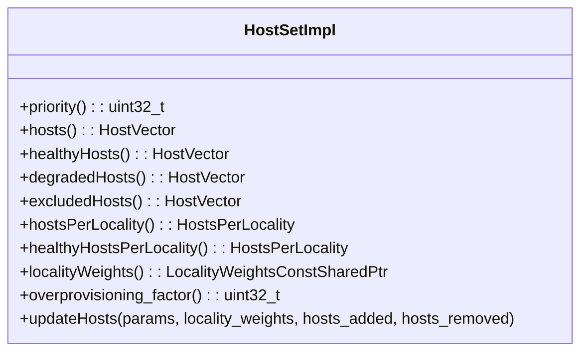
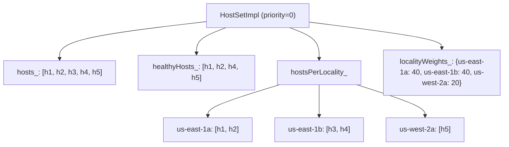
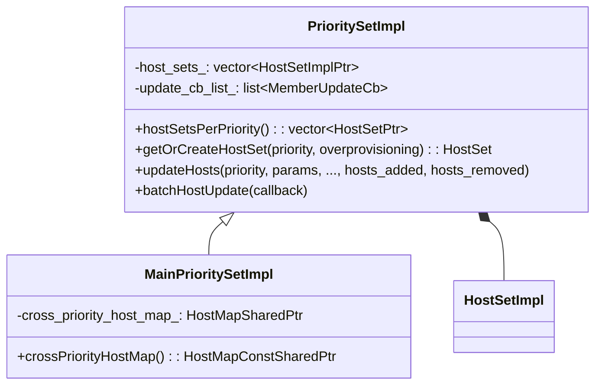
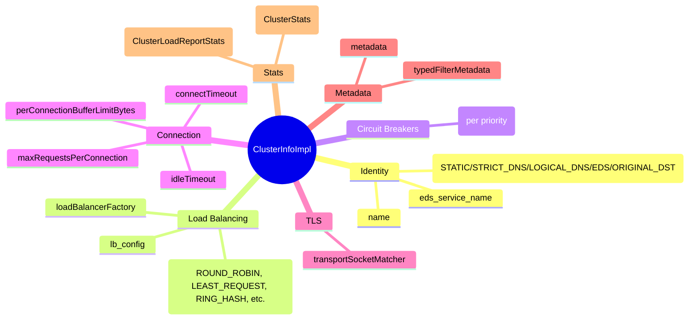
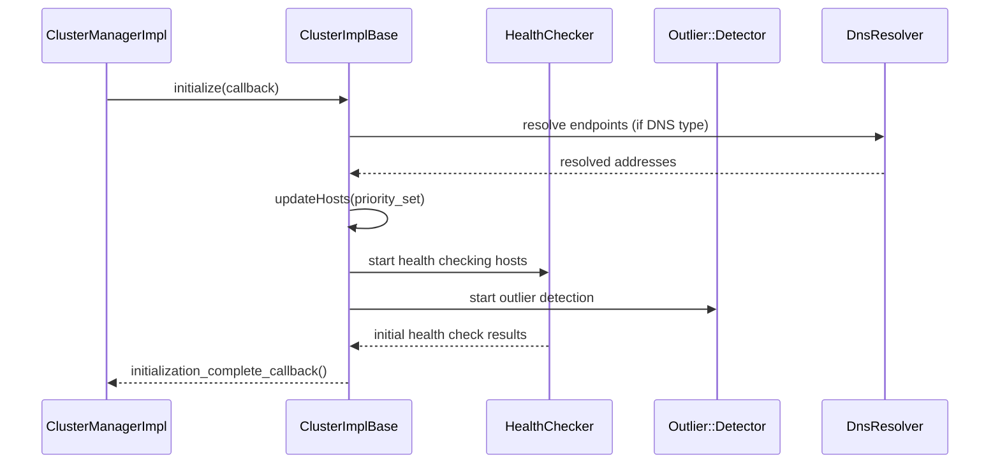
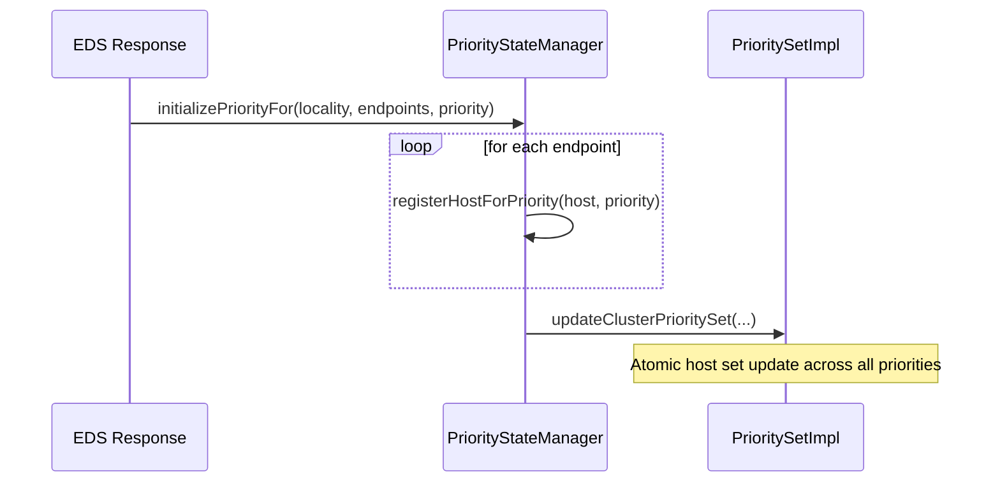
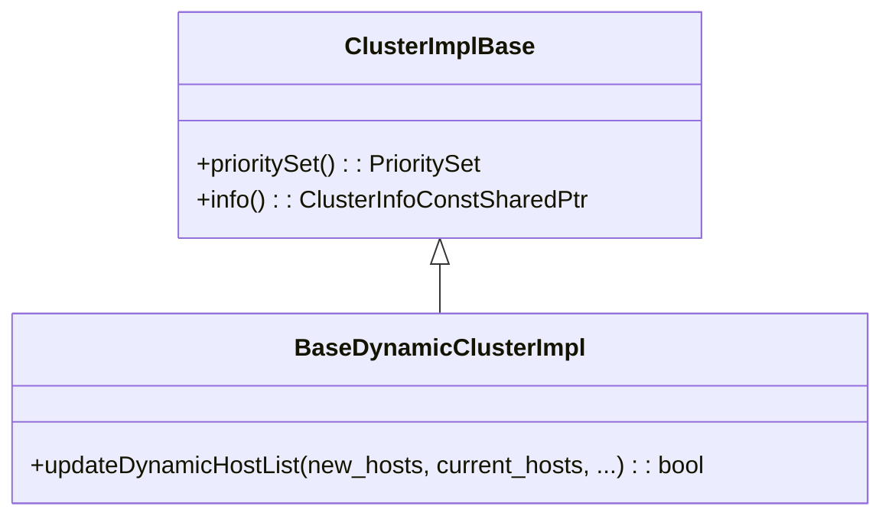

# Upstream Implementation — Hosts, Clusters, Priority Sets

**Files:** `source/common/upstream/upstream_impl.h` / `.cc`  
**Size:** ~60 KB header, ~121 KB implementation  
**Namespace:** `Envoy::Upstream`

## Overview

`upstream_impl.h` contains the core upstream data model: hosts, host sets, priority sets, cluster info, and cluster base implementations. This is the largest file in the upstream directory and defines how Envoy represents upstream endpoints and clusters.

## Class Hierarchy



## Host Data Model



## Host Health Model



### Health Flags

| Flag | Set By | Meaning |
|------|--------|---------|
| `FAILED_ACTIVE_HC` | Health checker | Active health check failed |
| `FAILED_OUTLIER_CHECK` | Outlier detector | Ejected by outlier detection |
| `FAILED_EDS_HEALTH` | EDS | EDS reports unhealthy |
| `DEGRADED_ACTIVE_HC` | Health checker | Active HC reports degraded |
| `DEGRADED_EDS_HEALTH` | EDS | EDS reports degraded |
| `PENDING_DYNAMIC_REMOVAL` | Cluster manager | Host scheduled for removal |
| `PENDING_ACTIVE_HC` | Health checker | Awaiting first health check |
| `EXCLUDED_VIA_IMMEDIATE_HC_FAIL` | Health checker | Immediate HC fail config |

## HostSet — Per Priority



### Locality-Aware Host Organization



## PrioritySet — Multi-Priority



### Priority Levels

```
PrioritySetImpl
  ├── host_sets_[0] = HostSetImpl (priority 0 — default/primary)
  ├── host_sets_[1] = HostSetImpl (priority 1 — secondary)
  └── host_sets_[2] = HostSetImpl (priority 2 — tertiary)
```

## ClusterInfoImpl — Cluster Metadata



## ClusterImplBase — Cluster Lifecycle



## `PriorityStateManager` — Batch Host Updates

Used during EDS updates to build new host sets before atomically applying them:



## `BaseDynamicClusterImpl`

Extension of `ClusterImplBase` for clusters whose hosts change dynamically (EDS, DNS):


