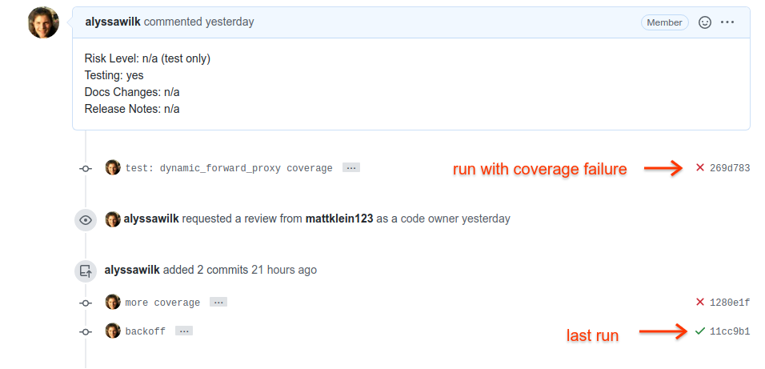
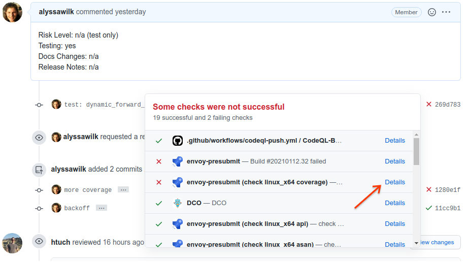
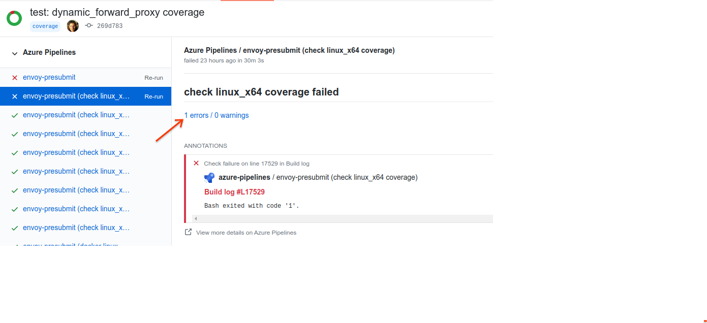
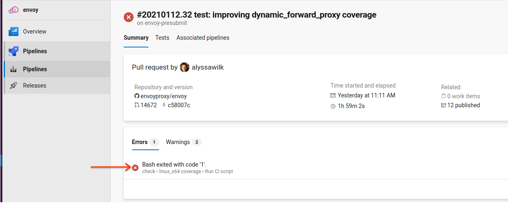
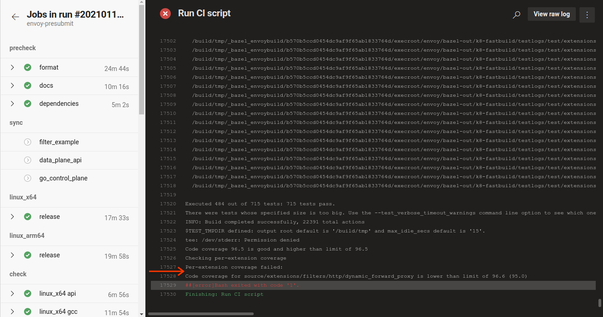
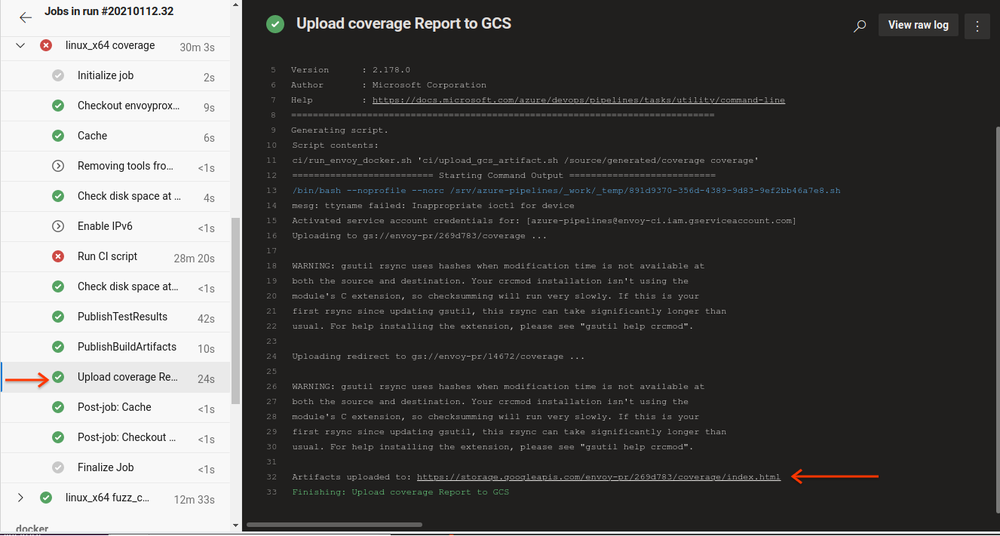
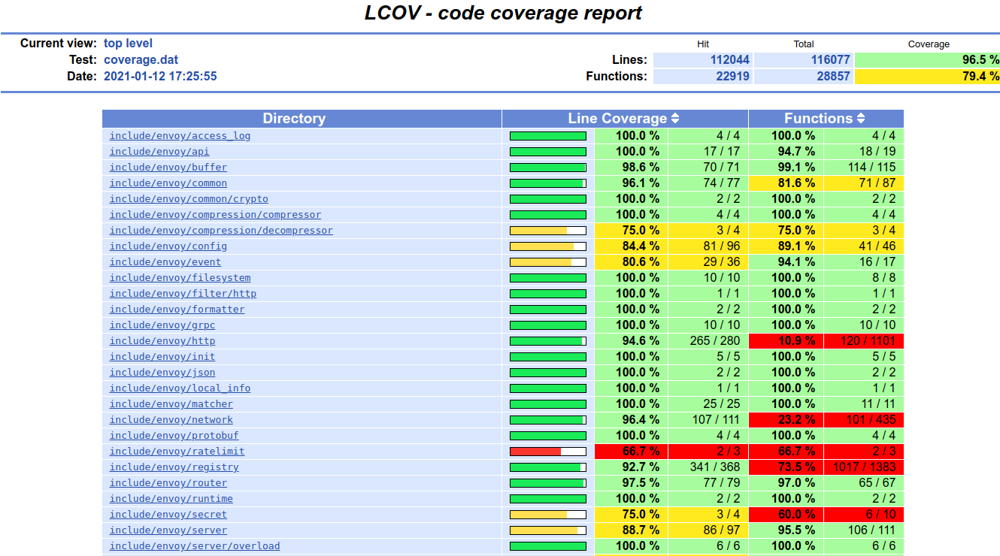
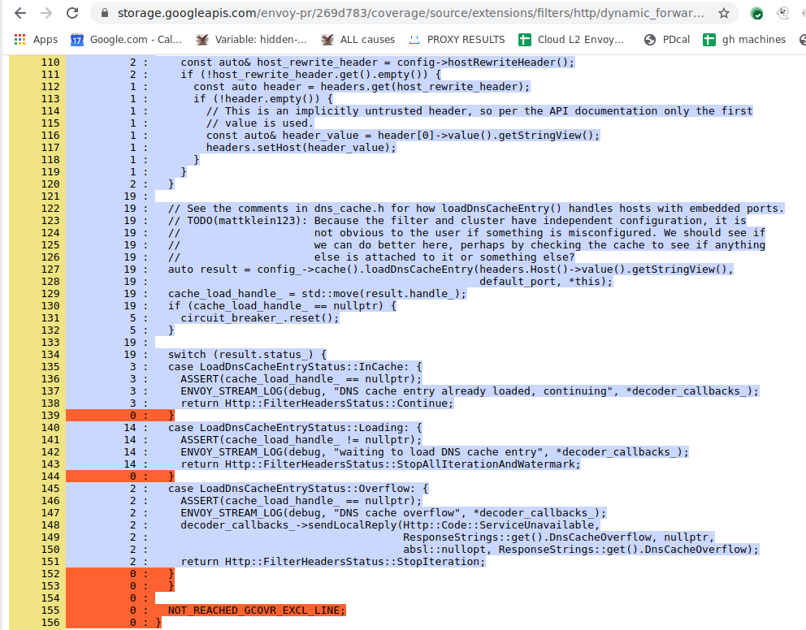

### How can I tell if my new code is covered by tests?

In a PR run, for example https://github.com/envoyproxy/envoy/pull/14672

Click on the check mark or X for the CI results you want to look at. Generally
this will be the last run, but for this example we’ll pick an earlier, failed
run.

Next, click on the “Details” link on the coverage run. If the run was a success
you may need to scroll down to see the coverage build.

Next up, click on the warnings/errors link. For a successful coverage run, this will list zero errors/warnings but will still be clickable

On the azure results page, again click through to see results.

In this case the error reason was clear, and the directory missing coverage is listed. To get an understanding of what lines aren’t covered, you can browse further.

Scroll down on the left, and click on “Upload coverage reports”
This will provide a link on the right, telling you where the coverage
upload went, in this case a link to
“https://storage.googleapis.com/envoy-pr/269d783/coverage/index.html” (which
will only be valid for some number of days).

Clicking on the link provides a full color-annotated coverage report

You can browse this report to the directory in question. In this particular
case the coverage issue was actually a coverage bug, where trailing braces in
tested switch statements are considered uncovered lines. Generally this will
instead provide a branch of code which simply needs unit tests.

