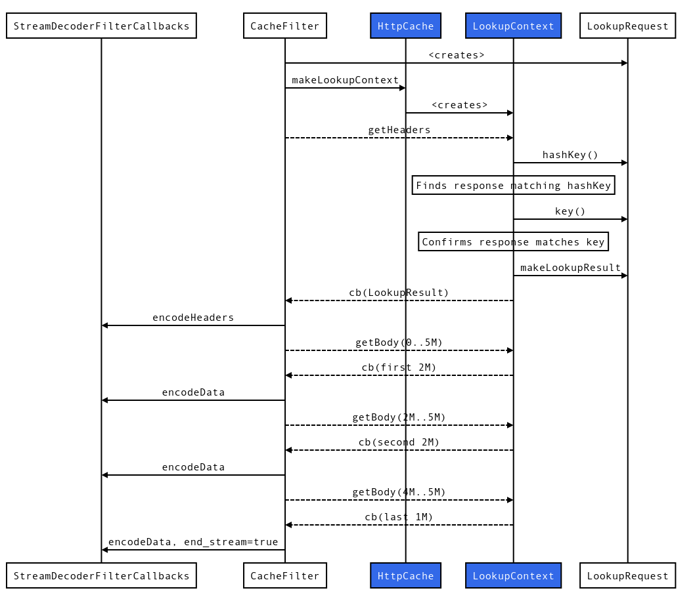

### Overview

The HTTP Cache Filter handles most of the complexity of HTTP caching semantics,
but delegates the actual storage of HTTP responses to implementations of the
HttpCache interface. These implementations can cover all points on the spectrum
of persistence, performance, and distribution, from local RAM caches to globally
distributed persistent caches. They can be fully custom caches, or
wrappers/adapters around local or remote open-source or proprietary caches.

If you write a new cache storage implementation, please add it to the Envoy
repository if possible. This is the only way to make sure it stays up-to-date
with Envoy changes, and lets other developers contribute fixes and improvements.

As you read this, also read the example implementation in `simple_http_cache.h/.cc`.

You need to write implementations of four small interfaces:

## HttpCache
 * Example Implementation: `SimpleHttpCache`
 * `HttpCache` represents an actual cache of responses stored somewhere. It provides methods to set up cache lookups and inserts, and to update the headers of cached responses.

## HttpCacheFactory
 * Example Implementation: `SimpleHttpCacheFactory`
 * `HttpCacheFactory` does what it sounds like: it creates HttpCache implementations, based on a name that came from the cache filter's config.

## LookupContext
 * Example Implementation: `SimpleLookupContext`
 * `LookupContext` represents a single lookup operation; this is a good place to store whatever per-lookup state you may need during the lookup process. 

## InsertContext
 * Example Implementation: `SimpleInsertContext`
 * `LookupContext` represents a single insert operation; this is a good place to store whatever per-insert state you may need during the lookup process. 

### Flow

To initiate a lookup on an HttpCache implementation, the cache filter calls
`HttpCache::makeLookupContext`, which should return a `LookupContextPtr`. The cache filter will
call `LookupContext::getHeaders` to find out if there's a cached response. If
a result is found, the `LookupContext` implementation must call
`LookupRequest::makeLookupResult`, and pass the result to the callback.

The cache filter will then make a series of `getBody` requests followed by `getTrailers` (if needed).

If the `LookupResult` in the callback indicates that a response wasn't found, the cache filter will let the request pass upstream. If the origin replies with a cacheable response, the filter will call `HttpCache::makeInsertContext`, and use its methods to insert the response.

The following diagram shows a potential GET request for a 5M resource that is present and fresh in the cache, with no trailers. In the case of a synchronous in-memory cache, this all happens within `CacheFilter::decodeHeaders`. Solid arrows denote synchronous function calls, while dashed arrows denote asynchronous function calls or their callbacks. Objects that are part of the cache implementation (`HttpCache` and `LookupContext`) are blue. (Other objects are part of the cache filter, or of Envoy.

