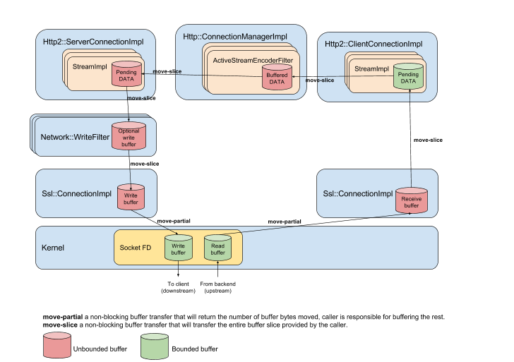

### Overview

Flow control in Envoy is done by having limits on each buffer, and watermark callbacks.  When a
buffer contains more data than the configured limit, the high watermark callback will fire, kicking
off a chain of events which eventually informs the data source to stop sending data.  This back-off
may be immediate (stop reading from a socket) or gradual (stop HTTP/2 window updates) so all
buffer limits in Envoy are considered soft limits.  When the buffer eventually drains (generally to
half of of the high watermark to avoid thrashing back and forth) the low watermark callback will
fire, informing the sender it can resume sending data.

### TCP implementation details

Flow control for TCP and TCP-with-TLS-termination are handled by coordination
between the `Network::ConnectionImpl` write buffer, and the `Network::TcpProxy`
filter.

The downstream flow control goes as follows.

 * The downstream `Network::ConnectionImpl::write_buffer_` buffers too much
   data.  It calls
   `Network::ConnectionCallbacks::onAboveWriteBufferHighWatermark()`.
 * The `Network::TcpProxy::DownstreamCallbacks` receives
   `onAboveWriteBufferHighWatermark()` and calls `readDisable(true)` on the upstream
   connection.
 * When the downstream buffer is drained, it calls
   `Network::ConnectionCallbacks::onBelowWriteBufferLowWatermark()`
 * The `Network::TcpProxy::DownstreamCallbacks` receives
   `onBelowWriteBufferLowWatermark()` and calls `readDisable(false)` on the upstream
   connection.

Flow control for the upstream path is much the same.

 * The upstream `Network::ConnectionImpl::write_buffer_` buffers too much
   data.  It calls
   `Network::ConnectionCallbacks::onAboveWriteBufferHighWatermark()`.
 * The Network::TcpProxy::UpstreamCallbacks receives
   `onAboveWriteBufferHighWatermark()` and calls `readDisable(true)` on the downstream
   connection.
 * When the upstream buffer is drained, it calls
   `Network::ConnectionCallbacks::onBelowWriteBufferLowWatermark()`
 * The `Network::TcpProxy::UpstreamCallbacks` receives
   `onBelowWriteBufferLowWatermark()` and calls `readDisable(false)` on the downstream
   connection.

### HTTP2 implementation details

Because the various buffers in the HTTP/2 stack are fairly complicated, each path from a buffer
going over the watermark limit to disabling data from the data source is documented separately.

For HTTP/2, when filters, streams, or connections back up, the end result is `readDisable(true)`
being called on the source stream.  This results in the stream ceasing to consume window, and so
not sending further flow control window updates to the peer.  This will result in the peer
eventually stopping sending data when the available window is consumed (or nghttp2 closing the
connection if the peer violates the flow control limit) and so limiting the amount of data Envoy
will buffer for each stream.  When `readDisable(false)` is called, any outstanding unconsumed data
is immediately consumed, which results in resuming window updates to the peer and the resumption of
data.

Note that `readDisable(true)` on a stream may be called by multiple entities.  It is called when any
filter buffers too much, when the stream backs up and has too much data buffered, or the
connection has too much data buffered.  Because of this, `readDisable()` maintains a count of
the number of times it has been called to both enable and disable the stream,  resuming reads when
each caller has called the equivalent low watermark callback.  For example, if
the TCP window upstream fills up and results in the network buffer backing up,
all the streams associated with that connection will `readDisable(true)` their
downstream data sources.   When the HTTP/2 flow control window fills up an
individual stream may use all of the window available and call a second
`readDisable(true)` on its downstream data source.  When the upstream TCP socket drains,
the connection will go below its low watermark and each stream will call
`readDisable(false)` to resume the flow of data.   The stream which had both a
network level block and a H2 flow control block will still not be fully enabled.
Once the upstream peer sends window updates, the stream buffer will drain and
the second `readDisable(false)` will be called on the downstream data source,
which will finally result in data flowing from downstream again.

The two main parties involved in flow control are the router filter (`Envoy::Router::Filter`) and
the connection manager (`Envoy::Http::ConnectionManagerImpl`).  The router is
responsible for intercepting watermark events for its own buffers, the individual upstream streams
(if codec buffers fill up) and the upstream connection (if the network buffer fills up).  It passes
any events to the connection manager, which has the ability to call `readDisable()` to enable and
disable further data from downstream.  On the reverse path, when the downstream connection
backs up, the connection manager collects events for the downstream streams and
the downstream conection.  It passes events to the router filter via
`Envoy::Http::DownstreamWatermarkCallbacks` and the router can then call `readDisable()` on the
upstream stream.

## HTTP/2 codec recv buffer

Given the HTTP/2 `Envoy::Http::Http2::ConnectionImpl::StreamImpl::pending_recv_data_` is processed immediately
there's no real need for buffer limits, but for consistency and to future-proof the implementation,
it is a WatermarkBuffer.   The high watermark path goes as follows:

 * When `pending_recv_data_` has too much data it calls
 `ConnectionImpl::StreamImpl::pendingRecvBufferHighWatermark()`.
 * `pendingRecvBufferHighWatermark` calls `readDisable(true)` on the stream.

The low watermark path is similar

 * When `pending_recv_data_` is drained, it calls
 `ConnectionImpl::StreamImpl::pendingRecvBufferLowWatermark`.
 * `pendingRecvBufferLowWatermarkwhich` calls `readDisable(false)` on the stream.

## HTTP/1 and HTTP/2 filters

Each HTTP and HTTP/2 filter gets a call of `StreamFilterBase::setBufferLimit()` on creation.  If the
limit is non-zero, the buffers are responsible for enforcing buffer limits.

# Decoder filters

Decoder filters buffering more than the buffer limit should call
`onDecoderFilterAboveWriteBufferHighWatermark` if they are streaming filters, i.e. filters which can
process more bytes as the underlying buffer is drained.   This causes the
downstream stream to be readDisabled and the flow of downstream data to be
halted.  The filter is then responsible for calling `onDecoderFilterBelowWriteBufferLowWatermark`
when the buffer is drained to resume the flow of data.

Decoder filters which must buffer the full response should respond with a 413 (Payload Too Large)
when encountering a response body too large to buffer.

The decoder high watermark path for streaming filters is as follows:

 * When an instance of `Envoy::Router::StreamDecoderFilter` buffers too much data it should call
   `StreamDecoderFilterCallback::onDecoderFilterAboveWriteBufferHighWatermark()`.
 * When `Envoy::Http::ConnectionManagerImpl::ActiveStreamDecoderFilter` receives
 `onDecoderFilterAboveWriteBufferHighWatermark()` it calls `readDisable(true)` on the downstream
 stream to pause data.

And the low watermark path:

 * When the buffer of the `Envoy::Router::StreamDecoderFilter` drains should call
   `StreamDecoderFilterCallback::onDecoderFilterBelowWriteBufferLowWatermark()`.
 * When `Envoy::Http::ConnectionManagerImpl` receives
 `onDecoderFilterAboveWriteBufferHighWatermark()` it calls `readDisable(false)` on the downstream
 stream to pause data.

# Encoder filters

Encoder filters buffering more than the buffer limit should call
`onEncoderFilterAboveWriteBufferHighWatermark` if they are streaming filters, i.e. filters which can
process more bytes as the underlying buffer is drained.   The high watermark
call will be passed from the `Envoy::Http::ConnectionManagerImpl` to the `Envoy::Router::Filter`
which will `readDisable(true)` to stop the flow of upstream data.  Streaming filters which
call `onEncoderFilterAboveWriteBufferHighWatermark` should call
`onEncoderFilterBelowWriteBufferLowWatermark` when the underlying buffer drains.

Filters which must buffer a full request body before processing further, should respond with a
500 (Server Error) if encountering a request body which is larger than the buffer limits.

The encoder high watermark path for streaming filters is as follows:

 * When an instance of `Envoy::Router::StreamEncoderFilter` buffers too much data it should call
   `StreamEncoderFilterCallback::onEncodeFilterAboveWriteBufferHighWatermark()`.
 * When `Envoy::Http::ConnectionManagerImpl::ActiveStreamEncoderFilter` receives
 `onEncoderFilterAboveWriteBufferHighWatermark()` it calls
 `ConnectionManagerImpl::ActiveStream::callHighWatermarkCallbacks()`
 * `callHighWatermarkCallbacks()` then in turn calls
    `DownstreamWatermarkCallbacks::onAboveWriteBufferHighWatermark()` for all
    filters which registered to receive watermark events
 * `Envoy::Router::Filter` receives `onAboveWriteBufferHighWatermark()` and calls
   `readDisable(false)` on the upstream request.

The encoder low watermark path for streaming filters is as follows:

 * When an instance of `Envoy::Router::StreamEncoderFilter` buffers too much data it should call
   `StreamEncoderFilterCallback::onEncodeFilterBelowWriteBufferLowWatermark()`.
 * When `Envoy::Http::ConnectionManagerImpl::ActiveStreamEncoderFilter` receives
 `onEncoderFilterBelowWriteBufferLowWatermark()` it calls
 `ConnectionManagerImpl::ActiveStream::callLowWatermarkCallbacks()`
 * `callLowWatermarkCallbacks()` then in turn calls
    `DownstreamWatermarkCallbacks::onBelowWriteBufferLowWatermark()` for all
    filters which registered to receive watermark events
 * `Envoy::Router::Filter` receives `onBelowWriteBufferLowWatermark()` and calls
   `readDisable(true)` on the upstream request.

# HTTP/2 codec upstream send buffer

The upstream send buffer `Envoy::Http::Http2::ConnectionImpl::StreamImpl::pending_send_data_` is
H2 stream data destined for an Envoy backend.   Data is added to this buffer after each filter in
the chain is done processing, and it backs up if there is insufficient connection or stream window
to send the data.  The high watermark path goes as follows:

 * When `pending_send_data_` has too much data it calls
   `ConnectionImpl::StreamImpl::pendingSendBufferHighWatermark()`.
 * `pendingSendBufferHighWatermark()` calls `StreamCallbackHelper::runHighWatermarkCallbacks()`
 * `runHighWatermarkCallbacks()` results in all subscribers of `Envoy::Http::StreamCallbacks`
 receiving an `onAboveWriteBufferHighWatermark()` callback.
 * When `Envoy::Router::Filter` receives `onAboveWriteBufferHighWatermark()` it
   calls `StreamDecoderFilterCallback::onDecoderFilterAboveWriteBufferHighWatermark()`.
 * When `Envoy::Http::ConnectionManagerImpl` receives
 `onDecoderFilterAboveWriteBufferHighWatermark()` it calls `readDisable(true)` on the downstream
 stream to pause data.

For the low watermark path:

 * When `pending_send_data_` drains it calls
   `ConnectionImpl::StreamImpl::pendingSendBufferLowWatermark()`
 * `pendingSendBufferLowWatermark()` calls `StreamCallbackHelper::runLowWatermarkCallbacks()`
 * `runLowWatermarkCallbacks()` results in all subscribers of `Envoy::Http::StreamCallbacks`
 receiving a `onBelowWriteBufferLowWatermark()` callback.
 * When `Envoy::Router::Filter` receives `onBelowWriteBufferLowWatermark()` it
   calls `StreamDecoderFilterCallback::onDecoderFilterBelowWriteBufferLowWatermark()`.
 * When `Envoy::Http::ConnectionManagerImpl` receives `onDecoderFilterBelowWriteBufferLowWatermark()`
   it calls `readDisable(false)` on the downstream stream to resume data.

# HTTP/2 network upstream network buffer

The upstream network buffer is HTTP/2 data for all streams destined for the
Envoy backend.   If the network buffer fills up, all streams associated with the
underlying TCP connection will be informed of the back-up, and the data sources
(HTTP/2 streams or HTTP connections) feeding into those streams will be
readDisabled.

The high watermark path is as follows:

 * When `Envoy::Network::ConnectionImpl::write_buffer_` has too much data it calls
   `Network::ConnectionCallbacks::onAboveWriteBufferHighWatermark()`.
 * When `Envoy::Http::CodecClient` receives `onAboveWriteBufferHighWatermark()` it
   calls `onUnderlyingConnectionAboveWriteBufferHighWatermark()` on `codec_`.
 * When `Envoy::Http::Http2::ConnectionImpl` receives `onAboveWriteBufferHighWatermark()` it calls
   `runHighWatermarkCallbacks()` for each stream of the connection.
 * `runHighWatermarkCallbacks()` results in all subscribers of `Envoy::Http::StreamCallback`
 receiving an `onAboveWriteBufferHighWatermark()` callback.
 * When `Envoy::Router::Filter` receives `onAboveWriteBufferHighWatermark()` it
   calls `StreamDecoderFilterCallback::onDecoderFilterAboveWriteBufferHighWatermark()`.
 * When `Envoy::Http::ConnectionManagerImpl` receives
 `onDecoderFilterAboveWriteBufferHighWatermark()` it calls `readDisable(true)` on the downstream
 stream to pause data.

The low watermark path is as follows:

 * When `Envoy::Network::ConnectionImpl::write_buffer_` is drained it calls
   `Network::ConnectionCallbacks::onBelowWriteBufferLowWatermark()`.
 * When `Envoy::Http::CodecClient` receives `onBelowWriteBufferLowWatermark()` it
   calls `onUnderlyingConnectionBelowWriteBufferLowWatermark()` on `codec_`.
 * When `Envoy::Http::Http2::ConnectionImpl` receives `onBelowWriteBufferLowWatermark()` it calls
   `runLowWatermarkCallbacks()` for each stream of the connection.
 * `runLowWatermarkCallbacks()` results in all subscribers of `Envoy::Http::StreamCallback`
 receiving a `onBelowWriteBufferLowWatermark()` callback.
 * When `Envoy::Router::Filter` receives `onBelowWriteBufferLowWatermark()` it
   calls `StreamDecoderFilterCallback::onDecoderFilterBelowWriteBufferLowWatermark()`.
 * When `Envoy::Http::ConnectionManagerImpl` receives `onDecoderFilterBelowWriteBufferLowWatermark()`
   it calls `readDisable(false)` on the downstream stream to resume data.

# HTTP/2 codec downstream send buffer

On filter creation, all filters have the opportunity to subscribe to downstream
watermark events sent by the connection manager, and the router filter takes
advantage of this.  When a particular downstream stream gets backed up, the router filter
gets notified and can then `readDisable()` the upstream data source.  The high
watermark path is as follows:

 * When `ConnectionImpl::StreamImpl::pending_send_data_` has too much data, it calls
   `ConnectionImpl::StreamImpl::pendingSendBufferHighWatermark()`
 * `pendingSendBufferHighWatermark()` calls `StreamCallbackHelper::runHighWatermarkCallbacks()`
 * `runHighWatermarkCallbacks()` results in all subscribers of `Envoy::Http::StreamCallbacks`
   receiving an `onAboveWriteBufferHighWatermark()` callback.  Currently,
   ConnectionManagerImpl::ActiveStream is the only subscriber.
 * `ConnectionManagerImpl::ActiveStream::onAboveWriteBufferHighWatermark()` calls
   `ConnectionManagerImpl::ActiveStream::callHighWatermarkCallbacks()`
 * `callHighWatermarkCallbacks()` then in turn calls
    `DownstreamWatermarkCallbacks::onAboveWriteBufferHighWatermark()` for all
    filters which registered to receive watermark events
 * `Envoy::Router::Filter` receives `onAboveWriteBufferHighWatermark()` and calls
   `readDisable(true)` on the upstream request.

The low watermark path is as follows:

 * When `ConnectionImpl::StreamImpl::pending_send_data_` drains, it calls
   `ConnectionImpl::StreamImpl::pendingSendBufferLowWatermark()`.
 * `pendingSendBufferLowWatermark()` calls `StreamCallbackHelper::runLowWatermarkCallbacks()`
 * `runLowWatermarkCallbacks()` results in all subscribers of `Envoy::Http::StreamCallbacks`
   receiving an `onBelowWriteBufferLowWatermark()` callback.
 * `ConnectionManagerImpl::ActiveStream::onBelowWriteBufferLowWatermark()` calls
   `ConnectionManagerImpl::ActiveStream::callLowWatermarkCallbacks()`
 * `callLowWatermarkCallbacks()` then in turn calls
    `DownstreamWatermarkCallbacks::onBelowWriteBufferLowWatermark()` for all
    filters which registered to receive watermark events.
 * `Envoy::Router::Filter` receives `onBelowWriteBufferLowWatermark()` and calls
   `readDisable(false)` on the upstream request.

# HTTP/2 network downstream network buffer

When a downstream network connection buffers too much data, it informs the
connection manager which passes theh high watermark event to all of the streams
on the connection.  They pass the watermark event to the router, which calls
`readDisable()` on the upstream streams. The high watermark path is as follows:

 * The downstream `Network::ConnectionImpl::write_buffer_` buffers too much
   data.  It calls
   `Network::ConnectionCallbacks::onAboveWriteBufferHighWatermark()`.
 * `Envoy::Http::Http2::ConnectionImpl::onAboveWriteBufferHighWatermark()`
   calls `ConnectionManagerImpl::ActiveStream::callHighWatermarkCallbacks()` on all
   `ActiveStreams` on the connection.
From this point on, the flow is the same as when the downstream codec buffer
goes over its high watermark.

The low watermark path is as follows:

 * The downstream `Network::ConnectionImpl::write_buffer_` drains.  It calls
   `Network::ConnectionCallbacks::onBelowWriteBufferLowWatermark()`.
 * `Envoy::Http::Http2::ConnectionImpl::onBelowWriteBufferLowWatermark()`
   calls `ConnectionManagerImpl::ActiveStream::callLowWatermarkCallbacks()` on all
   `ActiveStreams` on the connection.
From this point on, the flow is the same as when the downstream codec buffer
goes under its low watermark.

### HTTP implementation details

TODO(alyssawilk) implement and document.
