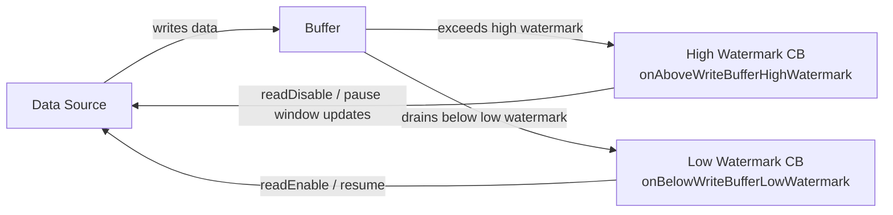
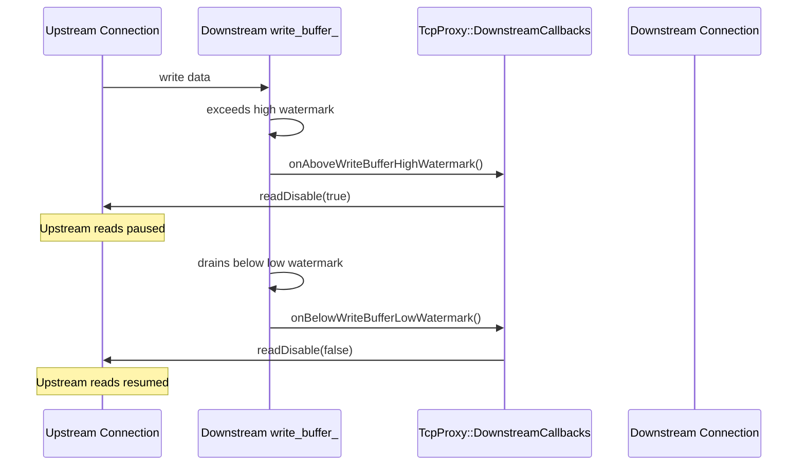
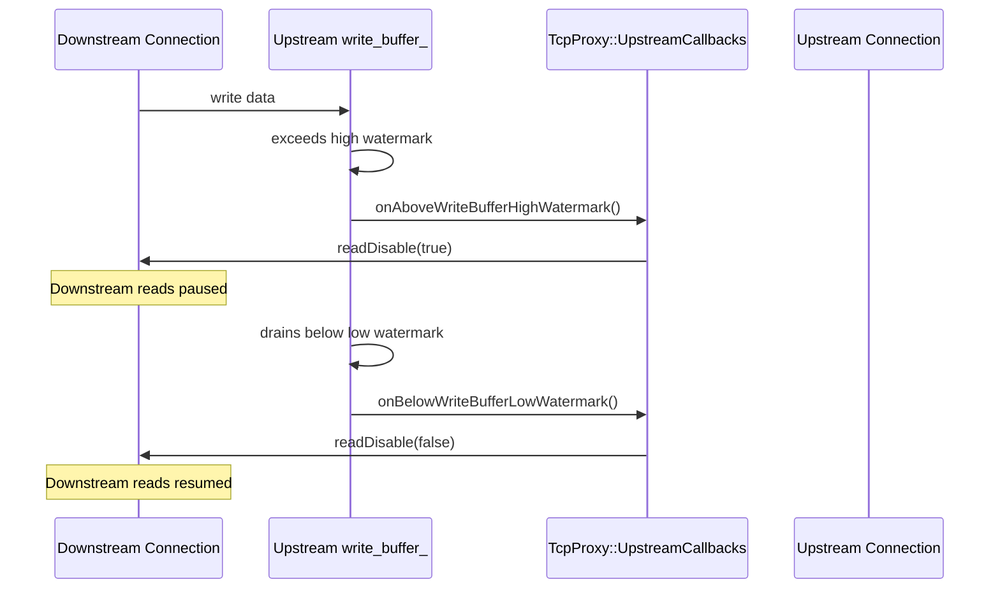

# Envoy Flow Control — Part 1: Overview and TCP

## Watermark Concept

All buffer limits in Envoy are **soft limits**. Each buffer has a high and low watermark.
When a buffer exceeds the high watermark, a callback fires to pause the data source.
When it drains below the low watermark (~50% of high), the source is resumed.

The back-off may be:
- **Immediate** — stop reading from a socket (`readDisable(true)` on a TCP connection)
- **Gradual** — stop sending HTTP/2 window updates, causing the peer to eventually stop

The low watermark is intentionally set at about **half the high watermark** to avoid
thrashing — rapidly toggling between paused and resumed states as data straddles the limit.

The callback contract:
- `onAboveWriteBufferHighWatermark()` — buffer exceeded the limit; pause the source
- `onBelowWriteBufferLowWatermark()` — buffer drained sufficiently; resume the source 

---

## TCP Flow Control

Handled by coordination between `Network::ConnectionImpl::write_buffer_` and `Network::TcpProxy`.

Each `Network::ConnectionImpl` has a `write_buffer_` that accumulates data to be written to the
underlying socket. When this buffer grows beyond the high watermark, it notifies registered
`Network::ConnectionCallbacks`. The `TcpProxy` filter subscribes to these callbacks for both its
downstream and upstream connections, and uses them to gate reads on the opposite side.

- **`TcpProxy::DownstreamCallbacks`** — reacts to the *downstream* write buffer; controls the *upstream* read side
- **`TcpProxy::UpstreamCallbacks`** — reacts to the *upstream* write buffer; controls the *downstream* read side

This cross-connection gating is the key mechanism: when data cannot be flushed to one side fast
enough, reads from the other side are paused to prevent unbounded buffering.

### Downstream Backpressure (downstream buffer fills up → pause upstream reads)

This happens when the downstream client is slow to consume data. Data sent from upstream to the
downstream write buffer accumulates. Once the buffer exceeds the high watermark, upstream reads
are disabled so no more data is pulled from the upstream server until the downstream client catches up.

### Upstream Backpressure (upstream buffer fills up → pause downstream reads)

This happens when the upstream server is slow to consume data sent from the downstream client
(e.g., a large request body). The upstream write buffer fills, downstream reads are disabled,
and TCP back-pressure propagates to the downstream client's send window.

