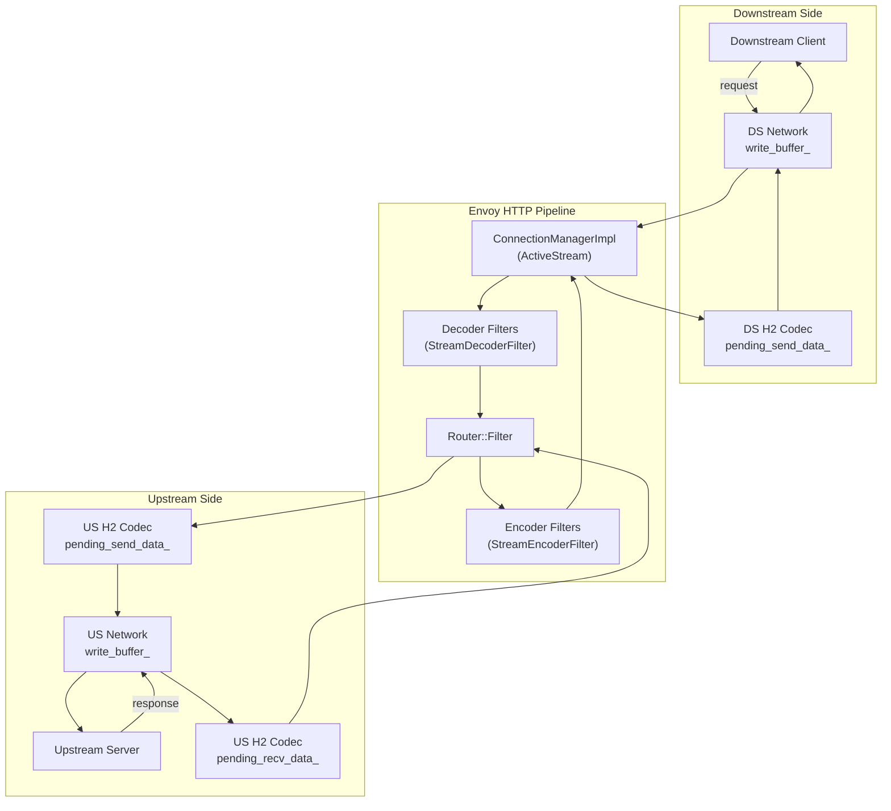
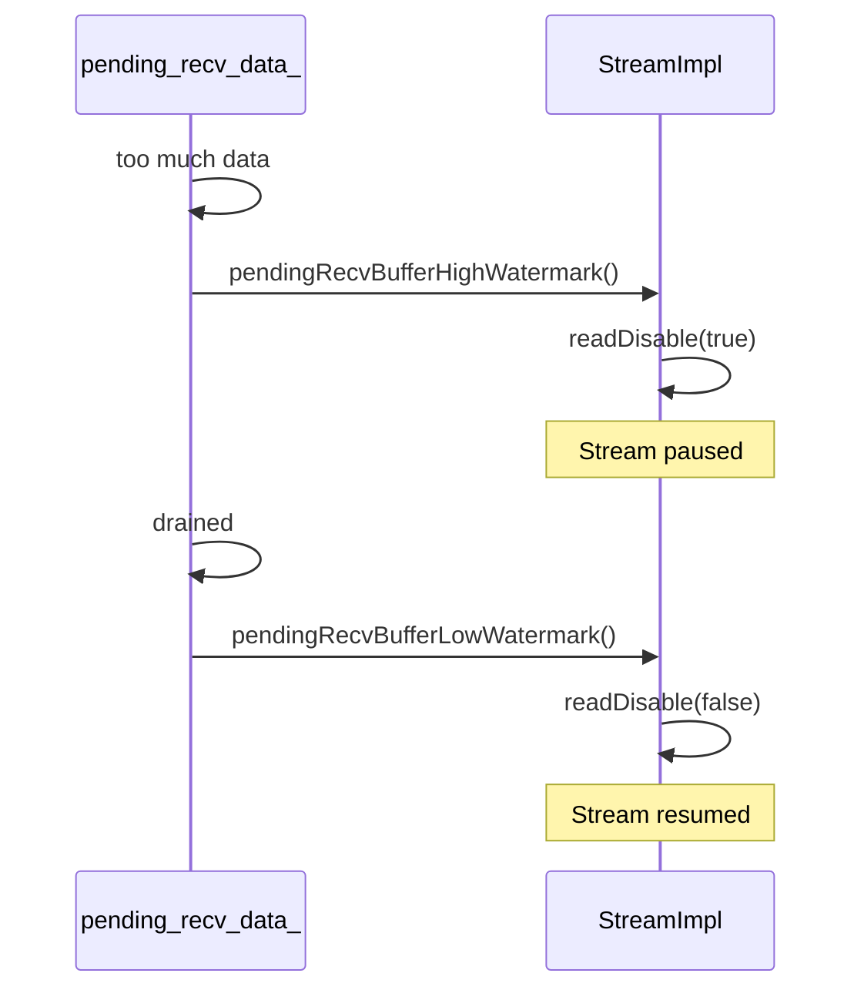
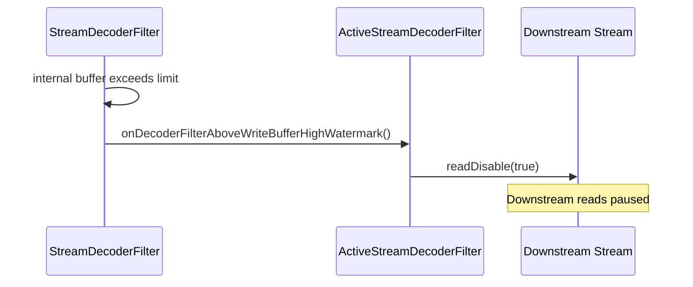
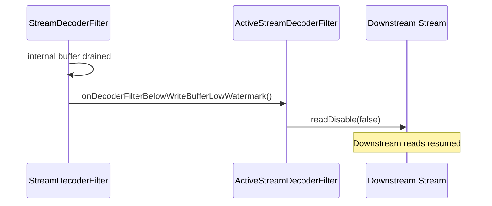
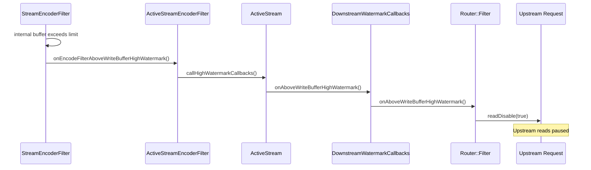
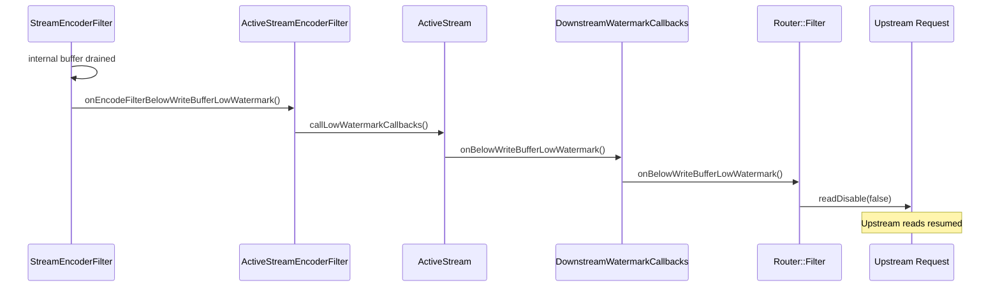
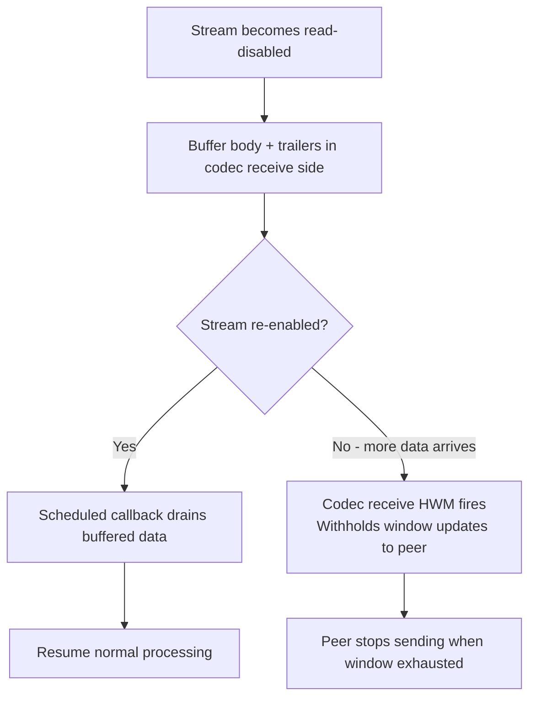

# Envoy Flow Control — Part 2: HTTP/2 Filter and Codec Receive Paths

## HTTP/2 Buffer Overview

For HTTP/2, when filters, streams, or connections back up, the end result is `readDisable(true)`
being called on the **source stream**. This causes the stream to cease consuming its H2 flow
control window, which stops sending further window updates to the peer. The peer will eventually
stop sending data when the available window is consumed. When `readDisable(false)` is called,
any outstanding unconsumed data is immediately consumed, resuming window updates and data flow.

The two main parties in HTTP/2 flow control are:
- **`Envoy::Router::Filter`** — intercepts watermark events for its own buffers, upstream streams,
  and upstream connection; passes events to the connection manager
- **`Envoy::Http::ConnectionManagerImpl`** — has the ability to call `readDisable()` on downstream
  streams; on the reverse path, passes downstream watermark events to the router via
  `DownstreamWatermarkCallbacks`

Filters subscribe to `DownstreamWatermarkCallbacks` as an optimization: instead of N-filters × M-streams
callbacks per watermark event, only the router filter is notified (N=1 multiplier). The connection
manager tracks outstanding high watermark events so the router receives them when it subscribes.

> **Key:** `readDisable()` is **reference-counted** — multiple entities can independently disable a stream.
> Reads only resume when **all** callers have issued the matching low watermark callback.
>
> **Example:** If the upstream TCP window fills (network-level block) *and* the H2 flow control
> window fills (stream-level block), a stream gets `readDisable(true)` called twice. When the
> upstream TCP socket drains, each stream gets one `readDisable(false)`. The stream that also had
> the H2 window block will still be paused until the upstream peer sends window updates — only then
> is the second `readDisable(false)` issued and data resumes from downstream.
>
> **Router destruction note:** The router does **not** unwind `readDisable(true)` calls on
> destruction. For HTTP/2, `Http2::ConnectionImpl` consumes any outstanding flow control window
> on stream deletion to avoid leaking the connection-level window.

---

## HTTP/2 Codec Receive Buffer (`pending_recv_data_`)

`Envoy::Http::Http2::ConnectionImpl::StreamImpl::pending_recv_data_` holds received H2 stream
data before it is dispatched through the filter chain. In practice this buffer is drained
immediately, so it rarely backs up. However it is implemented as a `WatermarkBuffer` for
consistency and future-proofing. One case where it can be triggered is if a filter in the chain
injects data causing the watermark to fire.

---

## Decoder Filter Path

Each HTTP/1 and HTTP/2 filter can call `bufferLimit()` at creation to query the configured limit.
Filters may override the default with `setBufferLimit()`. These limits are applied as filters are
created, so later filters in the chain can override earlier ones. It is recommended to only
**increase** the limit, never decrease it, to avoid conflicts with other filters.

There are two buffering modes for decoder filters:

| Mode | `FilterDataStatus` returned | Behavior on overflow |
|---|---|---|
| **Streaming** (can process as buffer drains) | `StopIterationAndWatermark` | `ConnectionManagerImpl` triggers watermark callbacks on behalf of the filter |
| **Full-body** (needs complete body before proceeding) | `StopIterationAndBuffer` | Returns **413 Payload Too Large** if buffer limit exceeded |

Filters that do their own **internal buffering** must call the watermark callbacks manually:

### High Watermark — pause downstream

### Low Watermark — resume downstream

---

## Encoder Filter Path

Encoder filters on the response path follow the same two modes:

| Mode | Behavior on overflow |
|---|---|
| **Streaming** | Call `onEncoderFilterAboveWriteBufferHighWatermark` → router calls `readDisable(true)` on upstream |
| **Full-body** | Return **500 Server Error** if request body exceeds buffer limit |

The encoder path is more involved than the decoder path because the signal must travel from the
encoder filter → `ConnectionManagerImpl` → `Router::Filter` → upstream, traversing `DownstreamWatermarkCallbacks`.

### High Watermark — pause upstream

### Low Watermark — resume upstream

---

## HTTP/2 Defer Processing (opt-in feature)

This feature is currently **off by default** and will be integrated into the main doc when
enabled by default. When active, a read-disabled H2 stream buffers body and trailers **inside
the codec** instead of eagerly dispatching them through the filter chain. Key behavior changes:

- **Minimises wasted work** — filter chain processing is deferred while the stream is paused
- **Codec recv HWM still gates window updates** — preserves protocol-level flow control;
  however the codec's receive buffer no longer calls `readDisable()` directly (to avoid getting
  stuck if read-disabled from elsewhere and never re-enabled)
- **Deferred stream close** — closing a stream may also be deferred; see
  `deferred_stream_close` in `config_http_conn_man_stats_per_codec` for stats
- **Fairness** — currently all buffered data is pushed through at once when re-enabled;
  chunking and per-stream fairness will be added in future

