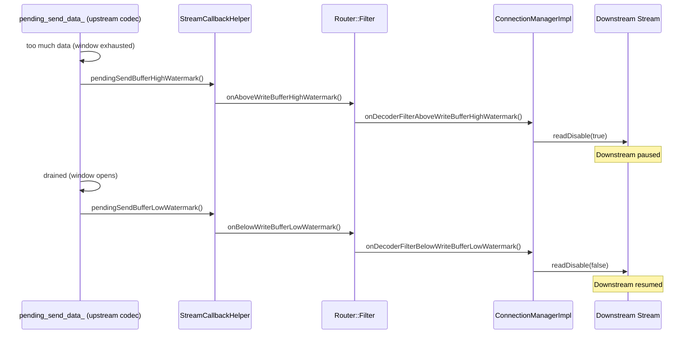
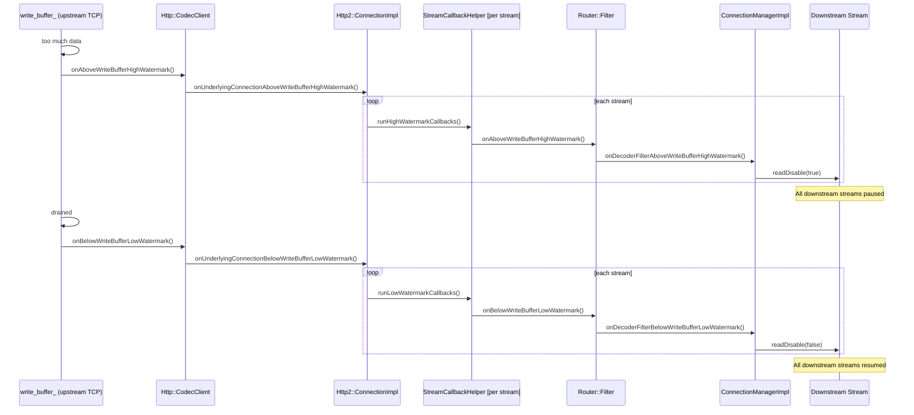
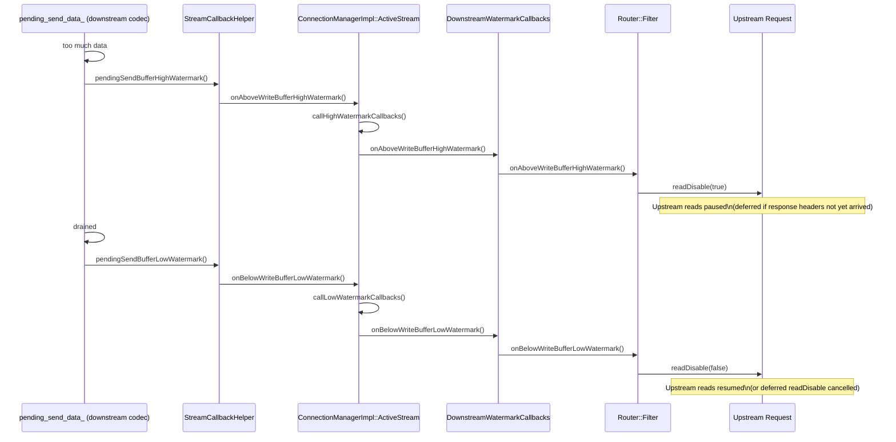
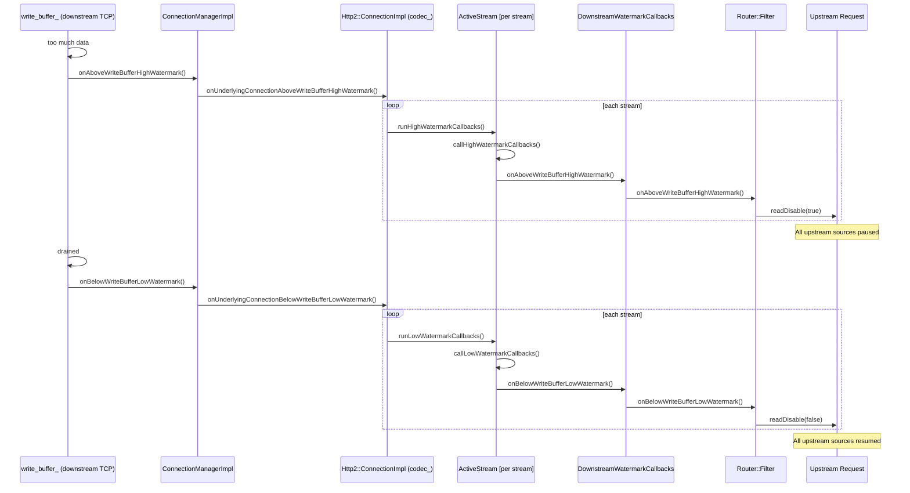

# Envoy Flow Control — Part 3: HTTP/2 Network Buffer Paths

## HTTP/2 Codec Upstream Send Buffer (`pending_send_data_` upstream)

`Envoy::Http::Http2::ConnectionImpl::StreamImpl::pending_send_data_` is H2 stream data destined
for an Envoy backend (upstream). Data is added to this buffer after each filter in the chain
finishes processing. It backs up when there is insufficient **connection-level or stream-level
H2 window** to send the data — the H2 peer has not granted enough window credits yet.

When this buffer overflows, the router tells `ConnectionManagerImpl` to `readDisable(true)` the
downstream source stream, pausing incoming data from the client until upstream window opens again.

> **New stream creation race:** When a new stream is created on an upstream connection that is
> **already above its high watermark**, `runHighWatermarkCallbacks()` is called immediately on the
> new stream to ensure it starts in the correct paused state. `Http2::ClientConnectionImpl`
> latches the underlying connection watermark state in `underlying_connection_above_watermark_`
> to detect this condition at stream creation time.

---

## HTTP/2 Network Upstream Buffer (`ConnectionImpl::write_buffer_` upstream)

`Envoy::Network::ConnectionImpl::write_buffer_` is the upstream **TCP-level** write buffer — the
last buffer before data is written to the kernel socket. It aggregates data for all H2 streams
multiplexed over the same connection. If the upstream server's TCP receive window is full (slow
server, network congestion), this buffer fills up.

Because all H2 streams share this one TCP connection, a single TCP-level backup causes
**every stream on that connection** to be paused. The callback chain traverses
`Http::CodecClient` → `Http2::ConnectionImpl` → per-stream `StreamCallbackHelper` → `Router::Filter`.

---

## HTTP/2 Codec Downstream Send Buffer (`pending_send_data_` downstream)

`ConnectionImpl::StreamImpl::pending_send_data_` on the **downstream** side holds response
body data waiting to be written to the downstream H2 connection. It backs up when the downstream
client's H2 flow control window is exhausted — the client is consuming responses slowly.

Unlike the network buffer (which affects all streams), this buffer is **per-stream** — only the
upstream source for that specific stream is paused via `readDisable(true)`.

**Header arrival deferral:** If `onAboveWriteBufferHighWatermark()` fires before response headers
have arrived from upstream, `readDisable(true)` is **deferred** until `decode1xxHeaders()` or
`decodeHeaders()` is called. If `onBelowWriteBufferLowWatermark()` arrives before that point,
the deferred disable is simply cancelled — no `readDisable` calls are made at all.

---

## HTTP/2 Network Downstream Buffer (`ConnectionImpl::write_buffer_` downstream)

`ConnectionImpl::write_buffer_` on the **downstream** side is the TCP-level send buffer toward
the downstream client. When the client's TCP receive window is full (slow client, network
congestion), this buffer fills up — backing up all H2 streams on that connection.

The signal flows: `ConnectionManagerImpl` (which subscribes to `Network::ConnectionCallbacks`
on the downstream connection) → `Http2::ConnectionImpl` codec → per-stream
`ActiveStream::callHighWatermarkCallbacks()` → `DownstreamWatermarkCallbacks` → `Router::Filter`
→ `readDisable(true)` on each upstream stream.

**New stream watermark propagation:** If a new downstream H2 stream is created while the
downstream connection is already above the high watermark, the `ConnectionManagerImpl` immediately
calls watermark callbacks on the new stream. This state is latched in
`ConnectionManagerImpl::underlying_connection_above_high_watermark_`.

> **Note:** New streams created while the downstream connection is above the high watermark
> immediately receive watermark callbacks. `ConnectionManagerImpl` latches this state in
> `underlying_connection_above_high_watermark_`.
