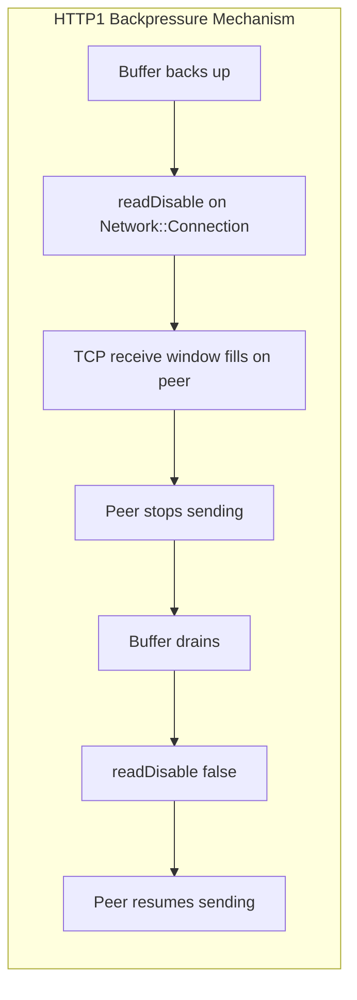
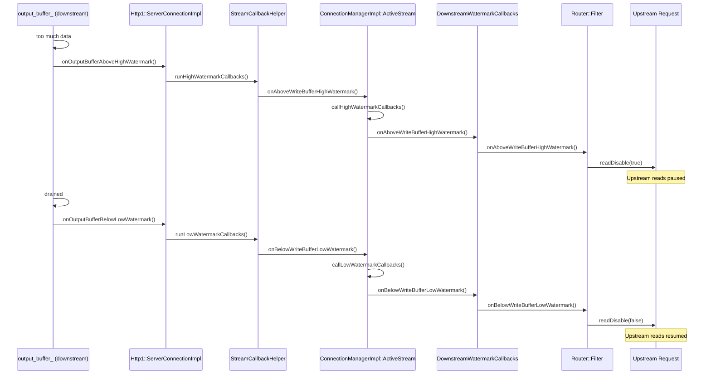
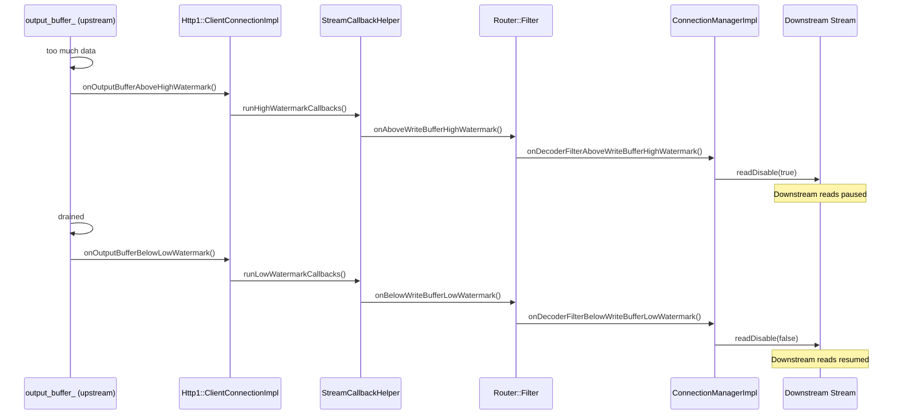

# Envoy Flow Control — Part 4: HTTP/1 and HTTP/3

## HTTP/1 Overview

HTTP flow control is extremely similar to HTTP/2, with one critical difference: **there is no
stream-level window**. HTTP/1 has no multiplexing — only one request/response occupies a
connection at a time. Backpressure is applied by calling `readDisable()` directly on the
underlying `Network::Connection`. This stops consuming TCP data, causing the peer's TCP
congestion window to fill up and the peer to naturally stop sending.

Filter and network backups use the same callback chain as HTTP/2 (documented in Parts 2 & 3).
The only difference is at the **codec level**, where `Http1::ConnectionImpl::output_buffer_`
replaces the H2 per-stream `pending_send_data_`.

### Connection Reuse and readDisable Unwinding

A given HTTP/1 connection may end a request in a state where `readDisable(true)` was called.
This must be unwound before the connection can serve another request:

- **Downstream pipeline:** Any outstanding `readDisable(true)` calls are unwound in
  `Http1::ConnectionImpl::newStream()` — ensuring the next pipelined request on the same
  connection can be read.
- **Upstream pool:** `readDisable(true)` calls are unwound in
  `ClientConnectionImpl::onMessageComplete()` — ensuring connections returned to the
  connection pool are in a ready-to-read state for the next request.

---

## HTTP/1 Codec Downstream Send Buffer (`output_buffer_`)

`Http::Http1::ConnectionImpl::output_buffer_` is the HTTP/1 downstream codec send buffer —
response data waiting to be written to the downstream client socket. This buffer is only expected
to have data pass through it and should never back up under normal conditions. However, if it
does (e.g., a very slow downstream client or a burst of response data), the watermark callbacks
fire and propagate upstream via the same `DownstreamWatermarkCallbacks` path as HTTP/2.

Once `runHighWatermarkCallbacks()` fires, the `ConnectionManagerImpl` takes over and the
code path is **identical to the HTTP/2 codec downstream send buffer** path.

---

## HTTP/1 Codec Upstream Send Buffer (`output_buffer_`)

`Http::Http1::ConnectionImpl::output_buffer_` on the **upstream** side holds request data
being sent to the upstream backend. Like the downstream variant, this buffer should pass data
through without backing up. If it does back up (slow upstream or burst of request data), the
watermark callbacks fire. Once `runHighWatermarkCallbacks()` fires, the `Router::Filter`
picks up the event and the path is **identical to the HTTP/2 codec upstream send buffer** path.

---

## Comparison: HTTP/1 vs HTTP/2 Buffer Paths

The fundamental difference is **granularity of backpressure**: HTTP/1 pauses an entire
connection while HTTP/2 can pause individual streams independently.

```mermaid
flowchart TB
    subgraph HTTP2
        H2Buf[H2 pending_send_data_] -->|HWM| H2SCB[StreamCallbackHelper]
        H2SCB -->|per-stream callback| H2Router[Router::Filter]
        H2Router -->|readDisable on stream| H2DS[Downstream H2 Stream]
    end

    subgraph HTTP1
        H1Buf[HTTP1 output_buffer_] -->|HWM| H1SC[ServerConnectionImpl]
        H1SC -->|runHighWatermarkCallbacks| H1Router[Router::Filter]
        H1Router -->|readDisable on connection| H1DS[Downstream Connection]
    end
```

| Property | HTTP/1 | HTTP/2 |
|---|---|---|
| Backpressure unit | Full `Network::Connection` | Per H2 stream |
| Window mechanism | TCP congestion window | H2 flow control window |
| Multiple streams | Not supported (one req/resp at a time) | Yes — each stream independently paused |
| readDisable scope | Entire connection | Per stream (ref-counted) |

---

## HTTP/3

HTTP/3 network buffer and stream send buffer behavior differs significantly from HTTP/2 and HTTP/1
due to QUIC's built-in flow control and stream multiplexing.

See `quiche_integration.md` for details.
