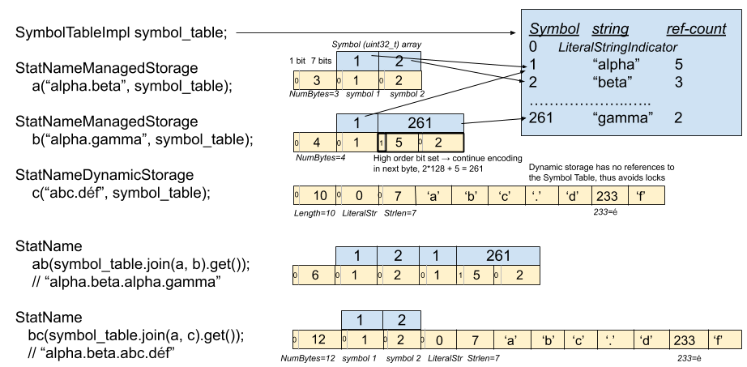

# Envoy Stats System

Envoy statistics track numeric metrics on an Envoy instance, optionally spanning
binary program restarts. The metrics are tracked as:

 * Counters: strictly increasing 64-bit integers.
 * Gauges: 64-bit integers that can rise and fall.
 * Histograms: mapping ranges of values to frequency. The ranges are auto-adjusted as
   data accumulates. Unlike counters and gauges, histogram data is not retained across
   binary program restarts.

In order to support restarting the Envoy binary program without losing counter and gauge
values, they are passed from parent to child in an RPC protocol.
They were previously held in shared memory, which imposed various restrictions.
Unlike the shared memory implementation, the RPC passing *requires a mode-bit specified
when constructing gauges indicating whether it should be accumulated across hot-restarts*.
    
## Performance and Thread Local Storage

A key tenant of the Envoy architecture is high performance on machines with
large numbers of cores. See
https://blog.envoyproxy.io/envoy-threading-model-a8d44b922310 for details. This
requires lock-free access to stats on the fast path -- when proxying requests.

For stats, this is implemented in
[ThreadLocalStore](https://github.com/envoyproxy/envoy/blob/master/source/common/stats/thread_local_store.h), supporting the following features:

 * Thread local per scope stat caching.
 * Overlapping scopes with proper reference counting (2 scopes with the same name will point to
   the same backing stats).
 * Scope deletion.
 * Lockless in the fast path.

This implementation is complicated so here is a rough overview of the threading model.

 * The store can be used before threading is initialized. This is needed during server init.
 * Scopes can be created from any thread, though in practice they are only created from the main
   thread.
 * Scopes can be deleted from any thread, and they are in practice as scopes are likely to be
   shared across all worker threads.
 * Per thread caches are checked, and if empty, they are populated from the central cache.
 * Scopes are entirely owned by the caller. The store only keeps weak pointers.
 * When a scope is destroyed, a cache flush operation is posted on all threads to flush any
   cached data owned by the destroyed scope.
 * Scopes use a unique incrementing ID for the cache key. This ensures that if a new scope is
   created at the same address as a recently deleted scope, cache references will not accidentally
   reference the old scope which may be about to be cache flushed.
 * Since it's possible to have overlapping scopes, we de-dup stats when counters() or gauges() is
   called since these are very uncommon operations.
 * Overlapping scopes will not share the same backing store. This is to keep things simple,
   it could be done in the future if needed.

### Histogram threading model

Each Histogram implementation will have 2 parts.

 * *main* thread parent which is called `ParentHistogram`.
 * *per-thread* collector which is called `ThreadLocalHistogram`.

Worker threads will write to ParentHistogram which checks whether a TLS
histogram is available. If there is one it will write to it, otherwise creates
new one and writes to it. During the flush process the following sequence is
followed.

 * The main thread starts the flush process by posting a message to every worker which tells the
   worker to swap its *active* histogram with its *backup* histogram. This is achieved via a call
   to the `beginMerge` method.
 * Each TLS histogram has 2 histograms it makes use of, swapping back and forth. It manages a
   current_active index via which it writes to the correct histogram.
 * When all workers have done, the main thread continues with the flush process where the
   *actual* merging happens.
 * As the active histograms are swapped in TLS histograms, on the main thread, we can be sure
   that no worker is writing into the *backup* histogram.
 * The main thread now goes through all histograms, collect them across each worker and
   accumulates in to *interval* histograms.
 * Finally the main *interval* histogram is merged to *cumulative* histogram.

## Stat naming infrastructure and memory consumption

Stat names are replicated in several places in various forms.

 * Held with the stat values, in `CounterImpl` and `GaugeImpl`, which are defined in
   [allocator_impl.cc](https://github.com/envoyproxy/envoy/blob/master/source/common/stats/allocator_impl.cc)
 * In [MetricImpl](https://github.com/envoyproxy/envoy/blob/master/source/common/stats/metric_impl.h)
   in a transformed state, with tags extracted into vectors of name/value strings.
 * In static strings across the codebase where stats are referenced
 * In a [set of
   regexes](https://github.com/envoyproxy/envoy/blob/master/source/common/config/well_known_names.cc)
   used to perform tag extraction.

There are stat maps in `ThreadLocalStore` for capturing all stats in a scope,
and each per-thread caches. However, they don't duplicate the stat names.
Instead, they reference the `StatName` held in the `CounterImpl` or `GaugeImpl`, and thus
are relatively cheap; effectively those maps are all pointer-to-pointer.

For this to be safe, cache lookups from locally scoped strings must use `.find`
rather than `operator[]`, as the latter would insert a pointer to a temporary as
the key. If the `.find` fails, the actual stat must be constructed first, and
then inserted into the map using its key storage. This strategy saves
duplication of the keys, but costs an extra map lookup on each miss.

### Naming Representation

When stored as flat strings, stat names can dominate Envoy memory usage when
there are a large number of clusters. Stat names typically combine a small
number of keywords, cluster names, host names, and response codes, separated by
`.`. For example `CLUSTER.upstream_cx_connect_attempts_exceeded`. There may be
thousands of clusters, and roughly 100 stats per cluster. Thus, the number
of combinations can be large. It is significantly more efficient to symbolize
each `.`-delimited token and represent stats as arrays of symbols.

The transformation between flattened string and symbolized form is CPU-intensive
at scale. It requires parsing, encoding, and lookups in a shared map, which must
be mutex-protected. To avoid adding latency and CPU overhead while serving
requests, the tokens can be symbolized and saved in context classes, such as
[Http::CodeStatsImpl](https://github.com/envoyproxy/envoy/blob/master/source/common/http/codes.h).
Symbolization can occur on startup or when new hosts or clusters are configured
dynamically. Users of stats that are allocated dynamically per cluster, host,
etc, must explicitly store partial stat-names their class instances, which later
can be composed dynamically at runtime in order to fully elaborate counters,
gauges, etc, without taking symbol-table locks, via `SymbolTable::join()`.

### `StatNamePool` and `StatNameSet`

These two helper classes evolved to make it easy to deploy the symbol table API
across the codebase.

`StatNamePool` provides pooled allocation for any number of
`StatName` objects, and is intended to be held in a data structure alongside the
`const StatName` member variables. Most names should be established during
process initializion or in response to xDS updates.

`StatNameSet` provides some associative lookups at runtime. The associations
should be created before the set is used for requests, via
`StatNameSet::rememberBuiltin`. This is useful in scenarios where stat-names are
derived from data in a request, but there are limited set of known tokens, such
as SSL ciphers or Redis commands.

### Dynamic stat tokens

While stats are usually composed of tokens that are known at compile-time, there
are scenarios where the names are newly discovered from data in requests. To
avoid taking locks in this case, tokens can be formed dynamically using
`StatNameDynamicStorage` or `StatNameDynamicPool`. In this case we lose
substring sharing but we avoid taking locks. Dynamically generated tokens can
be combined with symbolized tokens from `StatNameSet` or `StatNamePool` using
`SymbolTable::join()`.

Relative to using symbolized tokens, The cost of using dynamic tokens is:

 * the StatName must be allocated and populated from the string data every time
   `StatNameDynamicPool::add()` is called or `StatNameDynamicStorage` is constructed.
 * the resulting `StatName`s are as long as the string, rather than benefiting from
   a symbolized representation, which is typically 4 bytes or less per token.

However, the cost of using dynamic tokens is on par with the cost of not using
a StatName system at all, only adding one re-encoding. And it is hard to quantify
the benefit of avoiding mutex contention when there are large numbers of threads.

### Symbol Table Memory Layout

Below is a diagram
[(source)](https://docs.google.com/drawings/d/1eG6CHSUFQ5zkk-j-kcFCUay2-D_ktF39Tbzql5ypUDc/edit)
showing the memory layout for a few scenarios of constructing and joining symbolized
`StatName` and dynamic `StatName`.



### Current State and Strategy To Deploy Symbol Tables

As of September 5, 2019, the symbol table API has been integrated into the
production code, using a temporary ["fake" symbol table
implementation](https://github.com/envoyproxy/envoy/blob/master/source/common/stats/fake_symbol_table_impl.h). This
fake has enabled us to incrementally transform the codebase to pre-symbolize
names as much as possible, avoiding contention in the hot-path.

There are no longer any explicit production calls to create counters
or gauges directly from a string via `Stats::Scope::counter(const
std::string&)`, though they are ubiquitous in tests. There is also a
`check_format` protection against reintroducting production calls to
`counter()`.

However, there are still several ways to create hot-path contention
looking up stats by name, and there is no bulletproof way to prevent it from
occurring.
 * The [stats macros](https://github.com/envoyproxy/envoy/blob/master/include/envoy/stats/stats_macros.h) may be used in a data structure which is constructed in response to requests.
 * An explicit symbol-table lookup, via `StatNamePool` or `StatNameSet` can be
   made in the hot path.

It is difficult to search for those scenarios in the source code or prevent them
with a format-check, but we can determine whether symbol-table lookups are
occurring during via an admin endpoint that shows 20 recent lookups by name, at
`ENVOY_HOST:ADMIN_PORT/stats?recentlookups`. This works only when real symbol
tables are enabled, via command-line option `--use-fake-symbol-table 0`.

Once we are confident we've removed all hot-path symbol-table lookups, ideally
through usage of real symbol tables in production, examining that endpoint, we
can enable real symbol tables by default.

### Symbol Table Class Overview

Class | Superclass | Description
-----| ---------- | ---------
SymbolTable | | Abstract class providing an interface for symbol tables
FakeSymbolTableImpl | SymbolTable | Implementation of SymbolTable API where StatName is represented as a flat string
SymbolTableImpl | SymbolTable | Implementation of SymbolTable API where StatName share symbols held in a table
SymbolTableImpl::Encoding | | Helper class for incrementally encoding strings into symbols
StatName | | Provides an API and a view into a StatName (dynamic, symbolized, or fake). Like absl::string_view, the backing store must be separately maintained.
StatNameStorageBase | | Holds storage (an array of bytes) for a dynamic or symbolized StatName
StatNameStorage  | StatNameStorageBase | Holds storage for a symbolized StatName. Must be explicitly freed (not just destructed).
StatNameManagedStorage | StatNameStorage | Like StatNameStorage, but is 8 bytes larger, and can be destructed without free(). 
StatNameDynamicStorage | StatNameStorageBase | Holds StatName storage for a dynamic (not symbolized) StatName.
StatNamePool | | Holds backing store for any number of symbolized StatNames.
StatNameDynamicPool | | Holds backing store for any number of dynamic StatNames.
StatNameList | | Provides packed backing store for an ordered collection of StatNames, that are only accessed sequentially. Used for MetricImpl.
StatNameStorageSet | | Implements a set of StatName with lookup via StatName. Used for rejected stats.
StatNameSet | | Implements a set of StatName with lookup via string_view. Used to remember well-known names during startup, e.g. Redis commands.

### Hot Restart

Continuity of stat counters and gauges over hot-restart is supported. This occurs via
a sequence of RPCs from parent to child, issued while child is in lame-duck. These
RPCs contain a map of stat-name strings to values.

One implementation complexity is that when decoding these names in the child, we
must know which segments of the stat names were encoded dynamically. This is
implemented by sending an auxiliary map of stat-name strings to lists of spans,
where the spans identify dynamic segments.

Dynamic segments are rare, used only by Dynamo, Mongo, IP Tagging Filter, Fault
Filter, and `x-envoy-upstream-alt-stat-name` as of this writing. So in most
cases this dynamic-segment map is empty.

## Tags and Tag Extraction

TBD

## Disabling statistics by substring or regex

TBD

## Stats Memory Tests

Regardless of the underlying data structures used to implement statistics,
memory usage will grow with the number of hosts and clusters. When a PR is
issued that adds new per-host or per-cluster stats, this will have a
multiplicative effect on consumed memory. This can become significant for
deployments with O(10k) clusters or hosts.

To improve visibility for this memory growth, there are [memory-usage
integration
tests](https://github.com/envoyproxy/envoy/blob/master/test/integration/stats_integration_test.cc).

If a PR fails the tests in that file due to unexpected memory consumption, it
gives the author and reviewer an opportunity to consider the cost/value of the
new stats. If the test fails because the new byte-count is lower, then all
that's needed is to lock in the improvement by updating the expected values. If
the new per-cluster or per-host memory consumption is higher, then we must
decide whether the value from the added stats justify the overhead for all Envoy
deployments. In either case, we must update the golden values and add a comment
to the table in the test indicating the memory impact of each PR.

Developers trying to can iterate through changes in these tests locally with:

```bash
  bazel test -c opt --test_env=ENVOY_MEMORY_TEST_EXACT=true \
      test/integration:stats_integration_test
```

