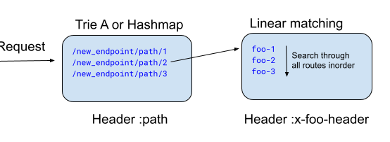

# Sublinear Route Matching in Envoy

## Overview

An incoming request to Envoy needs to be matched to a cluster based on defined [routes](https://www.envoyproxy.io/docs/envoy/latest/api-v3/config/route/v3/route_components.proto#envoy-v3-api-msg-config-route-v3-virtualhost). Typically, a well understood, linear route search matching with O(n) search cost (see  [Virtual Host](https://www.envoyproxy.io/docs/envoy/latest/api-v3/config/route/v3/route_components.proto#envoy-v3-api-msg-config-route-v3-virtualhost) → [Routes](https://www.envoyproxy.io/docs/envoy/latest/api-v3/config/route/v3/route_components.proto#envoy-v3-api-msg-config-route-v3-route)) is employed where the cost of route matching to clusters linearly goes up with increasing number of route rules. It can become a scalability issue with higher latencies as the number of routes go up in o(5k+). To overcome these scalability challenges the Generic Matcher API ( [Virtual Host → matcher{}](https://www.envoyproxy.io/docs/envoy/latest/api-v3/config/route/v3/route_components.proto#envoy-v3-api-msg-config-route-v3-virtualhost) → [matcher_tree](https://www.envoyproxy.io/docs/envoy/latest/xds/type/matcher/v3/matcher.proto#envoy-v3-api-msg-xds-type-matcher-v3-matcher-matchertree)) can offer a robust and flexible framework for route matching with two distinct sublinear matching implementations:

* Trie-based Matching ([prefix_match_map](https://github.com/envoyproxy/envoy/blob/main/source/common/matcher/prefix_map_matcher.h#L43)): Employs a prefix trie structure for efficient longest prefix matching in significantly much lower time complexity of O(min{input key length, longest prefix match}) compared to traditional linear search with O(# of routes x avg length of routes). Trie implementation in Envoy leverages ranged vectors for storing children to optimize on space as described [here](https://github.com/envoyproxy/envoy/blob/main/source/common/common/trie_lookup_table.h#L16). Also, it is to be noted that longest-prefix-match lookup of chars in trie does not support wildcards and each char is matched literally. 

* Hash Map-based Matching ([exact_match_map](https://github.com/envoyproxy/envoy/blob/main/source/common/matcher/exact_map_matcher.h#L45)): Uses a hashmap structure for exact string matching in practically constant time O(1).

These implementations can be used recursively and even combined with each other in nested fashion using Generic Matching API. It also enables mixing sublinear and linear route matching for breaking up route matching space for diverse use-cases.

## Trie-based Matching in Action

The Generic Matching API offers exceptional flexibility, enabling a wide array of route matching configurations. The following examples showcase its versatility, particularly in the realm of sublinear matching. While some of these may not be ideal for production use, they serve to illustrate the API's vast potential.

**Usecase 1:** A single trie structure for all url paths in :path header

Suppose one wants to route requests with following path prefixes to respective clusters using trie or hashmap for sublinear route searching


A request with :path header set to url /new_endpoint/path/2/abc should be routed to cluster_2

To achieve the above results, Envoy config below will create a single trie structure with above path strings and calls findLongestPrefix() match once, for paths in incoming request :path header. 

**NOTE:** Changing prefix_match_map to exact_match_map in below configuration will result in use of hash based path matching (instead of trie) and will succeed in lookup if :path header in request matches exactly with one of the routes defined.

```
static_resources:
  listeners:
  - name: listener_0
    address:
      socket_address:
        address: 0.0.0.0
        port_value: 10000
    filter_chains:
    - filters:
      - name: envoy.http_connection_manager
        typed_config:
          "@type": type.googleapis.com/envoy.extensions.filters.network.http_connection_manager.v3.HttpConnectionManager
          stat_prefix: ingress_http
          codec_type: AUTO
          http_filters:
          - name: envoy.filters.http.router
            typed_config:
              "@type": type.googleapis.com/envoy.extensions.filters.http.router.v3.Router
          route_config:
            name: local_route
            virtual_hosts:
            - name: local_service
              domains: ["*"]
              matcher:
                matcher_tree:
                  input:
                    name: request-headers
                    typed_config:
                      "@type": type.googleapis.com/envoy.type.matcher.v3.HttpRequestHeaderMatchInput
                      header_name: :path
                  prefix_match_map:
                    map:
                      "/new_endpoint/path/1":
                        action:
                          name: route_foo
                          typed_config:
                            "@type": type.googleapis.com/envoy.config.route.v3.Route
                            match:
                              prefix: ""
                            route:
                              cluster: cluster_1
                      "/new_endpoint/path/2":
                        action:
                          name: route_foo
                          typed_config:
                            "@type": type.googleapis.com/envoy.config.route.v3.Route
                            match:
                              prefix: ""
                            route:
                              cluster: cluster_2
                      "/new_endpoint/path/3":
                        action:
                          name: route_bar
                          typed_config:
                            "@type": type.googleapis.com/envoy.config.route.v3.Route
                            match:
                              prefix: ""
                            route:
                              cluster: cluster_3
                        clusters:
  <Define cluster_0/1/2/3>
```

**Usecase 2:** Configuration for Hierarchical trie structures in example below illustrates how three different trie structures can be created by Envoy using nested prefix_match_map which can do request matching across various headers.:
**Note:** Use of exact_match_map will result in creation of hashmaps instead of tries.


For an incoming request with :path header set to say /new_endpoint/path/2/video, x-foo-header set to foo-2 and x-bar-header set to bar-2, three longest-prefix-match trie lookups will happen across A, B and C tries in the order of nesting for a successful request match.

```
static_resources:
  listeners:
  - name: listener_0
    address:
      socket_address:
        address: 0.0.0.0
        port_value: 10000
    filter_chains:
    - filters:
      - name: envoy.http_connection_manager
        typed_config:
          "@type": type.googleapis.com/envoy.extensions.filters.network.http_connection_manager.v3.HttpConnectionManager
          stat_prefix: ingress_http
          codec_type: AUTO
          http_filters:
          - name: envoy.filters.http.router
            typed_config:
              "@type": type.googleapis.com/envoy.extensions.filters.http.router.v3.Router
          route_config:
            name: local_route
            virtual_hosts:
            - name: local_service
              domains: ["*"]
              matcher:
                matcher_tree:
                  input:
                    name: request-headers
                    typed_config:
                      "@type": type.googleapis.com/envoy.type.matcher.v3.HttpRequestHeaderMatchInput
                      header_name: :path
                  prefix_match_map:
                    map:
                      "/new_endpoint/path/1":
                        action:
                          name: route_foo
                          typed_config:
                            "@type": type.googleapis.com/envoy.config.route.v3.Route
                            match:
                              prefix: /new_endpoint/foo
                            route:
                              cluster: cluster_1
                      "/new_endpoint/path/2":
                        matcher:
                          matcher_tree:
                            input:
                              name: request-headers
                              typed_config:
                                "@type": type.googleapis.com/envoy.type.matcher.v3.HttpRequestHeaderMatchInput
                                header_name: x-foo-header
                            prefix_match_map:
                              map:
                                "foo-1":
                                  action:
                                    name: route_foo
                                    typed_config:
                                      "@type": type.googleapis.com/envoy.config.route.v3.Route
                                      match:
                                        prefix: ""
                                      route:
                                        cluster: cluster_foo_1
                                "foo-2":
                                  matcher:
                                    matcher_tree:
                                      input:
                                        name: request-headers
                                        typed_config:
                                          "@type": type.googleapis.com/envoy.type.matcher.v3.HttpRequestHeaderMatchInput
                                          header_name: x-bar-header
                                      prefix_match_map:
                                        map:
                                          "bar-1":
                                            action:
                                              name: route_foo
                                              typed_config:
                                                "@type": type.googleapis.com/envoy.config.route.v3.Route
                                                match:
                                                  prefix: ""
                                                route:
                                                  cluster: cluster_bar_1
                                          "bar-2":
                                            action:
                                              name: route_foo
                                              typed_config:
                                                "@type": type.googleapis.com/envoy.config.route.v3.Route
                                                match:
                                                  prefix: ""
                                                route:
                                                  cluster: cluster_bar_2
                                              
                                          "bar-3":
                                            action:
                                              name: route_foo
                                              typed_config:
                                                "@type": type.googleapis.com/envoy.config.route.v3.Route
                                                match:
                                                  prefix: ""
                                                route:
                                                  cluster: cluster_bar_3

                                "foo-3":
                                  action:
                                    name: route_foo
                                    typed_config:
                                      "@type": type.googleapis.com/envoy.config.route.v3.Route
                                      match:
                                        prefix: ""
                                      route:
                                        cluster: cluster_foo_3
                      "/new_endpoint/path/3":
                        action:
                          name: route_bar
                          typed_config:
                            "@type": type.googleapis.com/envoy.config.route.v3.Route
                            match:
                              prefix: ""
                            route:
                              cluster: cluster_3
 
  clusters:
```

**Usecase 3:** Mixing sublinear route matching with traditional prefix based inorder linear routing.



```
static_resources:
  listeners:
  - name: listener_0
    address:
      socket_address:
        address: 0.0.0.0
        port_value: 10000
    filter_chains:
    - filters:
      - name: envoy.http_connection_manager
        typed_config:
          "@type": type.googleapis.com/envoy.extensions.filters.network.http_connection_manager.v3.HttpConnectionManager
          stat_prefix: ingress_http
          codec_type: AUTO
          http_filters:
          - name: envoy.filters.http.router
            typed_config:
              "@type": type.googleapis.com/envoy.extensions.filters.http.router.v3.Router
          route_config:
            name: local_route
            virtual_hosts:
            - name: local_service
              domains: ["*"]
              matcher:
                matcher_tree:
                  input:
                    name: request-headers
                    typed_config:
                      "@type": type.googleapis.com/envoy.type.matcher.v3.HttpRequestHeaderMatchInput
                      header_name: :path
                  prefix_match_map:
                    map:
                      "/new_endpoint/path/1":
                        action:
                          name: route_foo
                          typed_config:
                            "@type": type.googleapis.com/envoy.config.route.v3.Route
                            match:
                              prefix: ""
                            route:
                              cluster: cluster_1
                      "/new_endpoint/path/2":
                        action:
                          name: route_bar
                          typed_config:
                            "@type": type.googleapis.com/envoy.config.route.v3.Route
                            match:
                              prefix: ""
                            route:
                              cluster: cluster_2
                      "/new_endpoint/path/3":
                        action:
                          name: route_list
                          typed_config:
                            "@type": type.googleapis.com/envoy.config.route.v3.RouteList 
                            routes:
                            - match:
                                prefix: ""
                                headers:
                                - name: x-foo-header
                                  string_match:
                                    exact: foo-1
                              route:
                                cluster: cluster_3_1
                            - match:
                                prefix: ""
                                headers:
                                - name: x-foo-header
                                  string_match:
                                    exact: foo-2
                              route:
                                cluster: cluster_3_2
                            - match:
                                prefix: ""
                                headers:
                                - name: x-foo-header
                                  string_match:
                                    exact: foo-3
                              route:
                                cluster: cluster_3_3
  clusters:
```

**Usecase 4:** This example shows how one can run exact matches first (using hashmap) and if no matches are found then attempt prefix matches (using tries).
```
          route_config:
            name: local_route
            virtual_hosts:
            - name: local_service
              domains: ["*"]
              matcher:
                matcher_tree:
                  input:
                    name: request-headers
                    typed_config:
                      "@type": type.googleapis.com/envoy.type.matcher.v3.HttpRequestHeaderMatchInput
                      header_name: :path
                  exact_match_map:
                    map:
                      "/new_endpoint/foo/0":
                        action:
                          name: route_foo
                          typed_config:
                            "@type": type.googleapis.com/envoy.config.route.v3.Route
                            match:
                              prefix: ""
                            route:
                              cluster: cluster_0
                      "/new_endpoint/foo/1":
                        action:
                          name: route_bar
                          typed_config:
                            "@type": type.googleapis.com/envoy.config.route.v3.Route
                            match:
                              prefix: ""
                            route:
                              cluster: cluster_1
                      "/new_endpoint/foo/2":
                        action:
                          name: route_bar
                          typed_config:
                            "@type": type.googleapis.com/envoy.config.route.v3.Route
                            match:
                              prefix: /new_endpoint
                            route:
                              cluster: cluster_2
                on_no_match:
                  matcher:
                    matcher_tree:
                      input:
                        name: prefix-matches
                        typed_config:
                          "@type": type.googleapis.com/envoy.type.matcher.v3.HttpRequestHeaderMatchInput
                          header_name: :path
                      prefix_match_map:
                        map:
                          "/new_endpoint/foo":
                            action:
                              name: route_foo_prefix
                              typed_config:
                                "@type": type.googleapis.com/envoy.config.route.v3.Route
                                match:
                                  prefix: ""
                                route:
                                  cluster: cluster_1
                          "/new_endpoint":
                            action:
                              name: route_foo_prefix
                              typed_config:
                                "@type": type.googleapis.com/envoy.config.route.v3.Route
                                match:
                                  prefix: ""
                                route:
                                  cluster: cluster_2
  clusters:
```


