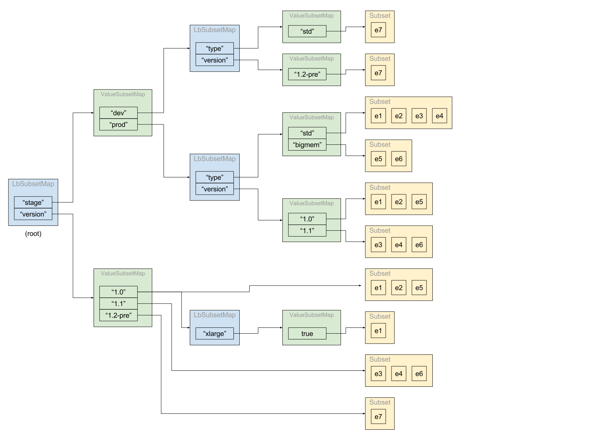

### Overview

The subset load balancer (SLB) divides the upstream hosts in a cluster into one or more subsets. At
request time the SLB uses information from the `LoadBalancerContext` to choose one of its
subsets. Choosing a host is then delegated to the subset's load balancer. If no subset matches the
context, the SLB falls back (depending on configuration) to balancing over a default subset,
balancing over any upstream host in the cluster, or returning no host.

Load balancing within a subset is accomplished by constructing one of the existing load balancer
types with `Upstream::HostSet` that presents a filtered copy of the upstream hosts. All load
balancer types except the Original DST load balancer may be used for subset load balancing.

### Fallback

The SLB can be configured with one of three fallback policies. If no subset matching the
`LoadBalancerContext` is found:

1. `NO_ENDPOINT` specifies that `chooseHost` returns `nullptr` and load balancing fails.
2. `ANY_ENDPOINT` specifies that load balancing occurs over the entire set of upstream hosts.
3. `DEFAULT_SUBSET` specifies that load balancing occurs over a specific subset of upstream
   hosts. If the default subset is empty, `chooseHost` returns `nullptr` and load balancing fails.

During construction, if the fallback policy is `ANY_ENDPOINT`, a default subset is constructed
using the original `Upstream::HostSet`. If the fallback policy is `DEFAULT_SUBSET`, but the
configuration does not specify any metadata (e.g. all hosts match), the SLB changes the fallback
policy to `ANY_ENDPOINT`.

### Selecting Subsets

The initial implementation supports selecting subsets by endpoint metadata provided via EDS.

The configuration specifies a list of subset selectors. Each selector is used, in turn, to create
subsets of hosts. The selectors exist to limit the combinations of endpoint metadata used for
creating subsets. We precompute the subsets outside the load balancing path to avoid locking.

Currently the only mechanism for specifying a selector is to provide a list of metadata keys:

``` json
{
  "subset_selectors": [
    { "keys": [ "a", "b" ] },
    { "keys": [ "x" ] }
  ]
}
```

For each selector, the SLB iterates over the hosts and inspects the host's metadata for the
`"envoy.lb"` filter. If a host's metadata provides values for each key, a subset is created for the
metadata. For example, given the selectors above, if a host's metadata contains `{a=1, b=2}`, a
subset is created for `{a=1, b=2}`. Other hosts with `{a=1, b=2}` are also included in the subset.
A host with metadata like `{a=1, b=2, x=3}` is included in two subsets (`{a=1, b=2}` and
{`x=3`}). The same keys may appear in multiple selector entries: it is feasible to have both an
`{a=1, b=2}` subset and an `{a=1}` subset.

On update, the SLB divides the hosts added into the appropriate subset(s) and triggers update
events on the filtered host sets. The SLB also manages the optional "local HostSet" used for
zone-aware routing.

The CDS configuration for the subset selectors is meant to allow future extension. For example:

1. Selecting endpoint metadata keys by a prefix or other string matching algorithm, or
2. Using a list-typed metadata value to allow a single endpoint to have multiple values for a
   metadata key.

Subsets are stored in a trie-like fashion. Keys in the selectors are lexically sorted. An
`LbSubsetMap` is an `unordered_map` of string keys to `ValueSubsetMap`. `ValueSubsetMap` is an
`unordered_map` of (wrapped, see below) `ProtobufWkt::Value` to `LbSubsetEntry`. The
`LbSubsetEntry` may contain an `LbSubsetMap` of additional keys or a `Subset`. `Subset`
encapsulates the filtered `Upstream::HostSet` and `Upstream::LoadBalancer` for a subset.

`ProtobufWkt::Value` is wrapped to provide a cached hash value for the value. Currently,
`ProtobufWkt::Value` is hashed by first encoding the value as a string and then hashing the
string. By wrapping it, we can compute the hash value outside the request path for both the
metadata values provided in `LoadBalancerContext` and those used internally by the SLB.

### Subset Lookup

Currently we require the metadata provided in `LoadBalancerContext` to match a subset exactly in
order to select the subset for load balancing. Changing this behavior has implications for the
performance of the subset selection algorithm. The current algorithm, described below, runs in
`O(N)` time with respect to the number of metadata key-value pairs in the `LoadBalancerContext`.

The metadata key-value pairs from `LoadBalancerContext` must be sorted by key for the algorithm to
work. Currently we expect lexical order, but the sort order doesn't matter as long as both the
context and load balancer use the same ordering. Sorting of the `LoadBalancerContext` keys is
currently handled by `Router::RouteEntryImplBase`.

Given a sequence of N metadata keys and values (previously sorted lexically by key) from
`LoadBalancerContext`, we can look up the appropriate subset in `O(N)` time as follows. It may be
helpful to look at the [diagram](#diagram) provided in the example.

1. Initialize `subsets` to refer to the root `LbSubsetMap` and `entry` to point at a null
   `LbSubsetEntryPtr`.
2. For each key-value in the metadata:
   1. Lookup the key in `subsets` to find a `ValueSubsetMap`. (Average constant time.) If not
      found, exit the loop.
   2. Lookup the value in the `ValueSubsetMap` to find an `LbSubsetEntry`. (Average constant time.)
      If not found, exit the loop.
   3. Assign the `LbSubsetEntry`'s `LbSubsetMap` to `subsets`. (It may be empty.)
   4. If this is the last key-value pair, assign the `LbSubsetEntry` to `entry`.
3. If `entry` has been set and has a `Subset` value, we found a matching subset, delegate balancing
   to the subset's load balancer.
4. Otherwise, execute the fallback policy.

N.B. `O(N)` complexity presumes that the delegate load balancer executes in constant time.

### Example

Assume a set of hosts from EDS with the following metadata, assigned to a single cluster.

Endpoint | stage | version | type   | xlarge
---------|-------|---------|--------|-------
e1       | prod  | 1.0     | std    | true
e2       | prod  | 1.0     | std    |
e3       | prod  | 1.1     | std    |
e4       | prod  | 1.1     | std    |
e5       | prod  | 1.0     | bigmem |
e6       | prod  | 1.1     | bigmem |
e7       | dev   | 1.2-pre | std    |

Note: Only e1 has the "xlarge" metadata key.

Given this CDS `envoy::api::v2::Cluster`:

``` json
{
  "name": "c1",
  "lb_policy": "ROUND_ROBIN",
  "lb_subset_config": {
    "fallback_policy": "DEFAULT_SUBSET",
    "default_subset": {
      "stage": "prod",
      "version": "1.0",
      "type": "std"
    },
    "subset_selectors": [
      { "keys": [ "stage", "type" ] },
      { "keys": [ "stage", "version" ] },
      { "keys": [ "version" ] },
      { "keys": [ "xlarge", "version" ] },
    ]
  }
}
```

The following subsets are created:

`stage=prod, type=std` (e1, e2, e3, e4)
`stage=prod, type=bigmem` (e5, e6)
`stage=dev, type=std` (e7)
`stage=prod, version=1.0` (e1, e2, e5)
`stage=prod, version=1.1` (e3, e4, e6)
`stage=dev, version=1.2-pre` (e7)
`version=1.0` (e1, e2, e5)
`version=1.1` (e3, e4, e6)
`version=1.2-pre` (e7)
`version=1.0, xlarge=true` (e1)

In addition, a default subset is created:

`stage=prod, type=std, version=1.0` (e1, e2)

After loading this configuration, the SLB's `LbSubsetMap` looks like this:

<a name="diagram"></a>


Given these `envoy::api::v2::Route` entries:

``` json
"routes": [
  {
    "match": {
      "prefix": "/",
      "headers": [
        {
          "name": "x-custom-version",
          "value": "pre-release"
        }
      ]
    },
    "route": {
      "cluster": "c1",
      "metadata_match": {
        "filter_metadata": {
          "envoy.lb": {
            "version": "1.2-pre",
            "stage": "dev"
          }
        }
      }
    }
  },
  {
    "match": {
      "prefix": "/",
      "headers": [
        {
          "name": "x-hardware-test",
          "value": "memory"
        }
      ]
    },
    "route": {
      "cluster": "c1",
      "metadata_match": {
        "filter_metadata": {
          "envoy.lb": {
            "type": "bigmem",
            "stage": "prod"
          }
        }
      }
    }
  },
  {
    "match": {
      "prefix": "/"
    },
    "route": {
      "weighted_clusters": {
        "clusters": [
          {
            "name": "c1",
            "weight": 90,
            "metadata_match": {
              "filter_metadata": {
                "envoy.lb": {
                  "version": "1.0"
                }
              }
            }
          },
          {
            "name": "c1",
            "weight": 10,
            "metadata_match": {
              "filter_metadata": {
                "envoy.lb": {
                  "version": "1.1"
                }
              }
            }
          }
        ]
      },
      "metadata_match": {
        "filter_metadata": {
          "envoy.lb": {
            "stage": "prod",
          }
        }
      }
    }
  }
]
```

The following headers may then be used to select subsets:

`x-custom-version: pre-release` causes requests to be routed e7. This is an example of routing
requests to a developer launched instance for pre-release testing. If the e7 upstream leaves the
cluster, the subset is removed and further requests with this header are routed to the default
subset (containing e1 and e2).

`x-hardware-test: memory` causes requests to be load balanced over the e5 and e6 endpoints. This is
an example of routing requests to upstreams running on a particular class of hardware, perhaps for
load testing. If the bigmem hosts are removed from service, further requests with this header are
routed to the default subset.

Otherwise, requests without those headers are split between two subsets. 90% of the requests are
routed to `stage=prod, version=1.0` (e1, e2, e5). 10% of the requests are routed to `stage=prod,
version=1.1` (e3, e4, e6). This is an example of gradually shifting traffic to a new version.
