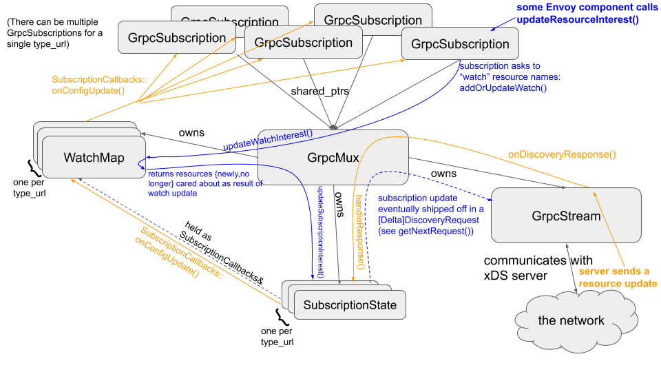

# Envoy xDS subsystem

## Overview

Envoy implements the [xDS
protocol](https://www.envoyproxy.io/docs/envoy/latest/api-docs/xds_protocol). This document tracks
some implementation details.

**tl;dr**: xDS can use the filesystem, REST or gRPC. gRPC xDS comes in four flavors.
However, Envoy code uses all of that via the same `Subscription` interface.
If you are an Envoy developer with your hands on a valid `Subscription` object,
you can mostly forget the filesystem/REST/gRPC distinction, and you can
especially forget about the gRPC flavors.

An overview of the architecture is provided in the diagram below:

Note that this is currently somewhat idealized, with Envoy having two gRPC mux implementations,
`GrpcMuxImpl` and `NewGrpcMuxImpl`, while we complete migration to a single muxer, see
https://github.com/envoyproxy/envoy/issues/11477.

The key components are:
* `GrpcMuxImpl` which manages the xDS transport and multiplexing one or more subscriptions on a
  single gRPC stream. The muxer is responsible for managing the wire level concerns via
  `GrpcStream`, while also tracking subscription state and watchers for updates. Multiple resource
  type URLs may be managed by a single muxer. For non-ADS, this will always be one stream per
  subscription, whereas for ADS, multiple subscriptions will be multiplexed on a single stream.
* `SubscriptionState` tracks subscription state for a single resource type URL.
* `WatchMap` tracks all the subscribers for a given resource type.
* Each Envoy subsystem, e.g. LDS, CDS, etc. has a `GrpcSubscriptionImpl` that points at a `GrpcMuxImpl`.

The above components are responsible for subscriptions, watches, muxing and stream management.
Caching is not currently a centralized service, and is instead delegated to per-resource type
modules such as `RdsRouteConfigProviderImpl`.

Note that there can be multiple active gRPC subscriptions for a single resource type. This concept
is called "resource watches". If one EDS subscription subscribes to X and Y, and another subscribes
to Y and Z, the underlying subscription logic will maintain a subscription to the union: X Y and Z.
Updates to X will be delivered to the first object, Y to both, Z to the second. This logic is
implemented by `WatchMap`.

## xdstp:// naming

In addition, Envoy is currently implementing a new structured naming scheme aimed to support
better scalability, cacheability, federation and reliability, see
https://github.com/envoyproxy/envoy/issues/11264. This introduces new requirements on the xDS
transport; it needs to manage subscriptions to new forms of resource collections and provide
contextual information in resource name subscriptions.

To support this, the Envoy's `LocalInfo` owns a `Config::ContextProvider`, providing all node
specific context parameters required for `xdstp://` naming. This is consumed by `GrpcMuxImpl`. In
addition, `GrpcMuxImpl` and `WatchMap` are aware of this naming scheme and implement the expected
match semantics and naming schemes.

Implementation is in progress and we support the following aspects of `xdstp://` today:
* LDS, CDS and SRDS glob collections over gRPC (delta xDS).
* RDS and EDS singletons over gRPC (delta xDS)
* LDS filesystem list collections featuring inline resources.

It should be noted that `xdstp://` support is experimental at this time while we complete
implementation.

`xdstp://` support will only be added for delta xDS.

We do not yet supported federated configuration sources, it is assumed that a
single ADS stream or `ConfigSource` specified parallel to the `xdstp://`
resource locator is used. Envoy will support this in the future once a bootstrap
based mapping from authority to `ConfigSource` is supported.

## gRPC xDS internals

When using gRPC, xDS has two pairs of options:
* Aggregated vs. non-aggregated
* Delta vs. State-of-the-World (SotW) updates.

All four combinations of these are usable.

Aggregated means that EDS, CDS, etc resources are all carried by the same gRPC stream.
For Envoy's implementation of xDS client logic, there is effectively no difference
between aggregated xDS and non-aggregated: they both use the same request/response protos. The
non-aggregated case is handled by the aggregated logic, by just
happening to only have 1 xDS subscription type to aggregate, i.e., `NewGrpcMuxImpl` only has one
`DeltaSubscriptionState` entry in its map.

However, to the config server, there is a significant difference: when using ADS (i.e. when
the user provides an `ads_config` in the bootstrap config), the gRPC client sets
its method string to `{Delta,Stream}AggregatedResources`, as opposed to `{Delta,Stream}Clusters`,
`{Delta,Stream}Routes`, etc. So, despite using the same request/response protos,
and having identical client code, they're actually different gRPC services.

Delta vs. SotW is a question of wire format: the protos in question are named
`[Delta]Discovery{Request,Response}`. That is what the `GrpcMux` interface is useful for: its
`NewGrpcMuxImpl` (TODO may be renamed) implementation works with `DeltaDiscovery{Request,Response}` and has
delta-specific logic; its `GrpxMuxImpl` implementation (TODO will be merged into `NewGrpcMuxImpl`)
works with `Discovery{Request,Response}` and has SotW-specific logic. Both the delta and SotW
Subscription implementations (TODO will be merged) hold a `shared_ptr<GrpcMux>`. The `shared_ptr`
allows for both non- and aggregated: if non-aggregated, you'll be the only holder of that
`shared_ptr`.
