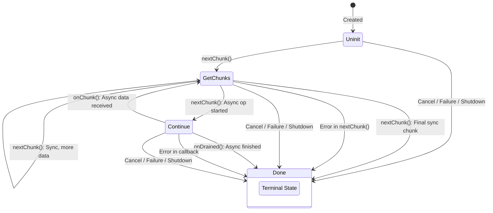

---

### Envoy::AdminResponse State Machine

This describes the lifecycle of an `AdminResponse` object, used for streaming potentially large responses from Envoy's admin interface.

#### States

*   **`Uninit`**:
    *   The initial state of the `AdminResponse` after it has been created.
    *   No data has been generated or sent yet.

*   **`GetChunks`**:
    *   The core state for producing data. The system enters this state when it's ready to generate the next part of the response.
    *   The `nextChunk()` method is called when the response is in this state.

*   **`Continue`**:
    *   Indicates that the response generation is waiting for an asynchronous operation to complete.
    *   This state is entered after `nextChunk()` initiates an operation that doesn't return data immediately (e.g., fetching data from another thread or component).

*   **`Done`**:
    *   The terminal state.
    *   No more data will be produced or callbacks made by this `AdminResponse`.
    *   The response is considered complete, cancelled, or has failed.

#### Transitions

1.  **`[*] --> Uninit`** (Label: `Created`)
    *   The `AdminResponse` object is instantiated and starts in the `Uninit` state.

2.  **`Uninit --> GetChunks`** (Label: `nextChunk()`)
    *   The first call to `nextChunk()` moves the state from `Uninit` to `GetChunks`, initiating the data generation process.

3.  **`GetChunks --> GetChunks`** (Label: `nextChunk(): Sync, more data`)
    *   When `nextChunk()` is called, it synchronously produces one or more data chunks, but there's still more data to come in subsequent calls. The state remains `GetChunks`.

4.  **`GetChunks --> Continue`** (Label: `nextChunk(): Async op started`)
    *   `nextChunk()` initiates an asynchronous operation to fetch/generate the next chunk. The state transitions to `Continue` to wait for the callback.

5.  **`GetChunks --> Done`** (Label: `nextChunk(): Final sync chunk`)
    *   `nextChunk()` synchronously produces the *final* data chunk. The response is now complete.

6.  **`Continue --> GetChunks`** (Label: `onChunk(): Async data received`)
    *   The asynchronous operation (started in `GetChunks`) completes and provides a data chunk via the `onChunk()` callback. The state returns to `GetChunks` to process this chunk and prepare for the next.

7.  **`Continue --> Done`** (Label: `onDrained(): Async finished`)
    *   The asynchronous operation signals that it's completely finished sending data, for example, by calling `onDrained()`.

8.  **`Uninit --> Done`** (Label: `Cancel / Failure / Shutdown`)
    *   The response is terminated while in the `Uninit` state. This can happen if `cancel()` is called, `onFailure()` is invoked, or the main Envoy server context is shutting down before `nextChunk()` is ever called.

9.  **`GetChunks --> Done`** (Label: `Error in nextChunk()` or `Cancel / Failure / Shutdown`)
    *   The response is terminated while in the `GetChunks` state. This can be due to:
        *   An error occurring during the execution of `nextChunk()`.
        *   `cancel()` being called.
        *   `onFailure()` being invoked.
        *   The main Envoy server context shutting down.

10. **`Continue --> Done`** (Label: `Error in callback` or `Cancel / Failure / Shutdown`)
    *   The response is terminated while waiting in the `Continue` state. This can be due to:
        *   An error occurring within the asynchronous callback (`onChunk()` or `onDrained()`).
        *   `cancel()` being called.
        *   `onFailure()` being invoked.
        *   The main Envoy server context shutting down.

---
