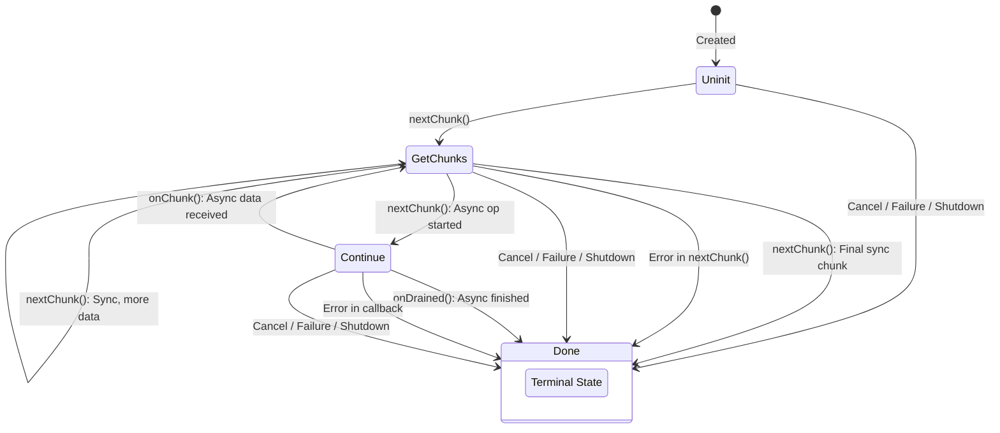

Explanation of Mermaid Syntax:

 * stateDiagram-v2: Declares a state diagram.
 * direction TB: Sets the direction from Top to Bottom.
 * [*]: Represents the start or end state.
   * [*] --> Uninit: Transition from start to Uninit.
 * State1 --> State2: Label: Defines a transition from State1 to State2 with a given Label.
 * The transitions for cancellation, failure, or shutdown are shown from each active state (Uninit, GetChunks, Continue) to the Done state.
 
