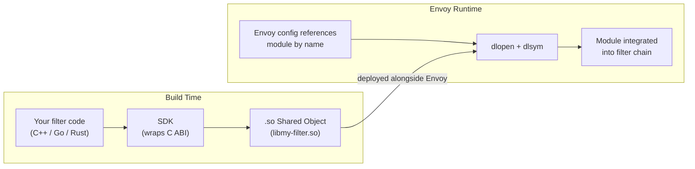
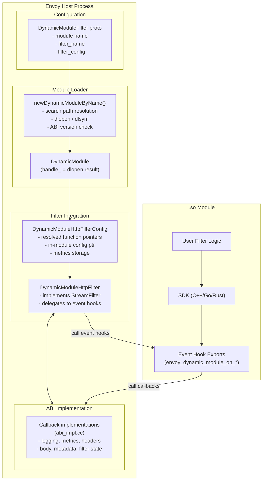
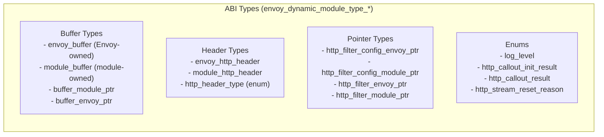
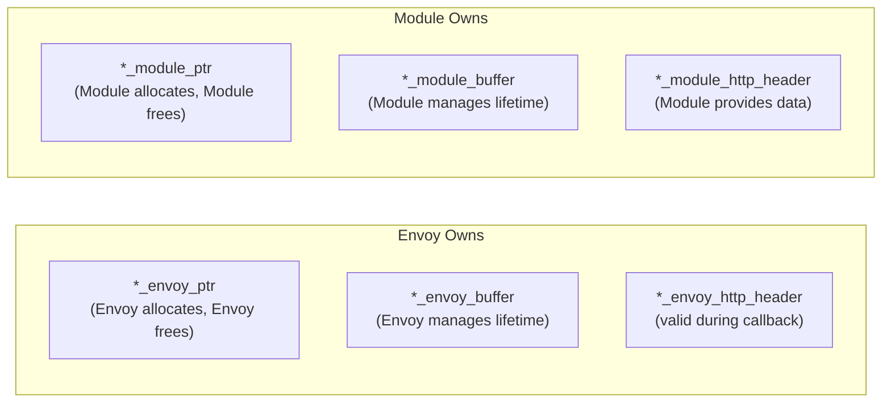
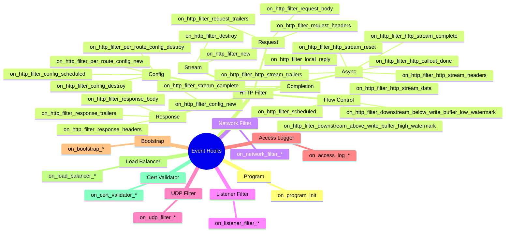
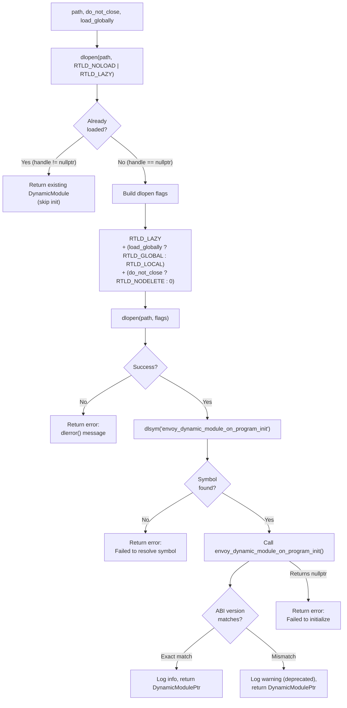
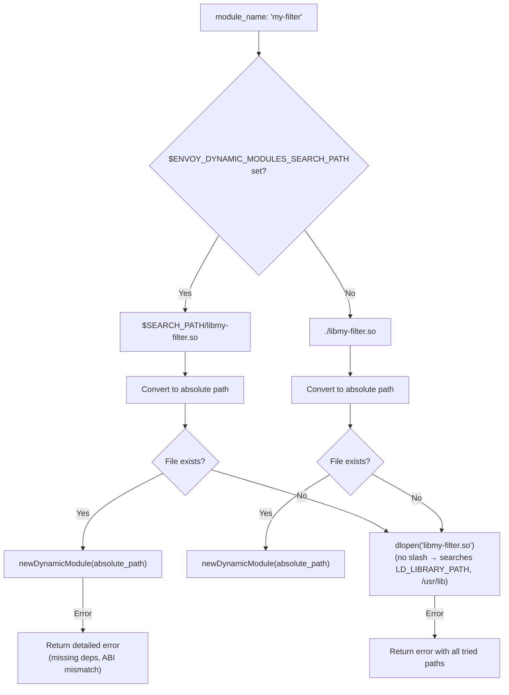
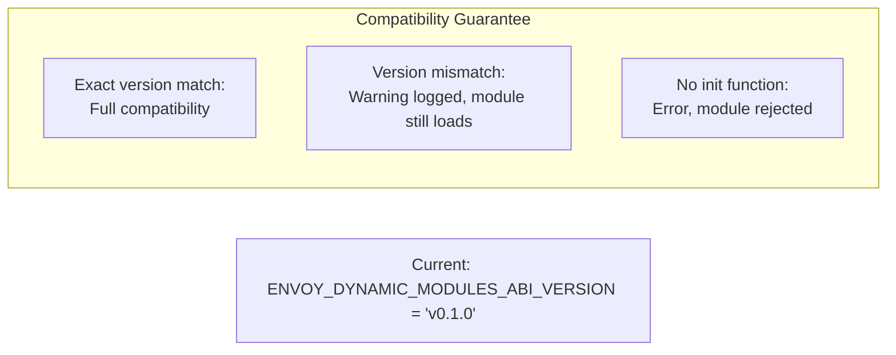
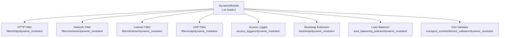

# Dynamic Modules Overview — Part 1: Architecture and ABI

## Series Navigation

| Part | Topic |
|------|-------|
| **Part 1** | **Architecture and ABI** (this document) |
| Part 2 | [HTTP Filter and Other Extensions](./OVERVIEW_PART2_http_filter_and_extensions.md) |
| Part 3 | [SDKs and Development Guide](./OVERVIEW_PART3_sdks_and_development.md) |
| Part 4 | [Callbacks, Metrics, Advanced Topics](./OVERVIEW_PART4_callbacks_metrics_advanced.md) |

---

## What Are Dynamic Modules?

Dynamic modules are **shared objects (`.so` files) loaded at runtime** via `dlopen` to extend Envoy without recompilation. They communicate with Envoy through a stable C ABI, enabling modules written in C++, Go, Rust, or any language that can produce C-compatible exports.

### Key Properties

| Property | Detail |
|----------|--------|
| **Trust model** | Modules run in-process with full Envoy privileges — they are trusted code |
| **Loading** | Via `dlopen` (POSIX), one `DynamicModule` instance per unique `.so` file |
| **Deduplication** | Same file (by inode) reuses existing handle via `RTLD_NOLOAD` |
| **Language support** | C++, Go, Rust via official SDKs; any C-ABI language possible |
| **Extension types** | HTTP filter, network filter, listener filter, UDP filter, access logger, bootstrap, load balancer, cert validator |

---

## High-Level Architecture

---

## File Map

| File | Size | Purpose |
|------|------|---------|
| `abi/abi.h` | ~346 KB | Complete C ABI definition (types, hooks, callbacks) |
| `abi_impl.cc` | ~20 KB | Common callback implementations (logging, concurrency, function registry) |
| `dynamic_modules.h` | ~4 KB | `DynamicModule` class — wraps dlopen handle |
| `dynamic_modules.cc` | ~6 KB | Loading logic — search path, dlopen, ABI version check |
| `STYLE.md` | ~6 KB | ABI naming conventions and documentation style guide |
| `sdk/cpp/sdk.h` | ~28 KB | C++ SDK interfaces (HttpFilter, HeaderMap, BodyBuffer) |
| `sdk/cpp/sdk.cc` | ~2 KB | C++ SDK registration and destructors |
| `sdk/cpp/sdk_internal.cc` | ~39 KB | C++ SDK ABI bridge implementations |
| `sdk/cpp/sdk_fake.h` | ~3 KB | C++ test fakes |
| `sdk/go/sdk.go` | ~2 KB | Go SDK entry point |
| `sdk/go/abi/internal.go` | ~46 KB | Go CGo ABI bridge |
| `sdk/go/shared/api.go` | ~8 KB | Go SDK interfaces |
| `sdk/go/shared/base.go` | ~23 KB | Go SDK base types and implementations |
| `sdk/rust/src/lib.rs` | ~317 KB | Rust SDK (macros, traits, bindings) |
| `sdk/rust/build.rs` | ~2 KB | Rust bindgen build script |

---

## The C ABI (`abi/abi.h`)

The ABI header is the single source of truth for the contract between Envoy and modules. At ~346 KB, it is comprehensive and covers all extension types.

### Type System

### Ownership Model

### Event Hook Categories

---

## Module Loading Deep Dive

### `newDynamicModule` — The Core Loader

### `newDynamicModuleByName` — Name Resolution

---

## ABI Version Compatibility

**Why warn on mismatch instead of reject?** Forward compatibility — a module compiled against an older ABI version may still work if no removed functions are called. The warning alerts operators to recompile.

---

## All Extension Types Supported

Each extension type follows the same pattern:
1. Proto config references a dynamic module by name
2. Factory loads the module via `newDynamicModuleByName`
3. Config class resolves extension-specific event hooks
4. Per-stream/connection instance delegates to the module
