# Dynamic Modules Overview — Part 2: HTTP Filter and Other Extensions

## Series Navigation

| Part | Topic |
|------|-------|
| Part 1 | [Architecture and ABI](./OVERVIEW_PART1_architecture_and_abi.md) |
| **Part 2** | **HTTP Filter and Other Extensions** (this document) |
| Part 3 | [SDKs and Development Guide](./OVERVIEW_PART3_sdks_and_development.md) |
| Part 4 | [Callbacks, Metrics, Advanced Topics](./OVERVIEW_PART4_callbacks_metrics_advanced.md) |

---

## HTTP Filter — The Primary Extension

### End-to-End Flow

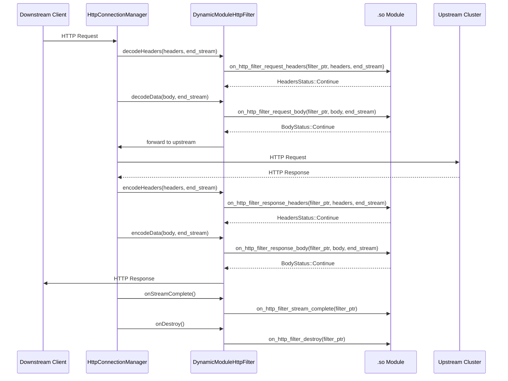

### Filter Status Return Values

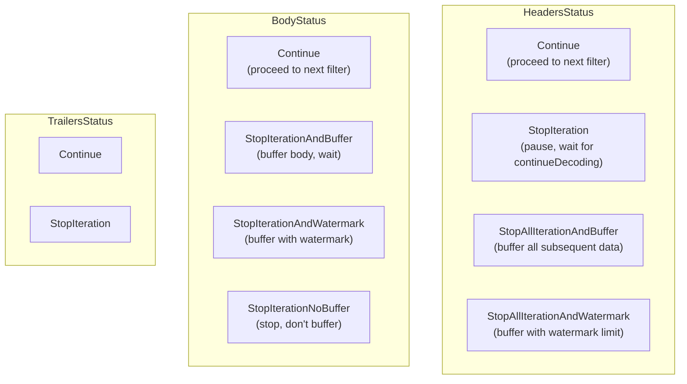

### Local Reply (Short Circuit)

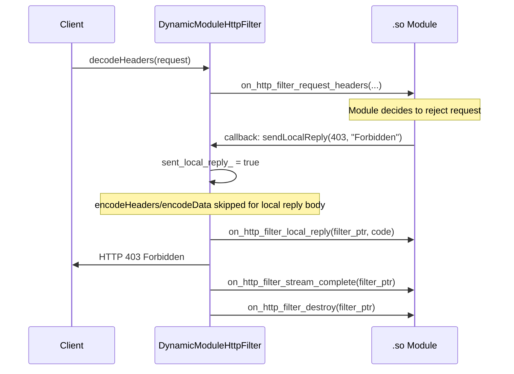

### Re-entrancy Protection

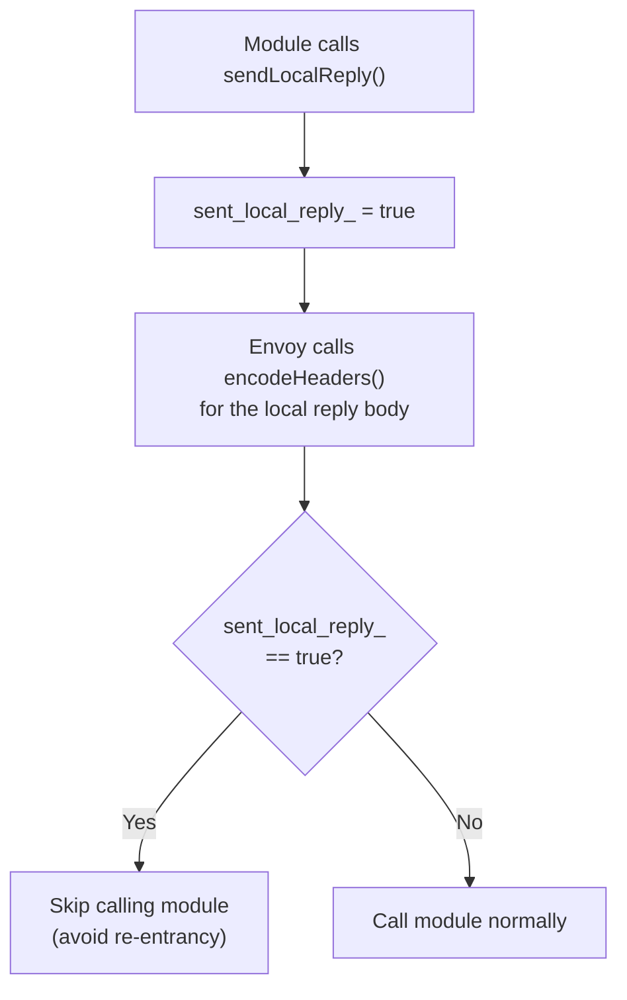

---

## HTTP Callouts — Async Sub-Requests

Modules can make HTTP requests to other clusters during request processing:

```mermaid
flowchart TD
    subgraph SimpleCallout["Simple HTTP Callout"]
        SC1["Module calls httpCallout(cluster, request, timeout)"]
        SC2["Envoy sends request to cluster"]
        SC3["Response received"]
        SC4["on_http_filter_http_callout_done(filter, id, result)"]
    end

    subgraph StreamCallout["Streaming HTTP Callout"]
        ST1["Module calls startHttpStream(cluster, headers, timeout)"]
        ST2["Module calls sendStreamData(data, end_stream)"]
        ST3["on_http_filter_http_stream_headers(filter, stream_id, headers)"]
        ST4["on_http_filter_http_stream_data(filter, stream_id, data)"]
        ST5["on_http_filter_http_stream_complete(filter, stream_id)"]
    end

    SC1 --> SC2 --> SC3 --> SC4
    ST1 --> ST2 --> ST3 --> ST4 --> ST5
```

### Callout Result Types

| Result | Meaning |
|--------|---------|
| `Success` | Full response received |
| `Failure` | Connection/timeout failure |
| `Reset` | Stream was reset |

---

## Network Filter Extension

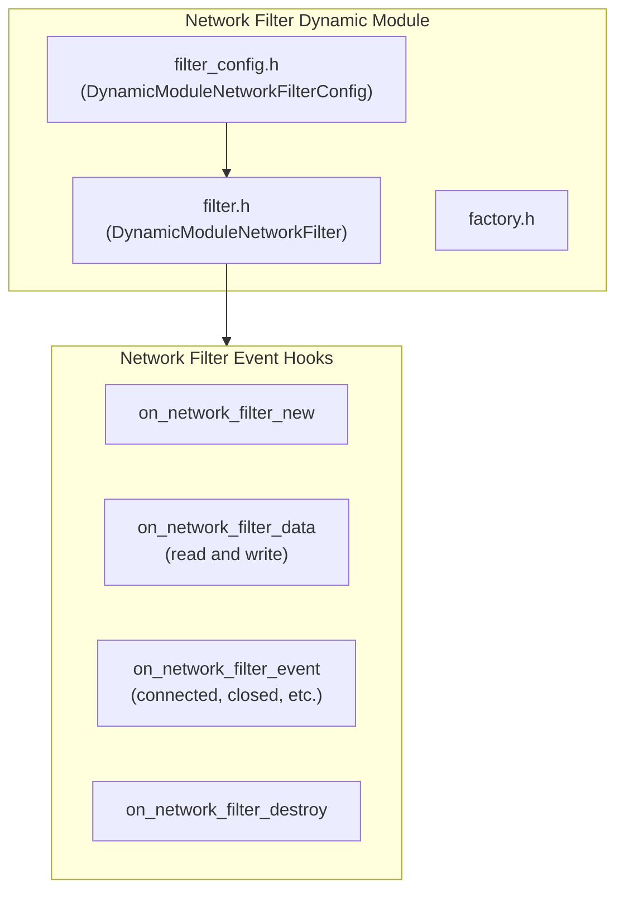

### Network vs HTTP Filter

| Aspect | HTTP Filter | Network Filter |
|--------|------------|----------------|
| Layer | L7 (HTTP) | L4 (TCP/raw bytes) |
| Data unit | Headers + Body + Trailers | Raw byte buffers |
| Callbacks | Request/Response split | Read/Write direction |
| Protocol awareness | Full HTTP semantics | Protocol-agnostic |

---

## Listener Filter Extension

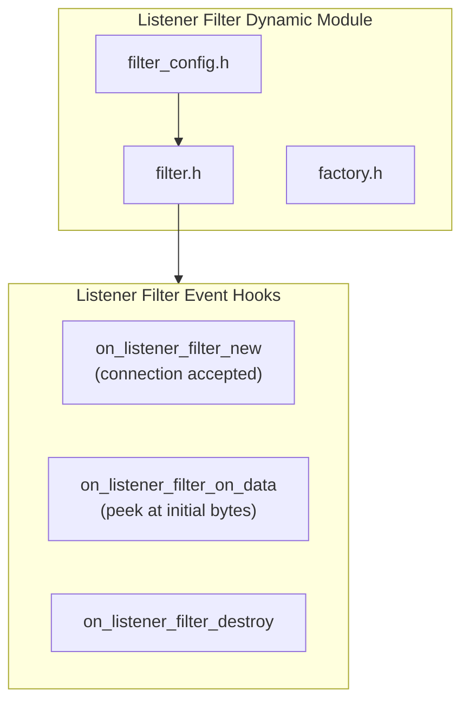

---

## UDP Filter Extension

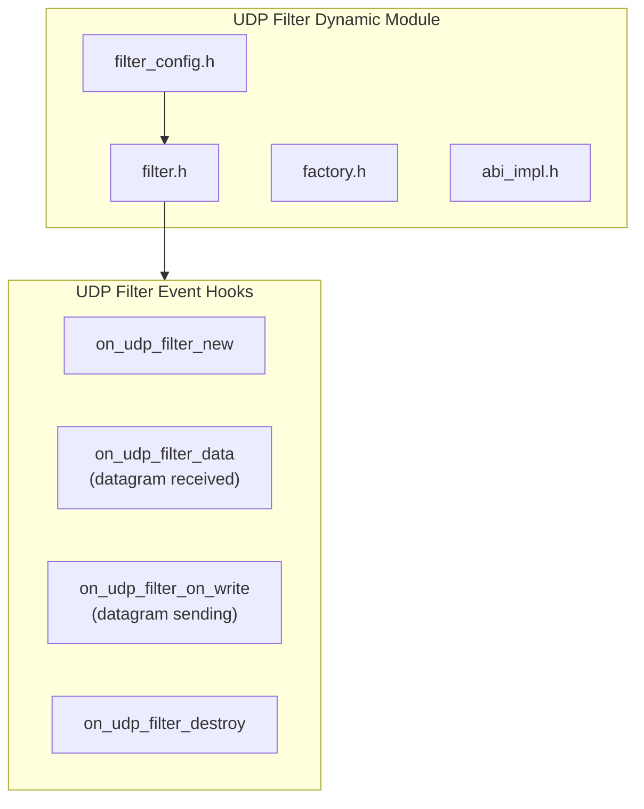

---

## Access Logger Extension

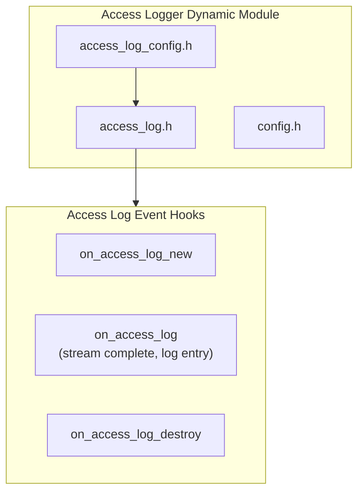

---

## Bootstrap Extension

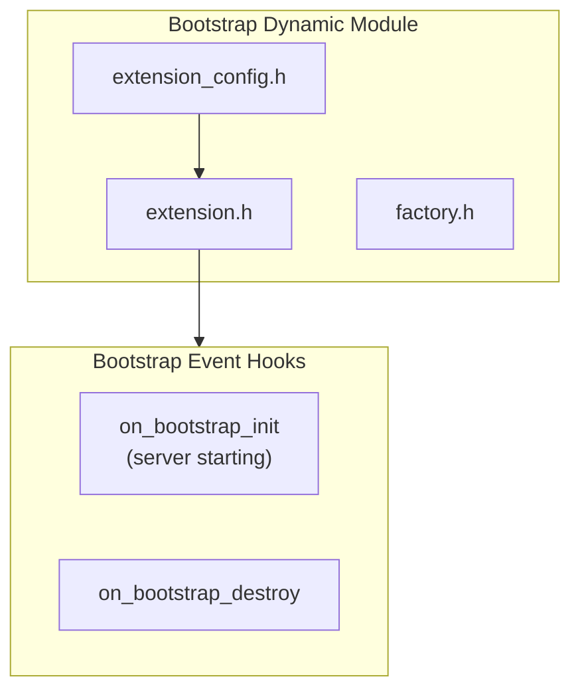

---

## Load Balancer Extension

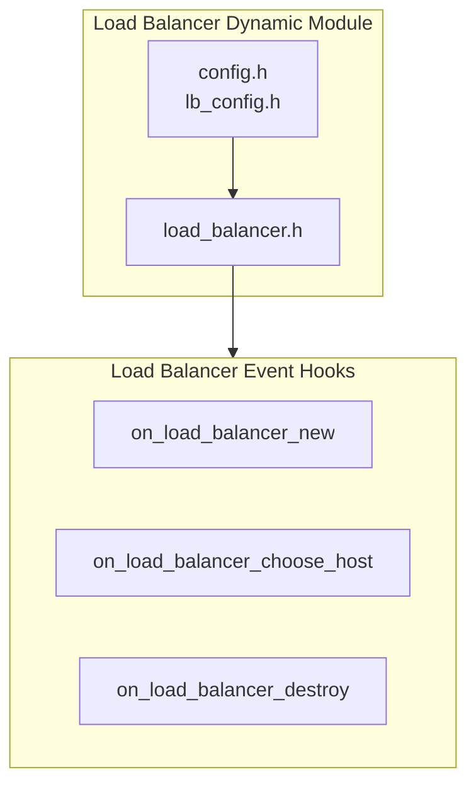

---

## Cert Validator Extension

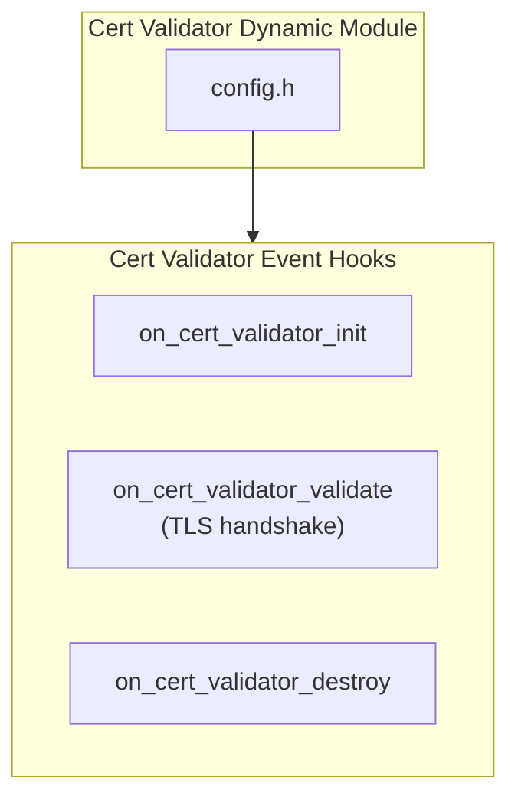

---

## Extension Type Summary

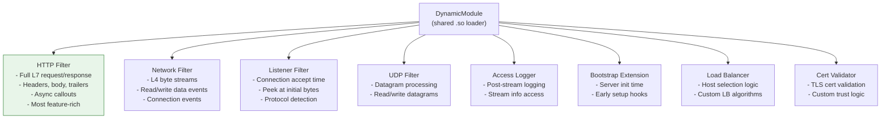

---

## Proto Configuration

### DynamicModuleConfig (shared across extensions)

```mermaid
mindmap
  root((DynamicModuleConfig))
    name
      Module name
      Resolves to lib{name}.so
    do_not_close
      Skip dlclose
      Required for Go modules
    load_globally
      RTLD_GLOBAL flag
      Share symbols between modules
    metrics_namespace
      Prefix for custom metrics
      Default: dynamicmodulescustom
```

### DynamicModuleFilter (HTTP filter specific)

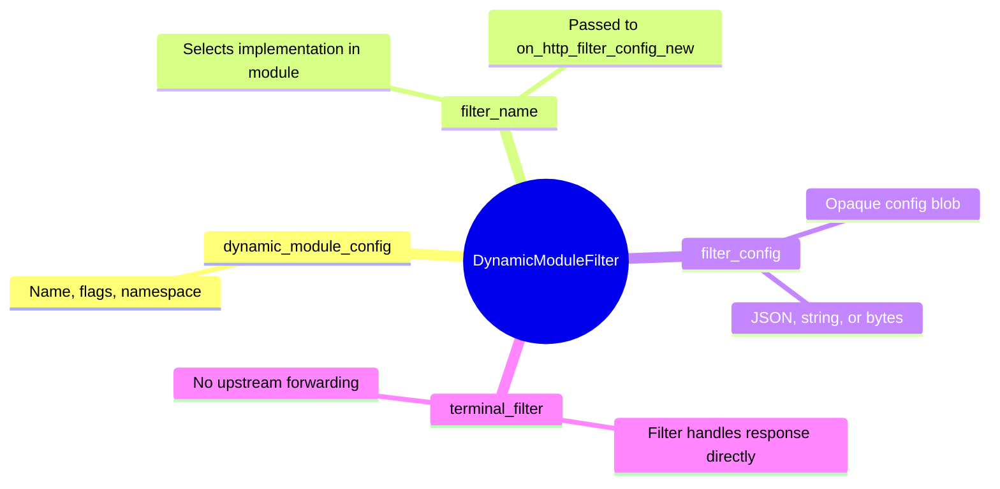
