# Dynamic Modules Overview — Part 3: SDKs and Development Guide

## Series Navigation

| Part | Topic |
|------|-------|
| Part 1 | [Architecture and ABI](./OVERVIEW_PART1_architecture_and_abi.md) |
| Part 2 | [HTTP Filter and Other Extensions](./OVERVIEW_PART2_http_filter_and_extensions.md) |
| **Part 3** | **SDKs and Development Guide** (this document) |
| Part 4 | [Callbacks, Metrics, Advanced Topics](./OVERVIEW_PART4_callbacks_metrics_advanced.md) |

---

## SDK Stack

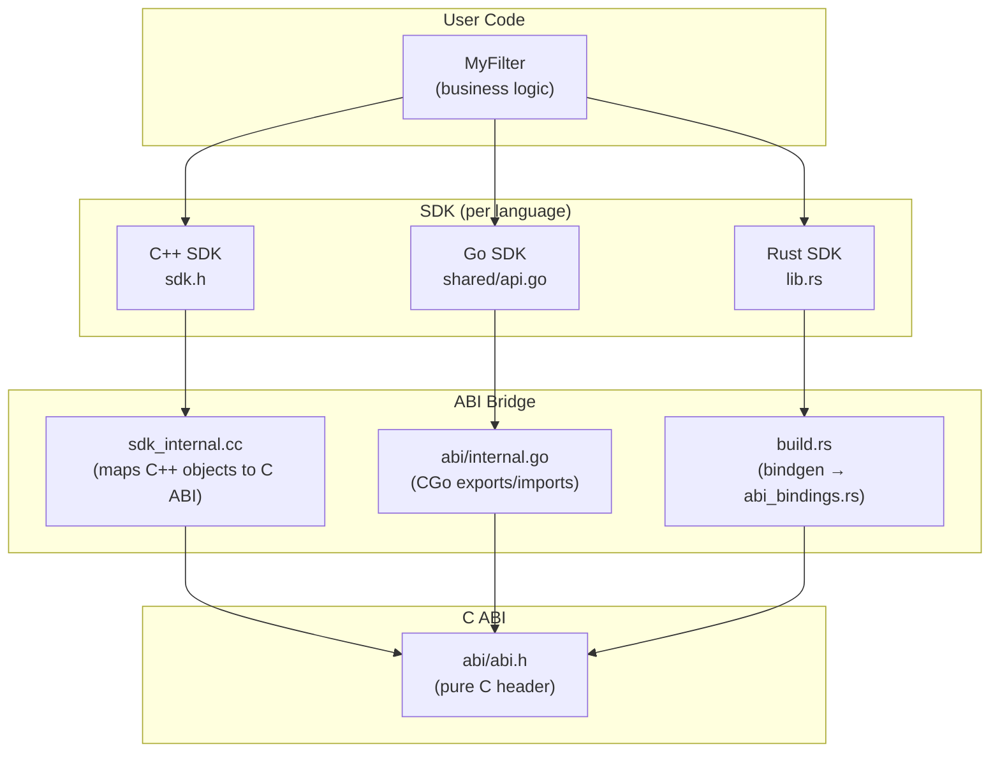

---

## C++ SDK — Developing a Filter

### Step 1: Implement the Interfaces

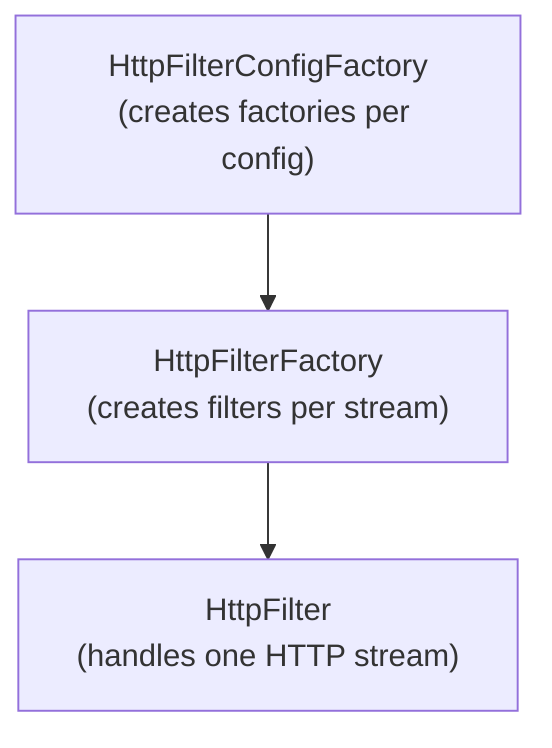

### Step 2: Use the Handle API

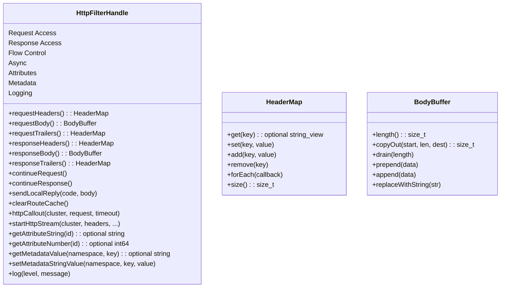

### Step 3: Register

```cpp
REGISTER_HTTP_FILTER_CONFIG_FACTORY(MyFilterConfigFactory);
```

### C++ Build Output

Compile to a shared library:
```
g++ -shared -fPIC -o libmy-filter.so my_filter.cc -lenvoy_dynamic_modules_sdk
```

### C++ SDK Internals

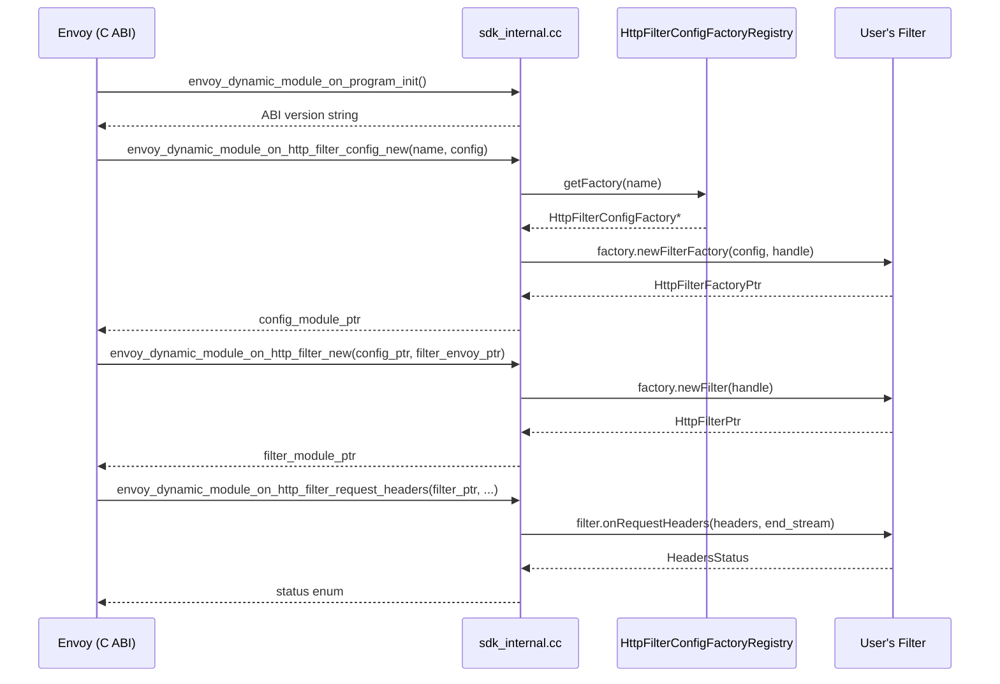

---

## Go SDK — Developing a Filter

### Key Interfaces

```go
type HttpFilterConfigFactory interface {
    Name() string
    NewFilterFactory(config string, handle HttpFilterConfigHandle) HttpFilterFactory
}

type HttpFilterFactory interface {
    NewFilter(handle HttpFilterHandle) HttpFilter
}

type HttpFilter interface {
    OnRequestHeaders(headers HeaderMap, endStream bool) HeadersStatus
    OnRequestBody(body BodyBuffer, endStream bool) BodyStatus
    OnRequestTrailers(trailers HeaderMap) TrailersStatus
    OnResponseHeaders(headers HeaderMap, endStream bool) HeadersStatus
    OnResponseBody(body BodyBuffer, endStream bool) BodyStatus
    OnResponseTrailers(trailers HeaderMap) TrailersStatus
    OnStreamComplete()
    OnDestroy()
}
```

### EmptyHttpFilter — Default No-Op

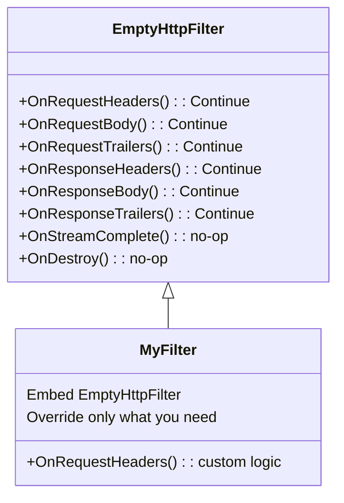

### Go Registration

```go
func init() {
    sdk.RegisterHttpFilterConfigFactories(&MyFilterConfigFactory{})
}
```

### Go CGo Bridge Architecture

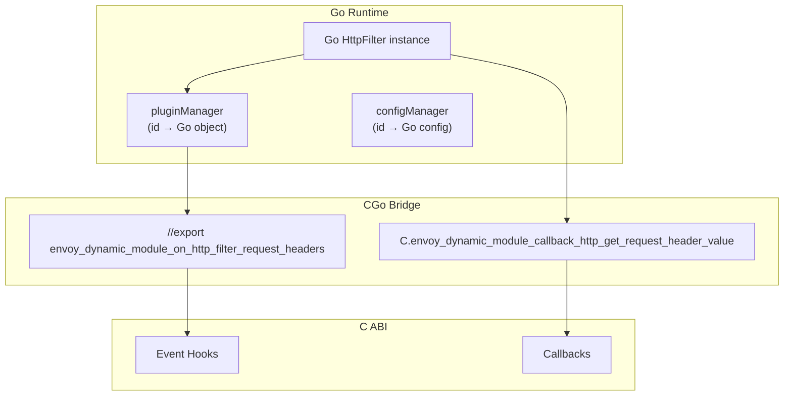

### Go-Specific: ID-Based Object Management

Go's garbage collector can move objects, so pointers can't cross the CGo boundary. The SDK uses ID-based maps:

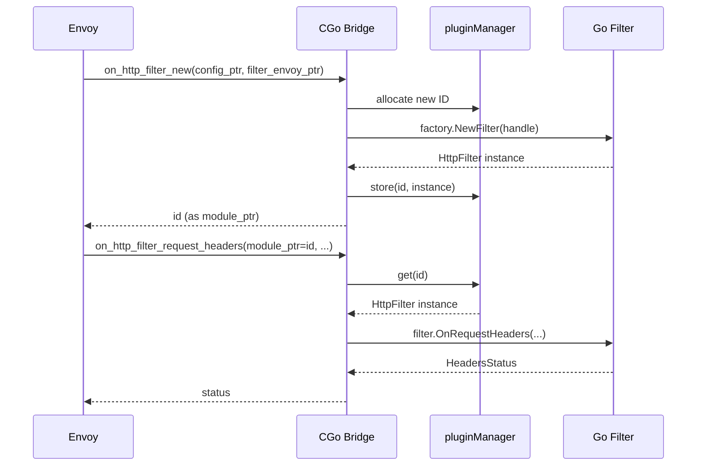

### Go Build

```bash
CGO_ENABLED=1 go build -buildmode=c-shared -o libmy-filter.so ./...
```

**Important:** Set `do_not_close: true` in the Envoy config because Go does not support `dlclose`.

---

## Rust SDK — Developing a Filter

### Rust Traits

```rust
pub trait HttpFilterConfigFactory: Send + Sync {
    fn name(&self) -> &str;
    fn new_filter_factory(
        &self,
        config: &str,
        handle: HttpFilterConfigHandle,
    ) -> Box<dyn HttpFilterFactory>;
}

pub trait HttpFilterFactory: Send + Sync {
    fn new_filter(&self, handle: HttpFilterHandle) -> Box<dyn HttpFilter>;
}

pub trait HttpFilter {
    fn on_request_headers(&mut self, headers: &HeaderMap, end_stream: bool) -> HeadersStatus;
    fn on_request_body(&mut self, body: &BodyBuffer, end_stream: bool) -> BodyStatus;
    // ... etc
}
```

### Rust Registration Macro

```rust
declare_init_functions!(MyFilterConfigFactory);
```

This macro generates the `envoy_dynamic_module_on_program_init` export and the registration glue.

### Rust Build System

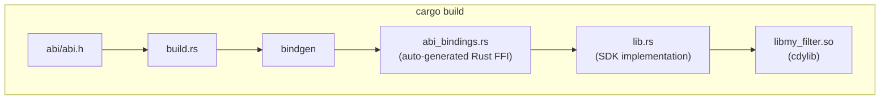

### Cargo.toml

```toml
[lib]
crate-type = ["cdylib"]

[dependencies]
envoy-dynamic-modules-rust-sdk = { path = "..." }
```

### Rust SDK Additional Features

| Module | Purpose |
|--------|---------|
| `buffer.rs` | Buffer view and manipulation types |
| `access_log.rs` | Access logger trait and registration |
| `cert_validator.rs` | Certificate validator trait |
| `lib.rs` | Core SDK: logging macros, function registry, HTTP filter traits |

---

## Development Workflow

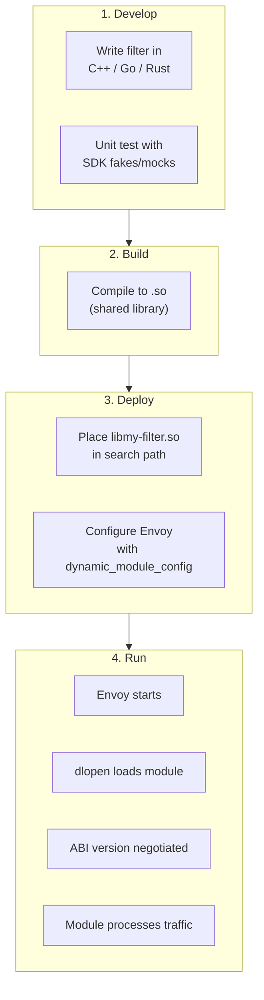

### Envoy Configuration Example

```yaml
http_filters:
- name: envoy.filters.http.dynamic_modules
  typed_config:
    "@type": type.googleapis.com/envoy.extensions.filters.http.dynamic_modules.v3.DynamicModuleFilter
    dynamic_module_config:
      name: my-filter          # loads libmy-filter.so
      do_not_close: false      # true for Go modules
    filter_name: my-filter     # selects implementation in module
    filter_config: '{"key": "value"}'  # passed to module
```

---

## Testing Framework

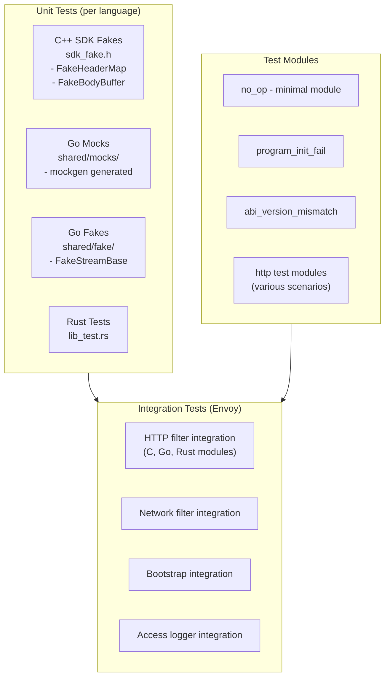

### Parameterized Multi-Language Tests

Tests run the same scenarios across C, Go, and Rust:

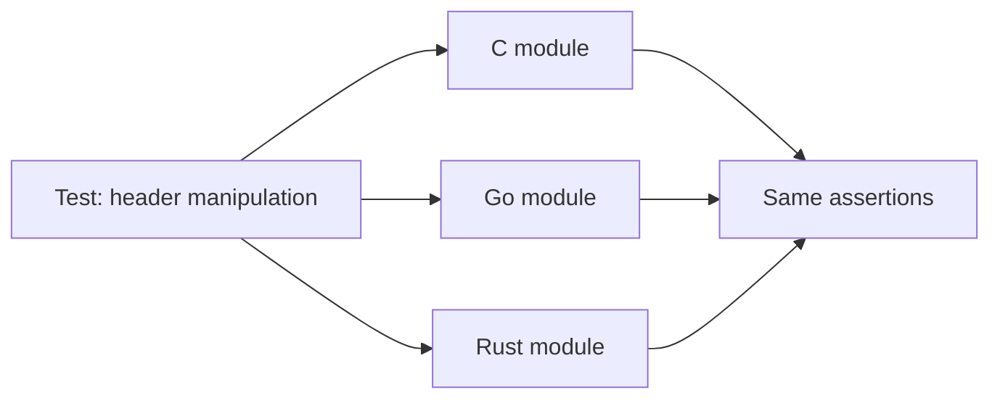

The `DynamicModuleTestLanguages` test parameter provides all language variants, and `testSharedObjectPath()` resolves the correct `.so` path for each.
