# Dynamic Modules Overview — Part 4: Callbacks, Metrics, and Advanced Topics

## Series Navigation

| Part | Topic |
|------|-------|
| Part 1 | [Architecture and ABI](./OVERVIEW_PART1_architecture_and_abi.md) |
| Part 2 | [HTTP Filter and Other Extensions](./OVERVIEW_PART2_http_filter_and_extensions.md) |
| Part 3 | [SDKs and Development Guide](./OVERVIEW_PART3_sdks_and_development.md) |
| **Part 4** | **Callbacks, Metrics, and Advanced Topics** (this document) |

---

## Complete Callback Reference

### Common Callbacks (Available to All Extensions)

```mermaid
mindmap
  root((Common Callbacks))
    Logging
      callback_log(level, message)
      callback_log_enabled(level): bool
    Concurrency
      callback_get_concurrency(): uint32
    Function Registry
      callback_register_function(name, fn_ptr)
      callback_get_function(name): fn_ptr
```

### HTTP Filter Callbacks — Header Manipulation

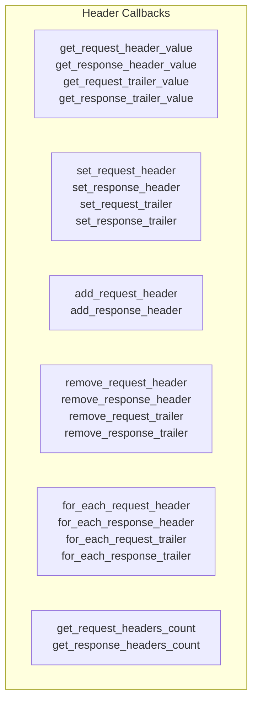

### HTTP Filter Callbacks — Body Manipulation

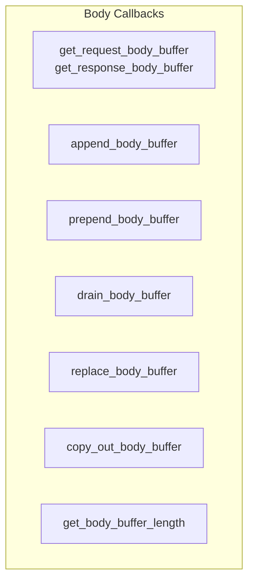

### HTTP Filter Callbacks — Flow Control

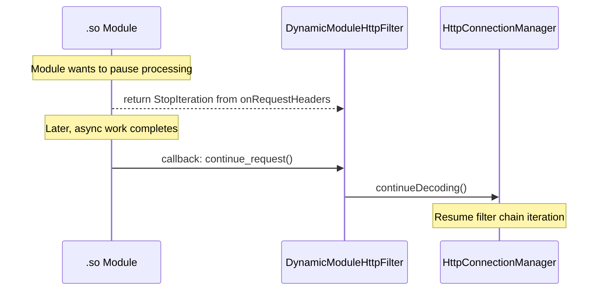

### HTTP Filter Callbacks — Metadata and Filter State

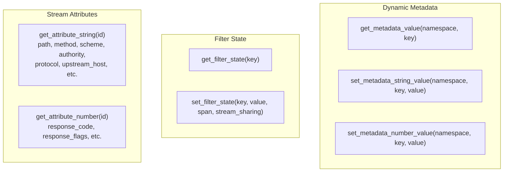

### HTTP Filter Callbacks — Async Operations

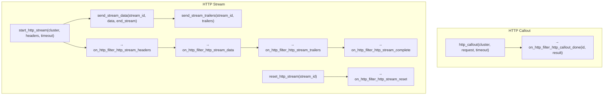

---

## Metrics System

### Metric Definition (Config Time)

Metrics must be defined during `on_http_filter_config_new`. After config initialization, stat creation is frozen to avoid lock contention on the hot path.

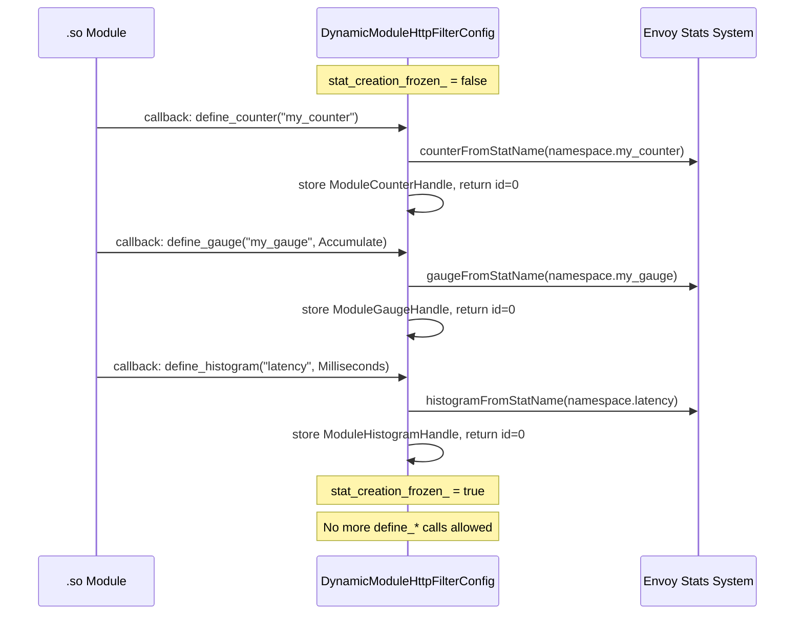

### Metric Recording (Request Time)

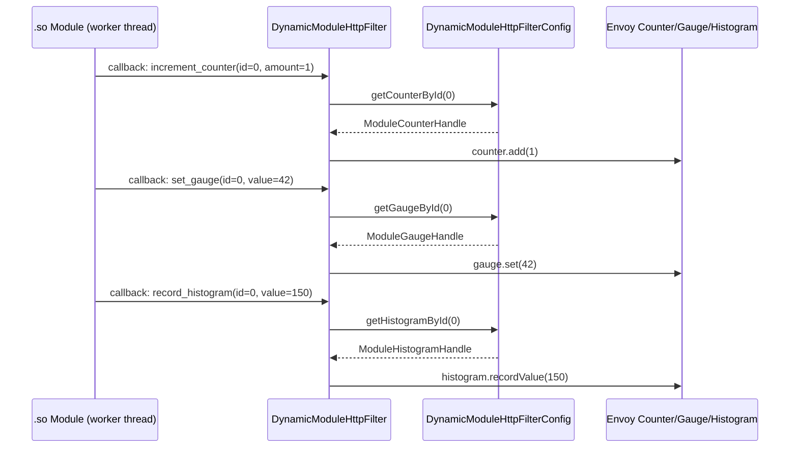

### Metric Vec (Labeled Metrics)

For metrics with dynamic labels (e.g., per-status-code counters):

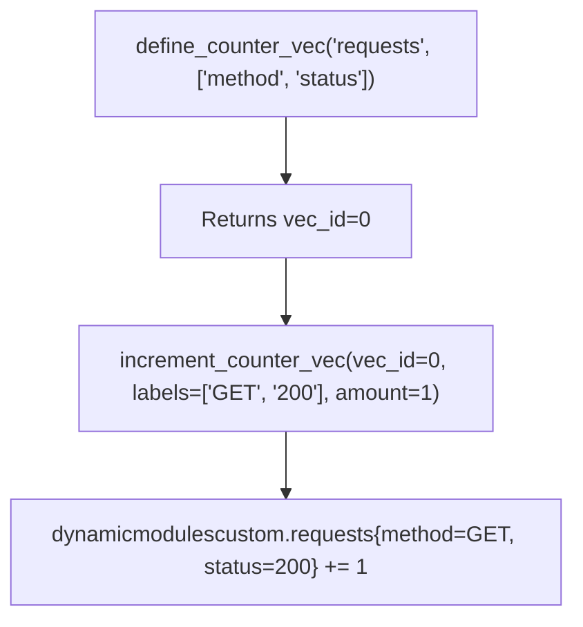

### Metric Types

| Type | Operations | Use Case |
|------|-----------|----------|
| **Counter** | `add(amount)` | Monotonically increasing (requests, errors) |
| **CounterVec** | `add(labels, amount)` | Labeled counter (per method/status) |
| **Gauge** | `set(value)`, `increase(amount)`, `decrease(amount)` | Current value (connections, queue depth) |
| **GaugeVec** | `set/increase/decrease(labels, value)` | Labeled gauge |
| **Histogram** | `recordValue(value)` | Distributions (latency, size) |
| **HistogramVec** | `recordValue(labels, value)` | Labeled histogram |

---

## Cross-Thread Scheduling

### Worker Thread Scheduling

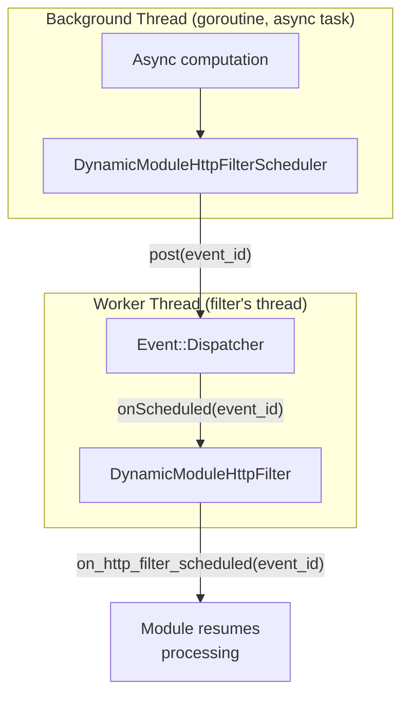

### Config-Level Scheduling

Similar to filter-level, but for operations that need the main thread:

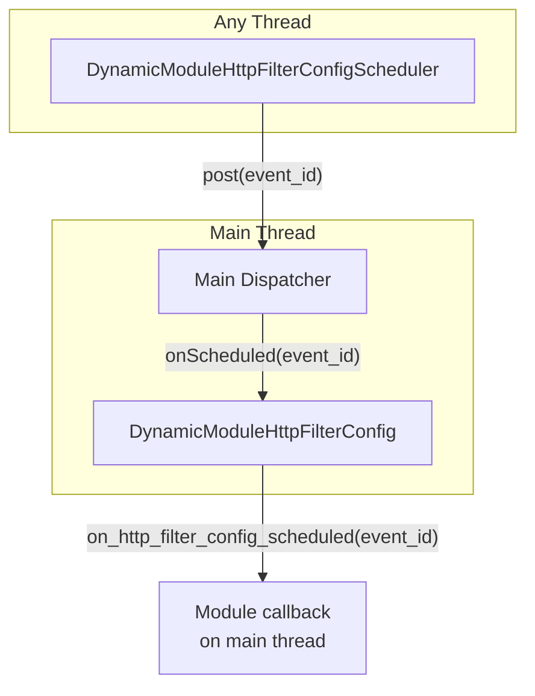

### Scheduler Lifecycle

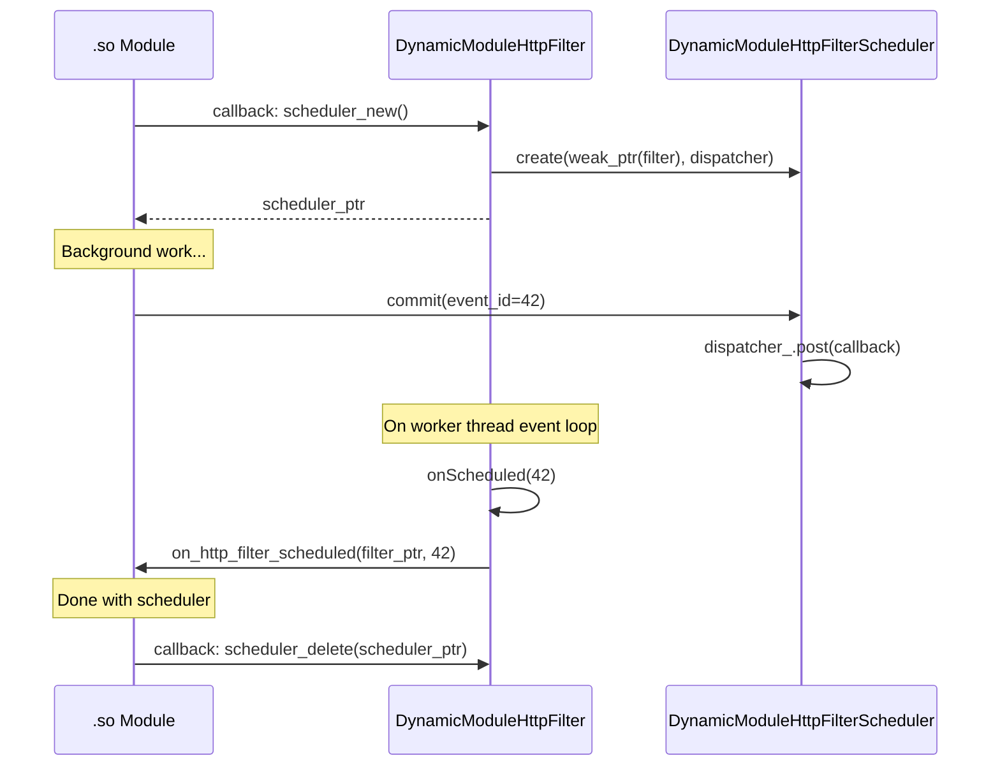

**Safety:** The scheduler holds a `weak_ptr` to the filter. If the filter is destroyed before the scheduled event fires, the `weak_ptr::lock()` returns null and the event is silently dropped.

---

## Socket Options

Modules can store and retrieve socket options per stream:

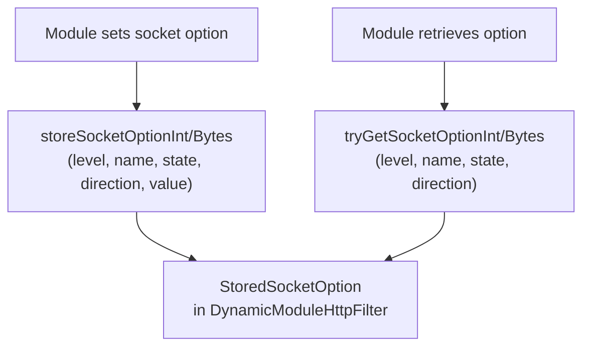

---

## Function Registry

Modules can register and look up function pointers by name, enabling cross-module communication:

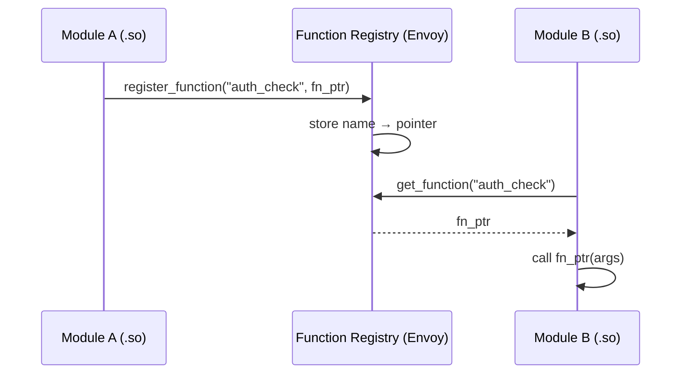

---

## Per-Route Configuration

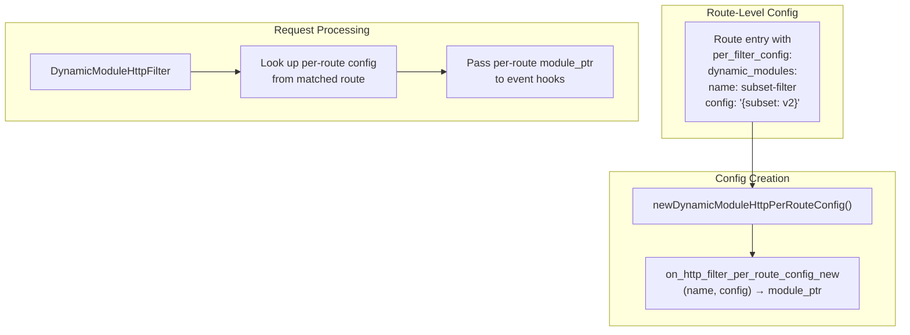

---

## Error Handling

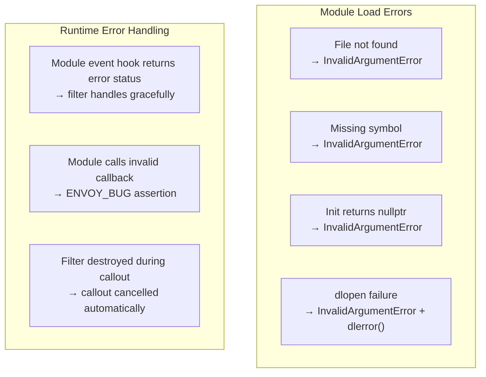

---

## Comparison with Other Extension Mechanisms

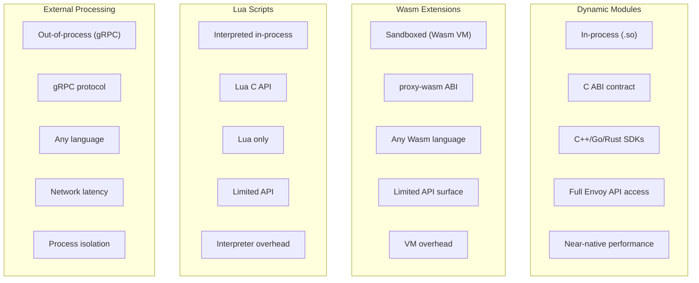

| Feature | Dynamic Modules | Wasm | Lua | Ext Processing |
|---------|----------------|------|-----|----------------|
| **Isolation** | None (in-process) | Sandboxed | None | Full (separate process) |
| **Performance** | Native | ~2-10x overhead | ~5-20x overhead | Network RTT |
| **Language** | C++, Go, Rust | Any → Wasm | Lua | Any |
| **API surface** | Full Envoy | Limited proxy-wasm | Limited | gRPC protocol |
| **Trust** | Full trust required | Untrusted OK | Semi-trusted | Untrusted OK |
| **Deployment** | .so alongside Envoy | .wasm file | Inline/file | Separate service |
| **Hot reload** | New config load | Yes | Yes | Service restart |

---

## Troubleshooting

### Module Won't Load

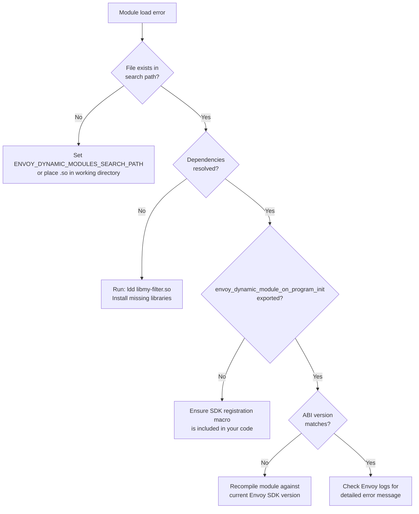

### Go Module Crashes on Unload

```
Set do_not_close: true in DynamicModuleConfig
Go runtime does not support dlclose
```

### Module Symbol Conflicts

```
Set load_globally: false (default)
Each module gets its own symbol namespace via RTLD_LOCAL
Only use RTLD_GLOBAL if modules need to share symbols
```
