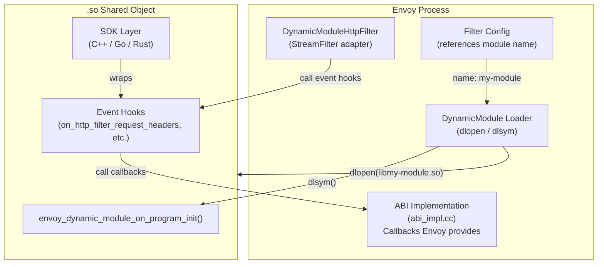
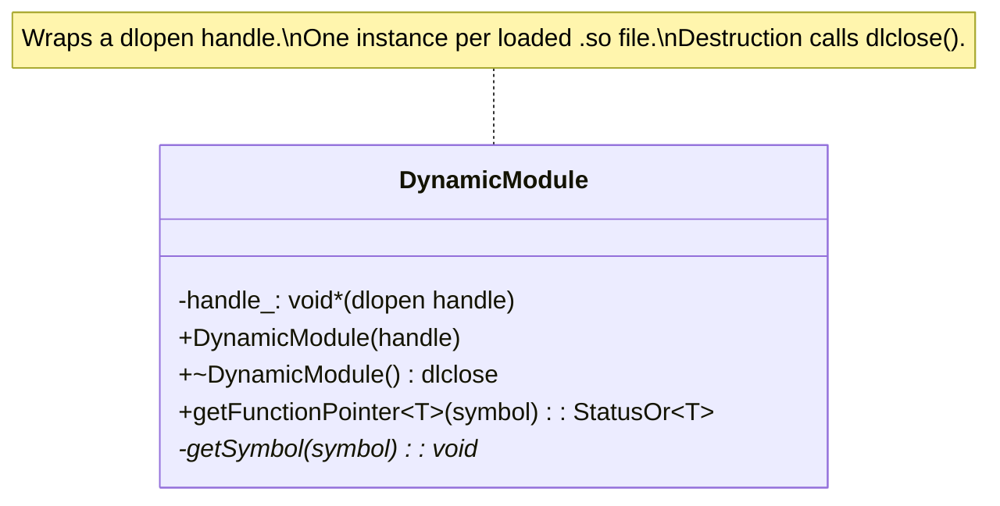
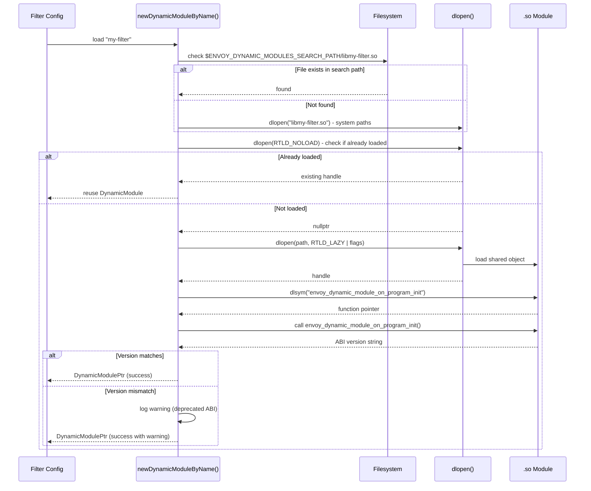
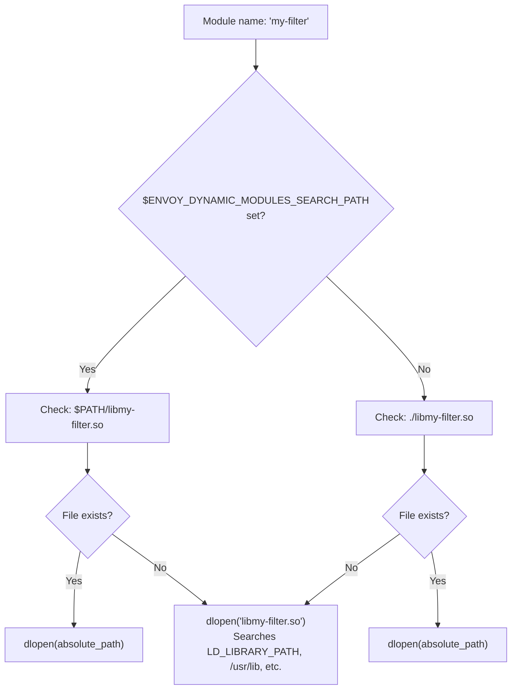
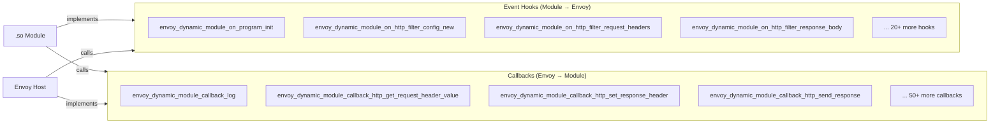
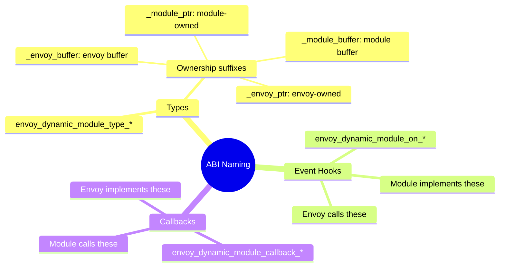
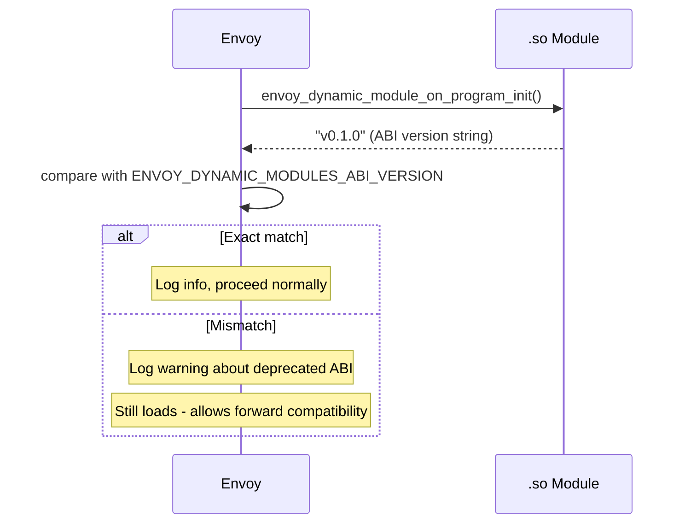

# Dynamic Modules — Core Loading and ABI

**Files:** `dynamic_modules.h`, `dynamic_modules.cc`, `abi/abi.h`, `abi_impl.cc`  
**Namespace:** `Envoy::Extensions::DynamicModules`

## Overview

Dynamic Modules allow extending Envoy at runtime by loading shared objects (`.so` files) via `dlopen`. Instead of recompiling Envoy, developers write modules in C++, Go, or Rust using a stable C ABI, compile them as shared libraries, and configure Envoy to load them.

## Architecture

## `DynamicModule` Class

## Module Loading Flow

## dlopen Flags

| Flag | When Used | Purpose |
|------|-----------|---------|
| `RTLD_LAZY` | Always | Resolve symbols lazily (required) |
| `RTLD_LOCAL` | Default | Symbols not shared with other modules |
| `RTLD_GLOBAL` | `load_globally=true` | Share symbols between modules |
| `RTLD_NODELETE` | `do_not_close=true` | Don't unload on dlclose (needed for Go) |
| `RTLD_NOLOAD` | Pre-check | Test if already loaded without loading |

## Module Search Path

## ABI Overview

The ABI is defined as a pure C header (`abi/abi.h`, ~346KB) that serves as the contract between Envoy and dynamic modules. It defines two categories of functions:

## ABI Naming Convention

## ABI Version Negotiation

## Common ABI Callbacks (abi_impl.cc)

| Callback | Purpose |
|----------|---------|
| `envoy_dynamic_module_callback_log` | Write to Envoy's logger at specified level |
| `envoy_dynamic_module_callback_log_enabled` | Check if a log level is enabled |
| `envoy_dynamic_module_callback_get_concurrency` | Get number of worker threads |
| `envoy_dynamic_module_callback_register_function` | Register a function pointer by name |
| `envoy_dynamic_module_callback_get_function` | Retrieve a registered function pointer |
