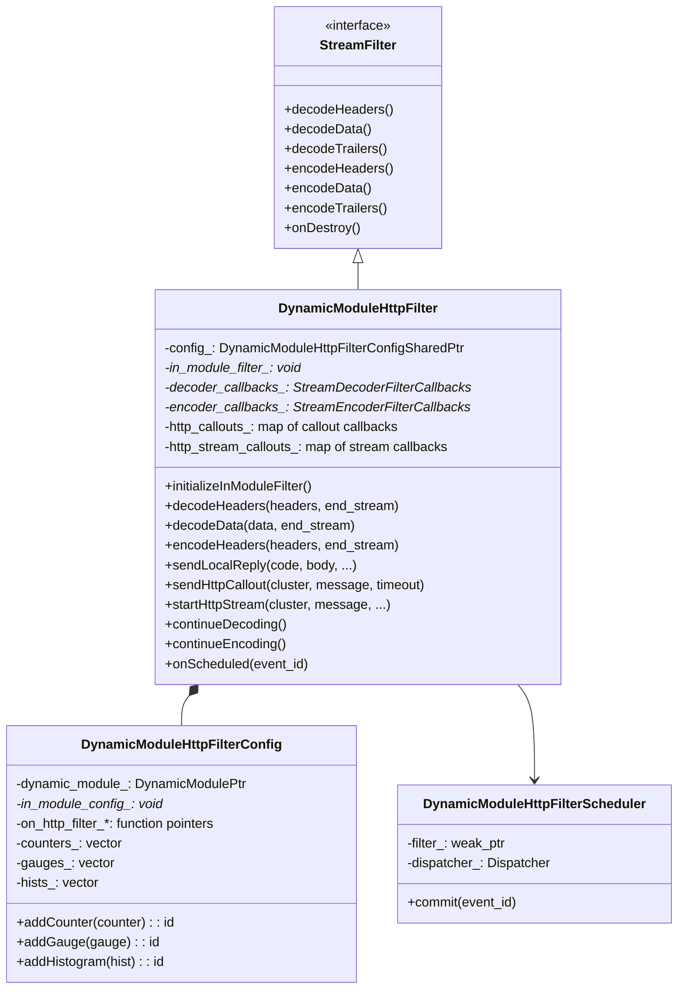
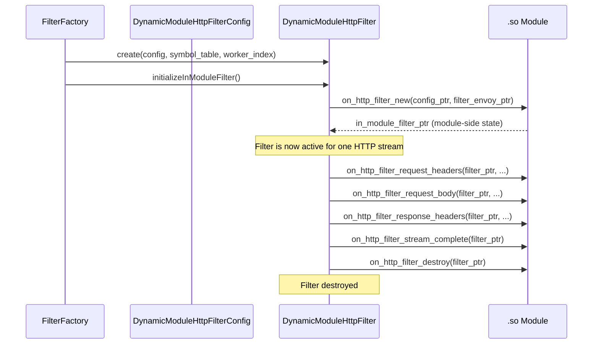
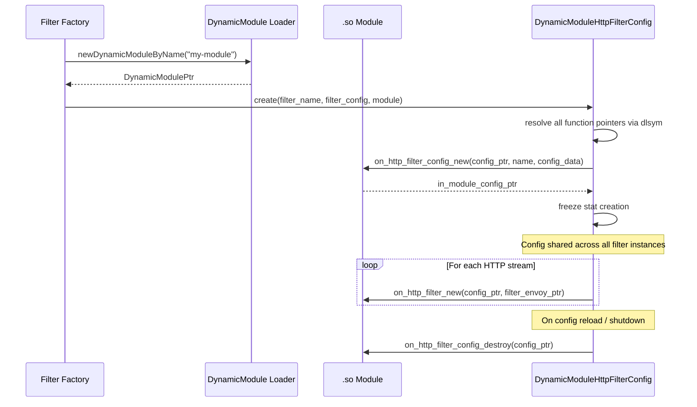
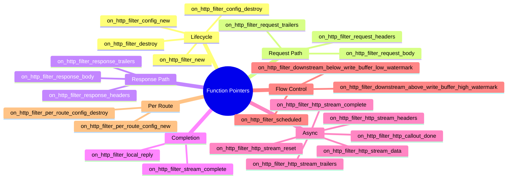
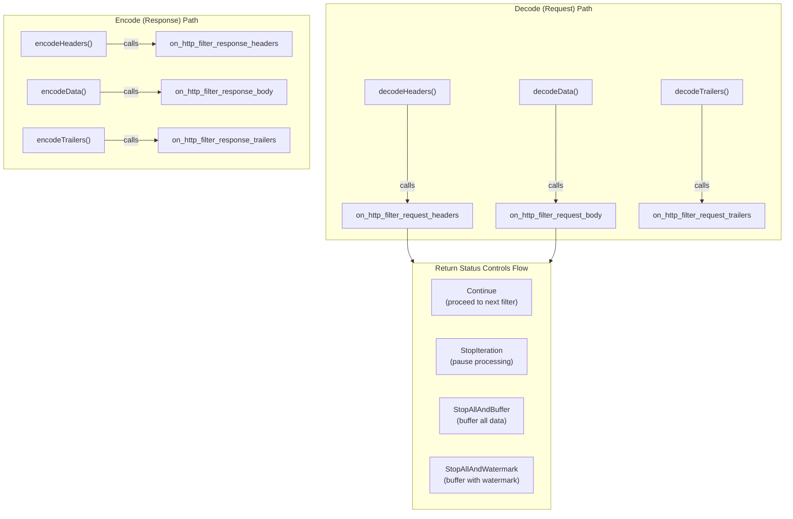
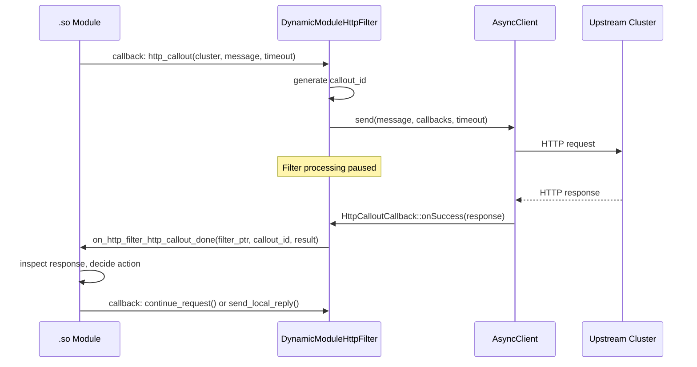
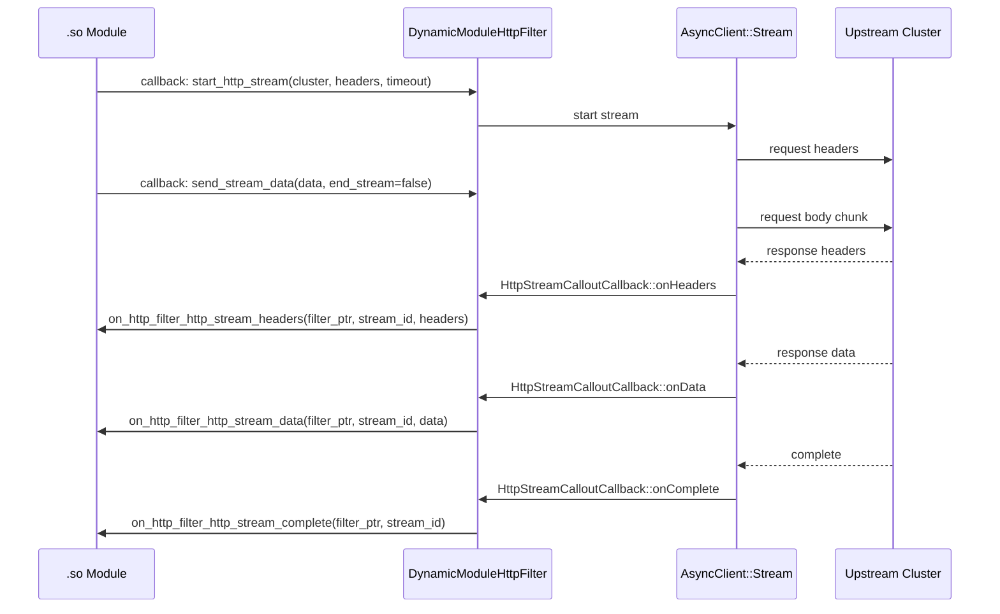
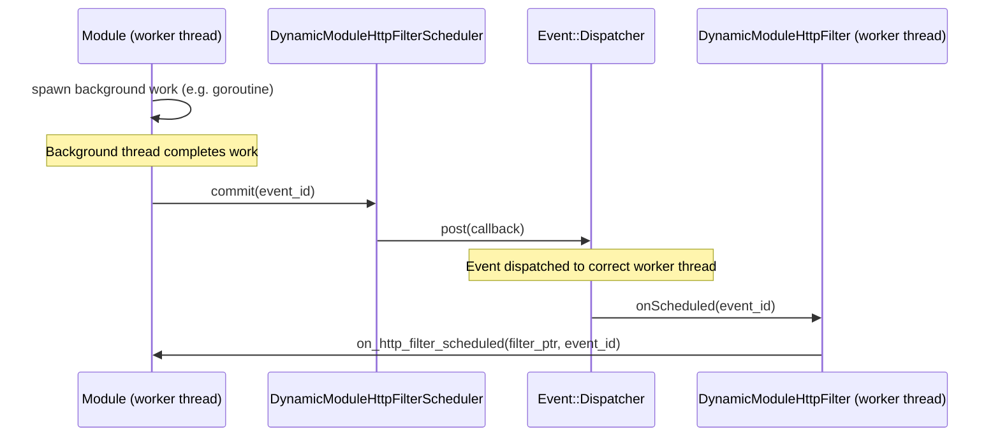
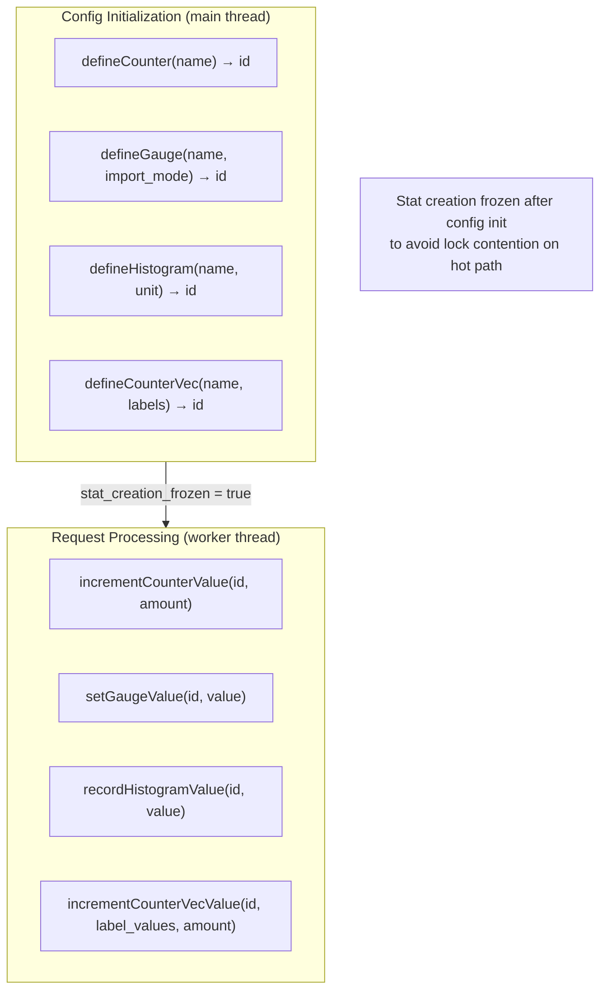
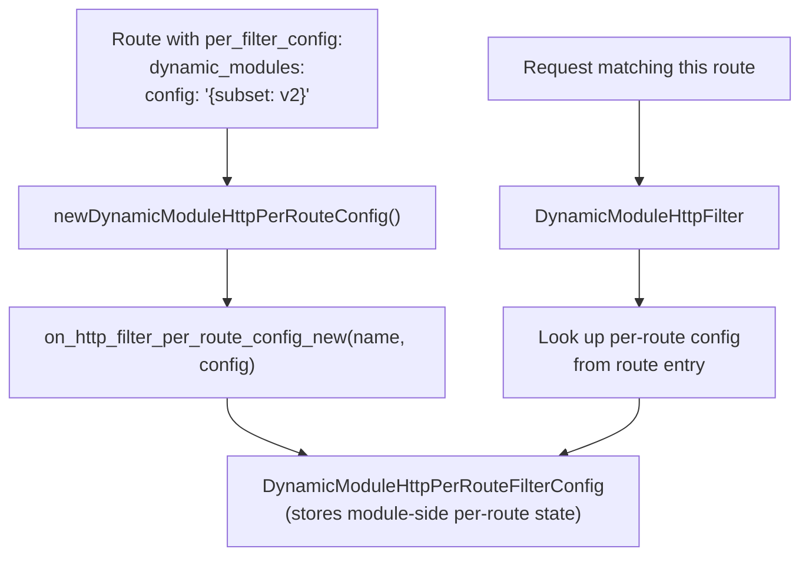

# Dynamic Modules — HTTP Filter

**Files:** `source/extensions/filters/http/dynamic_modules/filter.h`, `filter_config.h`, `factory.h`  
**Namespace:** `Envoy::Extensions::DynamicModules::HttpFilters`

## Overview

The HTTP filter is the primary extension point for dynamic modules. It implements Envoy's `Http::StreamFilter` interface and delegates all filter operations to event hooks in the loaded shared object, enabling request/response manipulation in any language that can produce a C-ABI `.so`.

## Class Hierarchy

## Filter Lifecycle

## Config Lifecycle

## Resolved Function Pointers

The config resolves all these ABI hooks at initialization and stores them as function pointers for zero-cost dispatch:

## Request/Response Processing

## HTTP Callouts (Async Sub-Requests)

## HTTP Streaming Callouts

For long-running or streaming upstream interactions:

## Cross-Thread Scheduling

Dynamic modules can schedule work back to the filter's worker thread from any thread:

## Metrics System

Modules define metrics at config time and record values at request time:

## Per-Route Configuration

