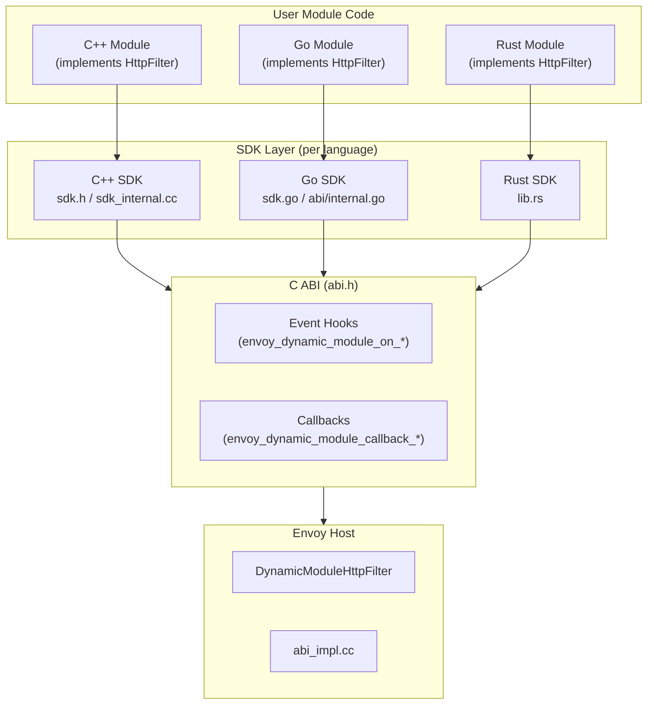
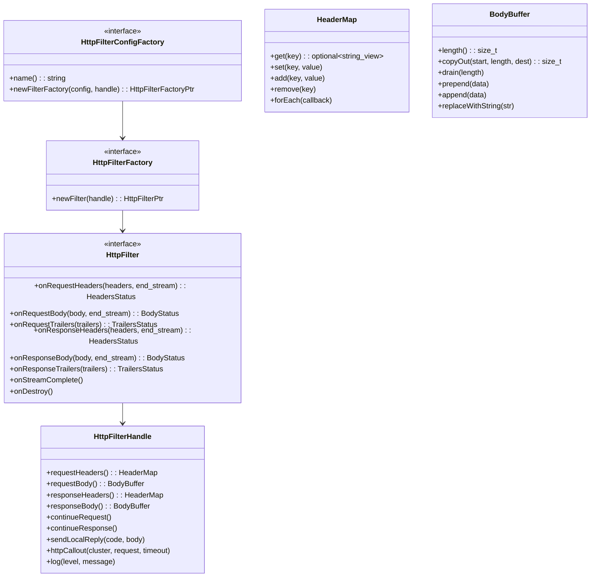
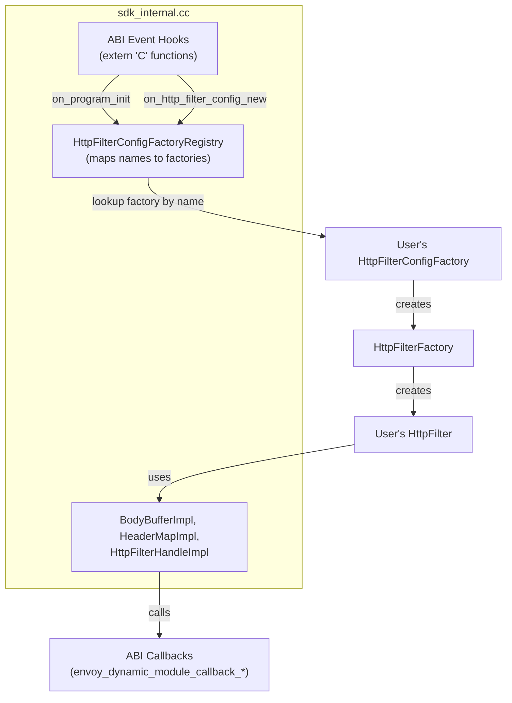
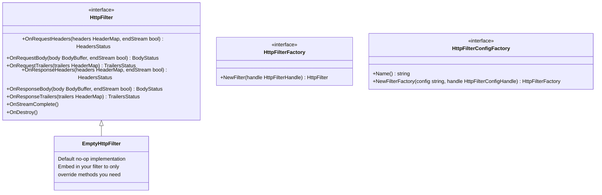
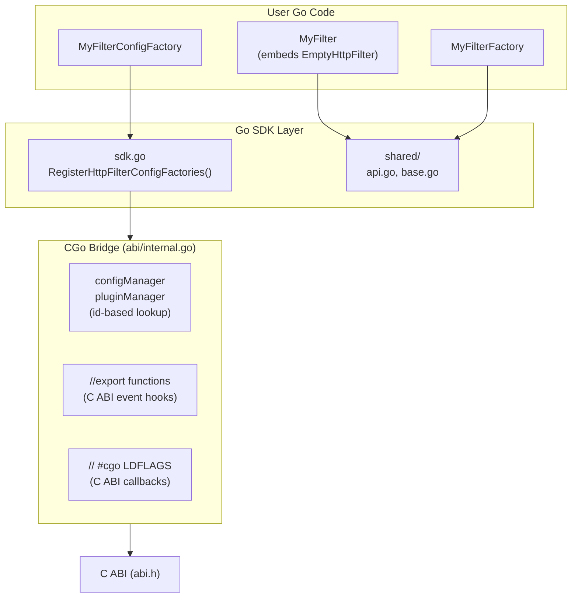
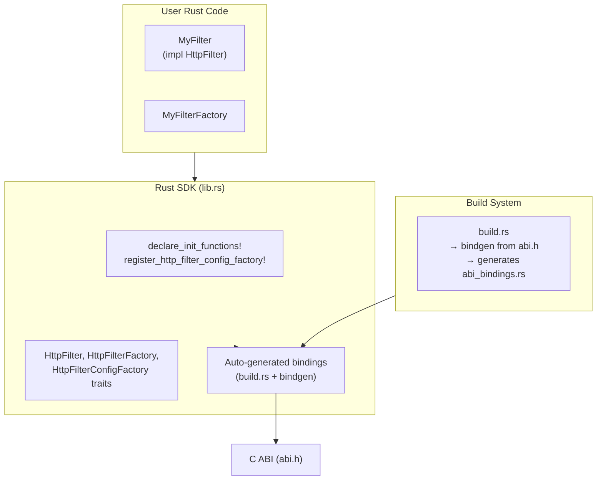
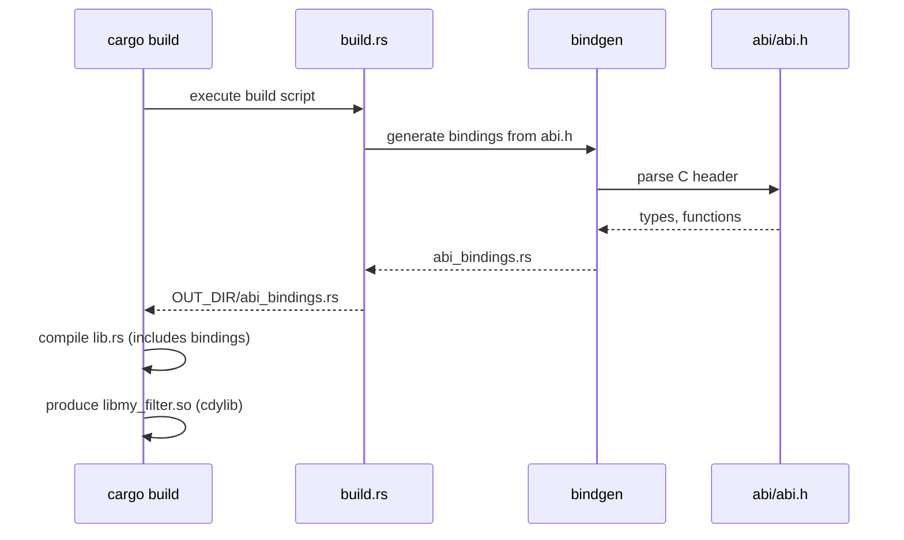
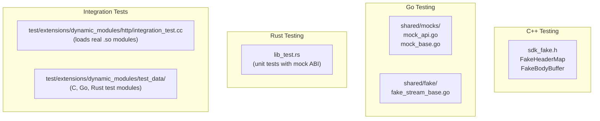

# Dynamic Modules — SDK Overview (C++, Go, Rust)

**Directories:** `sdk/cpp/`, `sdk/go/`, `sdk/rust/`

## Overview

Dynamic modules can be written in any language that can produce a shared object with C-ABI exports. The project provides first-class SDKs for **C++**, **Go**, and **Rust** that wrap the raw ABI into idiomatic, type-safe APIs.

## SDK Architecture



## C++ SDK

### Key Interfaces



### C++ Registration

```cpp
class MyFilterConfigFactory : public HttpFilterConfigFactory {
public:
    std::string name() override { return "my-filter"; }
    
    HttpFilterFactoryPtr newFilterFactory(
        std::string_view config,
        HttpFilterConfigHandle& handle) override {
        return std::make_unique<MyFilterFactory>(config);
    }
};

// Register at module load time
REGISTER_HTTP_FILTER_CONFIG_FACTORY(MyFilterConfigFactory);
```

### C++ SDK Bridge



## Go SDK

### Key Interfaces



### Go SDK Architecture



### Go-Specific Considerations

| Concern | Solution |
|---------|----------|
| Go GC moves memory | CGo bridge copies data at boundary |
| `dlclose` not supported | Config: `do_not_close: true` (RTLD_NODELETE) |
| Goroutines for async | `DynamicModuleHttpFilterScheduler` to post back to worker thread |
| Multiple instances | ID-based managers map C pointers to Go objects |

## Rust SDK

### Architecture



### Rust Build Process



### Rust SDK Features

| Feature | Module |
|---------|--------|
| HTTP Filter | `lib.rs` (traits, macros) |
| Access Logger | `access_log.rs` |
| Cert Validator | `cert_validator.rs` |
| Buffer operations | `buffer.rs` |
| Logging | `log!`, `warn!`, `error!` macros |
| Function registry | `register_function`, `get_function` |

## SDK Comparison

| Feature | C++ SDK | Go SDK | Rust SDK |
|---------|---------|--------|----------|
| **Registration** | `REGISTER_HTTP_FILTER_CONFIG_FACTORY` | `RegisterHttpFilterConfigFactories()` | `declare_init_functions!` |
| **Memory** | Manual / RAII | GC (via CGo bridge) | Ownership system |
| **Async** | `HttpFilterHandle` methods | Goroutines + scheduler | `async` (via scheduler) |
| **Testing** | `sdk_fake.h` (FakeHeaderMap, etc.) | `shared/mocks/` (mockgen) | `lib_test.rs` |
| **dlclose** | Supported | Not supported (RTLD_NODELETE) | Supported |
| **Build output** | `.so` (shared library) | `.so` (c-shared) | `.so` (cdylib) |
| **Overhead** | Minimal (direct C calls) | CGo crossing cost | Minimal (zero-cost FFI) |

## Testing Support


