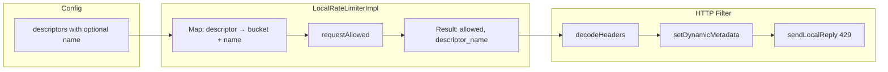
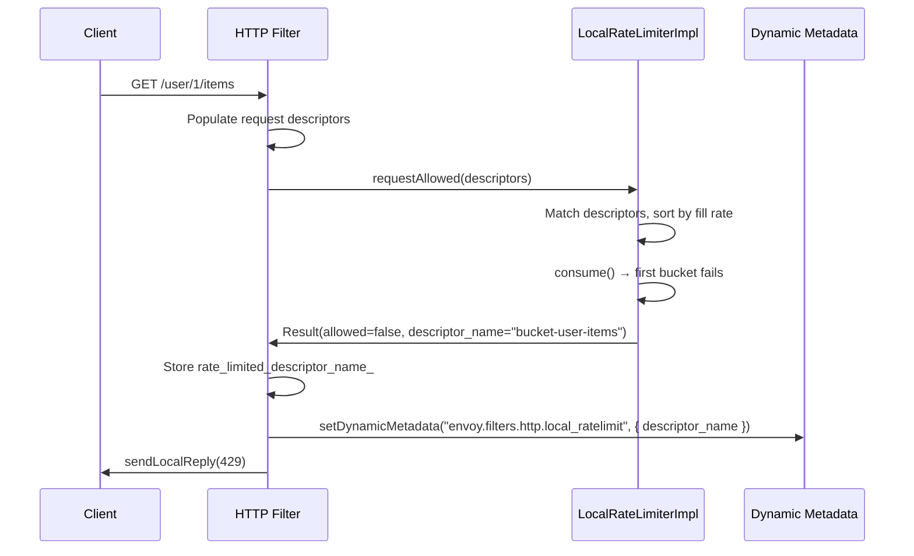
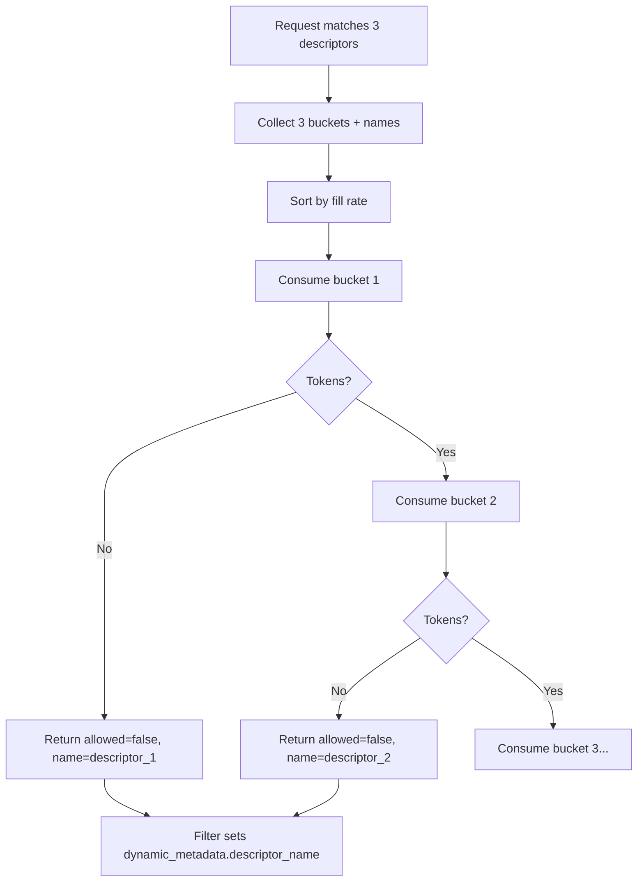

# Local Rate Limit: Descriptor Identification for Overlapping Descriptors

This document explains the **problem** (GitHub [#43113](https://github.com/envoyproxy/envoy/issues/43113)), the **design**, and the **code fix** that exposes which descriptor caused a 429 when using overlapping rate-limit descriptors.

---

## 1. The Problem (Bug / Limitation)

### What Was Wrong

With the **local rate limit** filter, you can define **multiple descriptors** (e.g. path-based). A single request can **match several descriptors at once** and consume tokens from **all** of their buckets. When the filter returns **429 Too Many Requests**, there was **no way to know which bucket was exhausted**.

### Example That Illustrates the Bug

```yaml
descriptors:
  - entries: [{ key: "path_match", value: "user-items" }]   # /user/{id}/items
    token_bucket: { max_tokens: 10, ... }
  - entries: [{ key: "path_match", value: "user-generic" }] # /user/*
    token_bucket: { max_tokens: 100, ... }
  - entries: [{ key: "path_match", value: "root" }]         # /*
    token_bucket: { max_tokens: 1000, ... }
```

A request to **`/user/123/items`** matches **all three** descriptors and consumes one token from each bucket. If the first bucket (user-items, 10 tokens) is exhausted:

- **Before the fix:** You get a 429 but **cannot tell** whether it was "user-items", "user-generic", or "root" (or the default bucket).
- **After the fix:** The descriptor that caused the limit can be **named** in config and **exposed** (e.g. in dynamic metadata and access logs).

### Why It Matters

- **Debugging:** Identify which limit is actually blocking traffic.
- **Metrics / alerting:** Per-descriptor counters (e.g. "user-items bucket exhausted").
- **Access logs / WASM:** Log or act on the specific descriptor name.

---

## 2. High-Level Design

### 2.1 Block Diagram: Components and Data Flow

```
┌─────────────────────────────────────────────────────────────────────────────────┐
│                         HTTP Local Rate Limit Filter                              │
├─────────────────────────────────────────────────────────────────────────────────┤
│                                                                                   │
│   Config (YAML)                    Runtime                                        │
│   ┌──────────────────┐            ┌──────────────────────────────────────────┐  │
│   │ descriptors:      │            │  LocalRateLimiterImpl                    │  │
│   │  - entries        │   ──────►  │  ┌────────────────────────────────────┐  │  │
│   │  - token_bucket   │            │  │ Map: LocalDescriptor →              │  │  │
│   │  - name (NEW)     │            │  │   { bucket, optional<string> name } │  │  │
│   └──────────────────┘            │  └────────────────────────────────────┘  │  │
│                                    │  + default_token_bucket_                  │  │
│                                    │  + dynamic_descriptors_ (wildcards)       │  │
│                                    └──────────────────────────────────────────┘  │
│                                                    │                              │
│                                                    ▼                              │
│                                    Result { allowed, token_bucket_context,        │
│                                             x_ratelimit_option,                   │
│                                             descriptor_name (NEW) }               │
│                                                    │                              │
│   decodeHeaders()                                  │                              │
│   ┌─────────────────────────────────────────────────────────────────────────┐   │
│   │ 1. Populate request descriptors (from route/headers)                     │   │
│   │ 2. result = rate_limiter_->requestAllowed(descriptors)                  │   │
│   │ 3. rate_limited_descriptor_name_ = result.descriptor_name   ◄── NEW     │   │
│   │ 4. If !result.allowed && enforced:                                       │   │
│   │      setDynamicMetadata("envoy.filters.http.local_ratelimit",            │   │
│   │        { "descriptor_name": rate_limited_descriptor_name_ })  ◄── NEW   │   │
│   │ 5. sendLocalReply(429, ...)                                              │   │
│   └─────────────────────────────────────────────────────────────────────────┘   │
│                                                                                   │
└─────────────────────────────────────────────────────────────────────────────────┘
```

- **Config:** Each descriptor can now have an optional **`name`**.
- **LocalRateLimiterImpl:** Keeps a **name** next to each bucket (static and dynamic) and returns it in **Result** when a bucket causes a deny.
- **Filter:** When sending 429, it writes **`descriptor_name`** into **dynamic metadata** so access logs, WASM, and metrics can use it.

### 2.2 Overlapping Descriptors: Which Bucket Fails?

When a request matches **multiple** descriptors, the limiter:

1. Collects all **matched** (descriptor → bucket, name) pairs.
2. Sorts them by **fill rate** (slowest refill first).
3. **Consumes** from each bucket in that order; the **first** bucket that cannot grant a token causes the 429, and **that** descriptor’s name is returned.

```
Request descriptors: [ path_match=user-items, path_match=user-generic, path_match=root ]
                              │
                              ▼
              ┌───────────────────────────────┐
              │  Match all 3 config           │
              │  descriptors → 3 buckets      │
              └───────────────────────────────┘
                              │
                              ▼
              ┌───────────────────────────────┐
              │  Sort by fill rate             │
              │  (e.g. user-items first)      │
              └───────────────────────────────┘
                              │
                              ▼
              ┌───────────────────────────────┐
              │  Try consume(user-items)       │
              │  → FAIL (0 tokens)             │
              │  → Return allowed=false,        │
              │     descriptor_name="bucket-   │
              │     user-items"                │
              └───────────────────────────────┘
```

So the **first** bucket that fails in this order is the one whose name is exposed.

---

## 3. Diagrams (Mermaid)

### 3.1 Component / Data Flow (Mermaid)



### 3.2 Sequence Diagram (Mermaid): Rate Limited Request



### 3.3 Overlapping Descriptors: Which Name Is Returned?



---

## 4. Sequence Diagram (ASCII): Request Path When Rate Limited

```
Client          HTTP Filter           LocalRateLimiterImpl      Dynamic Metadata / Reply
  │                   │                         │                            │
  │  GET /user/1/items│                         │                            │
  │──────────────────►│                         │                            │
  │                   │ 1. Populate descriptors  │                            │
  │                   │    (e.g. from route)     │                            │
  │                   │                         │                            │
  │                   │ 2. requestAllowed(       │                            │
  │                   │      [path_match=       │                            │
  │                   │       user-items, ...]   │                            │
  │                   │    )                     │                            │
  │                   │────────────────────────►│                            │
  │                   │                         │ 3. Match descriptors,       │
  │                   │                         │    sort by fill rate,       │
  │                   │                         │    consume() in order       │
  │                   │                         │    → first bucket fails    │
  │                   │                         │                            │
  │                   │ 4. Result(               │                            │
  │                   │      allowed=false,     │                            │
  │                   │      descriptor_name=   │                            │
  │                   │        "bucket-user-    │                            │
  │                   │         items"          │                            │
  │                   │    )                     │                            │
  │                   │◄────────────────────────│                            │
  │                   │                         │                            │
  │                   │ 5. rate_limited_        │                            │
  │                   │    descriptor_name_ =   │                            │
  │                   │    result.descriptor_   │                            │
  │                   │    name                  │                            │
  │                   │                         │                            │
  │                   │ 6. setDynamicMetadata(  │                            │
  │                   │      "envoy.filters.    │                            │
  │                   │       http.local_       │                            │
  │                   │       ratelimit",       │                            │
  │                   │      { "descriptor_     │                            │
  │                   │        name": "bucket-  │                            │
  │                   │        user-items" }    │                            │
  │                   │    )                     │                            │
  │                   │─────────────────────────────────────────────────────►│
  │                   │                         │                            │
  │                   │ 7. sendLocalReply(429)  │                            │
  │                   │─────────────────────────────────────────────────────►│
  │  429 Too Many     │                         │                            │
  │  Requests         │                         │                            │
  │◄──────────────────│                         │                            │
  │                   │                         │                            │
```

- Steps **1–4:** Filter gets request descriptors, calls the limiter, limiter returns **allowed** and **descriptor_name**.
- Steps **5–6:** Filter stores the name and writes it to **dynamic metadata**.
- Step **7:** Filter sends the 429; downstream (access log, WASM) can read **dynamic_metadata["envoy.filters.http.local_ratelimit"]["descriptor_name"]**.

---

## 5. Code Fix Summary

### 5.1 Layer Overview

| Layer | File(s) | Change |
|-------|---------|--------|
| **API** | `api/.../ratelimit.proto` | Add optional `string name = 4` to `LocalRateLimitDescriptor`. |
| **Common interface** | `common/local_ratelimit/local_ratelimit.h` | Add `absl::optional<std::string> descriptor_name` to `Result`. |
| **Common impl** | `common/local_ratelimit/local_ratelimit_impl.h/.cc` | Store name per bucket; return it in `Result` when the limiting bucket is a named descriptor. |
| **HTTP filter** | `http/local_ratelimit/local_ratelimit.h/.cc` | Store `result.descriptor_name`; on 429, set dynamic metadata with `descriptor_name`. |
| **Tests** | `filter_test.cc` | New config with named descriptor; test that 429 sets dynamic metadata with correct name. |

### 5.2 Proto (Config)

```protobuf
message LocalRateLimitDescriptor {
  repeated ... entries = 1;
  type.v3.TokenBucket token_bucket = 2;
  bool shadow_mode = 3;
  string name = 4;   // NEW: optional identifier for observability
}
```

- Operators can give each descriptor a **name** (e.g. `"bucket-user-items"`).
- If **name** is set and that descriptor’s bucket causes the 429, that name is exposed.

### 5.3 Common Impl: Storing and Returning the Name

- **Static descriptors:** The map value is now a struct **`{ bucket, optional<string> name }`** (filled from `descriptor.name()`). When a static bucket denies, that name is set in **Result.descriptor_name**.
- **Dynamic (wildcard) descriptors:** Each config descriptor has an optional **name**; when a dynamic bucket denies, its config descriptor’s name is returned in **Result.descriptor_name**.
- **Default bucket:** When the default bucket denies, **Result.descriptor_name** remains **nullopt** (no descriptor name).

So: **only named descriptors** that actually cause the 429 contribute a non-empty **descriptor_name**.

### 5.4 HTTP Filter: Dynamic Metadata

- In **decodeHeaders**, after **requestAllowed**:
  - `rate_limited_descriptor_name_ = result.descriptor_name`.
- When sending 429 (enforced, not shadow):
  - If **rate_limited_descriptor_name_** is set, call **setDynamicMetadata** with namespace **`"envoy.filters.http.local_ratelimit"`** and a struct with key **`"descriptor_name"`** and value **rate_limited_descriptor_name_**.

Consumers (access log formatters, WASM, stats) can then use **dynamic_metadata["envoy.filters.http.local_ratelimit"]["descriptor_name"]** to know which descriptor caused the 429.

---

## 6. Example: Config and Observability

### Config with Named Descriptors

```yaml
descriptors:
  - entries:
      - key: "path_match"
        value: "user-items"
    token_bucket:
      max_tokens: 10
      tokens_per_fill: 1
      fill_interval: 1s
    name: "bucket-user-items"
  - entries:
      - key: "path_match"
        value: "user-generic"
    token_bucket:
      max_tokens: 100
      tokens_per_fill: 1
      fill_interval: 1s
    name: "bucket-user-generic"
```

### Access Log / Dynamic Metadata

When a request is limited by the first descriptor, dynamic metadata looks like:

```json
{
  "envoy.filters.http.local_ratelimit": {
    "descriptor_name": "bucket-user-items"
  }
}
```

You can reference this in access log format (e.g. **`%DYNAMIC_METADATA(envoy.filters.http.local_ratelimit:descriptor_name)%`**) or in WASM/custom metrics to get per-descriptor visibility.

---

## 7. Summary

| Before | After |
|--------|--------|
| Overlapping descriptors could all consume tokens; on 429, **unknown** which bucket failed. | Each descriptor can have an optional **`name`**; the **name of the bucket that caused the 429** is returned in **Result** and written to **dynamic metadata**. |
| No way to attribute 429s to a specific limit in logs or metrics. | Access logs, WASM, and custom code can read **descriptor_name** from **dynamic_metadata** and build per-descriptor metrics/alerting. |

The fix is **backward compatible**: **name** is optional; if omitted, **descriptor_name** is not set and behavior matches the previous implementation.
