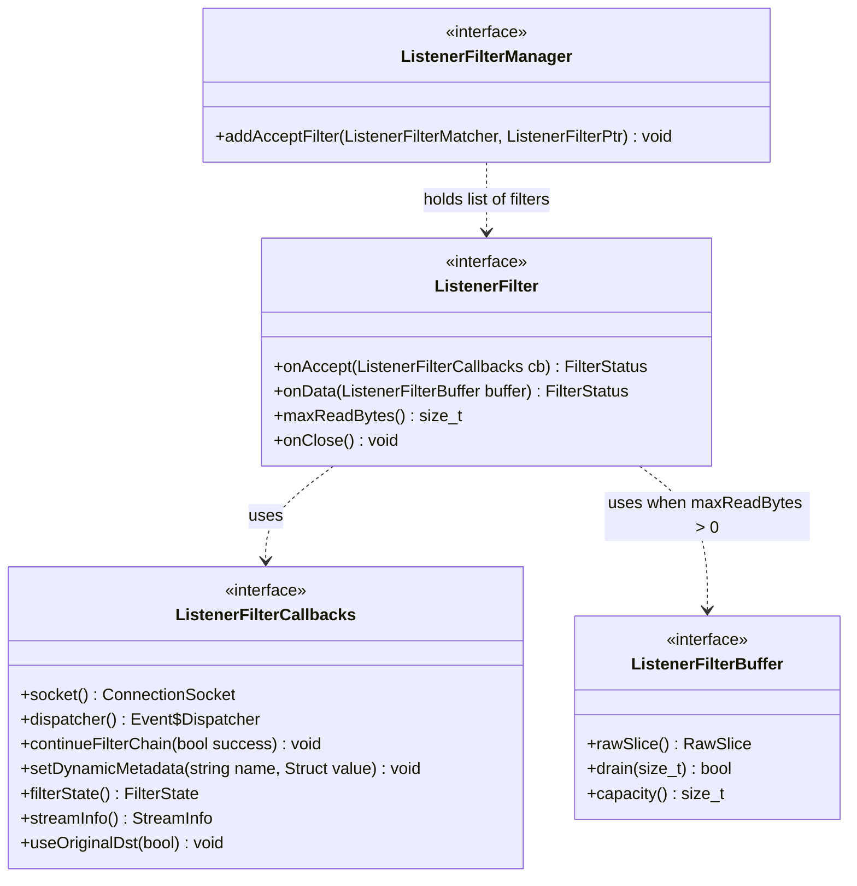
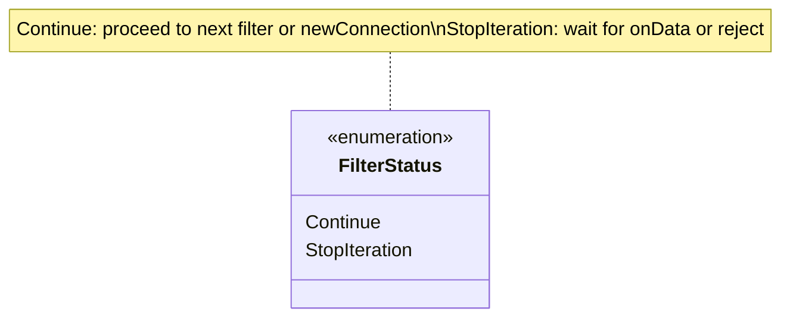
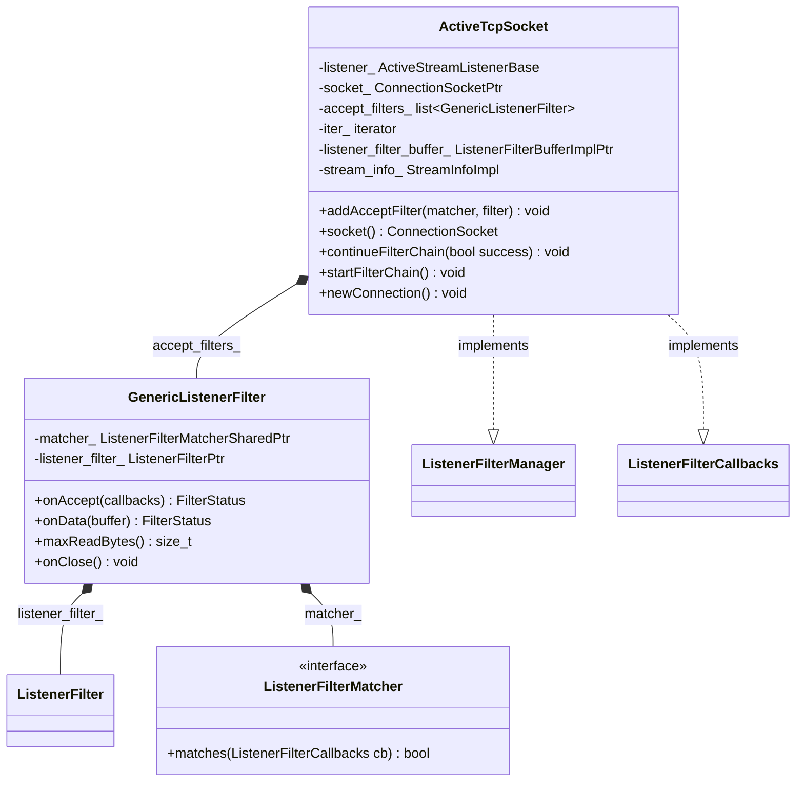

# Part 1: Listener Filters — Overview and Architecture

## Table of Contents
1. [Introduction](#introduction)
2. [What Is a Listener Filter?](#what-is-a-listener-filter)
3. [Where Listener Filters Run](#where-listener-filters-run)
4. [Block Diagram: System Context](#block-diagram-system-context)
5. [UML: Core Interfaces and Types](#uml-core-interfaces-and-types)
6. [Directory and File Layout](#directory-and-file-layout)
7. [Document Series Overview](#document-series-overview)

---

## Introduction

**Listener filters** run in Envoy **before** a `Connection` (and thus before any network filter chain) is created. They operate on the raw accepted socket: they can peek at the first bytes (e.g., TLS ClientHello, PROXY protocol header, HTTP preface), restore original destination/source addresses, or reject/rate-limit the connection. The result (SNI, ALPN, transport protocol, addresses) is used to **select the filter chain** and to configure the subsequent connection.

This document gives an overview of the listener filter architecture, where it sits in the accept path, and the core interfaces involved.

---

## What Is a Listener Filter?

A listener filter:

- Is invoked **once per accepted socket**, in order, as part of the **listener filter chain**.
- Implements the **`Network::ListenerFilter`** interface:
  - **`onAccept(ListenerFilterCallbacks& cb)`** — Called first. Can complete immediately (return `Continue`) or request more data (return `StopIteration`).
  - **`onData(ListenerFilterBuffer& buffer)`** — Called when peeked data is available, only if the filter previously returned `StopIteration` and `maxReadBytes() > 0`.
  - **`maxReadBytes()`** — Maximum bytes the filter needs to peek. If 0, `onData` is not used for buffering.
  - **`onClose()`** — Optional; called when the socket is closed while the filter is waiting for data.
- Uses **`ListenerFilterCallbacks`** to:
  - Access the **socket** (`cb.socket()`), **dispatcher**, **filter state**, **dynamic metadata**, **stream info**.
  - **Continue the chain** — `cb.continueFilterChain(true)` to move to the next filter or create the connection; `cb.continueFilterChain(false)` to reject and close.
- May **modify the socket** (e.g., set SNI, ALPN, transport protocol, restore local/remote address) so that **filter chain matching** and downstream logic see the right metadata.

Listener filters do **not** see the full TCP stream; they only see a limited peek buffer (and only if they return `StopIteration` and have `maxReadBytes() > 0`). Data consumed by listener filters is **replayed** into the connection when it is created.

---

## Where Listener Filters Run

Listener filters run in the **accept path**, between **accept** and **filter chain selection / connection creation**:

```
  Kernel accept()
        │
        ▼
  TcpListenerCallbacks::onAccept(ConnectionSocketPtr)
        │
        ▼
  ActiveTcpListener creates ActiveTcpSocket(socket)
        │
        ▼
  createListenerFilterChain(ListenerFilterManager&)   ← factories add filters
        │
        ▼
  ActiveTcpSocket::startFilterChain()
        │
        ├── For each filter (with matcher): onAccept(callbacks)
        │         │
        │         ├── Continue → next filter
        │         └── StopIteration → create ListenerFilterBuffer, wait for data
        │                   │
        │                   └── onData(buffer) → continueFilterChain(true|false)
        │
        ▼
  Filter chain complete → findFilterChain(socket) → newConnection()
        │
        ▼
  ConnectionImpl + network filters (e.g. HCM, TcpProxy)
```

So: **one listener filter chain per accepted socket**, on the object that implements `ListenerFilterManager` and `ListenerFilterCallbacks` — the **`ActiveTcpSocket`** (owned by `ActiveTcpListener`).

---

## Block Diagram: System Context

High-level blocks and data flow:

```
┌─────────────────────────────────────────────────────────────────────────────────┐
│                              Listener (e.g. 0.0.0.0:443)                          │
│  ┌─────────────────────────────────────────────────────────────────────────────┐│
│  │  ListenerConfig / FilterChainFactory                                         ││
│  │    createListenerFilterChain(ListenerFilterManager&)                          ││
│  │         adds: [ ProxyProtocol, TlsInspector, OriginalDst, ... ]              ││
│  └─────────────────────────────────────────────────────────────────────────────┘│
└─────────────────────────────────────────────────────────────────────────────────┘
                                        │
                    accept()            │
                                        ▼
┌─────────────────────────────────────────────────────────────────────────────────┐
│  ActiveTcpListener (per worker)                                                    │
│    onAccept(socket) → new ActiveTcpSocket(socket)                                  │
│    startFilterChain()                                                              │
└─────────────────────────────────────────────────────────────────────────────────┘
                                        │
                                        ▼
┌─────────────────────────────────────────────────────────────────────────────────┐
│  ActiveTcpSocket                                                                  │
│  • Implements: ListenerFilterManager, ListenerFilterCallbacks                      │
│  • accept_filters_: list of GenericListenerFilter (matcher + ListenerFilter)      │
│  • iter_: current filter in chain                                                 │
│  • listener_filter_buffer_: peek buffer (when filter needs onData)                │
│  • stream_info_, socket_                                                           │
│                                                                                    │
│  ┌──────────────────┐  ┌──────────────────┐  ┌──────────────────┐                 │
│  │ ProxyProtocol    │→ │ TlsInspector     │→ │ OriginalDst      │→ ... → newConn  │
│  │ (onAccept+onData)│  │ (onAccept+onData)│  │ (onAccept only)  │                 │
│  └──────────────────┘  └──────────────────┘  └──────────────────┘                 │
└─────────────────────────────────────────────────────────────────────────────────┘
                                        │
                    continueFilterChain(true)
                                        ▼
┌─────────────────────────────────────────────────────────────────────────────────┐
│  FilterChainManager::findFilterChain(socket)                                      │
│    Uses: SNI, ALPN, transport protocol, destination port, etc. (set by filters)   │
└─────────────────────────────────────────────────────────────────────────────────┘
                                        │
                                        ▼
┌─────────────────────────────────────────────────────────────────────────────────┐
│  newConnection() → ConnectionImpl + network filter chain (e.g. HCM → router)      │
└─────────────────────────────────────────────────────────────────────────────────┘
```

---

## UML: Core Interfaces and Types

### ListenerFilter and callbacks



### Filter status and flow



### ActiveTcpSocket and wrapper



---

## Directory and File Layout

```
source/extensions/filters/listener/
├── docs/
│   ├── 01-Overview-and-Architecture.md    (this file)
│   ├── 02-Listener-Filter-Chain-Execution.md
│   ├── 03-Built-in-Listener-Filters.md
│   └── 04-Configuration-and-Extension.md
├── tls_inspector/
│   ├── tls_inspector.h/cc
│   ├── ja4_fingerprint.h/cc
│   └── config.cc
├── proxy_protocol/
│   ├── proxy_protocol.h/cc
│   ├── proxy_protocol_header.h
│   └── config.cc
├── original_dst/
│   ├── original_dst.h/cc
│   └── config.cc
├── original_src/
│   ├── original_src.h/cc
│   ├── config.h/cc
│   └── original_src_config_factory.h/cc
├── http_inspector/
│   ├── http_inspector.h/cc
│   └── config.cc
├── local_ratelimit/
│   ├── local_ratelimit.h/cc
│   └── config.cc
├── dynamic_modules/
│   ├── filter.h/cc
│   ├── filter_config.h/cc
│   ├── factory.h/cc
│   └── abi_impl.cc
└── BUILD
```

Supporting types in the core codebase:

- **`envoy/network/filter.h`** — `ListenerFilter`, `ListenerFilterCallbacks`, `ListenerFilterManager`, `ListenerFilterMatcher`
- **`source/common/listener_manager/active_tcp_socket.h/.cc`** — `ActiveTcpSocket`, `GenericListenerFilter`
- **`source/common/listener_manager/active_tcp_listener_and_socket.md`** — Accept-to-connection flow
- **`source/common/network/listener_filter_buffer_impl.h`** — Peek buffer for listener filters

---

## Document Series Overview

| Part | Document | Content |
|------|----------|---------|
| **1** | 01-Overview-and-Architecture.md (this file) | What listener filters are, where they run, system block diagram, UML of core interfaces |
| **2** | 02-Listener-Filter-Chain-Execution.md | How the chain is run: `ActiveTcpSocket`, `continueFilterChain`, `ListenerFilterBuffer`, timeouts, sequence diagrams |
| **3** | 03-Built-in-Listener-Filters.md | Each built-in filter (TLS Inspector, Proxy Protocol, Original Dst/Src, HTTP Inspector, Local Rate Limit): purpose, block diagram, UML, sequence diagram |
| **4** | 04-Configuration-and-Extension.md | Config factories, `NamedListenerFilterConfigFactory`, filter matchers, dynamic modules |
