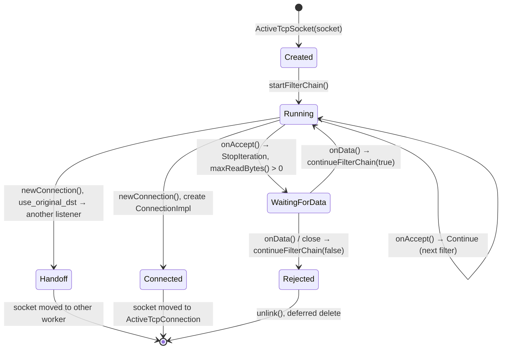
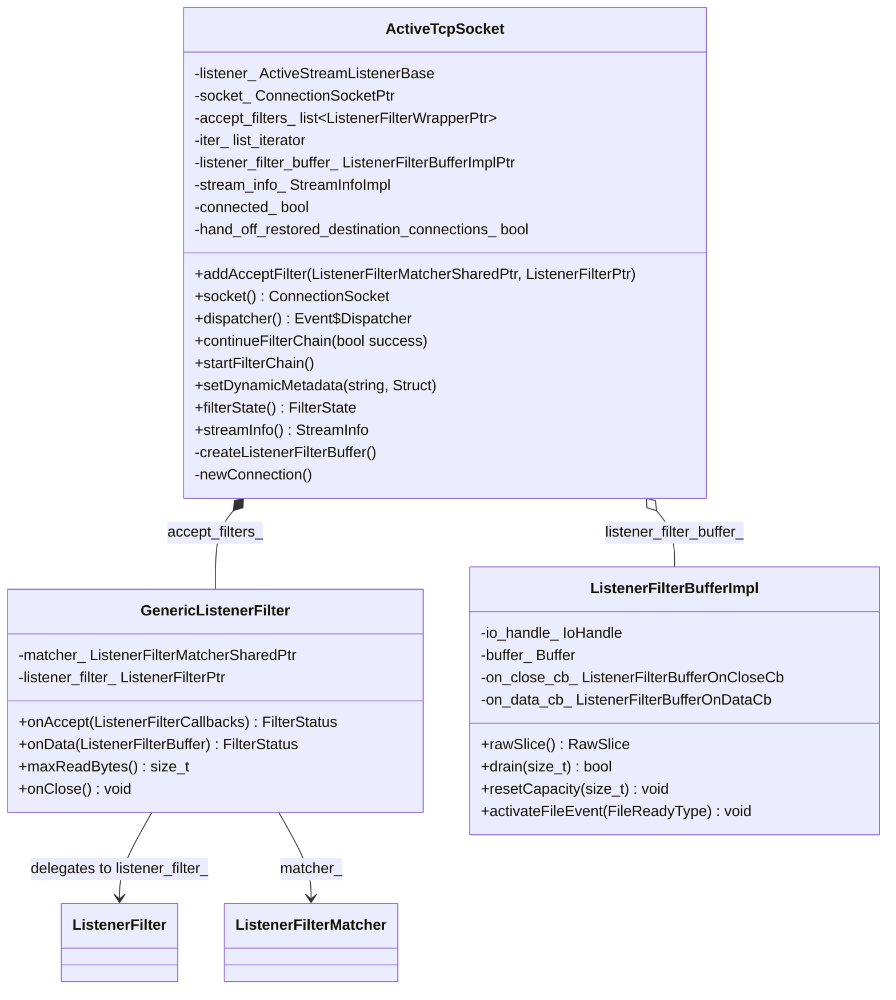
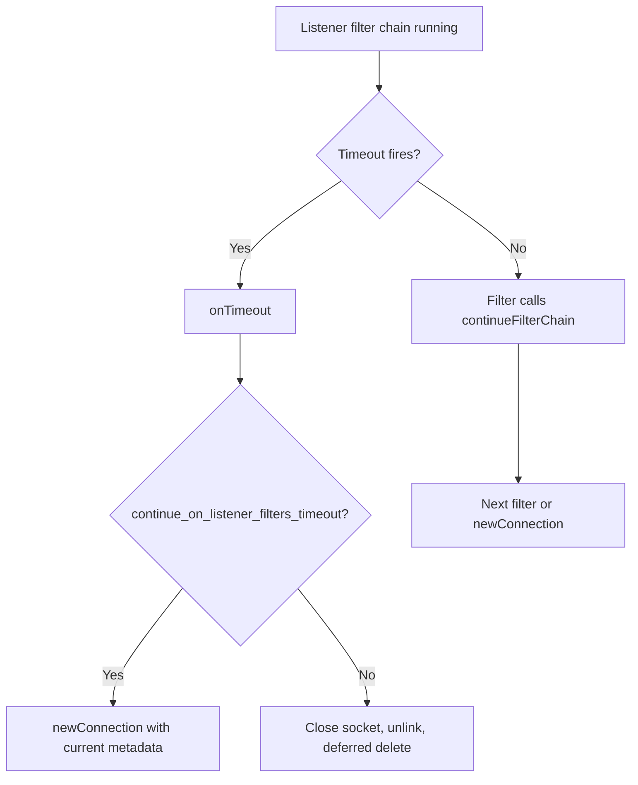

# Part 2: Listener Filters — Listener Filter Chain Execution

## Table of Contents
1. [Execution Model](#execution-model)
2. [Block Diagram: Filter Chain Iteration](#block-diagram-filter-chain-iteration)
3. [ActiveTcpSocket Lifecycle](#activetcp-socket-lifecycle)
4. [Sequence Diagram: Happy Path (No Peek)](#sequence-diagram-happy-path-no-peek)
5. [Sequence Diagram: Filter Needs Data (TLS Inspector)](#sequence-diagram-filter-needs-data-tls-inspector)
6. [ListenerFilterBuffer and Peek Flow](#listener-filter-buffer-and-peek-flow)
7. [UML: ActiveTcpSocket and GenericListenerFilter](#uml-activetcp-socket-and-generic-listener-filter)
8. [Timeout and Error Handling](#timeout-and-error-handling)

---

## Execution Model

The listener filter chain runs on **`ActiveTcpSocket`**, which:

1. Implements **`ListenerFilterManager`** — so the listener config can add filters via `addAcceptFilter(matcher, filter)`.
2. Implements **`ListenerFilterCallbacks`** — so each filter gets the socket, dispatcher, `continueFilterChain()`, metadata, filter state, stream info.
3. Iterates over **accept_filters_** (wrapped as `GenericListenerFilter`). For each filter:
   - **Matcher** is evaluated; if it does not match, the filter is skipped (as if it returned `Continue`).
   - **`onAccept(*this)`** is called. If it returns **`Continue`**, the loop advances to the next filter. If it returns **`StopIteration`**, the socket stops and waits:
     - If **`maxReadBytes() > 0`**: a **ListenerFilterBuffer** is created and the socket is read (peek). When data arrives (or socket closes), **`onData(buffer)`** is called; the filter then calls **`continueFilterChain(true)`** or **`continueFilterChain(false)`**.
     - If **`maxReadBytes() == 0`**: the buffer is only used to watch for socket close; no `onData` for more bytes.
4. When all filters have completed (each either returned `Continue` or called `continueFilterChain(true)`), **`newConnection()`** is invoked: filter chain is found by **`findFilterChain(socket)`**, then a **ConnectionImpl** and network filter chain are created.

Data **consumed** (drained) in the listener filter buffer is replayed into the connection so the first network filter sees the same byte stream.

---

## Block Diagram: Filter Chain Iteration

```
                    startFilterChain()
                            │
                            ▼
              continueFilterChain(true)  ──────────────────┐
                            │                             │
                            ▼                             │
         ┌──────────────────────────────────────┐         │
         │  iter_ == end? → iter_ = begin()     │         │
         │  else            iter_ = next(iter_)  │         │
         └──────────────────────────────────────┘         │
                            │                             │
                            ▼                             │
         ┌──────────────────────────────────────┐         │
         │  for (; iter_ != end(); ++iter_)      │         │
         │    status = (*iter_)->onAccept(*this)  │         │
         └──────────────────────────────────────┘         │
                            │                             │
              ┌─────────────┴─────────────┐                │
              │                           │                │
              ▼                           ▼                │
    status == Continue            status == StopIteration  │
              │                           │                │
              │                           ▼                │
              │              socket closed? → no_error=false, break
              │                           │                │
              │                           ▼                │
              │              createListenerFilterBuffer()  │
              │              (if not already); start read  │
              │              return (wait for onData/close)  │
              │                                             │
              └──────────────────┬──────────────────────────┘
                                 │
                                 ▼
                    iter_ == end() && no_error
                                 │
                                 ▼
                         newConnection()
```

---

## ActiveTcpSocket Lifecycle



---

## Sequence Diagram: Happy Path (No Peek)

All filters return `Continue` from `onAccept` (e.g. Original Dst, Original Src, Local Rate Limit when not limiting).

```mermaid
sequenceDiagram
    participant ATL as ActiveTcpListener
    participant ATS as ActiveTcpSocket
    participant PP as ProxyProtocol (skip/matches)
    participant OD as OriginalDstFilter
    participant LF as Next ListenerFilter

    ATL->>ATS: new ActiveTcpSocket(socket)
    ATL->>ATS: startFilterChain()

    ATS->>ATS: continueFilterChain(true)
    ATS->>PP: onAccept(ATS)
    PP->>ATS: Continue
    ATS->>OD: onAccept(ATS)
    OD->>OD: getOriginalDst(); restoreLocalAddress()
    OD->>ATS: Continue
    ATS->>LF: onAccept(ATS)
    LF->>ATS: Continue
    ATS->>ATS: iter_ == end → newConnection()
    ATS->>ATL: newActiveConnection(filter_chain, socket)
```

---

## Sequence Diagram: Filter Needs Data (TLS Inspector)

TLS Inspector returns `StopIteration` from `onAccept`, then receives peeked data in `onData` and eventually continues.

```mermaid
sequenceDiagram
    participant ATS as ActiveTcpSocket
    participant TLS as TlsInspector
    participant Buf as ListenerFilterBufferImpl
    participant IO as IoHandle (socket)

    ATS->>TLS: onAccept(ATS)
    TLS->>TLS: cb_ = &cb
    TLS->>ATS: StopIteration

    ATS->>ATS: createListenerFilterBuffer(maxReadBytes)
    ATS->>Buf: new ListenerFilterBufferImpl(io_handle, on_data_cb)
    ATS->>Buf: activateFileEvent(Read)

    IO->>Buf: readable
    Buf->>Buf: peek into buffer, then
    Buf->>ATS: on_data_cb(buffer) → (*iter_)->onData(buffer)
    ATS->>TLS: onData(buffer)
    TLS->>TLS: parseClientHello(); set SNI, ALPN, transport
    TLS->>ATS: Continue
    ATS->>ATS: continueFilterChain(true)

    ATS->>ATS: ++iter_; next filter or newConnection()
```

---

## ListenerFilterBuffer and Peek Flow

When a filter returns `StopIteration` and `maxReadBytes() > 0`, **`ActiveTcpSocket::createListenerFilterBuffer()`** creates a **`ListenerFilterBufferImpl`** that:

1. **Wraps the socket’s IoHandle** and registers for **Read** (and optionally **Close**) on the dispatcher.
2. **Peeks** (does not drain) up to `maxReadBytes()` from the socket into an internal buffer.
3. When data is available (or more data than before), invokes the **on_data_cb** passed by `ActiveTcpSocket`:
   - The callback calls **`(*iter_)->onData(filter_buffer)`**.
   - If the filter returns **`StopIteration`**: the socket stays in “wait for more data” mode; if the filter increased `maxReadBytes()`, the buffer capacity can be increased and the read event re-triggered.
   - If the filter returns **`Continue`**: **`continueFilterChain(true)`** is called, which moves to the next filter or to `newConnection()`.
4. If the filter (or someone) **drains** part of the buffer, that drained data is not re-read from the socket; it is tracked so that when the connection is created, the same bytes are replayed.

Block diagram of buffer and callbacks:

```
┌─────────────────────────────────────────────────────────────────┐
│  ListenerFilterBufferImpl                                        │
│  • io_handle_ (socket)                                            │
│  • buffer_ (peeked data)                                          │
│  • on_close_cb_  → on filter close: socket close, continue(false)  │
│  • on_data_cb_   → on data: (*iter_)->onData(buffer)             │
│  • capacity_ = filter->maxReadBytes()                             │
│  • FileEvent(Read) → read from socket into buffer_ → on_data_cb_ │
└─────────────────────────────────────────────────────────────────┘
         │
         │  rawSlice() / drain()
         ▼
┌─────────────────────────────────────────────────────────────────┐
│  ListenerFilter (e.g. TlsInspector)                              │
│  onData(buffer): parse buffer; set SNI/ALPN; return Continue    │
└─────────────────────────────────────────────────────────────────┘
```

---

## UML: ActiveTcpSocket and GenericListenerFilter



---

## Timeout and Error Handling

- **Listener filter timeout**  
  The listener can set **listener_filters_timeout**. If the listener filter chain does not finish within that time:
  - **`onTimeout()`** is called on the `ActiveTcpSocket`.
  - If **continueOnListenerFiltersTimeout()** is true, **`newConnection()`** is called anyway (with whatever metadata has been set so far).
  - Otherwise the socket is closed and the socket is unlinked and deferred-deleted.

- **Socket closed while waiting**  
  If the peer closes the connection while a filter is waiting for data, the buffer’s **on_close_cb** runs: it calls **`(*iter_)->onClose()`**, closes the socket, and then **`continueFilterChain(false)`**, which unlinks and deletes the `ActiveTcpSocket`.

- **Filter closes the socket**  
  If a filter (e.g. local rate limit) calls **`cb.socket().ioHandle().close()`** and returns **`StopIteration`**, the next time the loop runs it will see **`!socket().ioHandle().isOpen()`**, set **no_error = false**, break, and then **not** call **`newConnection()`**; **`continueFilterChain(false)`** will still be used when the socket is unlinked.

Flow for timeout:


